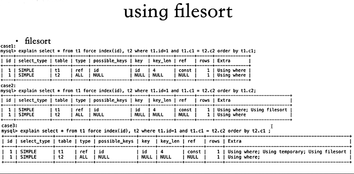
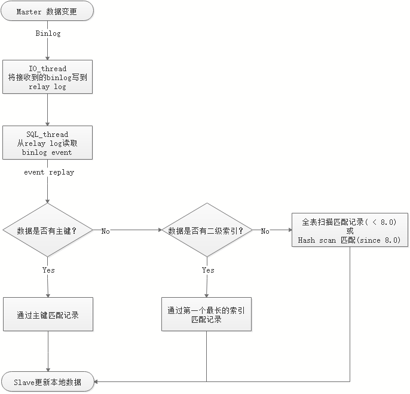

[TOC]

# 小表的索引必要性

通常也要建立索引。

用mysqlslap对只有一万行记录的表进行简单压测，一种是对该表先进行排序后读取30条记录，另一种是对该表随机读取一行记录，分

别对比有索引和没有索引的表现，结论：

1. 排序后读取时，没索引时慢了约37倍时间。压测期间出现大量的Creating sort index状态。
2. 随机读取一行记录时，没索引时慢了约44倍时间。压测期间出现大量的Sending data状态，有索引时，则更多的是出现Sending to client状态。

结论：不管是小表还是大表，需要时还是乖乖加上索引吧，否则有可能它就是瓶颈。

 

# 性别列等几元数据列对索引的必要情况

通常没必要建索引

但是具体问题具体分析，当总体数据量较大，但某一元数据数量较少时，索引还是有必要的。

 

- 表结构

```
CREATE TABLE `x3` (
  `id` int(10) unsigned NOT NULL AUTO_INCREMENT,
  `c1` int(10) unsigned DEFAULT NULL,
  `c2` varchar(100) NOT NULL,
  `c3` varchar(100) NOT NULL,
  PRIMARY KEY (`id`),
  KEY `c1` (`c1`)
) ENGINE=InnoDB DEFAULT CHARSET=utf8mb4
```

 

- 性别列数据倾斜严重（仅有10个值为1个条目）

此时若对c1=1条件进行查询， 那么有索引是非常必要的。

```
mysql> desc select * from x3 where c1 = 2;
+----+-------------+-------+------------+------+---------------+------+---------+-------+---------+----------+-------+
| id | select_type | table | partitions | type | possible_keys | key  | key_len | ref   | rows    | filtered | Extra |
+----+-------------+-------+------------+------+---------------+------+---------+-------+---------+----------+-------+
|  1 | SIMPLE      | x3    | NULL       | ref  | c1            | c1   | 5       | const | 1177547 |   100.00 | NULL  |
+----+-------------+-------+------------+------+---------------+------+---------+-------+---------+----------+-------+
1 row in set, 1 warning (0.00 sec)

mysql> desc select * from x3 where c1 = 1;
+----+-------------+-------+------------+------+---------------+------+---------+-------+---------+----------+-------+
| id | select_type | table | partitions | type | possible_keys | key  | key_len | ref   | rows    | filtered | Extra |
+----+-------------+-------+------------+------+---------------+------+---------+-------+---------+----------+-------+
|  1 | SIMPLE      | x3    | NULL       | ref  | c1            | c1   | 5       | const | 1177547 |   100.00 | NULL  |
+----+-------------+-------+------------+------+---------------+------+---------+-------+---------+----------+-------+
1 row in set, 1 warning (0.00 sec)

```


```
mysql> alter table x3 drop index c1;
Query OK, 0 rows affected (0.48 sec)
Records: 0  Duplicates: 0  Warnings: 0

mysql> desc select * from x3 where c1 = 2;
+----+-------------+-------+------------+------+---------------+------+---------+------+---------+----------+-------------+
| id | select_type | table | partitions | type | possible_keys | key  | key_len | ref  | rows    | filtered | Extra       |
+----+-------------+-------+------------+------+---------------+------+---------+------+---------+----------+-------------+
|  1 | SIMPLE      | x3    | NULL       | ALL  | NULL          | NULL | NULL    | NULL | 2355095 |    10.00 | Using where |
+----+-------------+-------+------------+------+---------------+------+---------+------+---------+----------+-------------+
1 row in set, 1 warning (0.00 sec)

mysql> desc select * from x3 where c1 = 1;
+----+-------------+-------+------------+------+---------------+------+---------+------+---------+----------+-------------+
| id | select_type | table | partitions | type | possible_keys | key  | key_len | ref  | rows    | filtered | Extra       |
+----+-------------+-------+------------+------+---------------+------+---------+------+---------+----------+-------------+
|  1 | SIMPLE      | x3    | NULL       | ALL  | NULL          | NULL | NULL    | NULL | 2355095 |    10.00 | Using where |
+----+-------------+-------+------------+------+---------------+------+---------+------+---------+----------+-------------+
1 row in set, 1 warning (0.00 sec)

```


 

# 没索引或索引没用好的后果

传送门：[优秀索引：三星索引理论](.\2.优秀索引：三星索引理论.md)

 

## using filesort

模式1：sort的item仅包括排序列，待排序完成后，根据rowid回表查询所需要的列，4.1以前

模式2：sort的item包括全部列，排序完成后，无需再回表，MySQL 4.1~5.6

第二种可以明显减少额外I/O，但需要更多内存

 

5.7后新增优化模式：更紧凑格式数据排序模式，排序更高效

sort仅用于单表排序，若多表join时有排序，则走temporary，再基于temp table再进行filesort

 

> 
>
> - t1.c1，驱动表。order by 列属于t1，没sort
> - t1.c2 没索引，需要sort
> - order by 列是被驱动表， 这时没法使用索引， 需要对join结果生成临时表，再对临时表进行排序。


 

## using temporary

- 外部临时表，CREATE TEMPORARY TABLE，只对当前session可见，关闭连接后删除
- 内部临时表，SQL运行时using temporary

 

- 先创建MEMORY表（8.0以前），当数据超过max_heap_table_size时，自动转换成disk temp table
- 5.7起新增internal_tmp_disk_storage_engine选项，可设置为InnoDB，以前默认是MylSAM。但该选项8.0.16后消失，因为只能使用InnoDB引擎
- 8.0后，temp table默认引擎改为TempTable，意欲取代MEMORY引擎，新增选项internal_tmp_mem_storage_engine(TempTable)、temptable_max_ram(1GB)

 

- 几种需要temporary的常见情况

  - 表Join时使用BNL/BKA
  - 表Join时，GROUP BY/ORDER BY的列不属于驱动表
  - GROUP BY和ORDER BY的列不同
  - UNION (合并结果后去重)
  - 多表关联查询后update
  - 聚合查询中包含distinct、group_concat

 

# 表没有主键的后果

 

没索引的时候，全表扫描或者hash扫描，hash扫描会略微快一些，但是比索引还是差很多。

 
