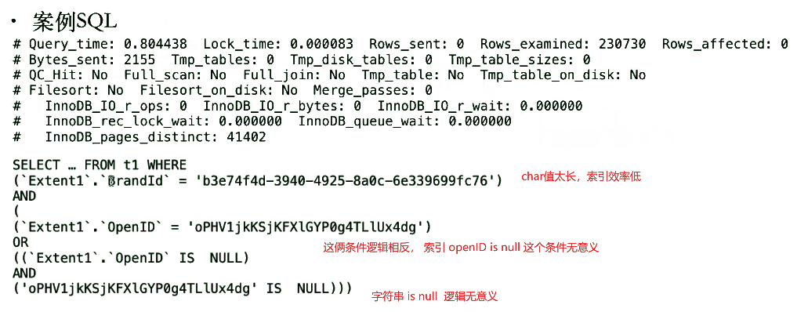
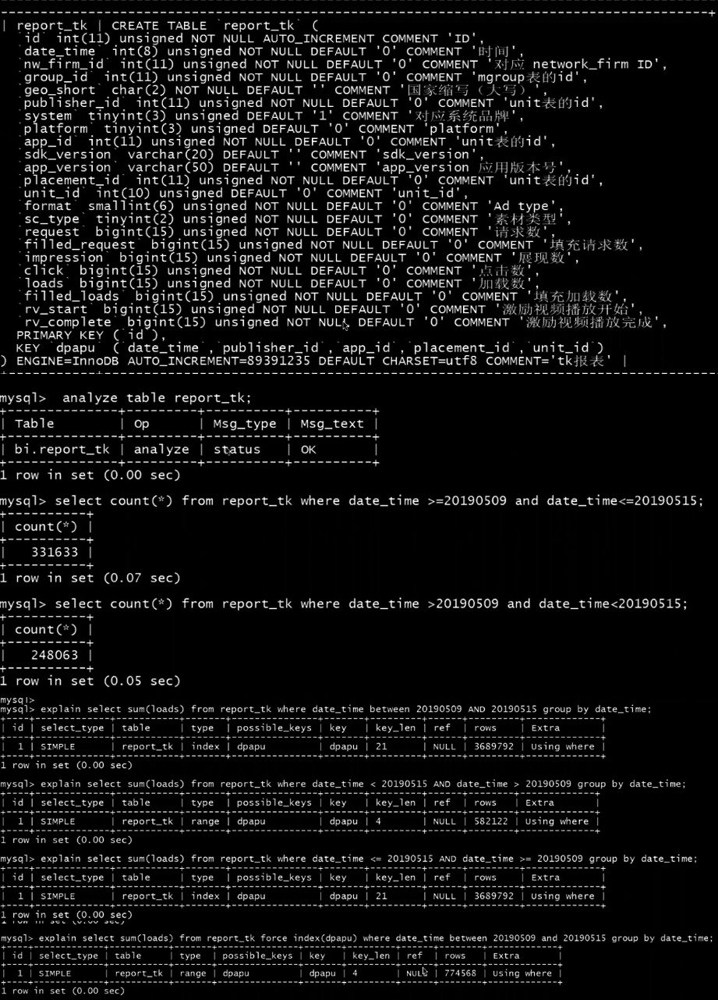

[TOC]

# 案例1

- 8.0之前不支持函数索引

- 条件前使用了函数以至于无法使用索引

  ```
  mysql> select * from orders 
  	where year(o_prderdate) = 2009 
  	and month(o_orderdate) =5
  	and o_clerk = 'abcabcd';
  	
  +-------------+-------+------+---------------+------+---------+------+---------+----------+-------------+
  | select_type | table | type | possible_keys | key  | key_len | ref  | rows    | filtered | Extra       |
  +-------------+-------+------+---------------+------+---------+------+---------+----------+-------------+
  | SIMPLE      | orders| ALL  | NULL          | NULL | NULL    | NULL | 2355095 |    10.00 | Using where |
  +-------------+-------+------+---------------+------+---------+------+---------+----------+-------------+
  1 row in set, 1 warning (0.00 sec)
  
  # 无索引，全表扫描
  ```

  

- 原因

  条件左边加函数，无法走索引。

- 解决方法：

  - 拆掉函数，速度提升

    ```
    mysql> select * from orders 
    	where o_prderdate >= '2009-5-1' 
    	and o_orderdate <= '2009-5-31'
    	and o_clerk = 'abcabcd';
    	
    +-------------+-------+------+---------------+-------------+---------+---------+----------+---------------------+
    | select_type | table | type | possible_keys | key         | key_len | rows    | filtered | Extra               |
    +-------------+-------+------+---------------+-------------+---------+---------+----------+---------------------+
    | SIMPLE      | orders| range| i_o_orderdate |i_o_orderdate| 4       | 55095   |    10.00 | Using where;ICP;MRR |
    +-------------+-------+------+---------------+-------------+---------+---------+----------+---------------------+
    1 row in set, 1 warning (0.00 sec)
    ```

    

  - 新增o_clerk列索引，速度近一步提升

    ```
    mysql> alter table order add index(o_clerk);
    
    mysql> select * from orders 
    	where o_prderdate >= '2009-5-1' 
    	and o_orderdate <= '2009-5-31'
    	and o_clerk = 'abcabcd';
    	
    +-------------+-------+------+-----------------------+-------------+---------+---------+----------+---------------------+
    | select_type | table | type | possible_keys         | key         | key_len | rows    | filtered | Extra               |
    +-------------+-------+------+-----------------------+-------------+---------+---------+----------+---------------------+
    | SIMPLE      | orders| range| i_o_orderdate,o_clerk | o_clerk     | 32      | 550     |    10.00 | Using where;ICP;MRR |
    +-------------+-------+------+-----------------------+-------------+---------+---------+----------+---------------------+
    1 row in set, 1 warning (0.00 sec)
    ```
  
    
  
  - 等值放前面效率会刚高，所以创建联合索引
  
    row和返回数相当，基本优化到位
  
    ```
    mysql> alter table order add index i2(o_clerk,o_orderdate);
    
    mysql> select * from orders 
    	where o_prderdate >= '2009-5-1' 
    	and o_orderdate <= '2009-5-31'
    	and o_clerk = 'abcabcd';
    15 rows in set (0.00 sec)
    
    +-------------+-------+------+-------------------------+-------------+---------+---------+----------+---------------------+
    | select_type | table | type | possible_keys           | key         | key_len | rows    | filtered | Extra               |
    +-------------+-------+------+-------------------------+-------------+---------+---------+----------+---------------------+
    | SIMPLE      | orders| range|i_o_orderdate,o_clerk,i2 | i2          | 40      | 13      |    10.00 | Using where;ICP;MRR |
    +-------------+-------+------+-------------------------+-------------+---------+---------+----------+---------------------+
    1 row in set, 1 warning (0.00 sec)
    ```
  
- 可以查询P_S获取历史记录信息

  > 仅做示例
  >
  > select sql_text, 
  >
  > ​	(timer_wait)/1000000000.0 "t(ms)", 
  >
  > ​	rows_examined "rows" 
  >
  > from performance_schema.events_statements_history  
  >
  > order by timer_start;

  ```
  mysql> select sql_text, (timer_wait)/1000000000.0 "t(ms)", rows_examined rows from performance_schema.events_statements_history  order by timer_start;
  +----------------------------+-----------+---------+
  | sql_text                   | t(ms)     | rows    |
  +----------------------------+-----------+---------+
  | select count(*) from x3    | 1099.1701 | 2359376 |
  | select * from x3 limit 3   |    0.8983 |       3 |
  | select distinct c3 from x3 | 1113.1904 | 2359377 |
  ...
  ...
  ```

  

# 案例2



- 扫描230730条数据后， 返回结果为0条（rows sent)，索引效率低

- innodb pages distinct （percona才有）扫描了41402个page，然而数据才23w条，说明表可能很宽，导致存储效率低，或者索引存储很离散，导致扫描效率低


 

 

# 案例3

```
********************** 1. row **********************
					id: 1
		   select_type: PRIMARY
				 table: C
			partitions: NULL
				  type: ALL
		 possible_keys: NULL
		   		   key: NULL
			   key_len: NULL
				   ref: NULL
				  rows: 1514
			  filtered: 1.00
				 Extra: Using where; Using temporary; Using filesort
********************** 2. row **********************
					id: 1
		   select_type: PRIMARY
				 table: D
			partitions: NULL
				  type: index
		 possible_keys: NULL
		   		   key: IDX_RSTR_OBJ_TYPE
			   key_len: 43
				   ref: NULL
				  rows: 19709
			  filtered: 100.00
				 Extra: Using where; Using index; Using join buffer (Block Nested Loop)
```

- 驱动表c全表扫描，被驱动表d全索引扫描

- 被驱动表发生BNL，可能没有利用上索引。

- 先看下两个表之间 join 列是否可以走索引， where条件是否可以走索引

 

# 案例4

```
mysql> show table quallification \G
********************** 1. row **********************
Table: qualification
create table: qualification (
id bigint(20) NOT NULL AUTO_INCREENT,
advertiser_id bigint(20) default '0' ,
is_main tinyint(1) not null default '1'
channel varchar(32) not null ,
channel_info json default null ,
check_status varchar(20) not null default 'UN_SUBMIT',
check_info varchar(512) default null,
create_time timestamp not null default current_timestamp,
modify_time timestamp not null default current_timestamp on update current_timestamp,
qua_id varchar(15) generated always as (json_extract(channel_info,''$.id')) virtual,
primary key (id)
) engine=InnoDB autoincrement=76780 default charset=utf8

mysql> desc update qualification set check_status = 'PENDING' where channel = 'MARKTING' and checck_status not in ('UN_SUBMIT','UN_UPDATE') and advertiser_id=1081;
+----+--------------+--------------+------------+--------+---------------+--------+-----------+-----+------+----------+-----------+
| id |  select_type | table        | partitions |  type  | possible_keys | key    | key_len   | ref | rows | filtered | Extra     | 
+----+--------------+--------------+------------+--------+---------------+--------+-----------+-----+------+----------+-----------+
| 1  | update       | qualification| NULL       | index  | NULL          |PRIMARY |    8      |NULL | 67839|  100.00  |Using where|   
+----+--------------+--------------+------------+--------+---------------+--------+-----------+-----+------+----------+-----------+

mysql> select count(*) from qualification;
+-------+
| count |
+-------+
| 71168 |
+-------+
```

- 只有主键，没有其他索引， update效率很低

- 在从库上看各列统计的唯一值是多少，决定创建单键索引还是联合索引

 


# 案例5

- 强势索引没生效

- 因为不符合最左匹配原则

```
...
...
chrome tinyint(2) not null default '0',
status int(5) default null,
order_type int(5) default '10',
lat double default null,
lng double default null,
post_fee decimal(10m2) default '2.12',
shipping_extra_fee decimal(10,2) not null,
.....
.....
warehouse_code varchar(30) default null,
....
....
primary key(id),
unique key order_id(order_id),
key ...
......
key idx_order_id_warehouse_status (order_id,warehouse_code,status) using btree


mysql> explain select * from oms_order force index(idx_order_id_warehouse_status) where status = 1;
+----+--------------+--------------+------------+--------+---------------+--------+-----------+-----+------+----------+-------------+
| id |  select_type | table        | partitions |  type  | possible_keys | key    | key_len   | ref | rows | filtered | Extra       | 
+----+--------------+--------------+------------+--------+---------------+--------+-----------+-----+------+----------+-------------+
| 1  | simple       | oms_order    | NULL       | ALL    | NULL          | NULL   |  NULL     |NULL | 993  |  10.00   | Using where |   
+----+--------------+--------------+------------+--------+---------------+--------+-----------+-----+------+----------+-------------+

```

 


 

# 案例6

```
create table t (
id int(11) not null auto_increment,
a int(11) default null,
b int(11) default null,
c int(11) default null,
primary key(id),
key idx_c_b_a (c,b,a)
) engine=InnoDB auto_increment=36 default charset=utf8

mysql> explain select * from t where a=2;
+----+--------------+--------------+------------+--------+---------------+----------+-----------+-----+------+----------+------------------------+
| id |  select_type | table        | partitions |  type  | possible_keys | key      | key_len   | ref | rows | filtered | Extra                  | 
+----+--------------+--------------+------------+--------+---------------+----------+-----------+-----+------+----------+------------------------+
| 1  | simple       | t            | NULL       | index  | NULL          |idx_c_b_a | 6         |NULL | 6    |  16.67   |Using where; Using index|   
+----+--------------+--------------+------------+--------+---------------+----------+-----------+-----+------+----------+------------------------+

```

- 为什么走了索引？

- 覆盖索引扫描，全索引扫描后再where过滤

 

 

 

# 案例7  



- 诡异的执行计划

- 5.6版本优化器不够完善。。。

 


# 案例8

- 正顺序排序很慢，倒序排序很快
- 表大小17G
- 版本5.6.16

 ```
create table end_brand_member (
brand_member_id int(11) unsigned not null auto_increment,
...
brand_id int(11) not null default '0',
...
primary key(brand_member_id),
unique key brand_id_memeber_id(brand_id,member_id),
...
engine=InnoDB auto_increment=116267081 default charset=utf8;
 ```

- 正序排序需要19s，倒序只需要ms级别

- 无论正序还是倒序，执行计划一样

  ```
  mysql> desc select * from end_brand_member where brand_id = 5 order by brand_member_id asc/desc limit 4;
  
  +----+--------------+-----------------+----------------------------------------------------------------------------+----------+-----------+-----+--------+-------------------------+
  | id |  select_type | table           | possible_keys                                                              | key      | key_len   | ref | rows   | Extra                   | 
  +----+--------------+-----------------+----------------------------------------------------------------------------+----------+-----------+-----+--------+-------------------------+
  | 1  | simple       | end_brand_member| brand_id_member_id,idx_brand_id_total_income_points,idx_brand_id_brand...  |Primary   | 4         |NULL | 188267 | Using where; Using index|   
  +----+--------------+-----------------+----------------------------------------------------------------------------+----------+-----------+-----+--------+-------------------------+
  
  ```

- 原因：brand_id列=5数据分布不均衡，数据十分靠后

- 对比验证

  ```
  +----------+-----------------+
  | brand_id | brand_member_id |
  +----------+-----------------+
  |        5 |        16461753 |
  |        5 |        16464802 |
  |        5 |        16464834 |
  |        5 |        16468606 |
  ...
  ...
  |        5 |       116241146 |
  |        5 |       116233716 |
  |        5 |       116224417 |
  |        5 |       116221218 |
  +----------+-----------------+
  该表最大ID值是116267081
  ```

- 解决方法

  正序查询时，加上跳跃条件

  ```
  mysql> select * from end_brand_member
  	where brand_id = 5
  	and brand_member_id >= ( select min(brand_member_id) 
  			from end_brand_member where brand_id=5)
      order by brand_member_id asc
      limit 4;
  ```

  - 改完后只需要78ms


# 案例9

- 表DDL

  ```
  ....
  primary key (id),
  unique key index_batch_mer_charge_tu (merch_id,third_txn_id,order_status) using btree,
  key index_batch_ty_mer_date (erch_id,batch_date),
  key idx_merchid (merch_id),
  key idx_order_date (order_date),
  key idx_recon_date (recon_date) using btree,
  key idx_merch_third_recon (merch_id,third_txn_id,recon_date)
  ) engin=InnoDB default charset=utf8
  ```

- SQL执行计划

  ```
  mysql> desc select t.merch_id,
  		t.third_txn_id
  	from ns_st_batch_mer_charge_tu t
  	where t.recon_date > '2020-02-29 18:38:41.798'
  	group by t.merch_id,t.third_txn_id
  	having count(t.third_txn_id) >1;
  	
  ********************** 1. row **********************
  					id: 1
  		   select_type: SIMPLE
  				 table: t
  			partitions: NULL
  				  type: range
  		 possible_keys: INDEX_BATCH_MER_CHARGE_TU,IDX_RECON_DATE,IDX_MERCH_THIRD_RECON
  		   		   key: IDX_RECON_DATE
  			   key_len: 6
  				   ref: NULL
  				  rows: 2719584
  			  filtered: 100.00
  				 Extra: Using index condition; Using temporary; Using filesort
  ```

- 尝试强制索引

  ```
  mysql> desc select t.merch_id,
  		t.third_txn_id
  	from ns_st_batch_mer_charge_tu t
  	force index(idx_merch_third_recon)
  	where t.recon_date > '2020-02-29 18:38:41.798'
  	group by t.merch_id,t.third_txn_id
  	having count(t.third_txn_id) >1;
  	
  ********************** 1. row **********************
  					id: 1
  		   select_type: SIMPLE
  				 table: t
  			partitions: NULL
  				  type: range
  		 possible_keys: IDX_MERCH_THIRD_RECON
  		   		   key: IDX_MERCH_THIRD_RECON
  			   key_len: 299
  				   ref: NULL
  				  rows: 16487906
  			  filtered: 100.00
  				 Extra: Using where; Using index;
  ```

  - 数据量和keylen加长，但是可以走覆盖索引，先group by再where ，甚至无需全索引扫描就可以。
  - 原因为统计信息不准确。重新analyze后，无需强制索引也好了。
  - 想办法消除临时表消除排序