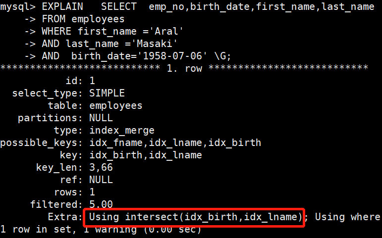
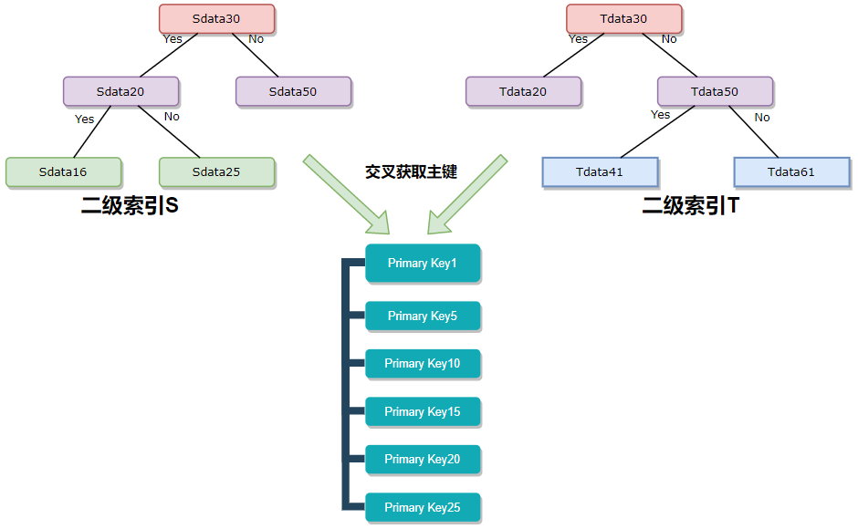

# MySQL Using intersect交集算法

​                              

**墨墨导读：**MySQL EXPLAIN下 Using intersect交集。

一次优化的过程中，MySQL执行计划选择了单独的3个二级索引中的2个索引，通过Using intersect算法进行index merge操作。从字面意义来上intersect就是  交集的意思。虽然性能上没多少影响，但比较好奇，在理解当中MySQL知识体系中是没有交集语法。


集合论中，设A，B是两个集合，由所有属于集合A且属于集合B的元素所组成的集合，叫做集合A与集合B的交集（interp），记作A∩B。


MySQL没有intersect这样的语法，但EXPLAIN使用索引交集的算法。

1)EXPALAIN案例：

```perl
mysql>CREATE TABLE `employees` (
  `emp_no` int(11) NOT NULL,
  `birth_date` date NOT NULL,
  `first_name` varchar(14)  NOT NULL,
  `last_name` varchar(16)  NOT NULL,
  `gender` enum('M','F')   NOT NULL,
  `hire_date` date NOT NULL,
  PRIMARY KEY (`emp_no`)
) ENGINE=InnoDB;
 
 
mysql>
create index idx_fname on  employees(`first_name`);
create index idx_lname on  employees(`last_name`);
create index idx_birth on  employees(`birth_date`);
 
 
mysql>EXPLAIN
SELECT  emp_no,birth_date,first_name,last_name
FROM employees
WHERE first_name ='Aral'
AND  last_name ='Masaki'
AND birth_date='1958-07-06';
```

下面进行查询：

using intersect：表示使用and的各个索引的条件时，该信息表示是从处理结果获取交集

2）通过官方的了解：
Using intersect方式是索引合并访问方法。一般有几种算法，在EXPLAIN输出的额外字段中显示:

- Using intersect(…)
- Using union(…)
- Using sort_union(…)

索引合并交集算法对所有使用的索引执行同步扫描，并生成从合并索引扫描中接收到的行序列的交集。其中Using intersect 就是一种。




3）关闭优化器行为index_merge_interp实现单独一个索引：

```php
mysql> SET optimizer_switch = 'index_merge_interp=off';
Query OK, 0 rows affected (0.00 sec)
 
 
mysql> EXPLAIN   SELECT  emp_no,birth_date,first_name,last_name
FROM employees
WHERE first_name ='Aral'
AND last_name ='Masaki'
AND birth_date='1958-07-06'\G;
```


这里有疑问，那个性能会更好，以下是通过profile分析对比：


其中executing时间不使用索引交集方式性能更好。因为index merge方式执行了底层两次IO访问，导致执行时间长。

**总结**

- 优化器方面index_merge_interp参数不建议关闭，理由是只要数据驻扎在入内存中，对于性能影响不大，所以有足够的内存分配到innodb buffer pool的时，保持默认值；
- 但对于一些特定的SQL语句情况，需要交集优化器选项。
- 测试当中，发现条件语句里不管有多少个索引可用，intersect 只选择2个索引；
- 如上案例，建议是联合索引方式。

通过intersect分析，MySQL完全可实现intersect语法的支持，希望后续8.0版本里把这部分加进去。

**参考：**
https://stackoverflow.com/questions/4526686/why-would-mysql-use-index-interp-instead-of-combined-index
https://dev.mysql.com/doc/refman/8.0/en/index-merge-optimization.html