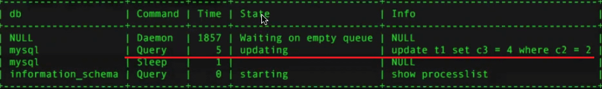
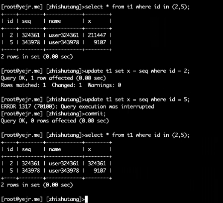

# 事务

- 事务(Transaction)是一组SQL组成的执行单元(unit),是数据库并发控制和恢复回滚的基本单位

- 一个事务可能包含多个SQL，要么都失败，要么都成功

- 事务具备4个基本属性

  1. Atomic,同一个事务里，要么都提交，要么都回滚
  2. Consistency,即在事务开始之前和事务结束以后，数据库的完整性约束没有被破坏
  3. Isolation,并发事务间的数据是彼此隔离的
  4. Durability,事务提交后，所有结果务必被持久化

- 支持事务的引擎：InnoDB、NDB Cluster、TokuDB、RocksDB

- 不支持事务的引擎：MylSAM、MEMORY/HEAP

## [事务提交流程及两阶段提交和性能](../5.MySQL体系结构/1.MySQL体系结构/2.server层服务层SQL层/5.事务提交流程.md)

## 双一模式保证数据持久性

- innodb_flush_log_at_trx_commit     = 1
- sync_binlog = 1 

 

这俩意味着什么？

innodb_flush_log_at_trx_commit

> The default setting of 1 is required for full ACID compliance. Logs are written and flushed to disk at each transaction commit.

 

sync_binlog

> =1: Enables synchronization of the binary log to disk before transactions are committed. This is the safest setting but can have a negative impact on performance due to the increased number of disk writes. In the event of a power failure or operating system crash, transactions that are missing from the binary log are only in a prepared state. This permits the automatic recovery routine to roll back the transactions, which guarantees that no transaction is lost from the binary log.

在提交事务之前，将二进制日志同步到磁盘。 这是最安全的设置，但由于磁盘写入次数增加，可能会对性能产生负面影响。 如果发生电源故障或操作系统崩溃，二进制日志中缺少的事务将仅处于准备状态。 这允许自动恢复例程回滚事务，从而确保二进制日志中不会丢失任何事务。

 

> For the greatest possible durability and consistency in a replication setup that uses InnoDB with transactions, use these settings:

为了在使用InnoDB和事务的复制设置中获得最大的持久性和一致性，请使用以下设置:

- sync_binlog=1.
- innodb_flush_log_at_trx_commit=1.

 

> Caution
>
> Many operating systems and some disk hardware fool the flush-to-disk operation. They may tell mysqld that the flush has taken place, even though it has not. In this case, the durability of transactions is not guaranteed even with the recommended settings, and in the worst case, a power outage can corrupt InnoDB data. Using a battery-backed disk cache in the SCSI disk controller or in the disk itself speeds up file flushes, and makes the operation safer. You can also try to disable the caching of disk writes in hardware caches.


警告

许多操作系统和某些磁盘硬件使“刷新磁盘”操作变得愚蠢。 他们可能告诉mysqld刷新已经发生，即使没有发生。 在这种情况下，即使使用推荐的设置也无法保证事务的持久性，并且在最坏的情况下，停电可能会破坏InnoDB数据。 在SCSI磁盘控制器或磁盘本身中使用电池供电的磁盘缓存可以加快文件刷新的速度，并使操作更安全。 您也可以尝试禁用硬件高速缓存中磁盘写入的高速缓存。

 

# 事务语法

```
START TRANSACTION
    [transaction_characteristic [, transaction_characteristic] ...]

transaction_characteristic: {
    WITH CONSISTENT SNAPSHOT
  | READ WRITE
  | READ ONLY
}

BEGIN [WORK]
COMMIT [WORK] [AND [NO] CHAIN] [[NO] RELEASE]
ROLLBACK [WORK] [AND [NO] CHAIN] [[NO] RELEASE]
SET autocommit = {0 | 1}
```

- 当参数`completion_type`为0（默认值）时，commit与commit work功能一致。

- 当参数`completion_type`为1时，commit work == commit and chain，表示马上自动开启一个相同隔离级别的事务，即：事务变成了**链事务**。

  > 关于链事务，可以查看一下InnoDB存储引擎这本书的“事务”章节，也可以搜索一下链事务的基础知识，后续有心情会补充一下这方面的文章，不过这不是重点。

- 当参数`completion_type`为2时，commit work == commit and release，事务提交后会自动断开与服务器的连接。

- rollback、rollback work 与 commit和commit work的工作模式一样。

# 事务开始

## 显式开始事务

- start transaction

  - [read write]
  - [with consistent snapshot]
  - [read only]  #默认值

 

- 只读事务从5.1开始支持。
- 显式执行start transaction ，不加选项的话，会默认启动只读模式的事务。事务里如果需要修改数据     ，那么会自动转为读写模式。
- 如果显式执行start transaction read only，那么该事务被明确声明只读，该事务无法修改数据，也不会自动转换模式。

 

- begin /begin work

  - begin 后面没有选项

 

## 隐式开始事务

略，不用多说。

 

## 关闭自动提交

- set autocommit = 0
- @@autocommit = 0

 

# 事务结束

## 事务提交

显式提交

- commit

隐式提交

- 再次开启新事务：begin / begin work |     start transaction

MySQL不支持嵌套事务，所以开启新事务时，老事务将提交。

- set autocommit = 1
- DDL | DCL

 

## 事务回滚

显式回滚

- rollback

隐式回滚

- 连接断开， mysql> exit;
- 超时断开， mysql> timeout
- 会话被踢， mysql> kill x
- 锁等待超时，当innodb_rollback_in_timeout=0（默认），当前SQL回滚，整个事务不回滚。参数为1时，回滚整个事务。
- 异常宕机，这块要参照crash recovery，传送门：[2.5 事务提交流程](..\5.MySQL体系结构\1.MySQL体系结构\2.server层服务层SQL层\5.事务提交流程.md) ，[MySQL Crash      Recovery机制](..\5.MySQL体系结构\1.MySQL体系结构\2.server层服务层SQL层\6.MySQL Crash Recovery 流程.md)

 

# 关于autocommit=0是否必要

- 好处

  多语句提交时，不会每个sql单独提交，提高事务提交效率

- 坏处

  有事务忘记提交时，锁一直不释放

  另一个事务长期锁等待，严重影响tps



 

 

 

 

 

# 知识问答：

- 什么时候会主动切换到只读事务模式？
- 查查线上业务的应用程序，是否都默认设置autocommit     = 0 
- 处于锁等待的SQL超时了，事务会怎么处理？

> 锁等待超时，当innodb_rollback_in_timeout=0（默认），当前SQL回滚，整个事务不回滚。参数为1时，回滚整个事务。

- 处于锁等待的SQL被kill了，事务会怎么处理？

  该sql回滚，事务正常。




# 事务操作的统计，QPS、TPS

- QPS

  - Question Per Seconds

- TPS

  - Transaction Per Seconds

  - 计算方法 (com_commit+com_rollback) / time ，前提是所有的事务必须是显式提交。如果存在隐式提交和回滚，不会计算到com_commit和com_rollback变量中。如果用户的程序都是显式事务，那么可以通过com_commit和com_rollback进行统计。

    > ```
    > MySQL [kk]> show global status like 'com_commit';
    > +---------------+--------+
    > | Variable_name | Value  |
    > +---------------+--------+
    > | Com_commit    | 183302 |
    > +---------------+--------+
    > 1 row in set (0.00 sec)
    > 
    > MySQL [kk]> set autocommit=0;
    > Query OK, 0 rows affected (0.00 sec)
    > 
    > MySQL [kk]> insert into kk.sbtest1(k,c,pad) values (99,'bb','ccc');
    > Query OK, 1 row affected (0.01 sec)
    > 
    > MySQL [kk]> show global status like 'com_commit';
    > +---------------+--------+
    > | Variable_name | Value  |
    > +---------------+--------+
    > | Com_commit    | 183302 |
    > +---------------+--------+
    > 1 row in set (0.00 sec)
    > ```

    

  - 还有两个参数`handler_commit`，`handler_rollback`用于事务的统计操作。

    > - Handler_commit
    >
    >   The number of internal COMMIT statements.
    >
    > - Handler_rollback
    >
    >   The number of requests for a storage engine to perform a rollback operation.