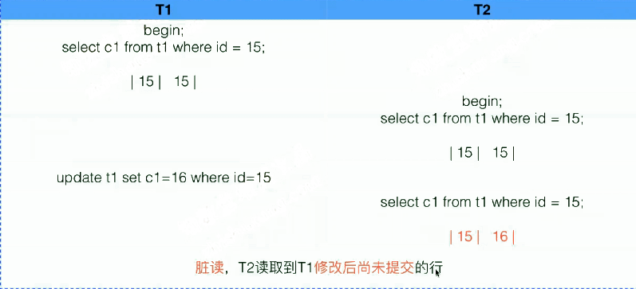
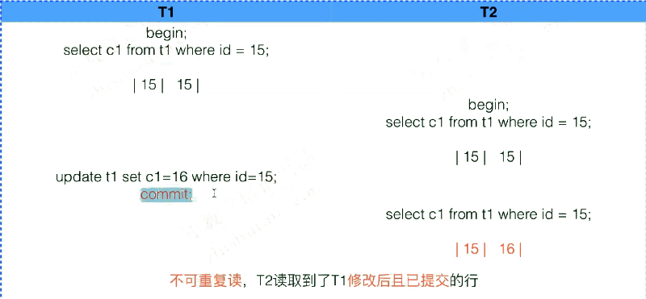
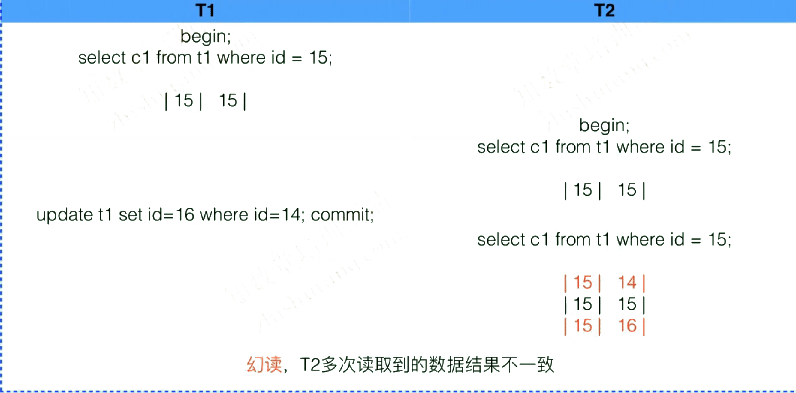
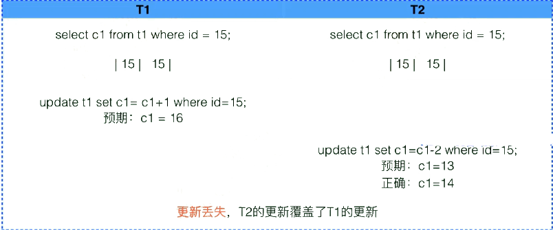

如果没有事务控制，那么并发读写时，可能会发生——

 

| **概念**   | **图示**                            | **图示说明**                                                 |
| ---------- | ----------------------------------- | ------------------------------------------------------------ |
| 脏读       |          | T2读取到了T1修改后尚未提交的行                               |
| 不可重复读 |            | T2读取到了T1修改后且已提交的行                               |
| 幻读       |  | T2多次读取到的数据结果不一致                                 |
| 更新丢失   |         | 每个sql都是独立事务（没写begin噢），所以没有事务隔离效果。     T2的更新覆盖了T1的更新。     回滚覆盖（也属于更新丢失） |
|            |                                     |                                                              |

 

 

# 事务隔离级别

 

| **隔离级别**      | **隔离级别** | **隔离等级** | **说明**                                                     | **dirty** **read**  **脏读** | **unrepeatable read**   **不可重复读** | **phatom read**   **幻读** |
| ----------------- | ------------ | ------------ | ------------------------------------------------------------ | ---------------------------- | -------------------------------------- | -------------------------- |
| Read  Uncommitted | 读未提交     | 最低         | 允许脏读，允许事务查看其它事务所进行的未提交的更改           | √                            | √                                      | √                          |
| Read Commited     | 读已提交     |              | 允许幻读，允许事务查看其它事务所进行的已提交的更改           | ×                            | √                                      | √                          |
| Repeatable Read   | 可重复读     |              | 消除了不可重复读、幻读、脏读，保证事务一致性，确保每个事务的读取结果总是一样。默认隔离级别。 | ×                            | ×                                      | ×  (InnoDB特定√)           |
| Serializable      | 串行化读     | 最高         | 每次读都需要获得表级别共享锁(lock in share mode)，读写间相互都会阻塞 | ×                            | ×                                      | ×                          |

 

- 大部分情况下，其实选择RC隔离级别就可以，例如常规的游戏、微博、社区、社交等业务场景中

- Oracle和MSSQL默认的隔离级别也是RC级别

- 在金融、交易类业务场景中，一方面在业务上要做好数据完整性、一致性判断，在数据库层面最好也选择RR隔离级别，进一步保障数据可靠性

 

 

## 为什么MySQL默认隔离级别是RR？

以前binlog format只支持statement，该模式的时候，RC级别允许没有Gap lock，会造成一个sql在主库从库的执行结果是不一样的，无法保证两者的一致性，因此需要修改为RR才能在statement模式下尽可能保持主从一致性。

 

 

# 事务隔离级别的配置与查看

## 配置文件配置：

[mysqld]中，加入一行：

```
transaction-isolation="READ_COMMITTED" | "REPEATABLE_READ" | "READ_UNCOMMITTED" | "SERIALIZABLE"
```

默认为REPEATABLE_READ，在不确定时就用默认的RR级别

## 在线全局修改：

```
set [global] transaction isolation level read committed;
```


## 当前会话级别修改：

```
set session transaction isolation level read committed;
```

 

## 查看当前隔离级别：

```
select @@GLOBAL.TX_ISOLATON, @@SESSION.TX_ISOLATION; #8.0.3移除啦

select @@TRANSACTION_ISOLATION;
```