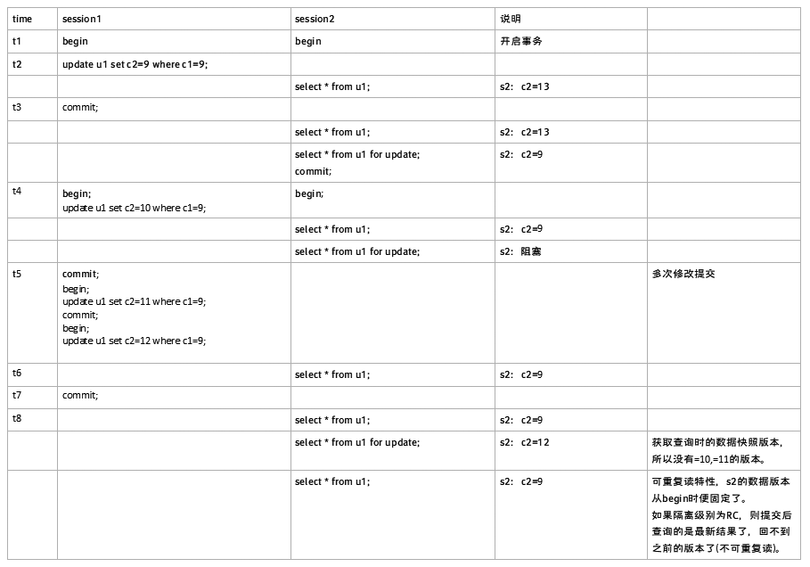
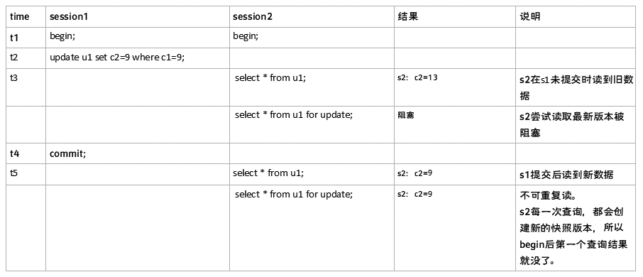

# InnoDB 读

分为快照读和当前读

 

 

## 快照读 snapshot read

基于 read view 读可见版本，不加锁

- start transaction with   consistent snapshot;  #read +     select
- 普通select

 

## 当前读 current read

读已提交的最新版本，并加锁

- S锁(IS)

  `select .. lock in share mode;`

- X锁(IX)

  `select .. for update;`

> SELECT ... LOCK IN SHARE MODE走的是IS锁(意向共享锁)，即在符合条件的rows上都加了共享锁，这样的话，其他session可以读取这些记录，也可以继续添加IS锁，但是无法修改这些记录直到你这个加锁的session执行完成(否则直接锁等待超时)。
>
>  SELECT ... FOR UPDATE 走的是IX锁(意向排它锁)，即在符合条件的rows上都加了排它锁，其他session也就无法在这些记录上添加任何的S锁或X锁。如果不存在一致性非锁定读的话，那么其他session是无法读取和修改这些记录的，但是innodb有非锁定读(快照读并不需要加锁)，for update之后并不会阻塞其他session的快照读取操作，除了select ...lock in share mode和select ... for update这种显示加锁的查询操作。 
>
>  通过对比，发现for update的加锁方式无非是比lock in share mode的方式多阻塞了select...lock in share mode的查询方式，并不会阻塞快照读。

# 快照， read view

由基于某个时间点的一组InnoDB内部活跃事务构建而成的列表。

 

## 不同事务隔离级别建立read view的阶段

- RC

  事务里的每一次读，都会创建一次版本。

  即：在每次语句执行的过程中，都关闭read_view, 重新在row_search_for_mysql函数中创建当前的一份read_view。这样就会产生不可重复读现象发生。

 

- RR

  第一次有效读的时候才会创建快照版本。

  即：创建事务trx结构的时候，就生成了当前的global read view。使用trx_assign_read_view函数创建，一直维持到事务结束。在事务结束这段时间内 每一次查询都不会重新重建Read View ， 从而实现了可重复读。

 

 

 

## 实验验证：RC和RR级别何时建立read view？

- 表情况：

  ```
  mysql> select * from u1;
  +----+----+----------------+
  | c1 | c2 | c3       |
  +----+----+----------------+
  | 1 | 2 |  3.0000000000 |
  | 2 | 3 |  4.0000000000 |
  | 3 | 4 |  5.0000000000 |
  | 5 | 6 | 10.0000000000 |
  | 6 | 7 | 888.0000000000 |
  | 7 | 7 | 888.0000000000 |
  | 8 | 7 | 888.0000000000 |
  | 9 | 13 | 888.0000000000 |
  +----+----+----------------+
  ```

 

- RR级别：

  set session transaction isolation level repeatable read; #both.
  
   
  
- RC级别：

  set session transaction isolation level read committed; #both.

  

