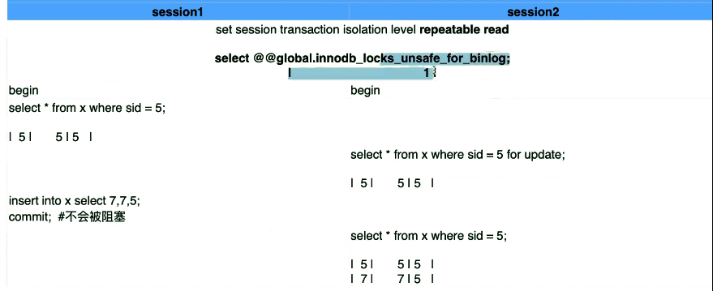
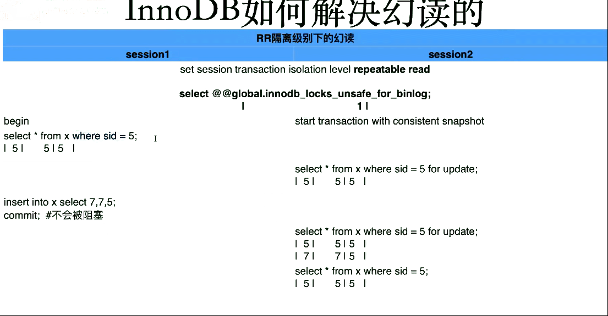

# InnoDB利用gap lock机制来解决幻读问题

结论：通过gap lock(阻止其它会话事务写入) + 一致性快照读（快照事务开始时的数据版本） ，完整避免了幻读问题。

 

- 存在幻读的条件

  - 隔离级别小于等于RC。

    或者 

  - innodb_locks_unsafe_for_binlog=1 。       #8.0后该参数废弃

 

- RR级别下解决了幻读问题

  - 引入gap lock，把两条记录中间的gap锁住，避免其它事务写入
  - 使用了一致性快照读

 

## gap lock

在事务进行过程中，防止一个事务往两条数据之间的间隙进行写数据，因此需要将两条数据之间的间隙锁住，避免其它事务向间隙写数据。

但是gap lock也产生了更多的锁事件，后续锁的章节再谈。

 

## innodb_locks_unsafe_for_binlog=1 

- mysql数据库中默认的隔离级别为RR
- innodb默认使用了next-gap算法，这种算法结合了index-row锁和gap锁。正因为这样的锁算法，innodb在可重复读这样的默认隔离级别上，可以避免幻象的产生。innodb_locks_unsafe_for_binlog最主要的作用就是控制innodb是否对gap加锁。
- 注意该参数如果是enable的，则是unsafe的，此时gap不会加锁；反之，如果disable掉该参数，则gap会加锁。当然对于一些和数据完整性相关的定义，如外键和唯一索引（含主键）需要对gap进行加锁，那么innodb_locks_unsafe_for_binlog的设置并不会影响gap是否加锁。
- 在5.1.15的时候，innodb引入了一个概念叫做“semi-consistent”，这样会在innodb_locks_unsafe_for_binlog的状态为ennable时在一定程度上提高update并发性。

 

 

 

- innodb_locks_unsafe_for_binlog=1时，RR级别也会发生幻读

- 可重复读&当前读，这个没问题

 

- 因为关闭了gap lock ，所以for update并没有锁住，依然可以insert。此时便出现了幻读
- 

 

- 一开始就发起一致性快照读，此时实现了可重复读和当前读，同样没问题。

 

 本节小结

​	InnoDB利用gap lock解决幻读问题

​	也带来了新的锁扩大化‘问题’，见后面章节

 

 

 

