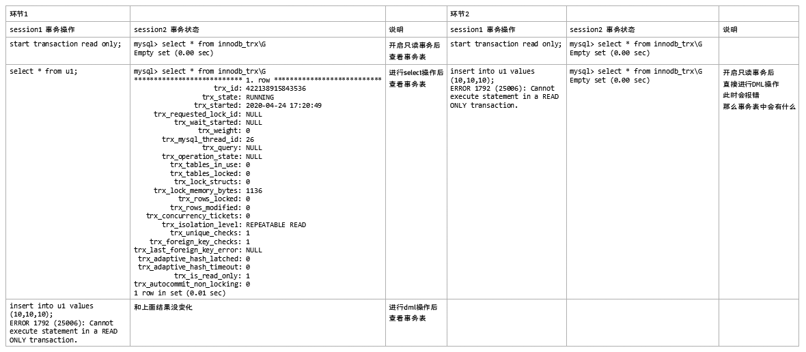
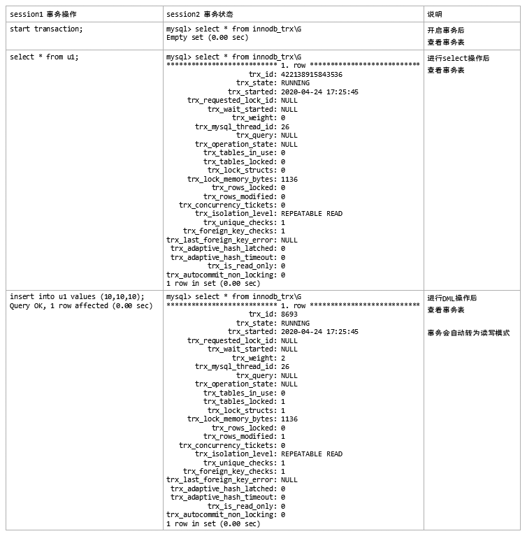
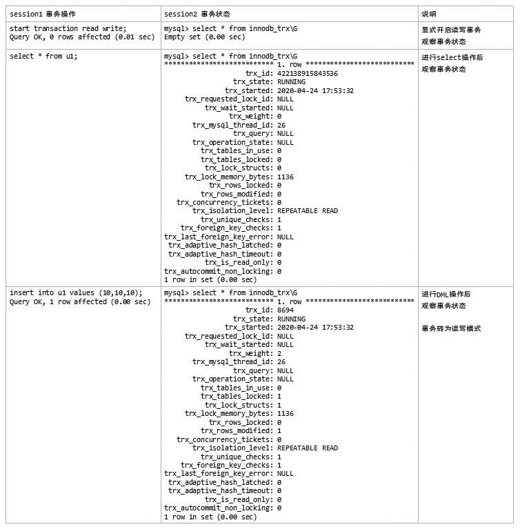
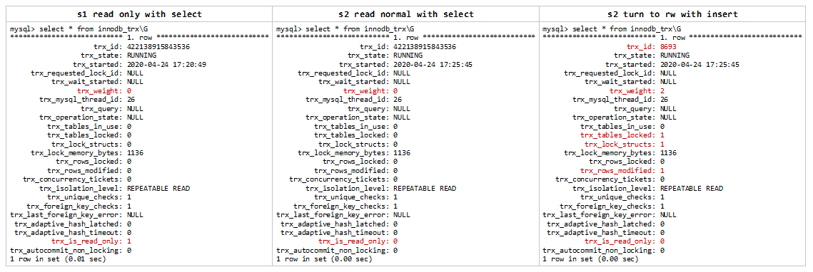

5.7起，非显式声明的事务，默认都是以只读模式启动。在事务过程中有数据被修改时，才自动变更为读写模式。

 

## 只读事务特点：

- 5.6开始支持
- 5.7进一步优化，不记录redo

- 5.7起，非显式声明的事务，默认都是以只读模式启动。在事务过程中有数据被修改时，才自动变更为读写模式。

- 显式声明只读的事务，无法再变更为读写模式。

 

- 一般事务id非常大，就是只读事务
- innodb_trx.trx_is_read_only=1

 

## 利用只读事务提升效率：

只读事务无需分配redo和undo 

 

/*对比一下显式只读事务和普通事务只读阶段、普通事务读写阶段的状态差别*/

## 实验场景：

- 场景1：显式只读事务的事务表状态，观察事务开启后是立即生成事务状态，还是发生动作后才生成事务状态？
  - 环节1：开启只读事务后，查看事务表；进行select操作后，查看事务表；进行dml操作后，查看事务表。
  - 环节2：开启只读事务后，直接进行DML操作，此时会报错，那么事务表中会有什么？

- 场景2：默认事务状态下，观察事务状态的变化
  - 环节1：开启事务后，查看事务表；进行select操作后，查看事务表；进行DML操作后，查看事务表。

- 场景3：显式读写事务，事务状态是怎样的？
  - 环节1：显式开启读写事务，观察事务状态；进行select操作后，观察事务状态；进行DML操作后，观察事务状态。

## 实验步骤：

开两个session：session 1负责操作事务，session 2负责查看i_s.innodb_trx 表。

- 场景1：显式只读事务

- 场景2：默认事务状态

- 场景3：显式读写事务

## 实验结论：

- 事务开启后，发生有效动作才会【真正的】发生事务，发生事务后才能在I_S.innodb_trx中查看到事务状态
- 因此，只读事务只有读的时候才产生事务，除此之外会报错，也不会发生事务。
- 显式声明事务读写和默认级别的效果是一样的，在事务开始时默认都是只读模式，只有发生DML动作后才会自动转为读写模式
- 事务转为读写模式时，事务ID比较正常；在只读的时候，事务ID会大的吓人。

- 只读事务的权重(trx_weight)为0，初步实验发现，每发生一次DML动作，该值便会+1。

