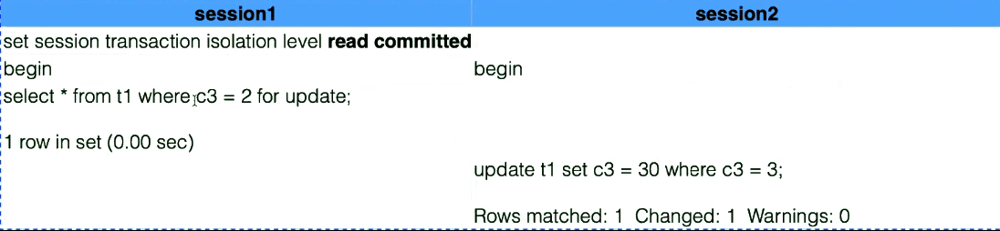
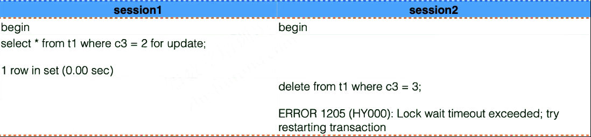
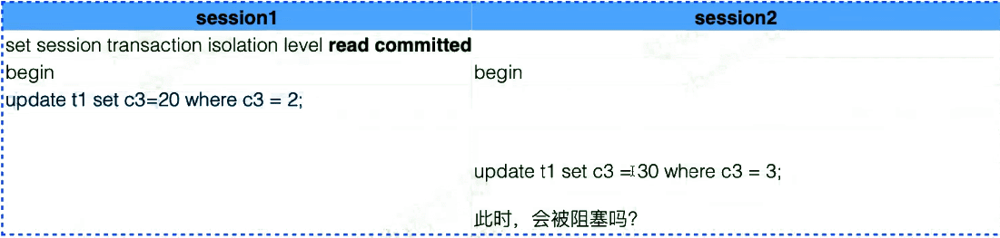
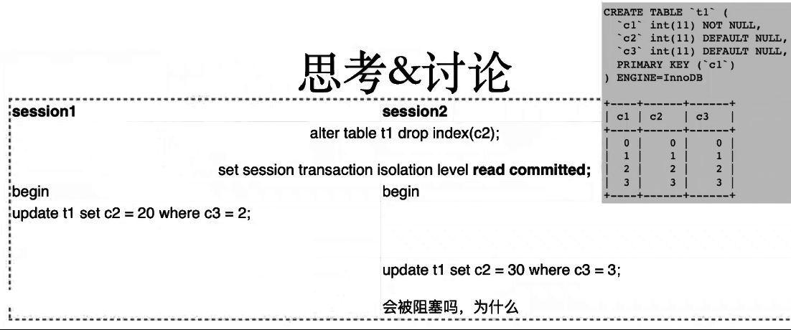

# InnoDB semi-consitent read

InnoDB特有的特性，是为了提高没索引时的update效率。

 

- semi-consitent read是read committed & consistent read 的结合，一致性读和已提交读的结合体。
- 提高update效率，降低update受锁的影响。尤其在表没有索引的情况时。
- 说人话就是：提高事务的并行度，当明确知道A事务的锁不影响B事务更新时，允许半一致性读来完成update的执行。

 

1. updat语句如果读到一行【已经加锁】的记录，此时InnoDB返回【该行记录已经提交的】最新版本，并再次判断此版本是否满足update语句的where条件。
2. 如果满足update语句的where条件（也就是最新版本的数据需要被update语句更新），则会【重新发起】一次读操作，本次【读取行的最新版本】并加锁。

 

semi-consistent read 发生的条件

- 只能是update语句。（Insert、Delete都不行）
- 隔离级别小于等于RC

或

- innodb_locks_unsafe_for_binlog=1     #参数8.0之后废弃

 

 

# 举几个栗子：

 

## 例1.

- c3列无索引。
- 会话s1会对所有记录都加上锁（因为没索引，所以锁了整个表）
- 会话s2中，update的条件不在select的锁的范围，在逐行加锁的过程中不会因为s1会话的锁阻塞，update行为成功完成。（半一致性读特性加持）

但半一致性读仅限于update。

 

 

同样的场景和条件，delete操作便会被select会话的锁阻塞超时，执行失败。

 

## 例2.

- session1没提交，session2不会被阻塞。半一致性读发生。

 

 

 

 

## 例3.

- 前两个例子都是c3列无索引，更新该列，且条件也为该列。
- 其实无索引的时候，即使条件或更新目标不为该列也一样，只要A事务的锁的内容，并不影响B事务更新，那么就可以享受到半一致性读的特性加持，完成update

 