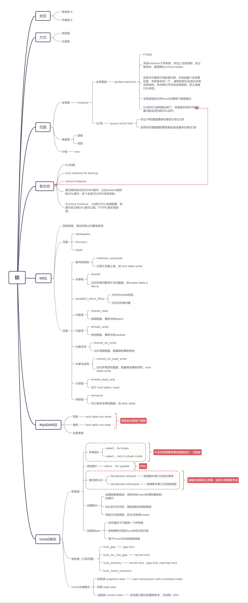
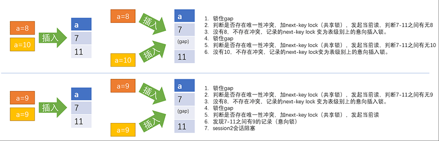
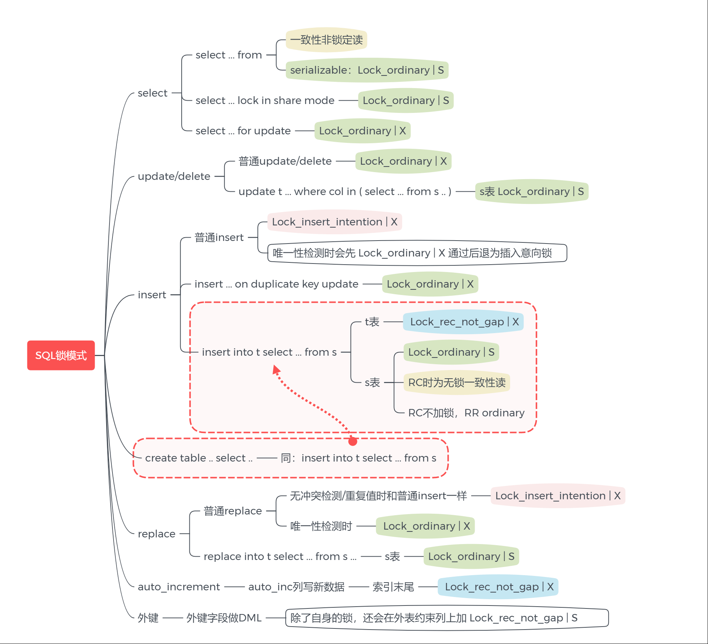

[TOC]


> - 锁如何发生，如何解除。
>
> - 了解死锁的发生，和解决。
>
>   
>
> - 为什么数据库要有锁？作用和影响是什么？没有锁会怎样？
>
> - MySQL里都有什么锁？
>
>   - MyISAM锁
>   - InnoDB锁
>     - 锁类型
>     - InnoDB锁实现
>     - InnoDB锁案例
>     - InnoDB死锁
>     - InnoDB锁优化
>   - 锁状态监控




​    

# 锁总览

## 锁的作用

避免<font color=red>并发请求</font>时对同一个数据对象同时修改，导致数据不一致。

## 加锁流程

1. 事务T1在对某个数据对象R1操作之前，先向系统发出请求，对其加锁L1
2. 之后，事务T1对该数据对象R1有了相应的控制，在T1释放L1之前，其它事务不能修改R1

## 锁对数据库的影响

### 锁等待

- 锁L1锁定某个对象R1，锁L2等待该锁释放，如果不释放，会一直等待，或者达到系统预设的超时阈值后报错，整个事务回滚，或只回滚当前SQL。

  - 可以配置参数，行锁超时后事务会被回滚。

    ```
    mysql> show global variables like '%rollback%';
    +----------------------------+-------+
    | Variable_name              | Value |
    +----------------------------+-------+
    | innodb_rollback_on_timeout | OFF   |
    | innodb_rollback_segments   | 128   |
    +----------------------------+-------+
    2 rows in set (0.00 sec)
    ```

    

### 死锁

- 锁资源请求产生了回路，如：L1等待L2释放，L2等待L3释放，L3等待L1释放，死循环。


## 锁类型

- 排他锁（X）
- 共享锁（S）

## 锁范围

- 全局锁（global lock）instance级别
- 表级锁（table lock）
- 行级锁（row lock）

- 还有mutex，不属于锁，InnoDB内部保护机制，不可控，无法手动解锁，只能调整参数优化。

## 锁方式

  - 悲观锁

    - “不信任”其它事务，为了以防万一，总是先对数据对象加锁。

    - 事先不加锁，冲突检测过程中才加锁。（就是当前加锁后，并未真正锁，当另一个session尝试锁或其它行为时发生冲突检测，才察觉到加锁了。如同用书占座，只有当其他人想坐过来的时候，帮占座的人才会出面提出该座位已经被占用（被锁））

      > select .. for update/for share 就是悲观锁。

 - 乐观锁

   - 不急着加锁，而是等到真的需要进行更新漏了，才再次查询并更新数据。
   - 提前加锁。MGR、PXC先在本节点加锁更新，再广播出去——如果其它节点加锁失败，那么本节点再回滚回去。

     - MGR、PXC用的就是乐观锁。


## 全局锁

### 全局读锁

- global read lock  全局读锁
- 一般是因为mysqldump、xtrabackup等备份请求发起
- FTWRL，关闭instance下所有表，并加上全局读锁，防止被修改，直到提交unlock tables;
- （实例中可能有不同的表引擎，在发起整个实例备份前，先将表关闭一下， 避免有其它会话正在修改表结构。关闭再打开并加全局读锁，防止表被DDL修改。）
- 若用mysqldum之备份InnoDB无需记录binlog时，可以只加--single-transaction，不加--master-data选项。传送门：[一致性备份：所有的表状态都在一个时间点。](..\..\2.MySQL备份\逻辑备份\mysqldump\mysqldump一致性备份.md)
- xtrabackup时可以分开备份InnoDB和MyISAM。
- 全局读锁时，任何innodb事务不能被提交。
- 如果都是InnoDB表，可以无需锁表在线热备。
  
  

### 全局QC锁

QC已经永远说再见了。


 - 全局query cache锁（mutex）。最好关闭query cache
  - 对QC中的数据有更新时都会引发query cache lock，对应状态为：`waiting for query cache lock`
  - 关闭QC：`query_cache_type=0 , query_cache_size=0`

 ### QC锁存在的问题:

 - 全局任何表数据的更新都会造成请求全局QC锁。
  - 当发起请求时，会将sql及结果放入qc，下次执行同样sql会从qc返回结果。
  - 但是两次执行之间如果发生数据修改，需要更新qc的时候，MySQL简单粗暴的处理方式：只要表数据更新，就会更新qc里关于这个表的所有的cache。所以只要表发生更新，就会请求全局qc这个排他锁，当实例有大量并发更新时，qc就会发生很严重的锁等待。

  

## 备份锁 backup lock

  - 8.0新增功能，为了保证备份一致性，需要backup_admin角色权限
- 发起备份前，执行lock instance for backup，备份结束后执行unlock instance解锁
- backup lock的作用时备份期间依旧允许DML操作，以及session级别的DDL操作，例如生成临时表。
  （但是建表、改表、删表、repair、truncate、optimize等都被禁止！）
 - 多个会话可以并行持有该锁。
 - 备份锁：降低全局读锁的影响。8.0开始所有数据都用innodb存储，发起备份锁便可以一致性备份。

> A backup lock acquired by **LOCK INSTANCE FOR BACKUP** is independent of transactional locks and locks
>
> taken by **FLUSH TABLES** **tbl_name** **[,** **tbl_name****\] ... WITH READ LOCK**, and the following sequences of statements are permitted:
>
> LOCK INSTANCE FOR BACKUP;
> FLUSH TABLES **tbl_name** [, **tbl_name**] ... WITH READ LOCK;
> UNLOCK TABLES;
> UNLOCK INSTANCE;
>
> FLUSH TABLES **tbl_name** [, **tbl_name**] ... WITH READ LOCK;
> LOCK INSTANCE FOR BACKUP;
> UNLOCK INSTANCE;
> UNLOCK TABLES;

 （但是建表、改表、删表、repair、truncate、optimize等都被禁止！）

```
mysql1> lock instance for backup;
Query OK, 0 rows affected (0.00 sec)

mysql3> select  * from metadata_locks;
+-------------+--------------------+----------------+-------------+-----------------------+-------------+---------------+-------------+-----------
| OBJECT_TYPE | OBJECT_SCHEMA      | OBJECT_NAME    | COLUMN_NAME | OBJECT_INSTANCE_BEGIN | LOCK_TYPE   | LOCK_DURATION | LOCK_STATUS | SOURCE    
+-------------+--------------------+----------------+-------------+-----------------------+-------------+---------------+-------------+-----------
| BACKUP LOCK | NULL               | NULL           | NULL        |       139618985816432 | SHARED      | EXPLICIT      | GRANTED     | sql_backup
| TABLE       | performance_schema | metadata_locks | NULL        |       139619055733920 | SHARED_READ | TRANSACTION   | GRANTED     | sql_parse.
+-------------+--------------------+----------------+-------------+-----------------------+-------------+---------------+-------------+-----------
2 rows in set (0.00 sec)

mysql2> truncate table k0;
--hang

mysql3> select  * from metadata_locks;
+-------------+--------------------+----------------+-------------+-----------------------+---------------------+---------------+-------------+---
| OBJECT_TYPE | OBJECT_SCHEMA      | OBJECT_NAME    | COLUMN_NAME | OBJECT_INSTANCE_BEGIN | LOCK_TYPE           | LOCK_DURATION | LOCK_STATUS | SO
+-------------+--------------------+----------------+-------------+-----------------------+---------------------+---------------+-------------+---
| BACKUP LOCK | NULL               | NULL           | NULL        |       139618985816432 | SHARED              | EXPLICIT      | GRANTED     | sq
| SCHEMA      | kk                 | NULL           | NULL        |       139618851698880 | INTENTION_EXCLUSIVE | EXPLICIT      | GRANTED     | dd
| GLOBAL      | NULL               | NULL           | NULL        |       139618851437968 | INTENTION_EXCLUSIVE | STATEMENT     | GRANTED     | sq
| BACKUP LOCK | NULL               | NULL           | NULL        |       139618851457584 | INTENTION_EXCLUSIVE | TRANSACTION   | PENDING     | sq
| TABLE       | performance_schema | metadata_locks | NULL        |       139619055733920 | SHARED_READ         | TRANSACTION   | GRANTED     | sq
+-------------+--------------------+----------------+-------------+-----------------------+---------------------+---------------+-------------+---
5 rows in set (0.00 sec)


mysql1> lock instance for backup;
Query OK, 0 rows affected (0.00 sec)

mysql1> truncate table k0;    --- 但是session1 自己却能DDL
Query OK, 0 rows affected (0.84 sec)

```


作为对比，对比一下FTWRL时：当前session也会被阻塞

```
mysql1> flush table with read lock; 
Query OK, 0 rows affected (0.01 sec) 

mysql1> truncate table k0; 
ERROR 1223 (HY000): Can't execute the query because you have a conflicting read lock 
```


## MDL锁

meta data lock

- 5.5开始引入
- 备份时防止对象被修改
- tablesspace/schema、表、function/procedure/trigger/event等多种对象上加的锁
- 事务开启后，会锁定表的meta data，其它会话对表有DDL操作时，均需等待MDL释放后方可继续。
- 锁超时阈值定义参数：lock_wait_timeout，默认锁等待一年……强烈建议调低。避免加MDL锁忘记释放后导致超长阻塞。
- 即便是只读查询、只读事务，也要尽快结束以释放MDL


### MDL锁类型

| INTENTION_EXCLUSIVE  | 意向排他锁，只用于范围上锁，例如lock table write.            |
| -------------------- | ------------------------------------------------------------ |
| SHARED               | 共享锁，用于访问字典对象，而不访问数据，例如 create table a like b |
| SHARED_HIGH_PRIO     | 只访问字典对象，例如 desc table_a                            |
| SHARED_READ          | 共享读锁，用于读取数据，如事务中的select rows                |
| SHARED_WRITE         | 共享写锁，用于修改数据，如事务中的update rows                |
| SHARED_NO_WRITE      | 共享非写锁，允许读取数据，阻塞其它TX修改数据，用在ALTER   TABLE第一阶段 |
| SHARED_NO_READ_WRITE | 用于访问字典，读写数据，阻塞其它TX读写数据，例如lock   table write |
| SHARED_READ_ONLY     | 只读锁，常见于lock table x read                              |
| EXCLUSIVE            | 排他锁，可以修改字典和数据，例如alter table                  |

### MDL锁的兼容性

|      | IX   | S    | SH   | SR   | SW   | SNW  | SNRW | X    |
| ---- | ---- | ---- | ---- | ---- | ---- | ---- | ---- | ---- |
| IX   | √    | √    | √    | √    | √    | √    | √    | √    |
| S    | √    | √    | √    | √    | √    | √    | √    | ×    |
| SH   | √    | √    | √    | √    | √    | √    | √    | ×    |
| SR   | √    | √    | √    | √    | √    | √    | ×    | ×    |
| SW   | √    | √    | √    | √    | √    | ×    | ×    | ×    |
| SNW  | √    | √    | √    | √    | ×    | ×    | ×    | ×    |
| SNRW | √    | √    | √    | ×    | ×    | ×    | ×    | ×    |
| X    | √    | ×    | ×    | ×    | ×    | ×    | ×    | ×    |

### 确认MDL锁源头以及消除方法

上锁后便可以在performance_schema.metadata_locks 查询到。
上锁后发生锁等待时，可以在sys.schema_table_lock_waits 查询。
有没有锁，和有没有锁等待是两个不同的概念。

 - 启用MDL的P_S统计

   - p_s.setup_consumers.global_instrumentation
   - p_s.setup_instruments.wait/lock/metadata/sql/mdl

    打开可以动态打开，立即生效。
    但是关闭的话，只有新的session才能有效果（等待亲测）

 - 查询MDL锁状态信息：

   - show proesslist;
   - select * from performance_schema.metadata_locks\G

 - 通过metadata_locks查看MDL锁事件

   ```
   mysql1> select * from performance_schema.metadata_locks where object_schema != 'performance_schema'\G
   Empty set (0.00 sec)
   
   mysql2> select *,sleep(1000) from k1 limit 2;
   
   mysql1> select * from performance_schema.metadata_locks where object_schema != 'performance_schema'\G
   *************************** 1. row ***************************
             OBJECT_TYPE: TABLE
           OBJECT_SCHEMA: kk
             OBJECT_NAME: k1
             COLUMN_NAME: NULL
   OBJECT_INSTANCE_BEGIN: 139618985616624   #是μs
               LOCK_TYPE: SHARED_READ
           LOCK_DURATION: TRANSACTION
             LOCK_STATUS: GRANTED
                  SOURCE: sql_parse.cc:6052
         OWNER_THREAD_ID: 52
          OWNER_EVENT_ID: 54
   1 row in set (0.00 sec)
   
   mysql3> select *,sleep(100) from k1 limit 2;
   
   mysql1> select * from performance_schema.metadata_locks where object_schema != 'performance_schema'\G
   *************************** 1. row ***************************
             OBJECT_TYPE: TABLE
           OBJECT_SCHEMA: kk
             OBJECT_NAME: k1
             COLUMN_NAME: NULL
   OBJECT_INSTANCE_BEGIN: 139618985616624
               LOCK_TYPE: SHARED_READ
           LOCK_DURATION: TRANSACTION
             LOCK_STATUS: GRANTED
                  SOURCE: sql_parse.cc:6052
         OWNER_THREAD_ID: 52
          OWNER_EVENT_ID: 56
   *************************** 2. row ***************************
             OBJECT_TYPE: TABLE
           OBJECT_SCHEMA: kk
             OBJECT_NAME: k1
             COLUMN_NAME: NULL
   OBJECT_INSTANCE_BEGIN: 139619052075760
               LOCK_TYPE: SHARED_READ
           LOCK_DURATION: TRANSACTION
             LOCK_STATUS: GRANTED
                  SOURCE: sql_parse.cc:6052
         OWNER_THREAD_ID: 53
          OWNER_EVENT_ID: 13
   ```

    

 - 如何拿着metadata lock视图查到的thread_id 找到对应的process？

   ```
   mysql1> show processlist;
   +----+-----------------+-----------+------+---------+--------+------------------------+--------------------------------------+
   | Id | User            | Host      | db   | Command | Time   | State                  | Info                                 |
   +----+-----------------+-----------+------+---------+--------+------------------------+--------------------------------------+
   |  4 | event_scheduler | localhost | NULL | Daemon  | 260212 | Waiting on empty queue | NULL                                 |
   | 12 | root            | localhost | NULL | Query   |      0 | starting               | show processlist                     |
   | 13 | root            | localhost | kk   | Query   |     37 | User sleep             | select *,sleep(1000) from k1 limit 2 |
   | 14 | root            | localhost | kk   | Query   |     27 | User sleep             | select *,sleep(100) from k1 limit 2  |
   +----+-----------------+-----------+------+---------+--------+------------------------+--------------------------------------+
   4 rows in set (0.00 sec)
   
   mysql1> select * from performance_schema.threads where PROCESSLIST_ID in (13,14);
   +-----------+---------------------------+------------+----------------+------------------+------------------+----------------+---------------------+------------------+-------------------+--------------------------------------+------------------+------+--------------+---------+-----------------+--------------+----------------+
   | THREAD_ID | NAME                      | TYPE       | PROCESSLIST_ID | PROCESSLIST_USER | PROCESSLIST_HOST | PROCESSLIST_DB | PROCESSLIST_COMMAND | PROCESSLIST_TIME | PROCESSLIST_STATE | PROCESSLIST_INFO                     | PARENT_THREAD_ID | ROLE | INSTRUMENTED | HISTORY | CONNECTION_TYPE | THREAD_OS_ID | RESOURCE_GROUP |
   +-----------+---------------------------+------------+----------------+------------------+------------------+----------------+---------------------+------------------+-------------------+--------------------------------------+------------------+------+--------------+---------+-----------------+--------------+----------------+
   |        52 | thread/sql/one_connection | FOREGROUND |             13 | root             | localhost        | kk             | Query               |              149 | User sleep        | select *,sleep(1000) from k1 limit 2 |             NULL | NULL | YES          | YES     | Socket          |          691 | USR_default    |
   |        53 | thread/sql/one_connection | FOREGROUND |             14 | root             | localhost        | kk             | Query               |              139 | User sleep        | select *,sleep(100) from k1 limit 2  |             NULL | NULL | YES          | YES     | Socket          |          693 | USR_default    |
   +-----------+---------------------------+------------+----------------+------------------+------------------+----------------+---------------------+------------------+-------------------+--------------------------------------+------------------+------+--------------+---------+-----------------+--------------+----------------+
   
   
   mysql2> begin ;
   Query OK, 0 rows affected (0.00 sec)
   
   mysql2> update k1 set id=22 where id=2;
   Query OK, 1793 rows affected (0.01 sec)
   Rows matched: 1793  Changed: 1793  Warnings: 0
   
   mysql3> begin;
   Query OK, 0 rows affected (0.00 sec)
   
   mysql3> update k1 set id=22 where id=2;
   
   
   mysql> select * from performance_schema.metadata_locks where object_schema != 'performance_schema'\G
   *************************** 1. row ***************************
             OBJECT_TYPE: TABLE
           OBJECT_SCHEMA: kk
             OBJECT_NAME: k1
             COLUMN_NAME: NULL
   OBJECT_INSTANCE_BEGIN: 139618985616624
               LOCK_TYPE: SHARED_WRITE
           LOCK_DURATION: TRANSACTION
             LOCK_STATUS: GRANTED    #拿到了MDL锁
                  SOURCE: sql_parse.cc:6052
         OWNER_THREAD_ID: 52
          OWNER_EVENT_ID: 66
   *************************** 2. row ***************************
             OBJECT_TYPE: TABLE
           OBJECT_SCHEMA: kk
             OBJECT_NAME: k1
             COLUMN_NAME: NULL
   OBJECT_INSTANCE_BEGIN: 139619052075760
               LOCK_TYPE: SHARED_WRITE
           LOCK_DURATION: TRANSACTION
             LOCK_STATUS: GRANTED    #拿到了MDL锁
                  SOURCE: sql_parse.cc:6052
         OWNER_THREAD_ID: 53
          OWNER_EVENT_ID: 19
   2 rows in set (0.00 sec)
   
   mysql> show processlist;
   +----+-----------------+-----------+------+---------+--------+------------------------+--------------------------------+
   | Id | User            | Host      | db   | Command | Time   | State                  | Info                           |
   +----+-----------------+-----------+------+---------+--------+------------------------+--------------------------------+
   |  4 | event_scheduler | localhost | NULL | Daemon  | 261969 | Waiting on empty queue | NULL                           |
   | 12 | root            | localhost | NULL | Query   |      0 | starting               | show processlist               |
   | 13 | root            | localhost | kk   | Sleep   |    277 |                        | NULL                           |
   | 14 | root            | localhost | kk   | Query   |     14 | updating               | update k1 set id=22 where id=2 |
   +----+-----------------+-----------+------+---------+--------+------------------------+--------------------------------+
   4 rows in set (0.00 sec)
   
   mysql> select * from sys.schema_table_lock_waits;
   Empty set (0.01 sec)
   
   ```


- 为什么都拿到了MDL锁？
  通过前面的MDL锁兼容性表格可知，SW和SW可以兼容并存的。
  理解一下可以得知：行锁虽然被阻塞，但是更新所需的MDL锁是拿到的——允许同时加（获取）shared_write锁， 只不过在等待行锁而已。

<font color=red>只有对表进行表级别锁时，才会互斥</font>

 - 表级别锁阻塞实验

   ```
   mysql2> lock table k1 read;
   Query OK, 0 rows affected (2 min 37.02 sec)
   
   mysql1> select * from performance_schema.metadata_locks where object_schema != 'performance_schema'\
   *************************** 1. row ***************************
             OBJECT_TYPE: TABLE
           OBJECT_SCHEMA: kk
             OBJECT_NAME: k1
             COLUMN_NAME: NULL
   OBJECT_INSTANCE_BEGIN: 139618985329072
               LOCK_TYPE: SHARED_READ_ONLY
           LOCK_DURATION: TRANSACTION
             LOCK_STATUS: GRANTED
                  SOURCE: sql_parse.cc:6052
         OWNER_THREAD_ID: 52
          OWNER_EVENT_ID: 69
   1 row in set (0.00 sec)
   
   mysql3> begin;
   Query OK, 0 rows affected (0.00 sec)
   
   mysql3> update k1 set id=22 where id=2;
   --hang住了。
   
   mysql1> mysql> select * from performance_schema.metadata_locks where object_schema != 'performance_sGhema'\ 
   *************************** 1. row ***************************
             OBJECT_TYPE: TABLE
           OBJECT_SCHEMA: kk
             OBJECT_NAME: k1
             COLUMN_NAME: NULL
   OBJECT_INSTANCE_BEGIN: 139618985329072
               LOCK_TYPE: SHARED_READ_ONLY
           LOCK_DURATION: TRANSACTION
             LOCK_STATUS: GRANTED
                  SOURCE: sql_parse.cc:6052
         OWNER_THREAD_ID: 52
          OWNER_EVENT_ID: 69
   *************************** 2. row ***************************
             OBJECT_TYPE: TABLE
           OBJECT_SCHEMA: kk
             OBJECT_NAME: k1
             COLUMN_NAME: NULL
   OBJECT_INSTANCE_BEGIN: 139619052222560
               LOCK_TYPE: SHARED_WRITE
           LOCK_DURATION: TRANSACTION
             LOCK_STATUS: PENDING # 加SW锁被阻塞
                  SOURCE: sql_parse.cc:6052
         OWNER_THREAD_ID: 53
          OWNER_EVENT_ID: 28
   2 rows in set (0.00 sec)
   
   ```


- 查询锁等待信息，利用sys schema查询MDL等待信息

  ```
  mysql> select * from sys.schema_table_lock_waits\G
  *************************** 1. row ***************************
                 object_schema: kk
                   object_name: k1
             waiting_thread_id: 53
                   waiting_pid: 14
               waiting_account: root@localhost
             waiting_lock_type: SHARED_WRITE
         waiting_lock_duration: TRANSACTION
                 waiting_query: update k1 set id=22 where id=2
            waiting_query_secs: 56
   waiting_query_rows_affected: 0
   waiting_query_rows_examined: 0
            blocking_thread_id: 52
                  blocking_pid: 13
              blocking_account: root@localhost
            blocking_lock_type: SHARED_READ_ONLY
        blocking_lock_duration: TRANSACTION
       sql_kill_blocking_query: KILL QUERY 13
  sql_kill_blocking_connection: KILL 13
  1 row in set (0.00 sec)
  
  mysql> show processlist;
  +----+-----------------+-----------+------+---------+--------+---------------------------------+--------------------------------+
  | Id | User            | Host      | db   | Command | Time   | State                           | Info                           |
  +----+-----------------+-----------+------+---------+--------+---------------------------------+--------------------------------+
  |  4 | event_scheduler | localhost | NULL | Daemon  | 263713 | Waiting on empty queue          | NULL                           |
  | 12 | root            | localhost | NULL | Query   |      0 | starting                        | show processlist               |
  | 13 | root            | localhost | kk   | Sleep   |    434 |                                 | NULL                           |
  | 14 | root            | localhost | kk   | Query   |    218 | Waiting for table metadata lock | update k1 set id=22 where id=2 |
  +----+-----------------+-----------+------+---------+--------+---------------------------------+--------------------------------+
  4 rows in set (0.00 sec)
  
  ```

  ​    

 - 由此可知，<font color=red>shared_write</font>和<font color=red>shared_read_only</font>互斥。

  - 由查询结果可知，thread 52 阻塞了thread 53的请求，并且给出了处理办法：

    - <font color=red>kill query </font>只能将id里当前在跑的sql中止在这个实验里， kill query 是没用的——show processlist看到，pid 13当前没有语句进行。

    - 只有 <font color=red>kill 13</font>才有效。

    - 当然了， 也可以在13中结束事务，释放锁：

      ```
      mysql2> unlock tables; 
      Query OK, 0 rows affected (0.00 sec) 
      
      mysql3> update k1 set id=22 where id=2; 
      Query OK, 0 rows affected (5 min 40.74 sec) 
      Rows matched: 0  Changed: 0 Warnings: 0 
      ```


# 表锁

表锁一般在server层面实现。
 InnoDB表还有IS/IX表级锁，以及auto-inc锁。

## 读锁

lock table t1 read;

 - 持有读锁的会话可以读表，但是不能写表。
  - 允许多个会话同时持有读锁

## 写锁

lock table t1 write

 - 持有写锁的会话既可以读表，也可以写表
  - 只有持有写锁的会话才可以读写该表
  - 其它会话访问该表或者请求加锁都会被阻塞，直到锁释放。

## 加锁

  - lock table t1 read;
    - 多个session都可以对一个表加读锁
- lock table t1 write
  - 也许需要先解除之前上的读锁。（自己试一下）
  - 写锁是X锁，同一时间一个表只能被一个session加写锁。

## 释放锁

MySQL解除表级锁目前是解除全部表级锁，无法单独解除某个锁。（help get_lock 好像可以，自己研究一下。）

 - unlock tables;
  - 断开连接或者被kill
 - ~~【错误，需要验证版本】执行lock table~~
  - ~~【错误，需要验证版本】显示开启一个事务~~

# MyISAM锁


  - 默认是表锁，读写互斥，仅只读共享
- 读锁，lock table xxx read，自身只读，不能写。其它线程仍可读，不能写。多个线程都可提交read lock
- 写锁，lock table xxx write，自身可读写，其它线程完全不可读写。
- 写锁优先级高于读锁
- select自动加读锁（共享锁）
- 其它DML、DDL自动加写锁（排他锁）
- 释放锁见上文。

<font color=red>放弃MyISAM吧，都是表锁。</font>
    


# InnoDB锁

  - 默认是行锁（row lock）
- InnoDB是通过在索引记录上加锁，实现行锁
- 因此没有索引时就无法实现行锁，从而升级成全表记录锁，等同于表锁。
- 索引效率很低时锁也会升级。需要加锁的数据量过多，也会直接升级锁范围。 因为这样代价会低很多。

 如同用书占座，只有当其他人想坐过来的时候，帮占座的人才会出面提出该座位已经被占用（被锁）

## InnoDB行锁实现机制

  - 基于索引实现，逐行检查，逐行加锁
- 没有索引的列上需要加锁时，会先对所有记录加锁，再根据实际情况决定是否释放锁。
- 辅助索引上加锁时，同时要回溯到主键索引上再加一次锁。
- 加锁的基本单位默认时lock_ordinary，当索引就具有唯一性的时候退化为lock_rec_not_gap
- 等值条件逐行加锁时，会向右遍历到第一个不满足条件的记录，然后lock_ordinary退化为lock_gap
- 如果发生唯一性检测（insert\update动作），那么会发生lock_ordinary ， 再退化成lock_rec_not_gap
- 唯一索引的范围条件加锁时，也会对第一个不满足条件的记录加锁

## InnoDB隐式、显式锁


  - 显式锁(explicit-lock)
    - select .. from ..        where .. for update / for share 
- 隐式锁(implicit-lock)
  - update set .. where ..
  - 任何辅助索引上锁，或非索引列上锁，都要回溯到主键上再加锁。
  - 和其他session有冲突时，隐式锁转换为显式锁。

## InnoDB锁类型

### 共享锁

> select .. for share/ lock in share mode

- 不允许其他事务修改被锁定的行，只能读
- 自动提交模式下的普通select是一致性非锁定读，不加锁。

### 排他锁


  - 对一行记录DML时，至少加上排他锁
- 锁范围视情况而定，可能是record lock、next-key lock、或者可能只有 gap lock
- 执行DML，或select.. for update

### 意向锁


  - InnoDB特有，加载在表级别上的锁。
- Intention shared(IS)，事务想要获得表中某几行的共享锁
- Intention exclusive(IX), 事务想要获得表中某几行的排他锁
- 意向锁时加载在数据表B+树结构的根节点，也就是对整个表加意向锁
- 意向锁的作用，避免在执行DML时，对表执行DDL操作导致数据不一致
- IS和IX 是可以兼容的。


## InnoDB锁兼容性

|         | X    | IX   | S    | IS   | AutoInc |
| ------- | ---- | ---- | ---- | ---- | ------- |
| X       | ×    | ×    | ×    | ×    | ×       |
| IX      | ×    | √    | ×    | √    | √       |
| S       | ×    | ×    | √    | √    | ×       |
| IS      | ×    | √    | √    | √    | √       |
| AutoInc | ×    | √    | ×    | √    | ×       |

## InnoDB行锁范围、粒度

InnoDB对行锁有进一步的细粒度：

 - LOCK_REC_NOT_GAP,record lock without gap lock.
  - LOCK_GAP,gap lock
  - LOCK_ORDINARY,next-key lock = record lock + gap lock ，普通辅助索引RR级别的加锁范围。
  - LOCK_INSERT_INTENTION
    

### InnoDB行锁粒度一览

lock wait 表示等待锁。

| lock_ordinary         | next-key   lock，普通锁，LOCK_S   record   lock + gap lock ,next-key lock | 锁定记录本身和前面的gap，record lock +         gap lock （也叫next-key lock）     RR级别下，利用next-key lock来避免产生幻读     当innodb_locks_unsafe_for_binlog=1时，lock_ordinary会降级为lock_rec_not_gap，相当于降级到RC。     8.0版本取消了参数innodb_locks_unsafe_for_binlog，即不再允许RR级别的幻读情景。 |
| --------------------- | ------------------------------------------------------------ | ------------------------------------------------------------ |
| lock_gap              | gap   lock                                                   | 锁定一个范围，但不包含记录本身。         只锁住索引记录之间、或第一条索引记录（INFIMUM）之前、又或最后一条索引记录（SUPEREMUM）之后的范围，并不锁住记录本身     RR级别下，对非唯一索引记录当前读时，除了对命中的记录加lock_ordinary锁，还会对该记录之后的gap加gap lock，这是为了保证可重复读的需要，避免其他事务插入数据造成幻读。     innodb有两条虚拟记录，最小记录和最大记录，用来构建B+tree。           如果条件是where <= n, 这时会从n开始到最小值（虚拟最小记录）之间范围加锁      如果条件是where >= n, 这时会从n开始到最大值（虚拟最小记录）之间范围加锁 |
| lock_rec_not_gap      | record   lock，锁定记录，但不锁gap。                         | record    lock，单个记录上的锁。         仅锁住记录本身，不锁前面的gap     RC下的行锁大多数都是这个锁类型     RR下的主键、唯一索引等值条件下加锁也通常是这个类型锁     RR下的非唯一索引加锁时（lock_ordinary），也会同时回溯到主键上加lock_rec_not_gap锁。           但唯一性约束检测时，即使是在RC下，总是要先加lock_s\lock_ordinary锁。 |
| lock_insert_intention | 意向插入锁                                                   | 是一种特殊的gap lock。         当插入索引记录的时候用来判断是否有其他事务的范围锁冲突，如果有就需要等待。     同一个GAP中，只要不是同一个位置就可以有多个插入意向锁并存。     例如5~10区间，同时插入6、8就不会相互冲突阻塞，而同时插入9就会引发冲突阻塞等待。     插入意向锁和间隙锁(gap lock)并不兼容，一个gap加了lock gap后，无法再加insert_intention。 |

 lock_conv_by_other 锁时由其他事务创建的（比如隐式锁转换）

### 意向插入锁的示意：



### 操作InnoDB表时的加锁等级

  - RR级别以及等值条件加锁时：
    - 主键索引等值条件加锁为lock_rec_not_gap
    - 唯一辅助索引等值条件加锁为lock_rec_not_gap
    - 普通辅助索引等值条件加锁为lock_ordinary
    - 没有索引的话加锁为全表范围lock_ordinary
- RC级别以及5.7及以前版本 RR&       innodb_locks_unsafe_for_binlog =1 时
  - 默认只有lock_rec_not_gap，只有在检查外键约束或者duplicate ey检查时才加lock_orainary |        lock_s

 MyISAM引擎有表锁，InnoDB引擎也可以加表锁。

## InnoDB自增锁 auto-inc lock

<font color=red>binlog_format=row时，可以放心的设置innodb_autoinc_lock_mode=2，降低自增锁的影响。</font>


5.1之后新增innodb_autoinc_lock_mode选项。5.1以前，所有自增锁都是表级别锁，5.1以后可以有不同的选项。
 同样的，也是在5.1以后binlog format支持多种方式（row,statement,mixed）。

 - 传统模式（模式为0）：
   - 对单表上的并发影响极大
   - 当任何一条SQL要插入新数据， 都要求发起一个表级别自增锁，请求得到最新的自增ID ， sql执行完成后，表级别自增锁释放。
   - 如果是多条数据的话，可能会造成严重的锁等待。
   - 可以保证主从时insert .. select一致性，但大量insert时并发效率很低
  - 前默认模式（模式为1）
    - 不再用锁方式，改为mutex，先使用新方式预判一个动作大约会插入多少数据量，首先分配10个自增ID，用不完也不回收。当其它session请求自增ID时，会造成自增列自增空洞，不过影响不大。
    - 如果遇到不确定的情况，如load data ， insert select 时会继续使用旧模式，使用表级别锁，直到动作完成才会释放表级别自增锁。
  - 新方式（模式为2，8.0.3开始默认为2）
    - 模式为1时有退化，但是，由于binlog format=row时可以保证主从一致性，在保证主从一致性的前提下，自增锁就可以统一退化成mutex模式，总是预估数据量、快速分配并释放，这样可以提高并发度。
    - 不退化，古老版本不适合replication环境，可能造成主从数据不一致。但是8.0.3开始为默认值了，同样的binlog_format默认值也是row了。

## InnoDB自旋锁 InnoDB spin lock

自旋锁 保护共享资源而提出的锁机制，和互斥锁类似，在任何时刻下都只能有一个持有者，控制事务并发时CPU时间片分配。

<font color=red>可以利用自旋锁的状态来判断InnoDB线程内部争用严重与否。</font>

 - 用于控制InnoDB内部线程调度而存在着的轮询检测
  - innodb_spin_wait_delay，控制轮询间隔，默认为6毫秒。（A线程获取CPU时间片后，B线程每隔6毫秒尝试获取CPU时间片的资源。）
  - 当CPU负载非常高的时候可能也无法保证所有线程都能被合理的分配，这时会导致线程处于休眠状态，spin round 可能也会很高。


 另一种描述方式：

 - 保障innodb内部线程的资源分配，innodb内部有很多工作线程，每个线程都要抢CPU的时间片。
  - 自旋锁来保障线程公平的分配CPU时间片。A线程获取CPU时间片后，B线程轮询尝试获取CPU时间片的资源。
  - 当CPU负载非常高的时候可能也无法保证所有线程都能被合理的分配，这时会导致线程处于休眠状态（长时间获得不到资源，会识别为高负载，转为sleep）。

### 通过自旋锁状态来判断数据库负载

  - 查看spin lock wait

    ```
    mysql> show engine innodb status\G 
    … 
    ----------
    SEMAPHORES 
    ---------- 
    OS WAIT ARRAY INFO: reservation count 239413 
    OS WAIT ARRAY INFO: signal count 560637 
    RW-shared spins 0, rounds 1028345, OS waits 118311 
    RW-excl spins 0, rounds 3590208, OS waits 45541 
    RW-sx spins 805351, rounds 5406426, OS waits 61835 
    
    Spin rounds per wait: 1028345.00 RW-shared, 3590208.00 RW-excl, 6.71 RW-sx 
    ------------
    - RW-shared spins 0 自旋0次, rounds 1028345 循环1028345圈, OS waits 118311 请求不到便sleep，sleep次数。
    - OS waits / rounds
    - 118311 / 1028345= 0.115 
    - 45541 / 3590208 = 0.0127 
    - 61835 / 5406426 = 0.0114 
    ```

    - rounds， 表示spin一次空转多少圈，也就是返回来询问的次数。
      - OS waits，表示sleep。当突然增长比较快时，说明latch争用比较严重。
        - 如果OS waits值比较高，说明latch争用比较严重。
      - OS waits/rounds  <font color=red>超过1% 说明系统负载比较高。</font>
      - ==OS wait 比较大的话， 重点查buffer pool是否够用，以及是否有很多SQL没有使用索引，导致持有innodb page时间较长。==

    ```
    ----------
    SEMAPHORES 
    ---------- 
    OS WAIT ARRAY INFO: reservation count 596113 
    OS WAIT ARRAY INFO: signal count 846843 
    RW-shared spins 0, rounds 4277086, OS waits 137734 
    RW-excl spins 0, rounds 22496950, OS waits 218313 
    RW-sx spins 637341, rounds 11383745, OS waits 170045 
    Spin rounds per wait: 4277086.00 RW-shared, 22496950.00 RW-excl, 17.86 RW-sx 
    218313/22496950 = 0.0097  
    170045/11383745 = 0.0149  
    ```

 # InnoDB 行锁

 

 - 默认都是加lock_ordinary锁
  - 如果是唯一索引列上的等值查询，则退化成lock_rec_not_gap

 - 所有版本，<font color=red>非唯一索引列</font>上的范围查询，遇到第一个不符合条件的记录也会加上lock_ordinary。
  - 8.0.18版本以前，主要指<=场景：唯一索引列上的范围查询，遇到第一个不符合条件的记录也会加上lock_ordinary ，在RC下会释放，RR下不会释放。
  - 8.0.18版本以前，<font color=red>非唯一索引列</font>上的等值查询，向右遍历遇到第一个不符合条件的记录时，先加上lock_ordinary，再退化成lock_gap。

 ## 锁排查可以用的视图和数据字典

```
mysql> show engine innodb status \G 
mysql> select * from performance_schema.data_lock_waits; 
mysql> select * from performance_schema.data_locks; 
mysql> select * from performance_schema.metadata_locks; 
```


 ## 查看InnoDB锁

 - 查看InnoDB锁
   - show global status

| Innodb_row_lock_current_waits | 当前等待的行锁数量<br>（这个可能不准确。当前即便没有发生，可能也大于0 .使用 select   count(*) from sys.innodb_lock_waits 来确认是否真有行锁发生。） |
| ----------------------------- | ------------------------------------------------------------ |
| Innodb_row_lock_time          | 请求行锁总耗时(ms)                                           |
| Innodb_row_lock_time_avg      | 请求行锁平均耗时(ms)                                         |
| Innodb_row_lock_time_max      | 请求行锁最大耗时(ms)                                         |
| Innodb_row_lock_waits         | 行锁发生次数                                                 |

 - show processlist

  - show engine innodb status

  - sys var:      innodb_status_output & innodb_status_output_locks

  - sys.innodb_lock_waits &  sys.schema_table_lock_waits

  - pfs.data_locks ， 老版本是 innodb_locks

  - pfs.data_lock_waits

  - pfs.metadata_locks

    

 ## InnoDB 行锁兼容性

|                |                       | 请求的锁类型  | 请求的锁类型     | 请求的锁类型 | 请求的锁类型          |
| -------------- | --------------------- | ------------- | ---------------- | ------------ | --------------------- |
|                |                       | lock_ordinary | lock_rec_not_gap | lock_gap     | lock_insert_intention |
| 已获得的锁类型 | lock_ordinary         | X             | X                | O            | X                     |
| 已获得的锁类型 | lock_rec_not_gap      | X             | X                | O            | O                     |
| 已获得的锁类型 | lock_gap              | O             | O                | O            | X                     |
| 已获得的锁类型 | lock_insert_intention | O             | O                | O            | O                     |

 - gap只和insert intention锁冲突
  - insert intention和任何锁都不冲突，除非也在相同位置做意向插入锁


 - 先获得意向插入锁的，再尝试上gap lock是可以的

  - 但是反过来 ，先获得gap lock的，再尝试加上意向插入锁便会阻塞，

  - 原因是：先获得意向插入锁时，实际上插入已经成功，意向插入锁会被转变为对具体记录的ordinary 或 rec_not_gap ，此时二者都与lock gap兼容。

    

 # InnoDB 读模式

 快照读和当前读。

### 快照读，snapshot read

  - 基于read view 读可见版本，不加锁
- start transaction with       consistent read + select
- 普通select
 - 一致性快照读需要RR
  - 发起RR级别，再发起快照读，再执行select。

#### 快照 read view

  - 由基于某个时间点的一组InnoDB内部活跃事务构建而成的列表
- 发起一个快照读时，将当前InnoDB内部活跃事务加入列表，活跃事务会记录影响了哪些数据。
- 读数据时，每条数据头部信息都有数据最新事务的id版本号，可以判断读到数据版本号和read view的关系， 大于小于还是在范围内， 来确定是要直接读版本，还是要读旧版本数据。

### 当前读，current read

  - 读（已提交的）最新版本，并加锁
- S锁，`select ..lock in share mode`
- X锁，`select ..for update /DML`

 # 思考和讨论

 1. 那些情况下会触发整个实例都可能 不可读写 的全局锁？

  2. 用xtrabackup备份全实例数据时，会造成锁等待吗？ 如果是mysqldump呢？

  3. 会话1发起backup lock，会话2执行mysqldump/xtrabackup备份，会被阻塞吗？

     ```
     mysql1> begin;
     Query OK, 0 rows affected (0.00 sec)
     
     mysql1> flush table with read lock;
     Query OK, 0 rows affected (0.00 sec)
     
     mysql1> create database oo;
     ERROR 1223 (HY000): Can't execute the query because you have a conflicting read lock
     
     mysql2> create database oo;
     --hang
     mysql3> select * from metadata_locks;
     +-------------+--------------------+----------------+-------------+-----------------------+---------------------+---------------+-------------+-------------------+-----------------+----------------+
     | OBJECT_TYPE | OBJECT_SCHEMA      | OBJECT_NAME    | COLUMN_NAME | OBJECT_INSTANCE_BEGIN | LOCK_TYPE           | LOCK_DURATION | LOCK_STATUS | SOURCE            | OWNER_THREAD_ID | OWNER_EVENT_ID |
     +-------------+--------------------+----------------+-------------+-----------------------+---------------------+---------------+-------------+-------------------+-----------------+----------------+
     | GLOBAL      | NULL               | NULL           | NULL        |       139619211751216 | SHARED              | EXPLICIT      | GRANTED     | lock.cc:1035      |              63 |             43 |
     | COMMIT      | NULL               | NULL           | NULL        |       139619186354560 | SHARED              | EXPLICIT      | GRANTED     | lock.cc:1110      |              63 |             43 |
     |*GLOBAL      | NULL               | NULL           | NULL        |       139618850829760 | INTENTION_EXCLUSIVE | STATEMENT     |*PENDING     | lock.cc:747       |              65 |              5 |
     | TABLE       | performance_schema | metadata_locks | NULL        |       139619054809168 | SHARED_READ         | TRANSACTION   | GRANTED     | sql_parse.cc:6052 |              64 |            261 |
     +-------------+--------------------+----------------+-------------+-----------------------+---------------------+---------------+-------------+-------------------+-----------------+----------------+
     4 rows in set (0.01 sec)
     ```


     换一个顺序 
    
     ```
     mysql1> lock instance for backup;
     Query OK, 0 rows affected (0.00 sec)
     
     mysql3> select * from metadata_locks;
     +-------------+--------------------+----------------+-------------+-----------------------+-------------+---------------+-------------+------------------------+-----------------+----------------+
     | OBJECT_TYPE | OBJECT_SCHEMA      | OBJECT_NAME    | COLUMN_NAME | OBJECT_INSTANCE_BEGIN | LOCK_TYPE   | LOCK_DURATION | LOCK_STATUS | SOURCE                 | OWNER_THREAD_ID | OWNER_EVENT_ID |
     +-------------+--------------------+----------------+-------------+-----------------------+-------------+---------------+-------------+------------------------+-----------------+----------------+
     |*BACKUP LOCK | NULL               | NULL           | NULL        |       139619211751216 | SHARED      | EXPLICIT      | GRANTED     | sql_backup_lock.cc:101 |              63 |             46 |
     | TABLE       | performance_schema | metadata_locks | NULL        |       139619054809168 | SHARED_READ | TRANSACTION   | GRANTED     | sql_parse.cc:6052      |              64 |            263 |
     +-------------+--------------------+----------------+-------------+-----------------------+-------------+---------------+-------------+------------------------+-----------------+----------------+
     2 rows in set (0.00 sec)
     
     mysql2> begin;
     Query OK, 0 rows affected (0.00 sec)
     
     mysql2> flush table with read lock;
     Query OK, 0 rows affected (0.00 sec)
     
     mysql3> select * from metadata_locks;
     +-------------+--------------------+----------------+-------------+-----------------------+-------------+---------------+-------------+------------------------+-----------------+----------------+
     | OBJECT_TYPE | OBJECT_SCHEMA      | OBJECT_NAME    | COLUMN_NAME | OBJECT_INSTANCE_BEGIN | LOCK_TYPE   | LOCK_DURATION | LOCK_STATUS | SOURCE                 | OWNER_THREAD_ID | OWNER_EVENT_ID |
     +-------------+--------------------+----------------+-------------+-----------------------+-------------+---------------+-------------+------------------------+-----------------+----------------+
     | BACKUP LOCK | NULL               | NULL           | NULL        |       139619211751216 | SHARED      | EXPLICIT      | GRANTED     | sql_backup_lock.cc:101 |              63 |             46 |
     |*GLOBAL      | NULL               | NULL           | NULL        |       139618851123296 | SHARED      | EXPLICIT      | GRANTED     | lock.cc:1035           |              65 |             10 |
     |*COMMIT      | NULL               | NULL           | NULL        |       139618850764288 | SHARED      | EXPLICIT      | GRANTED     | lock.cc:1110           |              65 |             10 |
     | TABLE       | performance_schema | metadata_locks | NULL        |       139619053138368 | SHARED_READ | TRANSACTION   | GRANTED     | sql_parse.cc:6052      |              64 |            266 |
     +-------------+--------------------+----------------+-------------+-----------------------+-------------+---------------+-------------+------------------------+-----------------+----------------+
     4 rows in set (0.00 sec)
     
     mysql1> create database oo;
     --hang
     
     mysql3> select * from metadata_locks;
     +-------------+--------------------+----------------+-------------+-----------------------+---------------------+---------------+-------------+------------------------+-----------------+----------------+
     | OBJECT_TYPE | OBJECT_SCHEMA      | OBJECT_NAME    | COLUMN_NAME | OBJECT_INSTANCE_BEGIN | LOCK_TYPE           | LOCK_DURATION | LOCK_STATUS | SOURCE                 | OWNER_THREAD_ID | OWNER_EVENT_ID |
     +-------------+--------------------+----------------+-------------+-----------------------+---------------------+---------------+-------------+------------------------+-----------------+----------------+
     | BACKUP LOCK | NULL               | NULL           | NULL        |       139619211751216 | SHARED              | EXPLICIT      | GRANTED     | sql_backup_lock.cc:101 |              63 |             46 |
     | GLOBAL      | NULL               | NULL           | NULL        |       139618851123296 | SHARED              | EXPLICIT      | GRANTED     | lock.cc:1035           |              65 |             10 |
     | COMMIT      | NULL               | NULL           | NULL        |       139618850764288 | SHARED              | EXPLICIT      | GRANTED     | lock.cc:1110           |              65 |             10 |
     |*GLOBAL      | NULL               | NULL           | NULL        |       139619186354560 | INTENTION_EXCLUSIVE | STATEMENT     | PENDING     | lock.cc:747            |              63 |             47 |
     | TABLE       | performance_schema | metadata_locks | NULL        |       139619053138368 | SHARED_READ         | TRANSACTION   | GRANTED     | sql_parse.cc:6052      |              64 |            267 |
     +-------------+--------------------+----------------+-------------+-----------------------+---------------------+---------------+-------------+------------------------+-----------------+----------------+
     5 rows in set (0.00 sec)
     
     mysql2> unlock tables;  --release FTWRL
     Query OK, 0 rows affected (0.00 sec)
     
     mysql1> lock instance for backup;  ----前面的备份锁还没释放
     Query OK, 0 rows affected (0.00 sec)
     
     mysql1> create database oo;     ----阻塞的DDL事务恢复执行了。
     ERROR 1007 (HY000): Can't create database 'oo'; database exists
     
     mysql1> create database ooo;   ----再执行一个DDL，成功。此时备份锁还在呢。
     Query OK, 1 row affected (0.21 sec)
     
     mysql3> select * from metadata_locks;  ---备份锁还在噢。
     +-------------+--------------------+----------------+-------------+-----------------------+-------------+---------------+-------------+------------------------+-----------------+----------------+
     | OBJECT_TYPE | OBJECT_SCHEMA      | OBJECT_NAME    | COLUMN_NAME | OBJECT_INSTANCE_BEGIN | LOCK_TYPE   | LOCK_DURATION | LOCK_STATUS | SOURCE                 | OWNER_THREAD_ID | OWNER_EVENT_ID |
     +-------------+--------------------+----------------+-------------+-----------------------+-------------+---------------+-------------+------------------------+-----------------+----------------+
     | BACKUP LOCK | NULL               | NULL           | NULL        |       139619211751216 | SHARED      | EXPLICIT      | GRANTED     | sql_backup_lock.cc:101 |              63 |             46 |
     | TABLE       | performance_schema | metadata_locks | NULL        |       139619053138368 | SHARED_READ | TRANSACTION   | GRANTED     | sql_parse.cc:6052      |              64 |            269 |
     +-------------+--------------------+----------------+-------------+-----------------------+-------------+---------------+-------------+------------------------+-----------------+----------------+
     2 rows in set (0.00 sec)
     
     ```


​     

​     

 # 死锁

 - 如果多个事务都需要访问数据，另一个事务已经以互斥方式锁定该数据，则会发生死锁。
  - 事务A等待事务B，同时事务B等待事务A，会产生死锁
  - InnoDB有死锁检测线程，如果检测到死锁，会马上抛出异常并回滚一个事务，回滚原则为“回滚代价较小的、影响较小的事务”，例如产生undo较少的事务会被回滚。
  - 如何判断事务之间是否会发生死锁？
    - 事务T1需要等待事务T2，画一条T1到T2的线
    
    - 以此类推
    
    - 图中如果有回路就表示有死锁。
      
      
 - 使用show engine  innodb status 可以查看到最后的死锁信息
  - 可以设置innodb_print_all_deadlocks = 1 来使日志中记录全部死锁信息
  - 高并发场景中（秒杀），关闭innodb_deadlock_detect选项，降低死锁检测的开销，提高并发效率。同时降低innodb_lock_wait_timeout，缩短锁等待时间。
  - 表级锁不会发生死锁，但是也无法读写并发执行。

## 关于死锁

 - 偶尔死锁不可怕，频繁死锁才需要关注
  - 程序中应有事务失败检测及自动重复提交机制
  - 多用小事务，并及时显式提交/回滚
  - 调整事务隔离级别为RC，以消除gap lock，降低死锁发生概率
  - 事务中涉及多个表，或者涉及多行记录时，每个事务的操作顺序都要保持一致，降低死锁概率，最好用存储过程/存储函数固化
  - 通过索引优化SQL效率，降低死锁概率
  - 死锁不是“锁死”，死锁会快速检测到，快速回滚。而“锁死”则是行时间锁等待。

 - innodb_rollback_on_timeout      = on 时，一旦sql超时，整个事务回滚。

 # 锁优化

 ## InnoDB锁优化

 - 尽可能让所有的数据检索都通过索引来完成，从而避免InnoDB因为无法通过索引键加锁而升级为全表记录级锁
  - 合理设计索引，让InnoDB在索引键上面加锁的时候尽可能准确，尽可能的缩小锁定范围，避免造成不必要的锁定而影响其他query执行
  - 尽可能减少范围数据检索过滤条件，降低过多的数据被加上lock_ordinary
  - 多使用primary key或者unique key

 ## MySQL锁优化

 - 避免MyISAM，改用InnoDB
  - 多使用primary key或者unique key
  - 确保所有SQL都能走索引
  - 检查索引定义，提高索引效率
  - 多用等值查询，减少范围查询
  - 避免大事务，长事务

 #    常见SQL的锁模式


  


 #  

| select … from                                                | 一致性非锁定读     如果是serializable级别：Lock_ordinary\|S  |
| ------------------------------------------------------------ | ------------------------------------------------------------ |
| lock in share mode                                           | Lock_ordinary                                                |
| for update                                                   | Lock_ordinary                                                |
| update/delete                                                | Lock_ordinary                                                |
| update t … where col in (select .. from s ..)                | s表加Lock_ordinary                                           |
| 普通 insert                                                  | Lock_insert_intention\|X     写入请求检测到有重复值时，会加锁Lock_ordinary\|X，可能引发死锁 |
| insert… on duplicate key update                              | Lock_ordinary                                                |
| insert into t select … from s                                | t表加Lock_rec_not_gap         \| X      s表加Lock_ordinary         \| S     隔离级别为RC或启用innodb_locks_unsafe_for_binlog时，s表上采用无锁一致性读，     即：RC不加锁，RR加nextkey-lock |
| create table … select                                        | 同 insert.. select                                           |
| replace                                                      | 无冲突/重复值时，和insert一样:Lock_insert_intention         \| X，     否则Lock_ordinary \| X |
| replace into t select .. from s where                        | s表加Lock_ordinary                                           |
| auto_increment列上写新数据时                                 | 索引末尾加 record   lock                                     |
| 请求自增列计数器时，InnoDB使用一个auto-inc mutex，     但只对请求的那个SQL有影响(lock_mode = 1 时) | --------------------------------                             |
| 有外键约束字段上进行insert/update/delete操作时               | 除了自身的锁，还会在外表约束列上同时加Lock_rec_not_gap       |
|                                                              | nextkey-lock 只发生在RR隔离级别下                            |