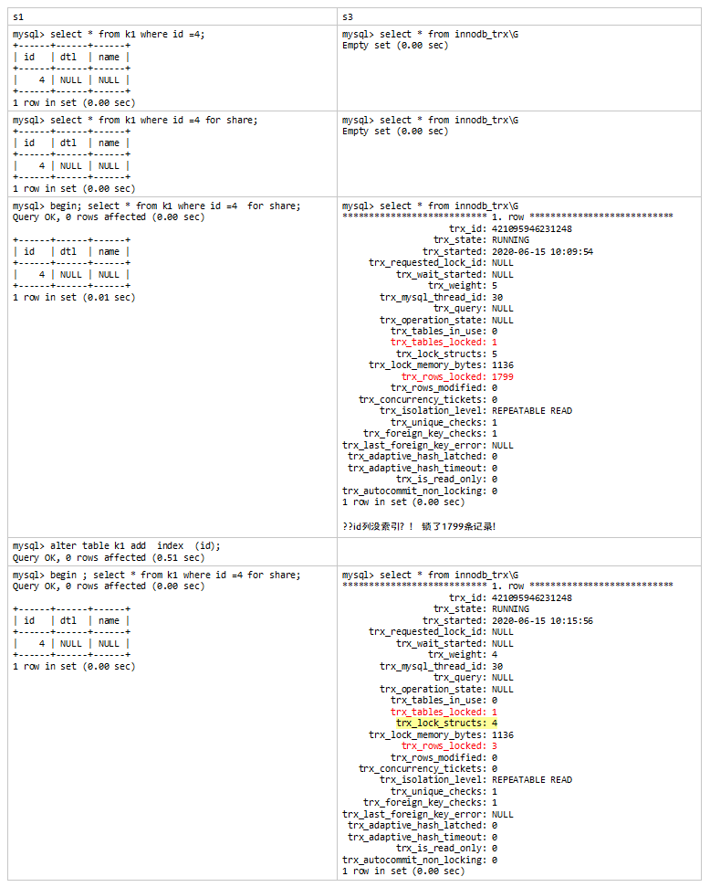
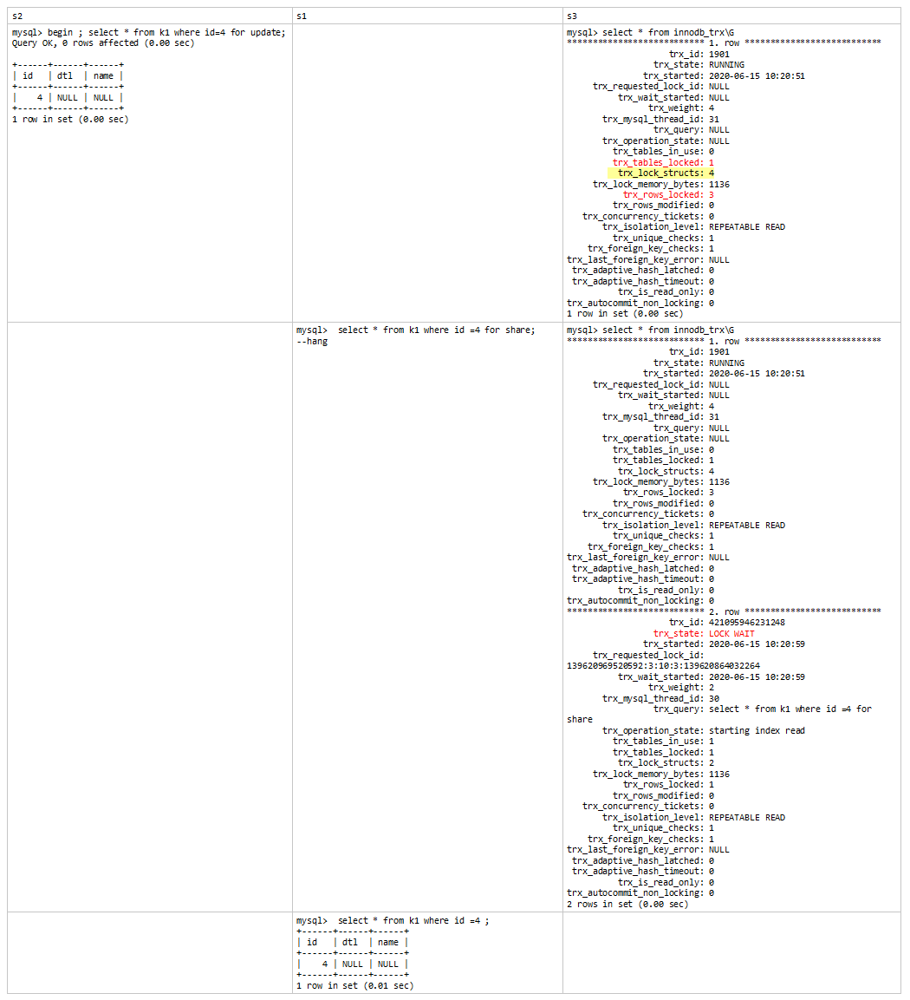

[TOC]

通过索引实现行锁，在索引记录上加锁。

没有索引就无法实现行锁，升级成全表记录锁，等同于表锁。

 

<font color=red>理解InnoDB独特的行锁运行机制，认识特有的四种行锁粒度——lock_ordinary、lock_gap、lock_rec_not_gap、lock_insert_intention</font>


# InnoDB 行锁

 - 默认都是加lock_ordinary锁
  - 如果是唯一索引列上的等值查询，则退化成lock_rec_not_gap
 - 所有版本，<font color=red>非唯一索引列</font>上的范围查询，遇到第一个不符合条件的记录也会加上lock_ordinary。
  - 8.0.18版本以前，主要指<=场景：唯一索引列上的范围查询，遇到第一个不符合条件的记录也会加上lock_ordinary ，在RC下会释放，RR下不会释放。
  - 8.0.18版本以前，<font color=red>非唯一索引列</font>上的等值查询，向右遍历遇到第一个不符合条件的记录时，先加上lock_ordinary，再退化成lock_gap。


## 锁排查可以用的视图和数据字典

```
mysql> show engine innodb status \G 
mysql> select * from performance_schema.data_lock_waits; 
mysql> select * from performance_schema.data_locks; 
mysql> select * from performance_schema.metadata_locks; 
```


## InnoDB 行锁兼容性

|                |                       | 请求的锁类型  | 请求的锁类型     | 请求的锁类型 | 请求的锁类型          |
| -------------- | --------------------- | ------------- | ---------------- | ------------ | --------------------- |
|                |                       | lock_ordinary | lock_rec_not_gap | lock_gap     | lock_insert_intention |
| 已获得的锁类型 | lock_ordinary         | X             | X                | O            | X                     |
| 已获得的锁类型 | lock_rec_not_gap      | X             | X                | O            | O                     |
| 已获得的锁类型 | lock_gap              | O             | O                | O            | X                     |
| 已获得的锁类型 | lock_insert_intention | O             | O                | O            | O                     |

 - gap只和insert intention锁冲突
  - insert intention和任何锁都不冲突，除非也在相同位置做意向插入锁


 - 先获得意向插入锁的，再尝试上gap lock是可以的
  - 但是反过来 ，先获得gap lock的，再尝试加上意向插入锁便会阻塞，
  - 原因是：先获得意向插入锁时，实际上插入已经成功，意向插入锁会被转变为对具体记录的ordinary 或 rec_not_gap ，此时二者都与lock gap兼容。


# InnoDB行锁之共享锁

### 共享锁：

- 不允许其他事务修改被锁定的行，只能读
- select .. for share/ lock in share     mode
- 自动提交模式下的普通select是一致性非锁定读，不加锁。

 

 

自动提交模式下， 不使用begin开启事务，直接select的话：

select * from xxx where .. 不加锁

select * from xxx where .. for share ，也查询不到加锁， 但是实际上是加锁的，只不过锁的时间及其的短暂。

验证：



此时，用排他锁来验证自动提交模式的for share究竟是否产生锁动作。



<font color=red>可以看出，自动提交模式下select（不加for share）是一致性非锁定读，但是加for share后，是会有锁定动作的，只不过没有阻塞的情况下，锁的持续时间是非常短暂的。</font>

 

 

# 查看InnoDB锁

 

- 开启参数：innodb_status_output_locks=1; 以支持使用 show engine innodb status 查看锁详情。

  ```
  mysql> begin ; select * from k1 where id=4 for update;
  Query OK, 0 rows affected (0.00 sec)
  
  mysql> show engine innodb status \G
  ..
  MySQL thread id 31, OS thread handle 139620328457984, query id 1297 localhost root
  **TABLE LOCK table `kk`.`k1` trx id 1901 lock mode IX**
  RECORD LOCKS space id 3 page no 10 n bits 1056 index id of table `kk`.`k1` trx id 1901 lock_mode X
  Record lock, heap no 3 PHYSICAL RECORD: n_fields 2; compact format; info bits 0
   0: len 4; hex 80000004; asc   ;;
   1: len 6; hex 000000000902; asc    ;;
   
  RECORD LOCKS space id 3 page no 9 n bits 320 index GEN_CLUST_INDEX of table `kk`.`k1` trx id 1901 lock_mode X locks rec but not gap
  Record lock, heap no 248 PHYSICAL RECORD: n_fields 6; compact format; info bits 0
   0: len 6; hex 000000000902; asc    ;;
   1: len 6; hex 000000000663; asc   c;;
   2: len 7; hex 82000000940110; asc    ;;
   3: len 4; hex 80000004; asc   ;;
   4: SQL NULL;
   5: SQL NULL;
   
  RECORD LOCKS space id 3 page no 10 n bits 1056 index id of table `kk`.`k1` trx id 1901 lock_mode X locks gap before rec
  Record lock, heap no 4 PHYSICAL RECORD: n_fields 2; compact format; info bits 0
   0: len 4; hex 80000016; asc   ;;
   1: len 6; hex 000000000200; asc    ;;
  ..
  
  - space id 3 表的表空间ID
  - page no 10 锁所在datapage的ID
  - heap no 4，slot no，记录在page物理上的第几个位置。
  ```

  

- 也可以查询P_S表

  ```
  mysql> select * from performance_schema.data_locks;
  +--------+----------------------------------------+-----------------------+-----------+----------+---------------+-------------+----------------+-------------------+------------+-----------------------+-----------+---------------+-------------+-----------+
  | ENGINE | ENGINE_LOCK_ID             | ENGINE_TRANSACTION_ID | THREAD_ID | EVENT_ID | OBJECT_SCHEMA | OBJECT_NAME | PARTITION_NAME | SUBPARTITION_NAME | INDEX_NAME | OBJECT_INSTANCE_BEGIN | LOCK_TYPE | LOCK_MODE   | LOCK_STATUS | LOCK_DATA |
  +--------+----------------------------------------+-----------------------+-----------+----------+---------------+-------------+----------------+-------------------+------------+-----------------------+-----------+---------------+-------------+-----------+
  | INNODB | 139620969519720:1072:139620864029240  |         2211 |    85 |    79 | kk      | k1     | NULL      | NULL       | NULL    |    139620864029240 | TABLE   | IX      | GRANTED   | NULL   |
  | INNODB | 139620969519720:15:4:5:139620864026200 |         2211 |    85 |    79 | kk      | k1     | NULL      | NULL       | PRIMARY  |    139620864026200 | RECORD  | X,REC_NOT_GAP | GRANTED   | 4     |
  +--------+----------------------------------------+-----------------------+-----------+----------+---------------+-------------+----------------+-------------------+------------+-----------------------+-----------+---------------+-------------+-----------+
  2 rows in set (0.00 sec)
  ```


- 再看下IS锁的情况

```
mysql> begin ; select * from k1 where id=4 for share;
Query OK, 0 rows affected (0.00 sec)
 
mysql> show engine innodb status \G
看不到IS锁信息。
1 row in set (0.00 sec)
 
mysql> select * from performance_schema.data_locks;
+--------+----------------------------------------+-----------------------+-----------+----------+---------------+-------------+----------------+-------------------+------------+-----------------------+-----------+---------------+-------------+-----------+
| ENGINE | ENGINE_LOCK_ID             | ENGINE_TRANSACTION_ID | THREAD_ID | EVENT_ID | OBJECT_SCHEMA | OBJECT_NAME | PARTITION_NAME | SUBPARTITION_NAME | INDEX_NAME | OBJECT_INSTANCE_BEGIN | LOCK_TYPE | LOCK_MODE   | LOCK_STATUS | LOCK_DATA |
+--------+----------------------------------------+-----------------------+-----------+----------+---------------+-------------+----------------+-------------------+------------+-----------------------+-----------+---------------+-------------+-----------+
| INNODB | 139620969519720:1072:139620864029240  |    421095946230376 |    85 |    83 | kk      | k1     | NULL      | NULL       | NULL    |    139620864029240 | TABLE   | IS      | GRANTED   | NULL   |
| INNODB | 139620969519720:15:4:5:139620864026200 |    421095946230376 |    85 |    83 | kk      | k1     | NULL      | NULL       | PRIMARY  |    139620864026200 | RECORD  | S,REC_NOT_GAP | GRANTED   | 4     |
+--------+----------------------------------------+-----------------------+-----------+----------+---------------+-------------+----------------+-------------------+------------+-----------------------+-----------+---------------+-------------+-----------+
2 rows in set (0.00 sec)
```

验证一下IS和IX的兼容

```
t1:
mysql> begin ; select * from k1 where id=4 for share;
Query OK, 0 rows affected (0.00 sec)
 
+------+------+------+
| id  | dtl | name |
+------+------+------+
|  4 | NULL | NULL |
+------+------+------+
1 row in set (0.00 sec)
t2:
mysql> begin ; select * from k1 where id=11 for update;
Query OK, 0 rows affected (0.00 sec)
 
Empty set (0.00 sec)
 
--注意:加锁加不在相同行，否则hang。
 
t3:
mysql> select * from performance_schema.data_locks;
+--------+----------------------------------------+-----------------------+-----------+----------+---------------+-------------+----------------+-------------------+------------+-----------------------+-----------+---------------+-------------+------------------------+
| ENGINE | ENGINE_LOCK_ID             | ENGINE_TRANSACTION_ID | THREAD_ID | EVENT_ID | OBJECT_SCHEMA | OBJECT_NAME | PARTITION_NAME | SUBPARTITION_NAME | INDEX_NAME | OBJECT_INSTANCE_BEGIN | LOCK_TYPE | LOCK_MODE   | LOCK_STATUS | LOCK_DATA       |
+--------+----------------------------------------+-----------------------+-----------+----------+---------------+-------------+----------------+-------------------+------------+-----------------------+-----------+---------------+-------------+------------------------+
| INNODB | 139620969519720:1072:139620864029240  |         2212 |    85 |    89 | kk      | k1     | NULL      | NULL       | NULL    |    139620864029240 | TABLE   | IX      | GRANTED   | NULL          |
| INNODB | 139620969519720:15:4:1:139620864026200 |         2212 |    85 |    89 | kk      | k1     | NULL      | NULL       | PRIMARY  |    139620864026200 | RECORD  | X       | GRANTED   | supremum pseudo-record |
| INNODB | 139620969521464:1072:139620864041176  |    421095946232120 |    84 |   110 | kk      | k1     | NULL      | NULL       | NULL    |    139620864041176 | TABLE   | IS      | GRANTED   | NULL          |
| INNODB | 139620969521464:15:4:5:139620864038296 |    421095946232120 |    84 |   110 | kk      | k1     | NULL      | NULL       | PRIMARY  |    139620864038296 | RECORD  | S,REC_NOT_GAP | GRANTED   | 4           |
+--------+----------------------------------------+-----------------------+-----------+----------+---------------+-------------+----------------+-------------------+------------+-----------------------+-----------+---------------+-------------+------------------------+
4 rows in set (0.00 sec)
```

 

## InnoDB行锁实现机制

- 基于索引实现，逐行检查，逐行加锁
- 没有索引的列上需要加锁时，会先对所有记录加锁，再根据实际情况决定是否释放锁。
- 辅助索引上加锁时，同时要回溯到主键索引上再加一次锁。
- 加锁的基本单位默认时lock_ordinary，当索引就具有唯一性的时候退化为lock_rec_not_gap
- 等值条件逐行加锁时，会向右遍历到第一个不满足条件的记录，然后lock_ordinary退化为lock_gap
- 如果发生唯一性检测（insert\update动作），那么会发生lock_ordinary ， 再退化成lock_rec_not_gap
- 唯一索引的范围条件加锁时，也会对第一个不满足条件的记录加锁

 

### 对普通索引上锁  

普通索引next-key lock + 主键 not gap + 普通索引的下一个记录的gap lock（见示意图）。

```
mysql> select * from k2;
+----+------+------+
| id | dtl  | un   |
+----+------+------+
| 1  |  1   |  1   |
| 2  |  2   |  2   |
| 3  |  5   |  5   |  (回溯到pk上锁)
------------------------------------------  <- gap (同时锁住普通索引下一个记录前的gap)
| 4  |  7   |  7   |*
| 5  |  11  |  11  |
+----+------+------+
5 rows in set (0.00 sec)
 
```

- 辅助索引上锁的验证实验

```
mysql> show create table k2\G
*************************** 1. row ***************************
    Table: k2
Create Table: CREATE TABLE `k2` (
 `id` int NOT NULL AUTO_INCREMENT,
 `dtl` int DEFAULT NULL,
 `un` int DEFAULT NULL,
 PRIMARY KEY (`id`),
 UNIQUE KEY `dtl` (`dtl`),
 KEY `un` (`un`)
) ENGINE=InnoDB AUTO_INCREMENT=9 DEFAULT CHARSET=utf8mb4 COLLATE=utf8mb4_0900_ai_ci
1 row in set (0.00 sec)
 
mysql> select * from k2;
+----+------+------+
| id | dtl | un  |
+----+------+------+
| 1 |  1 |  1 |
| 2 |  2 |  2 |
| 3 |  5 |  5 |
|  4 |  7 |  7 |*
| 5 |  11 |  11 |
+----+------+------+
5 rows in set (0.00 sec)
 
mysql> begin ; select * from k2 where un=5 for update;
Query OK, 0 rows affected (0.00 sec)
 
+----+------+------+
| id | dtl | un  |
+----+------+------+
| 3 |  5 |  5 |
+----+------+------+
1 row in set (0.00 sec)
 
mysql> select * from performance_schema.data_locks\G
*************************** 1. row ***************************
        ENGINE: INNODB
    ENGINE_LOCK_ID: 139620969521464:1061:139620864041176
ENGINE_TRANSACTION_ID: 1944
      THREAD_ID: 70
       EVENT_ID: 65
    OBJECT_SCHEMA: kk
     OBJECT_NAME: k2
    PARTITION_NAME: NULL
  SUBPARTITION_NAME: NULL
      INDEX_NAME: NULL
OBJECT_INSTANCE_BEGIN: 139620864041176
       LOCK_TYPE: TABLE*
      LOCK_MODE: IX*
     LOCK_STATUS: GRANTED
      LOCK_DATA: NULL
*************************** 2. row ***************************
        ENGINE: INNODB
    ENGINE_LOCK_ID: 139620969521464:4:6:9:139620864038296
ENGINE_TRANSACTION_ID: 1944
      THREAD_ID: 70
       EVENT_ID: 65
    OBJECT_SCHEMA: kk
     OBJECT_NAME: k2
    PARTITION_NAME: NULL
  SUBPARTITION_NAME: NULL
      INDEX_NAME: un*
OBJECT_INSTANCE_BEGIN: 139620864038296
      LOCK_TYPE: RECORD （nextkey-lock）*
      LOCK_MODE: X
     LOCK_STATUS: GRANTED
       LOCK_DATA: 5, 3    （un key value, primary key value, index Condion特性）*
*************************** 3. row ***************************
        ENGINE: INNODB
    ENGINE_LOCK_ID: 139620969521464:4:4:11:139620864038640
ENGINE_TRANSACTION_ID: 1944
      THREAD_ID: 70
       EVENT_ID: 65
    OBJECT_SCHEMA: kk
     OBJECT_NAME: k2
    PARTITION_NAME: NULL
  SUBPARTITION_NAME: NULL
      INDEX_NAME: PRIMARY*
OBJECT_INSTANCE_BEGIN: 139620864038640
      LOCK_TYPE: RECORD
       LOCK_MODE: X,REC_NOT_GAP*
     LOCK_STATUS: GRANTED
      LOCK_DATA: 3*
*************************** 4. row ***************************
        ENGINE: INNODB
    ENGINE_LOCK_ID: 139620969521464:4:6:10:139620864038984
ENGINE_TRANSACTION_ID: 1944
      THREAD_ID: 70
       EVENT_ID: 65
    OBJECT_SCHEMA: kk
     OBJECT_NAME: k2
    PARTITION_NAME: NULL
  SUBPARTITION_NAME: NULL
      INDEX_NAME: un*
OBJECT_INSTANCE_BEGIN: 139620864038984
      LOCK_TYPE: RECORD
      LOCK_MODE: X,GAP*      确认下一个记录不符合条件，回退nextkey-lock 为 lock-gap.
     LOCK_STATUS: GRANTED
      LOCK_DATA: 7, 4   （un key value, primary key value, index Condion特性）*
4 rows in set (0.00 sec)
 
```

## InnoDB隐式、显式锁

- 显式锁(explicit-lock)

  - select .. from .. where      .. for update / for share 

- 隐式锁(implicit-lock)

  - update set .. where ..
  - 任何辅助索引上锁，或非索引列上锁，都要回溯到主键上再加锁。
  - 和其他session有冲突时，隐式锁转换为显式锁。（没实验验证出来。）

 

如果发生唯一性检测（insert\update动作），那么会发生lock_ordinary ， 再退化成lock_rec_not_gap