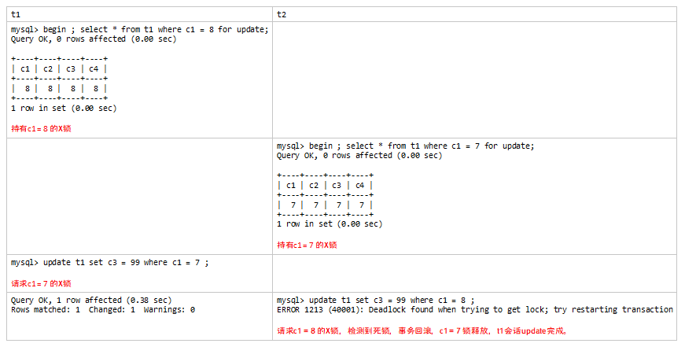
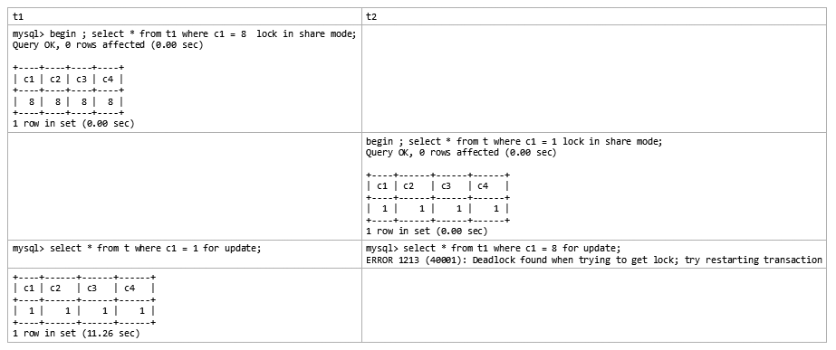
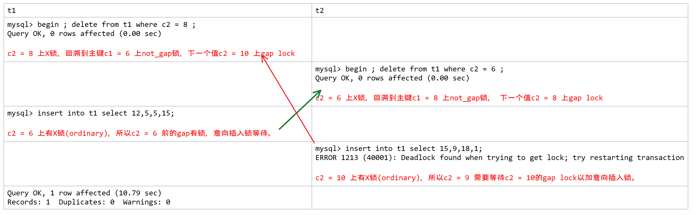
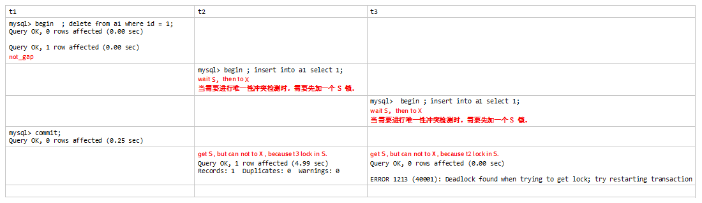
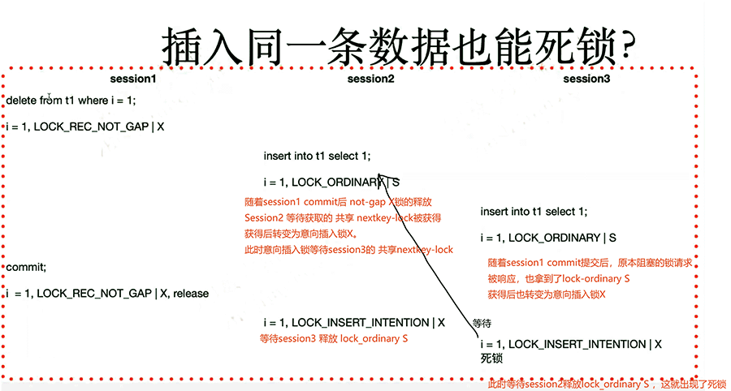
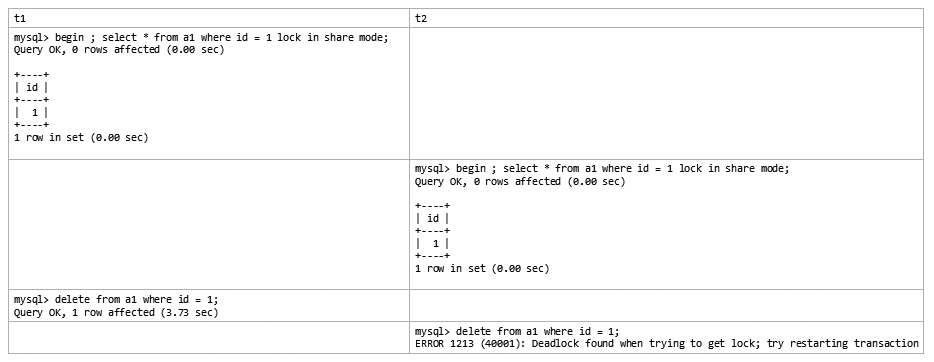

- # 何谓死锁

  - 如果多个事务都需要访问数据，另一个事务已经以互斥方式锁定该数据，则会发生死锁。

  - 事务A等待事务B，同时事务B等待事务A，会产生死锁

  - InnoDB有死锁检测线程，如果检测到死锁，会马上抛出异常并回滚一个事务，回滚原则为“回滚代价较小的、影响较小的事务”，例如产生undo较少的事务会被回滚。

  - 如何判断事务之间是否会发生死锁？

  - - 事务T1需要等待事务T2，画一条T1到T2的线
    - 以此类推
    - 图中如果有回路就表示有死锁。

  

  - 使用show engine innodb     status 可以查看到最后的死锁信息
  - 可以设置innodb_print_all_deadlocks     = 1 来使日志中记录全部死锁信息
  - 高并发场景中（秒杀），关闭innodb_deadlock_detect选项，降低死锁检测的开销，提高并发效率。同时降低innodb_lock_wait_timeout，缩短锁等待时间。
  - 表级锁不会发生死锁，但是也无法读写并发执行。

   

  # 关于死锁

   

  - 偶尔死锁不可怕，频繁死锁才需要关注
  - 程序中应有事务失败检测及自动重复提交机制
  - 多用小事务，并及时显式提交/回滚
  - 调整事务隔离级别为RC，以消除gap lock，降低死锁发生概率
  - 事务中涉及多个表，或者涉及多行记录时，每个事务的操作顺序都要保持一致，降低死锁概率，最好用存储过程/存储函数固化
  - 通过索引优化SQL效率，降低死锁概率
  - 死锁不是“锁死”，死锁会快速检测到，快速回滚。而“锁死”则是行时间锁等待。

   

  - innodb_rollback_on_timeout     = on 时，一旦sql超时，整个事务回滚。

  

  # 实例解析集中发生死锁的经典场景，加深对InnoDB行锁的理解

  - 相同表不同事务间的死锁场景。

  ```
  mysql> select * from t1;
  +----+----+----+----+
  | c1 | c2 | c3 | c4 |
  +----+----+----+----+
  | 1 | 1 | 1 | 0 |
  | 3 | 3 | 3 | 0 |
  | 4 | 2 | 2 | 2 |
  | 7 | 7 | 7 | 7 |
  | 8 | 8 | 8 | 8 |
  | 10 | 4 | 4 | 0 |
  +----+----+----+----+
  6 rows in set (0.00 sec)
  ```

   

   

   

  - 不同表不同事务之间的死锁场景

    

   

  一个session对一个表加锁后，如果要用相同的方式对另一个表加锁 ， 那么需要对前一表的锁进行解锁。

  ```
  mysql> begin ; select * from t where c1 = 1 for update;;
  Query OK, 0 rows affected (0.00 sec)
   
  +----+------+------+------+
  | c1 | c2  | c3  | c4  |
  +----+------+------+------+
  | 1 |  1 |  1 |  1 |
  +----+------+------+------+
  1 row in set (0.01 sec)
   
  mysql> select * from performance_schema.data_locks;
  +--------+----------------------------------------+-----------------------+-----------+----------+---------------+-------------+----------------+-------------------+------------+-----------------------+-----------+---------------+-------------+-----------+
  | ENGINE | ENGINE_LOCK_ID             | ENGINE_TRANSACTION_ID | THREAD_ID | EVENT_ID | OBJECT_SCHEMA | OBJECT_NAME | PARTITION_NAME | SUBPARTITION_NAME | INDEX_NAME | OBJECT_INSTANCE_BEGIN | LOCK_TYPE | LOCK_MODE   | LOCK_STATUS | LOCK_DATA |
  +--------+----------------------------------------+-----------------------+-----------+----------+---------------+-------------+----------------+-------------------+------------+-----------------------+-----------+---------------+-------------+-----------+
  | INNODB | 139620969519720:1076:139620864029240  |         2792 |    111 |    59 | kk      | t      | NULL      | NULL       | NULL    |    139620864029240 | TABLE   | IX      | GRANTED   | NULL   |
  | INNODB | 139620969519720:19:4:2:139620864026200 |         2792 |    111 |    59 | kk      | t      | NULL      | NULL       | PRIMARY  |    139620864026200 | RECORD  | X,REC_NOT_GAP | GRANTED   | 1     |
  +--------+----------------------------------------+-----------------------+-----------+----------+---------------+-------------+----------------+-------------------+------------+-----------------------+-----------+---------------+-------------+-----------+
  2 rows in set (0.00 sec)
   
  mysql> begin ; select * from t1 where c1 = 1 for update;
  Query OK, 0 rows affected (0.00 sec)
   
  +----+----+----+----+
  | c1 | c2 | c3 | c4 |
  +----+----+----+----+
  | 1 | 1 | 1 | 0 |
  +----+----+----+----+
  1 row in set (0.00 sec)
   
  mysql> select * from performance_schema.data_locks;
  +--------+----------------------------------------+-----------------------+-----------+----------+---------------+-------------+----------------+-------------------+------------+-----------------------+-----------+---------------+-------------+-----------+
  | ENGINE | ENGINE_LOCK_ID             | ENGINE_TRANSACTION_ID | THREAD_ID | EVENT_ID | OBJECT_SCHEMA | OBJECT_NAME | PARTITION_NAME | SUBPARTITION_NAME | INDEX_NAME | OBJECT_INSTANCE_BEGIN | LOCK_TYPE | LOCK_MODE   | LOCK_STATUS | LOCK_DATA |
  +--------+----------------------------------------+-----------------------+-----------+----------+---------------+-------------+----------------+-------------------+------------+-----------------------+-----------+---------------+-------------+-----------+
  | INNODB | 139620969519720:1073:139620864029240  |         2793 |    111 |    62 | kk      | t1     | NULL      | NULL       | NULL    |    139620864029240 | TABLE   | IX      | GRANTED   | NULL   |
  | INNODB | 139620969519720:16:4:3:139620864026200 |         2793 |    111 |    62 | kk      | t1     | NULL      | NULL       | PRIMARY  |    139620864026200 | RECORD  | X,REC_NOT_GAP | GRANTED   | 1     |
  +--------+----------------------------------------+-----------------------+-----------+----------+---------------+-------------+----------------+-------------------+------------+-----------------------+-----------+---------------+-------------+-----------+
  2 rows in set (0.01 sec)
  ```

   

  - 对一个表的两个insert会话死锁场景

  ```
  mysql> select * from t1;
  +----+----+----+----+
  | c1 | c2 | c3 | c4 |
  +----+----+----+----+
  | 0 | 0 | 0 | 0 |
  | 1 | 1 | 1 | 0 |
  | 3 | 3 | 3 | 0 |
  | 4 | 2 | 2 | 0 |
  |  6 | 8 | 5 | 0 |
  |  8 | 6 | 6 | 0 |
  | 10 | 10 | 4 | 40 |
  +----+----+----+----+
  7 rows in set (0.00 sec)
  ```

   

  

  ```
   
  mysql> begin ; delete from t1 where c2 = 8 ;的锁情况
  Query OK, 0 rows affected (0.00 sec)
   
  mysql> select * from performance_schema.data_locks; 
  +--------+----------------------------------------+-----------------------+-----------+----------+---------------+-------------+----------------+-------------------+------------+-----------------------+-----------+---------------+-------------+-----------+
  | ENGINE | ENGINE_LOCK_ID             | ENGINE_TRANSACTION_ID | THREAD_ID | EVENT_ID | OBJECT_SCHEMA | OBJECT_NAME | PARTITION_NAME | SUBPARTITION_NAME | INDEX_NAME | OBJECT_INSTANCE_BEGIN | LOCK_TYPE | LOCK_MODE   | LOCK_STATUS | LOCK_DATA |
  +--------+----------------------------------------+-----------------------+-----------+----------+---------------+-------------+----------------+-------------------+------------+-----------------------+-----------+---------------+-------------+-----------+
  | INNODB | 139620969519720:1083:139620864029240  |         2842 |    111 |    84 | kk      | t1     | NULL      | NULL       | NULL    |    139620864029240 | TABLE   | IX      | GRANTED   | NULL   |
  | INNODB | 139620969519720:26:5:6:139620864026200 |         2842 |    111 |    84 | kk      | t1     | NULL      | NULL       | c2     |    139620864026200 | RECORD  | X       | GRANTED   | 8, 6   |
  | INNODB | 139620969519720:26:4:6:139620864026544 |         2842 |    111 |    84 | kk      | t1     | NULL      | NULL       | PRIMARY  |    139620864026544 | RECORD  | X,REC_NOT_GAP | GRANTED   | 6     |
  | INNODB | 139620969519720:26:5:8:139620864026888 |         2842 |    111 |    84 | kk      | t1     | NULL      | NULL       | c2     |    139620864026888 | RECORD  | X,GAP     | GRANTED   | 10, 10  |
  +--------+----------------------------------------+-----------------------+-----------+----------+---------------+-------------+----------------+-------------------+------------+-----------------------+-----------+---------------+-------------+-----------+
  4 rows in set (0.00 sec)
   
   
  mysql> begin ; delete from t1 where c2 = 6 ; 的锁情况
  Query OK, 0 rows affected (0.00 sec)
   
  mysql> select * from performance_schema.data_locks;
  +--------+----------------------------------------+-----------------------+-----------+----------+---------------+-------------+----------------+-------------------+------------+-----------------------+-----------+---------------+-------------+-----------+
  | ENGINE | ENGINE_LOCK_ID             | ENGINE_TRANSACTION_ID | THREAD_ID | EVENT_ID | OBJECT_SCHEMA | OBJECT_NAME | PARTITION_NAME | SUBPARTITION_NAME | INDEX_NAME | OBJECT_INSTANCE_BEGIN | LOCK_TYPE | LOCK_MODE   | LOCK_STATUS | LOCK_DATA |
  +--------+----------------------------------------+-----------------------+-----------+----------+---------------+-------------+----------------+-------------------+------------+-----------------------+-----------+---------------+-------------+-----------+
  | INNODB | 139620969520592:1083:139620864035192  |         2848 |    112 |    49 | kk      | t1     | NULL      | NULL       | NULL    |    139620864035192 | TABLE   | IX      | GRANTED   | NULL   |
  | INNODB | 139620969520592:26:5:7:139620864032264 |         2848 |    112 |    49 | kk      | t1     | NULL      | NULL       | c2     |    139620864032264 | RECORD  | X       | GRANTED   | 6, 8   |
  | INNODB | 139620969520592:26:4:7:139620864032608 |         2848 |    112 |    49 | kk      | t1     | NULL      | NULL       | PRIMARY  |    139620864032608 | RECORD  | X,REC_NOT_GAP | GRANTED   | 8     |
  | INNODB | 139620969520592:26:5:6:139620864032952 |         2848 |    112 |    49 | kk      | t1     | NULL      | NULL       | c2     |    139620864032952 | RECORD  | X,GAP     | GRANTED   | 8, 6   |
  +--------+----------------------------------------+-----------------------+-----------+----------+---------------+-------------+----------------+-------------------+------------+-----------------------+-----------+---------------+-------------+-----------+
  4 rows in set (0.00 sec)
   
  ```

   

   

   

   

  - 多个会话插入同一条数据发生死锁的场景

  ```
  mysql> show create table a1\G
  *************************** 1. row ***************************
      Table: a1
  Create Table: CREATE TABLE `a1` (
   `id` int NOT NULL,
   PRIMARY KEY (`id`)
  ) ENGINE=InnoDB DEFAULT CHARSET=utf8mb4 COLLATE=utf8mb4_0900_ai_ci
  1 row in set (0.00 sec)
   
  mysql> select * from a1;
  +------+
  | id  |
  +------+
  |  1 |
  +------+
  1 row in set (0.00 sec)
  ```

  如果不是唯一型索引就不会发生这个问题。

  

   

   

  

   

  两个insert发生死锁原因剖析[[老叶茶馆\] - 2017-09-05 两个INSERT发生死锁原因剖析.html]()

  **当需要进行唯一性冲突检测时，需要先加一个 S 锁**。

   

   

  - 删除同一条数据发生死锁的场景

    