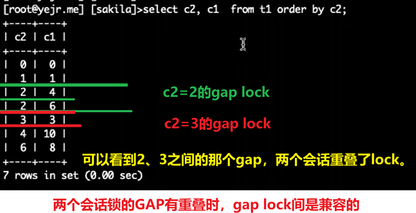

[TOC]

# 场景九：普通索引条件<font color=red>不同</font>，会话一联合无索引列条件上X锁，会话二联合无索引列另一条件尝试上X锁。

- 表结构

  ```
  mysql> show create table t1 \G
  *************************** 1. row ***************************
         Table: t1
  Create Table: CREATE TABLE `t1` (
    `c1` int unsigned NOT NULL DEFAULT '0',
    `c2` int unsigned NOT NULL DEFAULT '0',
    `c3` int unsigned NOT NULL DEFAULT '0',
    `c4` int unsigned NOT NULL DEFAULT '0',
    PRIMARY KEY (`c1`),
    KEY `c2` (`c2`)
  ) ENGINE=InnoDB DEFAULT CHARSET=utf8mb4 COLLATE=utf8mb4_0900_ai_ci
  1 row in set (0.00 sec)
  
  mysql> select * from t1 order by c2;
  +----+----+----+----+
  | c1 | c2 | c3 | c4 |
  +----+----+----+----+
  |  0 |  0 |  0 |  0 |
  |  1 |  1 |  1 |  0 |
  |  4 |  2 |  2 |  0 |*
  |  6 |  2 |  5 |  0 |*
  |  3 |  3 |  3 |  0 |**
  | 10 |  4 |  4 |  0 |
  |  8 |  6 |  6 |  0 |
  +----+----+----+----+
  7 rows in set (0.00 sec)
  ```


## 场景

| t1                                                           | t2                                                           |
| ------------------------------------------------------------ | :----------------------------------------------------------- |
| begin ;<br>select * from t1 where c2 = 2 and c3 = 5 for update; | begin ;                                                      |
|                                                              | select * from t1 where c2 = 3 and c3 = 7 for update;<br/>C2为辅助索引，C3无索引，是否阻塞？ |

### 结果：<font color=red>不阻塞</font>。两个会话锁的GAP有重叠时，gap lock间是兼容的。



- c2=2时，范围锁定，会锁定：2,4 、2,6 两条记录，以及2,4与2,6之间的gap ，以及2,4前的gap和2,6之后（3,3之前）的gap
- c2=3时，范围锁定，会锁定：3,3记录，3,3前的gap和3,3之后（4,10之前)的gap
  （这段解释好像有误。等学完范围条件上锁的规则之后再会看这里。）


## 过程

1. t1

   ```
   mysql> begin ; select * from t1 where c2 = 2 and c3 = 5 for update;
   Query OK, 0 rows affected (0.00 sec)
   
   +----+----+----+----+
   | c1 | c2 | c3 | c4 |
   +----+----+----+----+
   |  6 |  2 |  5 |  0 |
   +----+----+----+----+
   1 row in set (0.00 sec)
   ```
   
2. t3

   ```
   mysql>  select * from performance_schema.data_locks;
   +--------+----------------------------------------+-----------------------+-----------+----------+---------------+-------------+----------------+-------------------+------------+-----------------------+-----------+---------------+-------------+-----------+
   | ENGINE | ENGINE_LOCK_ID                         | ENGINE_TRANSACTION_ID | THREAD_ID | EVENT_ID | OBJECT_SCHEMA | OBJECT_NAME | PARTITION_NAME | SUBPARTITION_NAME | INDEX_NAME | OBJECT_INSTANCE_BEGIN | LOCK_TYPE | LOCK_MODE     | LOCK_STATUS | LOCK_DATA |
   +--------+----------------------------------------+-----------------------+-----------+----------+---------------+-------------+----------------+-------------------+------------+-----------------------+-----------+---------------+-------------+-----------+
   | INNODB | 139620969521464:1073:139620864041176   |                  2195 |        84 |       70 | kk            | t1          | NULL           | NULL              | NULL       |       139620864041176 | TABLE     | IX            | GRANTED     | NULL      |
   | INNODB | 139620969521464:16:5:5:139620864038296 |                  2195 |        84 |       70 | kk            | t1          | NULL           | NULL              | c2         |       139620864038296 | RECORD    | X             | GRANTED     | 2, 4      |
   | INNODB | 139620969521464:16:5:6:139620864038296 |                  2195 |        84 |       70 | kk            | t1          | NULL           | NULL              | c2         |       139620864038296 | RECORD    | X             | GRANTED     | 2, 6      |
   | INNODB | 139620969521464:16:4:5:139620864038640 |                  2195 |        84 |       70 | kk            | t1          | NULL           | NULL              | PRIMARY    |       139620864038640 | RECORD    | X,REC_NOT_GAP | GRANTED     | 4         |
   | INNODB | 139620969521464:16:4:6:139620864038640 |                  2195 |        84 |       70 | kk            | t1          | NULL           | NULL              | PRIMARY    |       139620864038640 | RECORD    | X,REC_NOT_GAP | GRANTED     | 6         |
   | INNODB | 139620969521464:16:5:4:139620864038984 |                  2195 |        84 |       70 | kk            | t1          | NULL           | NULL              | c2         |       139620864038984 | RECORD    | X,GAP         | GRANTED     | 3, 3      |
   +--------+----------------------------------------+-----------------------+-----------+----------+---------------+-------------+----------------+-------------------+------------+-----------------------+-----------+---------------+-------------+-----------+
   6 rows in set (0.00 sec)
   
   ```
   
3. t2

   ```
   mysql> begin ; select * from t1 where c2 = 3 and c3 = 7 for update;
   Query OK, 0 rows affected (0.00 sec)
   
   Empty set (0.00 sec)
   ```
   
4. t3

   ```
   mysql>  select * from performance_schema.data_locks;
   +--------+----------------------------------------+-----------------------+-----------+----------+---------------+-------------+----------------+-------------------+------------+-----------------------+-----------+---------------+-------------+-----------+
   | ENGINE | ENGINE_LOCK_ID                         | ENGINE_TRANSACTION_ID | THREAD_ID | EVENT_ID | OBJECT_SCHEMA | OBJECT_NAME | PARTITION_NAME | SUBPARTITION_NAME | INDEX_NAME | OBJECT_INSTANCE_BEGIN | LOCK_TYPE | LOCK_MODE     | LOCK_STATUS | LOCK_DATA |
   +--------+----------------------------------------+-----------------------+-----------+----------+---------------+-------------+----------------+-------------------+------------+-----------------------+-----------+---------------+-------------+-----------+
   | INNODB | 139620969519720:1073:139620864029240   |                  2196 |        85 |       54 | kk            | t1          | NULL           | NULL              | NULL       |       139620864029240 | TABLE     | IX            | GRANTED     | NULL      |
   | INNODB | 139620969519720:16:5:4:139620864026200 |                  2196 |        85 |       54 | kk            | t1          | NULL           | NULL              | c2         |       139620864026200 | RECORD    | X             | GRANTED     | 3, 3      |
   | INNODB | 139620969519720:16:4:4:139620864026544 |                  2196 |        85 |       54 | kk            | t1          | NULL           | NULL              | PRIMARY    |       139620864026544 | RECORD    | X,REC_NOT_GAP | GRANTED     | 3         |
   | INNODB | 139620969519720:16:5:8:139620864026888 |                  2196 |        85 |       54 | kk            | t1          | NULL           | NULL              | c2         |       139620864026888 | RECORD    | X,GAP         | GRANTED     | 4, 10     |
   | INNODB | 139620969521464:1073:139620864041176   |                  2195 |        84 |       70 | kk            | t1          | NULL           | NULL              | NULL       |       139620864041176 | TABLE     | IX            | GRANTED     | NULL      |
   | INNODB | 139620969521464:16:5:5:139620864038296 |                  2195 |        84 |       70 | kk            | t1          | NULL           | NULL              | c2         |       139620864038296 | RECORD    | X             | GRANTED     | 2, 4      |
   | INNODB | 139620969521464:16:5:6:139620864038296 |                  2195 |        84 |       70 | kk            | t1          | NULL           | NULL              | c2         |       139620864038296 | RECORD    | X             | GRANTED     | 2, 6      |
   | INNODB | 139620969521464:16:4:5:139620864038640 |                  2195 |        84 |       70 | kk            | t1          | NULL           | NULL              | PRIMARY    |       139620864038640 | RECORD    | X,REC_NOT_GAP | GRANTED     | 4         |
   | INNODB | 139620969521464:16:4:6:139620864038640 |                  2195 |        84 |       70 | kk            | t1          | NULL           | NULL              | PRIMARY    |       139620864038640 | RECORD    | X,REC_NOT_GAP | GRANTED     | 6         |
   | INNODB | 139620969521464:16:5:4:139620864038984 |                  2195 |        84 |       70 | kk            | t1          | NULL           | NULL              | c2         |       139620864038984 | RECORD    | X,GAP         | GRANTED     | 3, 3      |
   +--------+----------------------------------------+-----------------------+-----------+----------+---------------+-------------+----------------+-------------------+------------+-----------------------+-----------+---------------+-------------+-----------+
   10 rows in set (0.00 sec)
   ```
   
   <font color=red>普通索引会回溯给主键上锁，索引条件不同，就不是相同范围的数据，不会冲突。</font>