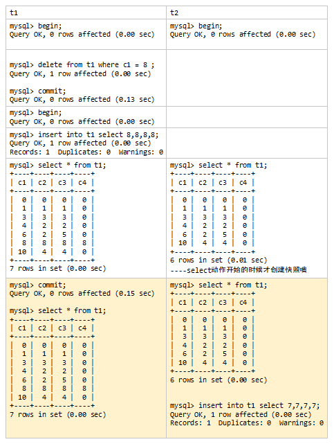
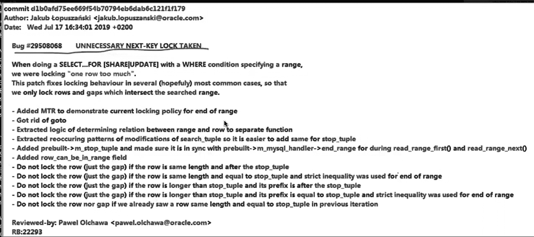

[TOC]

# 场景二十：两个会话分别向表中插入数据，主键列值都处于当前主键列最大值与第二大值之间，且不存在重复。

- 表结构

  ```
  mysql> show create table t1 \G
  *************************** 1. row ***************************
         Table: t1
  Create Table: CREATE TABLE `t1` (
    `c1` int unsigned NOT NULL DEFAULT '0',
    `c2` int unsigned NOT NULL DEFAULT '0',
    `c3` int unsigned NOT NULL DEFAULT '0',
    `c4` int unsigned NOT NULL DEFAULT '0',
    PRIMARY KEY (`c1`),
    KEY `c2` (`c2`)
  ) ENGINE=InnoDB DEFAULT CHARSET=utf8mb4 COLLATE=utf8mb4_0900_ai_ci
  1 row in set (0.00 sec)
  
  mysql> select * from t1;
  +----+----+----+----+
  | c1 | c2 | c3 | c4 |
  +----+----+----+----+
  |  0 |  0 |  0 |  0 |
  |  1 |  1 |  1 |  0 |
  |  3 |  3 |  3 |  0 |
  |  4 |  2 |  2 |  0 |
  |  6 |  2 |  5 |  0 |
  | 10 |  4 |  4 |  0 |
  +----+----+----+----+
  6 rows in set (0.00 sec)
  
  ```


## 场景

| t1                                                           | t2                                                           |
| ------------------------------------------------------------ | ------------------------------------------------------------ |
| begin ; <br/>delete from t1 where c1 = 8 ;<br/>commit;<br/>begin ; <br/>insert into t1 select 8,8,8,8; | begin ;                                                      |
|                                                              | insert into t1 select 7,7,7,7;<br/>C1是主键，C1 = 7 , C1 = 8, C1 = 9 记录都不存在。会阻塞吗？ |

### 结果：<font color=red>不阻塞。同一个GAP中，只要不是同一个位置就可以有多个插入意向锁并存。</font>


这个实验涉及到了快照版本，传送门：InnoDB读模式




```
mysql>  select * from performance_schema.data_locks;
+--------+--------------------------------------+-----------------------+-----------+----------+---------------+-------------+----------------+-------------------+------------+-----------------------+-----------+-----------+-------------+-----------+
| ENGINE | ENGINE_LOCK_ID                       | ENGINE_TRANSACTION_ID | THREAD_ID | EVENT_ID | OBJECT_SCHEMA | OBJECT_NAME | PARTITION_NAME | SUBPARTITION_NAME | INDEX_NAME | OBJECT_INSTANCE_BEGIN | LOCK_TYPE | LOCK_MODE | LOCK_STATUS | LOCK_DATA |
+--------+--------------------------------------+-----------------------+-----------+----------+---------------+-------------+----------------+-------------------+------------+-----------------------+-----------+-----------+-------------+-----------+
| INNODB | 139620969520592:1073:139620864035192 |                  2308 |        89 |       39 | kk            | t1          | NULL           | NULL              | NULL       |       139620864035192 | TABLE     | IX        | GRANTED     | NULL      |
| INNODB | 139620969519720:1073:139620864029240 |                  2307 |        88 |       98 | kk            | t1          | NULL           | NULL              | NULL       |       139620864029240 | TABLE     | IX        | GRANTED     | NULL      |
+--------+--------------------------------------+-----------------------+-----------+----------+---------------+-------------+----------------+-------------------+------------+-----------------------+-----------+-----------+-------------+-----------+
2 rows in set (0.00 sec)
```

已完成插入，所以只留下了意向插入锁。

> 意向插入锁：同一个GAP中，只要不是同一个位置就可以有多个插入意向锁并存。
>
> >  InnoDB行锁粒度一览:lock_insert_intention(意向插入锁)


但是此时t2再次进行

```
mysql> insert into t1 select 8,8,8,8; 
```


则会出现锁冲突，因为t1已经在c1=8的位置上上了插入意向锁。


```
mysql>  select * from performance_schema.data_locks;
+--------+----------------------------------------+-----------------------+-----------+----------+---------------+-------------+----------------+-------------------+------------+-----------------------+-----------+---------------+-------------+-----------+
| ENGINE | ENGINE_LOCK_ID                         | ENGINE_TRANSACTION_ID | THREAD_ID | EVENT_ID | OBJECT_SCHEMA | OBJECT_NAME | PARTITION_NAME | SUBPARTITION_NAME | INDEX_NAME | OBJECT_INSTANCE_BEGIN | LOCK_TYPE | LOCK_MODE     | LOCK_STATUS | LOCK_DATA |
+--------+----------------------------------------+-----------------------+-----------+----------+---------------+-------------+----------------+-------------------+------------+-----------------------+-----------+---------------+-------------+-----------+
| INNODB | 139620969520592:1073:139620864035192   |                  2315 |        96 |       16 | kk            | t1          | NULL           | NULL              | NULL       |       139620864035192 | TABLE     | IX            | GRANTED     | NULL      |
| INNODB | 139620969520592:16:4:9:139620864032264 |                  2315 |        96 |       17 | kk            | t1          | NULL           | NULL              | PRIMARY    |       139620864032264 | RECORD    | S,REC_NOT_GAP | WAITING     | 8         |
| INNODB | 139620969519720:1073:139620864029240   |                  2314 |        95 |       19 | kk            | t1          | NULL           | NULL              | NULL       |       139620864029240 | TABLE     | IX            | GRANTED     | NULL      |
| INNODB | 139620969519720:16:4:9:139620864026200 |                  2314 |        96 |       17 | kk            | t1          | NULL           | NULL              | PRIMARY    |       139620864026200 | RECORD    | X,REC_NOT_GAP | GRANTED     | 8         |
+--------+----------------------------------------+-----------------------+-----------+----------+---------------+-------------+----------------+-------------------+------------+-----------------------+-----------+---------------+-------------+-----------+
4 rows in set (0.00 sec)
```

<font color=red>8.0.18版本前上的是nextkey-lock，在8.0.18之后随着场景十六里的bug的修复，改为上REC_NOT_GAP锁。</font>


