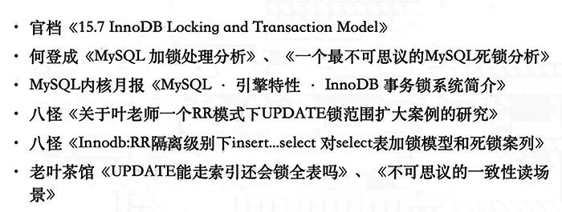

# 总结

| 条件场景                                                     | 结果                    | 实验场景   | 其他想说的                                                   |
| ------------------------------------------------------------ | ----------------------- | ---------- | ------------------------------------------------------------ |
| 主键条件，相同条件上X锁后，另一会话上S锁。                   | 阻塞                    | 场景一     | 排他锁和任何锁都冲突                                         |
| 主键条件，相同条件上S锁后，另一会话上X锁。                   | 阻塞                    | 场景二     | 排他锁和任何锁都冲突                                         |
| 无索引列条件，条件不同，无符合两会话条件的数据，上S锁后再尝试X锁。 | 阻塞                    | 场景四     | 无索引情况下，所有数据记录都会加锁， 即使条件数据不存在。    |
| 普通索引列/无索引列条件，上S锁，再向表内尝试插入大于记录已有最大值的记录。 | 阻塞                    | 场景六     | 有没有索引都阻塞。  RR级别上S锁后，无论记录是否存在都会有gap lock，gap lock 和插入意向锁不兼容，因此对同一个gap进行插入动作会被阻塞。 |
| 会话一对无索引列做不存在记录查询，上S锁；会话二尝试对存在数据的主键条件上X锁。 | 阻塞                    | 场景七     | 无索引的话对全部记录上nextkey-lock，主键条件查询上rec_not_gap，冲突出现在对record行的锁争用上。 |
| 普通索引条件相同，会话一联合无索引列条件上x锁，会话二联合无索引列另一条件尝试上x锁。 | 阻塞                    | 场景八     | 有索引时，索引上的相同条件会互斥，普通索引会回溯给主键上锁。 |
| c1列是主键，c2列普通辅助索引，c3列无索引。  会话一使用辅助索引和无索引列条件上x锁，会话二使用主键和无索引列条件上x锁。 | 阻塞                    | 场景十     | 查看数据可以发现，两会话锁定记录重合，排他锁与排他锁不兼容，事务阻塞。  在这里不考虑c3无索引，c2=2 和c1=4 的数据可以看到数据存在冲突，必然会阻塞。 |
| 使用辅助索引进行范围条件限定，更新无索引列；会话二向表中插入数据，数据处于会话一的范围锁的范围中。 | 阻塞                    | 场景十三   | nextkey-lock和意向插入锁不兼容。                             |
| 使用辅助索引进行范围条件限定，更新无索引列；会话二向表中插入数据，数据处于会话一锁定范围的边界gap。 | 阻塞                    | 场景十四   | 范围条件扫描时，等值记录上加lock_ordinary ， RR级别下，其前面的那条记录也会被加锁，（RC下加锁后再释放）。 |
| 使用主键进行范围条件限定进行数据更新，另一会话向表中插入数据，数据主键列值在前面范围条件内。 | 阻塞                    | 场景十五   | RR下，主键范围条件时，范围内记录都会加nextkey-lock，直到范围边界（虚拟最大/最小值）。  结合场景十四可知，有索引情况下，范围条件都会使范围内列上nextkey-lock，如果是辅助索引，那么还需要回溯到主键索引，为主键加rec_not_gap。 |
| 使用主键等值条件，将主键值更新到大于当前最大值，第二个会话对辅助索引上X锁，满足辅助索引条件的记录与第一个会话重合。 | `阻塞`                  | 场景十九   | `辅助索引上锁也会回溯到主键上锁，主键有锁时可能会发生锁冲突。` |
| 对不存在记录的主键条件上X锁，再使用相同的主键值向表内插入数据。（场景二十二的反序） | 阻塞                    | 场景二十一 | 主键不存在的值等值上锁会在下一个值加gap lock，插入值时也会请求下一值前的gap。 |
| 向表内插入数据，再使用相同的主键值条件上X锁。(场景二十一的反序) | 阻塞                    | 场景二十二 | 插入会先请求共享的rec_not_gap ，插入成功后转变为排他的 rec_not_gap ，对数据进行当前读时，当前读需要等待事务提交。 |
| 辅助索引等值条件加X锁，再向表内插入数据，数据中辅助索引列值为前一条件值的下一值。 | 阻塞                    | 场景二十三 | 非唯一辅助索引上的等值查询，向右遍历遇到最后一个不符合条件的记录时，先加上lock_ordinary，再退化成lock_gap。RC的话加上lock_ordinary后，退化消失， 连lock_gap都没有，直接就是not gap。 |
| 通过主键等值条件更新辅助索引列数据，再通过辅助索引更新值的下一值作为条件上X锁，该辅助索引条件值并不存在。（场景二十五的反序） | 阻塞                    | 场景二十四 | 进行更新未提交时，会给c2 = 7 上隐式 not gap 排他锁(因为没提交)，t2会话尝试当前读时请求c2=7最新版本，这就与排他锁冲突，阻塞会话。 |
| 通过不存在的辅助索引条件等值上X锁，再通过主键条件更新辅助索引列值（场景二十四的反序） | 阻塞                    | 场景二十五 |                                                              |
| 主键条件，相同条件，上X锁后，另一会话不上锁直接select。      | 不阻塞                  | 场景三     | 直接select 不加锁，为快照版本读。  一致性非锁定读动作没有锁，所以不会发生冲突。 |
| 普通索引列条件，条件不同，无符合两会话条件的数据，上S锁后再尝试X锁。 | 不阻塞                  | 场景五     | 有索引但是记录不存在时，加lock_gap，gap和gap不冲突，所以不冲突。  （普通索引上nextkey-lock，但是记录不存在，就没record锁，只剩了lock_gap） |
| 普通索引列条件，条件不同，会话一联合无索引列条件上x锁，会话二联合无索引列另一条件尝试上x锁。 | 不阻塞                  | 场景九     | 两个会话锁的GAP有重叠时，gap lock间是兼容的。                |
| 会话一使用辅助索引进行范围条件限定，更新无索引列；会话二尝试通过不存在数据的主键条件上x锁。 | 不阻塞                  | 场景十一   | 记住一点，辅助索引上锁后会回溯到主键上锁，因此只要主键的锁不冲突就ok。 |
| 两个会话使用相同的主键条件，对不存在的记录上x锁。            | 不阻塞                  | 场景十二   | 不存在的记录会在下一个记录前加lock_gap锁，lock_gap之间是兼容的。 |
| 使用主键进行<=范围条件限定加X锁，另一会话对范围条件后的第一个不满足条件记录进行delete。 | 阻塞/  8.0.18开始不阻塞 | 场景十六   | `RR级别下，范围条件扫描时，等值记录上加lock_ordinary ， RR级别下，其前/后面的那条记录也会被加锁，（RC下加锁后再释放）`  `20多年的bug在8.0.18里被修复了。` |
| 两个会话分别向表中插入数据，主键列值都处于当前主键列最大值与第二大值之间，且不存在重复。 | 不阻塞                  | 场景二十   | `同一个GAP中，只要不是同一个位置就可以有多个插入意向锁并存`  |

 

# 表结构介绍

```
mysql> show create table t1 \G
*************************** 1. row ***************************
    Table: t1
Create Table: CREATE TABLE `t1` (
 `c1` int unsigned NOT NULL DEFAULT '0',
 `c2` int unsigned NOT NULL DEFAULT '0',
 `c3` int unsigned NOT NULL DEFAULT '0',
 `c4` int unsigned NOT NULL DEFAULT '0',
 PRIMARY KEY (`c1`),
 KEY `c2` (`c2`)
) ENGINE=InnoDB DEFAULT CHARSET=utf8mb4 COLLATE=utf8mb4_0900_ai_ci
1 row in set (0.00 sec)
 
mysql> select * from t1;
+----+----+----+----+
| c1 | c2 | c3 | c4 |
+----+----+----+----+
| 0 | 0 | 0 | 0 |
| 1 | 1 | 1 | 0 |
| 3 | 3 | 3 | 0 |
| 4 | 2 | 2 | 0 |
| 6 | 2 | 5 | 0 |
| 8 | 6 | 6 | 0 |
| 10 | 4 | 4 | 0 |
+----+----+----+----+
7 rows in set (0.00 sec)
 
mysql> select @@transaction_isolation;
+-------------------------+
| @@transaction_isolation |
+-------------------------+
| REPEATABLE-READ     |
+-------------------------+
1 row in set (0.00 sec)
 
mysql> select c2,c1,c3,c4 from t1;
+----+----+----+----+
| c2 | c1 | c3 | c4 |
+----+----+----+----+
| 0 | 0 | 0 | 0 |
| 1 | 1 | 1 | 0 |
| 3 | 3 | 3 | 0 |
| 2 | 4 | 2 | 0 |
| 2 | 6 | 5 | 0 |
| 6 | 8 | 6 | 0 |
| 4 | 10 | 4 | 0 |
+----+----+----+----+
7 rows in set (0.00 sec)
 
mysql> desc select c2,c1,c3,c4 from t1;
+----+-------------+-------+------------+------+---------------+------+---------+------+------+----------+-------+
| id | select_type | table | partitions | type | possible_keys | key | key_len | ref | rows | filtered | Extra |
+----+-------------+-------+------------+------+---------------+------+---------+------+------+----------+-------+
| 1 | SIMPLE   | t1  | NULL    | ALL | NULL     | NULL | NULL  | NULL |  7 |  100.00 | NULL |
+----+-------------+-------+------------+------+---------------+------+---------+------+------+----------+-------+
1 row in set, 1 warning (0.00 sec)
 
mysql> select c2,c1 from t1;
+----+----+
| c2 | c1 |
+----+----+
| 0 | 0 |
| 1 | 1 |
| 2 | 4 |
| 2 | 6 |
| 3 | 3 |
| 4 | 10 |
| 6 | 8 |
+----+----+
7 rows in set (0.00 sec)
 
mysql> desc select c2,c1 from t1;
+----+-------------+-------+------------+-------+---------------+------+---------+------+------+----------+-------------+
| id | select_type | table | partitions | type | possible_keys | key | key_len | ref | rows | filtered | Extra    |
+----+-------------+-------+------------+-------+---------------+------+---------+------+------+----------+-------------+
| 1 | SIMPLE   | t1  | NULL    | index | NULL     | c2  | 4    | NULL |  7 |  100.00 | Using index |
+----+-------------+-------+------------+-------+---------------+------+---------+------+------+----------+-------------+
1 row in set, 1 warning (0.00 sec)
```

 


 


