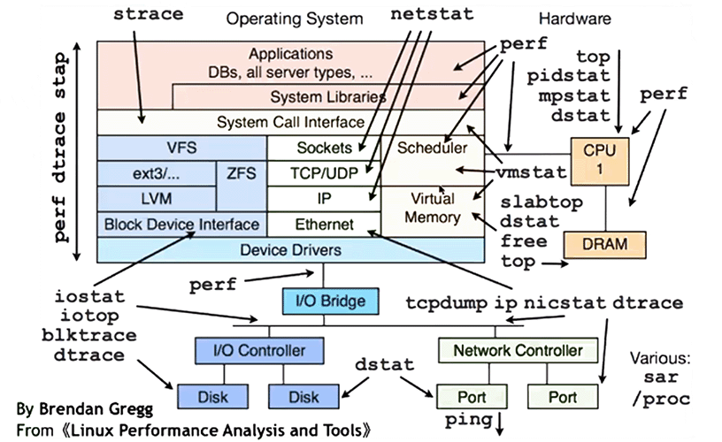
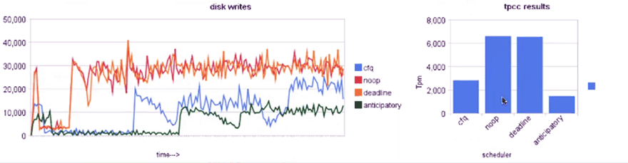
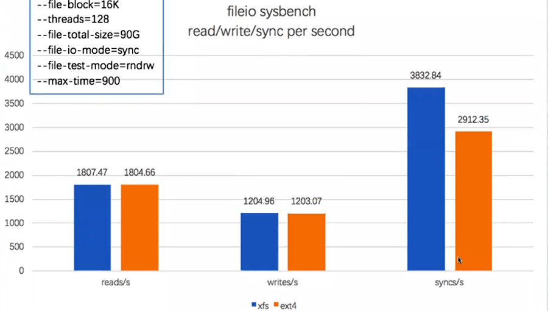
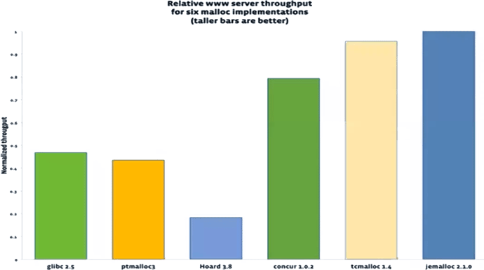
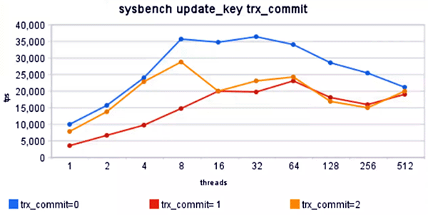

[TOC]

- 为什么说索引时最容易造成MySQL性能瓶颈的原因，但它也最容易被解决？
  - 如果没有索引就会全表扫描，会消耗大量CPU、内存、IO资源。


# MySQL性能瓶颈原因

- 硬件、系统因素
  - CPU
  - 磁盘IO
  - 网络性能
  - 操作系统争用
- MySQL相关因素
  - 数据库设计
    - 索引、数据类型
  - 应用程序性能
    - 特定请求、短时事务
  - 配置变量
    - 缓冲区、高速缓存、InnoDB

# 硬件及OS层面优化

## 不同环节IO延迟的时间

| 环节                                 | 延迟时间                                  |
| ------------------------------------ | ----------------------------------------- |
| L1 cache reference                   | 0.5 ns!                                   |
| Branch mispredict                    | 5 ns!                                     |
| L2 cache reference                   | 7 ns!                                     |
| Mutex lock/unlock                    | 25 ns!                                    |
| Main memory reference                | 100 ns!                                   |
| Compress 1K bytes with Zippy         | 3,000 ns!                                 |
| Send 2K bytes over 1Gbps network     | 20,000 ns!                                |
| Read 1MB sequentially from memory    | 250,000 ns!                               |
| Round trip within same datacenter    | 500,000 ns!                               |
| **<font color=red>Disk seek</font>** | **<font color=red>10,000,000 ns!</font>** |
| Read 1MB sequentially from disk      | 20,000,000 ns!                            |
| Send packet CA -> Netherlands -> CA  | 150,000,000 ns!                           |


## 哪些环节会造成系统性能瓶颈，及处理思路

- 神器 perf 

- strace




## 瓶颈分析工具

- sysstat工具集
  - sar
  - iostat
  - pidstat
  - mpstat
- perf top
  - 实时显示系统/进程的性能统计信息
- pt-ioprofile
  - mysql中的iotop
- pstack
  - 当mysql里有线程hang住时，利用pstack排查由于哪些函数调用存在问题


## 硬件优化

> 为什么运行正常的服务器，突然就hang住黑屏没反应了？？
>
> ——很可能是BBU在搞事情。


- BIOS配置优化
  - CPU设置最大性能模式，关闭C1E、C-stats
  - 内存设置成最大性能模式
  - 关闭NUMA（并关注MySQL：innodb_numa_interleave选项）
- RAID配置优化
  - RAID-10
  - CACHE&BBU
  - WB&FORCE WB
- 使用PCI-E SSD等高速IO设备


## NUMA！！

- NUMA特性可能导致内存分配不均衡，即使总体上物理内存还有空闲，但NUMA特性使得这部分空闲未必能够分配给急需内存的CPU核心，导致发生SWAP。

- 关闭NUMA可以有效降低发生SWAP的概率。


- numactl 查看（待补充）

  ```
  numactl --show
  numactl --hardware
  ```

  

- 彻底关闭numa方式（待补充）


## 操作系统优化

- IO scheduler

  - 机械盘：deadline

  - SSD：noop

  - 查看方式

    ```
    [root@testsrv ~]# cat /sys/block/sda/queue/scheduler 
    noop [deadline] cfq  -- 当前为deadline
    ```

    

- filesystem

  - xfs 最优先

    - xfs建议参数

      ```
      defaults,noatime,nodiratime,nobarrier,inode64
      ```

  - ext4 备选

    

    

- kernel

  - vm.swappiness = 1-5 (RHEL7开始，对于0要谨慎)
  - vm.dirty_background_ratio = 5
  - vm.dirty_ratio = 10

  > 尽最大可能降低使用swap的概率
  >
  > 纯MySQL服务器的话可以直接禁用swap——swappiness=0
  >
  > 
  >
  > vm.dirty_background_ratio:    如果脏页比例超过%，就让后台刷IO的进程开始工作
  >
  > vm.dirty_ratio:     脏页比例超过 %，就让后台进程转为前台进程，阻塞前台进程，优先刷新脏页


- 内存lib

  - 使用jemalloc替代默认glibc，获得更好的效率

  - 按照业界经验，jemalloc和tcmalloc相当，都比默认的内存分配管理模块要好一些
    - tcmalloc是google的内存分配管理模块
    - jemalloc是BSD提供的内存分配管理模块
  - 启用jemalloc
    - 5.0版本可能有性能问题，要谨慎使用
    - 当前最新版本是5.2.x，可以尝试对比测试
    - 总体来看，jemalloc、tcmalloc要比glibc标准的malloc更高效
  - 启用规则

- 内存不超过64G或逻辑CPU不超过8个的话，没有必要更换malloc。

- 安装

  ```
  yum install -y jemalloc jemalloc-devel
  ```

- 设置环境变量

  ```
  export LD_PRELOAD=/lib64/libjemalloc.so
  ```

- 重启mysqld，确认jemalloc生效

  ```
  lsof -n | grep -i 'mysqld.*jemalloc'
  ```

  


# MySQL层面优化

> 为什么不建议调整参数 innodb_thread_concurrency ？

## MySQL实例参数建议

- innodb_buffer_pool_size

  > 空实例IBP可以先1G，后期再根据需要在线调整加大（5.7以后）
  >
  > 老版本默认为8MB，需要注意调整。

  

- innodb_log_file_size = 2~4G & innodb_log_files_in_group >= 3

- innodb_flush_log_at_trx_commit & sync_binlog = 1

  > 启用半同步复制后没必要设置双1
  >
  > 提交模式对比测试：
  >
  > 

  

- innodb_max_dirty_pages_pct <= 50

  > dirty_pages_pct 脏页比例，官方建议设置为90%，但是绝大多数系统都是读多写少，所以脏页比例并不建议设置过高。另外脏页比例过高时会在ckpt阶段发生更久的IO
  >
  > 但是可以关注脏页比例水位线(innodb_max_dirty_pages_pct_lwm)， 低水位线保证当脏页比例超过水位线时，会开始尝试刷新脏页（而不至于真的到脏页比例才刷新脏页）

  

- innodb_thread_concurrency = 0

  > 线程并发不建议设置为非0
  >
  > show engine  .... xxx queries in queue 如果不为0， 说明并发开启了。如果非特定设定，那么就改回0.

  

- innodb_io_capacity & innodb_io_capacity_max

  > io_capacity要调整，默认200不够用。
  >
  > io_capacity_max设置为前者的两倍

  

- innodb_max_purge_lag = 0

  > max_purge_lag不建议设置为非0

  

- binlog_format = row & innodb_autoinc_lock_mode = 2

  > autoinc_lock_mode = 2 更进一步提升自增锁的效率


### 案例

> 环境：云MySQL，5.7，48C，488G
>
> | 参数及原值                           | 建议值 |
> | ------------------------------------ | ------ |
> | innodb_buffer_pool_size=2516582400   | 360G   |
> | join_buffer_size=262144              | 4M     |
> | innodb_sort_buffer_size=1048576      | 4M     |
> | max_heap_table_size=16777216         | 96M    |
> | read_rnd_buffer_size=524288          | 4M     |
> | lock_wait_timeout=31536000           | 3600   |
> | sync_binlog=0                        | 1      |
> | innodb_flush_log_at_trx_commit=2     | 1      |
> | interactive_timeout=3600             | 600    |
> | innodb_max_dirty_pages_pct=75.000000 | 50     |
> | innodb_log_file_size=536870912       | 2G     |
> | innodb_log_files_in_group=2          | 4      |
> | innodb_lock_wait_timeout=180         | 5      |
> | innodb_flush_sync=on                 | off    |
>
> - IBP单个大于8G ，可以考虑设置多个IB instance
> - sort buffer 案例中可以设置为128M
> - 云主机上，一个高配主机收益可能小于将该主机资源拆分成多个普配主机的收益。


## session级别参数

> 可在session级别修改生效

- sort/join/read/read rnd buffer, tmp/heap table

  > 8.0甚至不用调整，因为8.0支持`/* set_var(sort_buffer_size=xx)*/`方式在语句中动态的指定参数

  

- thead_handling = one-thread-per-connection | pool-of-thread

  > thread_handling ，企业版或者mariadb、percona

  

- long_query_time = 0.05

- time_zone = "+8:00"

- open_files_limit = 65535

- back_log = (max_connections * 2)

- max_execution_time = 10000 (/*+ MAX_EXECUTION_TIME(10000) */ HINT)

- log_error_verbosity = 3

  > log中记录：异常断开连接的记录、警告信息。
  >
  > log模式，数字越大警告记录越详细。


## TIME_ZONE

- 默认值为system

  > 当有timestamp not null default current_timestamp列时，访问timestamp列时调用libc时区函数，产生mutex互斥。
  >
  > 在高负载场景下 CPU %sys可能会打满，超过60%的cpu消耗在_spin_lock状态。
  >
  > 只需把选项改成具体时区即可（无需再调用时区函数）


## schema设计优化

> MySQL开发设计中的注意事项。
>
> 分页SQL怎么写效率更高？

- 核心宗旨
  - 表越窄越好——数据类型够用就好，保持高效
  - 表越小越好——数据冷热分离，只留最新热数据
  - 查询够高效——使每个SQL效率足够高，不阻塞


### JOIN

- join列类型（长度、字符集、校验集）要保持一致

  > 在字符集校验集一致时，char(20) & varchar(200) 的join是可以使用索引的。

- 所有列设置NOT NULL

- 多表join时，排序列一定要属于驱动表，否则有额外filesort

  - `select ... from a straight_join b where ... order by b.x; `排序列不属于驱动表，因此需要额外的filesort

  > 执行计划里，id相同的，顺序为从上到下。
  >
  > inner join时优化器会自行选择驱动表角色，示例里b1是驱动表，b2是被驱动表。
  >
  > > 创建主键索引后，主键对主键，顺序变化没有明显区别，因此就按照书写顺序进行驱动和被驱动了
  >
  > ```
  > mysql> desc select * from b1 inner join b2 on b1.id = b2.aid;
  > +----+-------------+-------+------------+--------+---------------+---------+---------+----------+------+----------+-------------+
  > | id | select_type | table | partitions | type   | possible_keys | key     | key_len | ref      | rows | filtered | Extra       |
  > +----+-------------+-------+------------+--------+---------------+---------+---------+----------+------+----------+-------------+
  > |  1 | SIMPLE      | b1    | NULL       | index  | PRIMARY       | n       | 51      | NULL     |  160 |   100.00 | Using index |
  > |  1 | SIMPLE      | b2    | NULL       | eq_ref | PRIMARY       | PRIMARY | 4       | kk.b1.id |    1 |   100.00 | Using where |
  > +----+-------------+-------+------------+--------+---------------+---------+---------+----------+------+----------+-------------+
  > 2 rows in set, 1 warning (0.00 sec)
  > ```
  >
  > 
  >
  > - left/right join时，按照书写逻辑决定驱动表
  >
  >   ```
  >   mysql> desc select * from b1 left join b2 on b1.id = b2.aid;
  >   +----+-------------+-------+------------+--------+---------------+---------+---------+----------+------+----------+-------------+
  >   | id | select_type | table | partitions | type   | possible_keys | key     | key_len | ref      | rows | filtered | Extra       |
  >   +----+-------------+-------+------------+--------+---------------+---------+---------+----------+------+----------+-------------+
  >   |  1 | SIMPLE      | b1    | NULL       | index  | NULL          | n       | 51      | NULL     |  160 |   100.00 | Using index |
  >   |  1 | SIMPLE      | b2    | NULL       | eq_ref | PRIMARY       | PRIMARY | 4       | kk.b1.id |    1 |   100.00 | Using where |
  >   +----+-------------+-------+------------+--------+---------------+---------+---------+----------+------+----------+-------------+
  >   2 rows in set, 1 warning (0.00 sec)
  >   
  >   mysql> desc select * from b2 left join b1 on b2.aid = b1.id;
  >   +----+-------------+-------+------------+--------+---------------+---------+---------+-----------+------+----------+-------------+
  >   | id | select_type | table | partitions | type   | possible_keys | key     | key_len | ref       | rows | filtered | Extra       |
  >   +----+-------------+-------+------------+--------+---------------+---------+---------+-----------+------+----------+-------------+
  >   |  1 | SIMPLE      | b2    | NULL       | index  | NULL          | via     | 4       | NULL      | 5911 |   100.00 | Using index |
  >   |  1 | SIMPLE      | b1    | NULL       | eq_ref | PRIMARY       | PRIMARY | 4       | kk.b2.aid |    1 |   100.00 | Using where |
  >   +----+-------------+-------+------------+--------+---------------+---------+---------+-----------+------+----------+-------------+
  >   2 rows in set, 1 warning (0.00 sec)
  >   
  >   ```
  >
  >   
  >
  > - 排序和驱动表的关系
  >
  >   - <font color=red>order by 列属于驱动表，那么扫描过程中可以以order by列的顺序进行扫描，就不需要额外的排序（filesort）</font>
  >
  >   ```
  >   mysql> desc select * from b2 inner join b1 on b2.aid = b1.id order by b2.aid;
  >   +----+-------------+-------+------------+--------+---------------+---------+---------+----------+------+----------+----------------------------------------------+
  >   | id | select_type | table | partitions | type   | possible_keys | key     | key_len | ref      | rows | filtered | Extra                                        |
  >   +----+-------------+-------+------------+--------+---------------+---------+---------+----------+------+----------+----------------------------------------------+
  >   |  1 | SIMPLE      | b1    | NULL       | index  | PRIMARY       | n       | 51      | NULL     |  160 |   100.00 | Using index; Using temporary; Using filesort |
  >   |  1 | SIMPLE      | b2    | NULL       | eq_ref | PRIMARY       | PRIMARY | 4       | kk.b1.id |    1 |   100.00 | Using where                                  |
  >   +----+-------------+-------+------------+--------+---------------+---------+---------+----------+------+----------+----------------------------------------------+
  >   2 rows in set, 1 warning (0.00 sec)
  >   
  >   mysql> desc select * from b2 inner join b1 on b2.aid = b1.id order by b1.id;
  >   +----+-------------+-------+------------+--------+---------------+---------+---------+----------+------+----------+-------------+
  >   | id | select_type | table | partitions | type   | possible_keys | key     | key_len | ref      | rows | filtered | Extra       |
  >   +----+-------------+-------+------------+--------+---------------+---------+---------+----------+------+----------+-------------+
  >   |  1 | SIMPLE      | b1    | NULL       | index  | PRIMARY       | PRIMARY | 4       | NULL     |  160 |   100.00 | NULL        |
  >   |  1 | SIMPLE      | b2    | NULL       | eq_ref | PRIMARY       | PRIMARY | 4       | kk.b1.id |    1 |   100.00 | Using where |
  >   +----+-------------+-------+------------+--------+---------------+---------+---------+----------+------+----------+-------------+
  >   2 rows in set, 1 warning (0.00 sec)
  >   
  >   ```
  >
  >   
  >
  > - inner join时优化器会根据统计信息选择驱动表，某些时候为了防止驱动表顺序被修改，那么可以强制设定
  >
  >   ```
  >   mysql> desc select * from b2 inner join b1 on b2.aid = b1.id order by b2.aid;
  >   +----+-------------+-------+------------+--------+---------------+---------+---------+----------+------+----------+----------------------------------------------+
  >   | id | select_type | table | partitions | type   | possible_keys | key     | key_len | ref      | rows | filtered | Extra                                        |
  >   +----+-------------+-------+------------+--------+---------------+---------+---------+----------+------+----------+----------------------------------------------+
  >   |  1 | SIMPLE      | b1    | NULL       | index  | PRIMARY       | n       | 51      | NULL     |  160 |   100.00 | Using index; Using temporary; Using filesort |
  >   |  1 | SIMPLE      | b2    | NULL       | eq_ref | PRIMARY       | PRIMARY | 4       | kk.b1.id |    1 |   100.00 | Using where                                  |
  >   +----+-------------+-------+------------+--------+---------------+---------+---------+----------+------+----------+----------------------------------------------+
  >   2 rows in set, 1 warning (0.00 sec)
  >   
  >   mysql> desc select * from b2 straight_join b1 on b2.aid = b1.id order by b2.aid;;
  >   +----+-------------+-------+------------+--------+---------------+---------+---------+-----------+------+----------+-------------+
  >   | id | select_type | table | partitions | type   | possible_keys | key     | key_len | ref       | rows | filtered | Extra       |
  >   +----+-------------+-------+------------+--------+---------------+---------+---------+-----------+------+----------+-------------+
  >   |  1 | SIMPLE      | b2    | NULL       | index  | PRIMARY       | PRIMARY | 4       | NULL      | 5911 |   100.00 | NULL        |
  >   |  1 | SIMPLE      | b1    | NULL       | eq_ref | PRIMARY       | PRIMARY | 4       | kk.b2.aid |    1 |   100.00 | Using where |
  >   +----+-------------+-------+------------+--------+---------------+---------+---------+-----------+------+----------+-------------+
  >   2 rows in set, 1 warning (0.00 sec)
  >   
  >   ```
  >
  >   

  


### 索引

- 主键/唯一索引性能优于普通索引

- 联合索引收益通常比普通单列索引更高

- 基数（cradinality）小的列不建立独立索引，因为不支持bitmap索引

- 长字段使用部分索引，不要对全字段长度建立索引

- 可利用冗余反向字段，用于反向索引

- 使用sphinx等方案代替`like '%xx%' `搜索

  > *Sphinx*是一个基于SQL的全文检索引擎，可以结合MySQL,PostgreSQL做全文搜索，它可以提供比数据库本身更专业的搜索功能，使得应用程序更容易实现专业化的全文检索


### 案例

```
create table if not extsts xxx (
id int(11) unsigned not null auto_increment,
scene_id int(11) not null default '0',
begin varchar(10) not null default '',
end varchar(10) not null default '',
number int(8) not null default '0',
primary key(id),
key id(id)
) engine=MyISAM default charset=utf8;
```

- 辅助索引与主键重合，无意义
- MyISAM引擎表
- 开始和结束时间，5.6之后datetime底层为int，可以直接用datetime类型
- 字段名可能和保留关键字重合，建议更保险规范