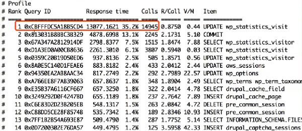

# SLOW SQL管理

- 解析
  - mysqldumpslow
  - pt-query-digest <font color=red>推荐</font>
- 也可以启用general log + pt-query-digest
- 可视化管理工具：Box Anemometer / Query-Digest-UI
- 相关选项
  - long-query-time=0.01
  - log_queries_not_using_indexes=1
  - log_throttle_queries_ot_using_indexes=60
  - min_examined_row_limit=100
  - log_slow_admin_statements=1
  - log_slow_slave_statements=1


- 使用pt查看 重点关注top SQL
  - commit慢：两阶段提交慢，IO性能可能有问题。 如果双1那么会更严重。或者内存太小。




- 5.7版本开始，也可以利用sys.statement_analysis视图

  - 执行次数最多的TOP 10 SQL

    ```
    select ... order by exec_count desc limit 10;
    ```

  - 平均响应耗时最慢的TOP 10 SQL

    ```
    select ... order by avg_latency desc limit 10
    ```

  - 每次扫描行数最多的TOP 10 SQL

    ```
    select ... order by rows_examined desc limit 10
    ```

  - sys.statement_analysis视图列释义

    | col               | means                                  |
    | ----------------- | -------------------------------------- |
    | query             | 归一化的SQL                            |
    | db                | 在哪个DB中执行，如果为NULL表示在任何DB |
    | full_scan         | 是否使用了全表扫描                     |
    | exec_cout         | 该SQL总执行的总次数                    |
    | err_count         | 发生错误的次数                         |
    | warn_count        | 发生警告的次数                         |
    | total_layency     | 总共发生延迟的时间                     |
    | max_latency       | 最大延迟的时间                         |
    | avg_latency       | 平均延迟的时间                         |
    | lock_latency      | 因锁等待占用的总时间                   |
    | rows_sent         | 执行该SQL总返回的行数                  |
    | rows_sent_avg     | 执行该SQL的平均返回行数                |
    | rows_examined     | 执行该SQL扫描的总行数                  |
    | rows_examined_avg | 执行该SQL平均每次扫描的行数            |
    | tmp_tables        | 该SQL形成内存临时表的总次数            |
    | tmp_disk_tables   | 该SQL形成文件临时表的总次数            |
    | rows_sorted       | 该SQL总排序的行数                      |
    | sort_merge_passes | 用于排序中合并的总次数                 |
    | digest            | 该语句的hash                           |
    | first_screen      | 该SQL最早出现的时间                    |
    | last_screen       | 该SQL最近出现的时间                    |

