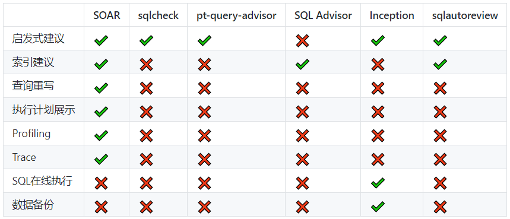
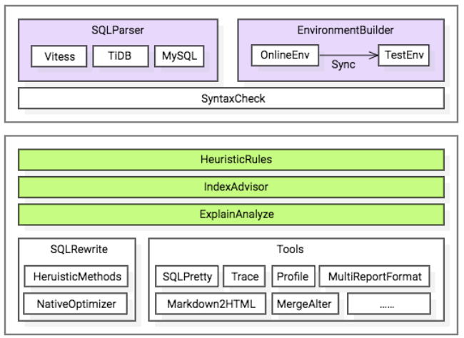

# SQL审核工具：soar

SOAR（SQL Optimizer And Rewriter），小米团队开发和维护的一个对SQL进行优化和改写的自动化工具。

- 跨平台支持（Linux，Mac。理论上也支持win）
- 目前只支持MySQL语法族协议的SQL优化
- 支持基于启发式算法的语句优化
- 支持复杂查询的多列索引优化（Update、Insert、Delete、Select）
- 支持explain信息丰富解读
- 支持SQL指纹、压缩和美化
- 支持同一张表多条alter请求合并
- 支持自定义规则的SQL改写

