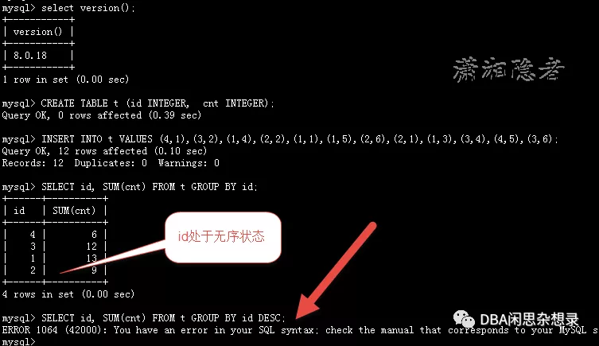

##                                                              MySQL解惑——GROUP BY隐式排序                

原创  潇湘隐者  DBA闲思杂想录 3月23日

​                                    

MySQL中GROUP BY隐式排序是个什么概念呢？主要是其它关系数据库(RDBMS)没有这样的概念，如果没有认真了解过概念，恐怕会对这个概念感觉有点困惑， 我们先来看看官方文档的介绍：

官方文档MySQL 5.7 Reference Manual中的“.2.1.14 ORDER BY Optimization”章节有如下介绍：

> GROUP BY implicitly sorts by default (that is, in the absence of ASC or DESC  designators for GROUP BY columns). However, relying on implicit GROUP BY sorting (that is, sorting in the absence of ASC or DESC designators) or explicit sorting for GROUP BY (that is, by using explicit ASC or DESC  designators for GROUP BY columns) is deprecated. To produce a given sort order, provide an ORDER BY clause.

默认情况下GROUP BY隐式排序(即，缺少GROUP BY后的ASC或DESC指示符)。但是，不推荐依赖于隐式GROUP  BY排序(即，在没有ASC或DESC指示符的情况下排序)或GROUP BY的显式排序(即，通过对GROUP  BY后使用显式ASC或DESC指示符)。要生成给定的排序，请提供ORDER BY子句。

从MySQL 8.0开始，GROUP BY字段不再支持隐式排序. 官方文档MySQL 8.0 Reference Manual中“8.2.1.16 ORDER BY Optimization”章节有如下介绍：

> Previously (MySQL 5.7 and lower), GROUP BY sorted implicitly under certain  conditions. In MySQL 8.0, that no longer occurs, so specifying ORDER BY  NULL at the end to suppress implicit sorting (as was done previously) is no longer necessary. However, query results may differ from previous  MySQL versions. To produce a given sort order, provide an ORDER BY  clause.

那么来看看MySQL的GROUP BY隐式排序（GROUP BY sorted implicitly）吧。我们用“Removal of implicit and explicit sorting for GROUP BY”这篇博客中的例子。

下面实验环境为MySQL 5.6.41（）

```
mysql> select version() from dual;
+------------+
| version()  |
+------------+
| 5.6.41-log |
+------------+
1 row in set (0.00 sec)

mysql> CREATE TABLE t (id INTEGER,  cnt INTEGER);
Query OK, 0 rows affected (0.04 sec)

mysql> INSERT INTO t VALUES (4,1),(3,2),(1,4),(2,2),(1,1),(1,5),(2,6),(2,1),(1,3),(3,4),(4,5),(3,6);
Query OK, 12 rows affected (0.00 sec)
Records: 12  Duplicates: 0  Warnings: 0

#MySQL在这里隐式地对GROUP BY的结果进行排序（即在缺少GROUP BY列的ASC或DESC指示符的情况下）。
mysql> SELECT id, SUM(cnt) FROM t GROUP BY id; --GROUP BY隐式排序
+------+----------+
| id   | SUM(cnt) |
+------+----------+
|    1 |       13 |
|    2 |        9 |
|    3 |       12 |
|    4 |        6 |
+------+----------+
4 rows in set (0.00 sec)
```

MySQL还支持使用GROUP BY进行显式排序（即通过对GROUP BY列使用显式ASC或DESC指示符）

```
mysql> SELECT id, SUM(cnt) FROM t GROUP BY id DESC;  --GROUP BY显式排序
+------+----------+
| id   | SUM(cnt) |
+------+----------+
|    4 |        6 |
|    3 |       12 |
|    2 |        9 |
|    1 |       13 |
+------+----------+
4 rows in set (0.00 sec)
```

从MySQL8.0开始，MySQL不再支持GROUP BY的隐式或显示排序，如下所示：

```
#下面实验环境为MySQL 8.0.18
mysql> select version();
+-----------+
| version() |
+-----------+
| 8.0.18    |
+-----------+
1 row in set (0.00 sec)

mysql> CREATE TABLE t (id INTEGER,  cnt INTEGER);
Query OK, 0 rows affected (0.39 sec)

mysql> INSERT INTO t VALUES (4,1),(3,2),(1,4),(2,2),(1,1),(1,5),(2,6),(2,1),(1,3),(3,4),(4,5),(3,6);
Query OK, 12 rows affected (0.10 sec)
Records: 12  Duplicates: 0  Warnings: 0

mysql> SELECT id, SUM(cnt) FROM t GROUP BY id;
+------+----------+
| id   | SUM(cnt) |
+------+----------+
|    4 |        6 |
|    3 |       12 |
|    1 |       13 |
|    2 |        9 |
+------+----------+
4 rows in set (0.00 sec)

mysql> SELECT id, SUM(cnt) FROM t GROUP BY id DESC;
ERROR 1064 (42000): You have an error in your SQL syntax; check the manual that corresponds to your MySQL server version for the right syntax to use near 'DESC' at line 1
```



如上所示，GROUP BY隐式排序不支持了，在MySQL 8.0中，上面测试例子是无序的。GROUP BY显示排序则直接报错。正确的做法应该是GROUP BY .. ORDER BY 这种操作。如下所示：

```
mysql>  SELECT id, SUM(cnt) FROM t GROUP BY id
    ->  ORDER BY id;
+------+----------+
| id   | SUM(cnt) |
+------+----------+
|    1 |       13 |
|    2 |        9 |
|    3 |       12 |
|    4 |        6 |
+------+----------+
4 rows in set (0.00 sec)


mysql>
```

MySQL 8.0.13中删除了GROUP BY的显式排序。至于为什么MySQL 8.0不再支持GROUP  BY的隐式排序和显示排序，这篇文章“Removal of implicit and explicit sorting for GROUP  BY”已经有详细的介绍，这里就不画蛇添足了。在升级数据库到MySQL 8.0.13或以上版本时，需要留意GROUP BY隐式排序和GROUP  BY 显式排序，进行修改测试。

# 参考资料：

*https://mysqlserverteam.com/removal-of-implicit-and-explicit-sorting-for-group-by/*