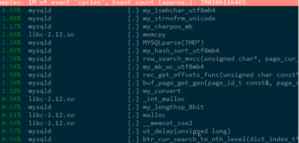
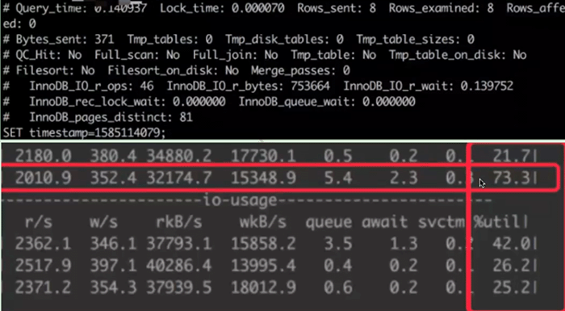
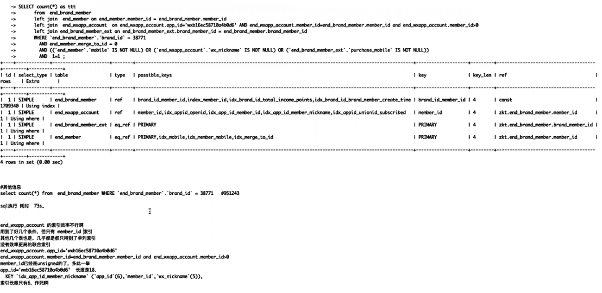
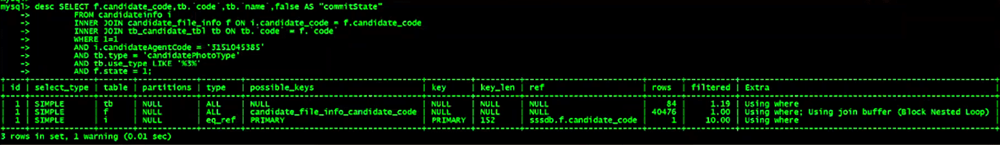

# 瓶颈分析及优化案例

行格式：以读为主可以使用compress；读少写多建议使用dynamic，不建议使用compress。

- DML慢的几种场景
  - innodb_thread_concurrency > 0
  - innodb_max_purge_lag > 0     --不要设置为非0，除非清楚在做什么，而且保证 x queries in queue在允许范围内。[是谁，把InnoDB表上的DML搞慢的:purge_lag 不能是非0的原因](..\1.性能瓶颈排查\02.MySQL层监控\剪辑：是谁，把InnoDB表上的DML搞慢的？.md)
  - innodb_io_capacity 太小
  - redo & binlog 2PC
  - 锁等待
  - semi-sync 延迟
  - disk full

- mycat接收性能太差，导致mysqld server端大量请求被阻塞。

  CPU占用很高，[kernel] [k]_spin_lock 占用超高。

  

- sysbench压测，单实例双1模式，TPS 2000，CPU很高但是IO较低。show processlist存在大量线程。

  开了不该开的innodb_thread_concurrency参数，而且发生了中断不均衡问题。

  > 其实开innodb_thread_concurrency参数可以，但是show engine innodb status  .... xxx queries in queue 过长时就要降低甚至关闭）

- 高并发压测时redo log刷新跟不上，tps几乎降低到0，分析事件为等待checkpoin。 [.] log_checkpointer 占用较高

  因为MySQL8.0版本下redo log默认太小。极端时可能导致实例崩溃或强行复写redo log 导致实例无法CR。

- perf top发现top3出现 my_ismbchar_utf8mb4、my_strnxfrm_unicode、my_charpos_mb之类的情况，可能发生了字符集引起的类型隐式转换

- pages_distinct 81 个page，但是返回结果只有8条，而且整个查询耗时0.140里，io_r_wait占用了0.139

  io性能可能不太好

  SQL效率可能也不太好

腾讯云：CDB

阿里云：RDS

腾讯云自研：CynosDB

阿里自研：polardb

- 腾讯云自家内部对比评测 

| 实例配置                         | 2C8G            | 2C4G           |          |                                                  |
| -------------------------------- | --------------- | -------------- | -------- | ------------------------------------------------ |
| 参数                             | CDB MySQL       | CynosDB MySQL  | 建议值   | 补充说明                                         |
| binlog_row_image                 | FULL            | MINIMAL        | FULL     |                                                  |
| character_set_server             | 初始化指定      | utf8           | utf8mb4  |                                                  |
| innodb_autoinc_lock_mode         | 1               | 1              | 2        | RBR模式下（binlog_format=row）可以改成2          |
| innodb_doublewrite               | 1，不可设置     | 0，不可设置    | 1        | 不清楚为何CynosDB关闭双写                        |
| innodb_lock_wait_timeout         | 50              | 7200           | 10       | CynosDB设置太大，建议不超过30秒                  |
| innodb_log_file_size             | 256MB           | 512MB          | 2GB      | 建议至少2GB                                      |
| innodb_online_alter_log_max_size | 128MB           | 128MB          | 1GB      | 建议至少1GB，影响在线DDL时的效率                 |
| innodb_print_all_deadlocks       | OFF             | OFF            | ON       | 打印全部死锁                                     |
| interactive_timeout              | 3600            | 3600           | 600      |                                                  |
| lock_wait_timeout                | 31536000        | 31536000       | 3600     | 建议不超过3600                                   |
| log_queries_not_using_indexes    | OFF             | OFF            | ON       | 建议开启，并且设置log_throttle_not_using_indexes |
| long_query_time                  | 10              | 10             | 0.01-0.1 |                                                  |
| sync_binlog                      | 1               | 1000，不可设置 |          | doublewrite不开，sync_binlog也不开，费解         |
| table_definition_cache           | 768             | 768            |          |                                                  |
| table_open_cache                 | 512             | 4096           | 4096     | 标准版为何默认这么小？                           |
| tmp_table_size                   | 16MB            | 4MB            | 16MB     |                                                  |
| tx_isolation                     | RR              | RC             | RR       | 业务不关心隔离级别时再调整，建议默认RR           |
| wait_timeout                     | 3600            | 3600           | 600      |                                                  |
|                                  |                 |                |          |                                                  |
| 性能测试                         | 2C 8G IOPS 4060 |                |          |                                                  |
| load data 1GB                    | 1m 53s 46ms     | 58s 621ms      |          |                                                  |
| add keys                         | 4m 2s 505ms     | 2m 2s 25ms     |          |                                                  |
| sync_binlog改为1000后测试        |                 |                |          |                                                  |
| load data 1GB                    | 1m 500s 609ms   | 58s 301m       |          |                                                  |
| add keys                         | 4m 6s 46ms      | 2m 1s 842ms    |          |                                                  |

字符串索引用不上，字符串列可以考虑近一步优化提升。

只有一个关联条件有索引，其他的条件都没有索引，所以用了BNL，使用join buffer

tb.type =  & tb.code  加联合索引

f.code & f.cdidate_code & f.state 加联合索引

i.candidate 列保证有索引

like 前后百分号无法近一步通过索引优化。