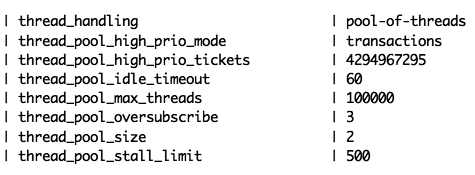

## 在MySQL 5.7下排查内存泄露和OOM问题全过程                

   

# 0、导读

> 我的个人网站后台使用的是MySQL 5.7版本，前段时间经常被oom-kill，借助5.7的新特性，经过一番排查，终于抓到这只鬼。

# 1、问题现象

我的网站前段时间经常时不时就抽风一下，提示数据库无法连接，提示：

> **建立数据库连接时出错**

本想反正是个人网站，挂就挂了，无所谓啦；也可能是VPS配置太低，访问量一大就容易出问题，忍忍算啦。

后来启荣大师说了一句话：看那木匠做的烂门 😓(⊙﹏⊙)b

于是下决心解决问题，不能再被鄙视啦，作为一个DBA，不能容忍数据库无缘无故挂掉，哪怕是个人VPS也不行 O(∩_∩)O~

# 2、问题排查

首先，加了个cron任务，每分钟自动检测mysqld进程是否存活，如果没有，就启动之。这也是我们在企业里解决问题的指导思想：**尽快找到问题，但在还没确认问题之前，优先保证服务可用性，不管你用啥方法。**

接下来，再看MySQL自身的日志，看看能不能找到什么线索。然并卵，啥也没找到，应该是被异常kill的，所以只有mysqld启动过程记录，并没有异常关闭的过程记录。

再排查系统日志，终于看到mysqld进程因为OOM给kill了：

**图1**

可以看到，mysqld进程消耗了最多内存，被oom-killer选中，给干掉了。

既然是OOM，那我们再看下当时系统整体内存消耗情况：

**图2**

是不是有明显的内存泄露迹象？不清楚的同学可以先看下面这篇文章普及下：

- [找到MySQL服务器发生SWAP罪魁祸首](http://mp.weixin.qq.com/s?__biz=MjM5NzAzMTY4NQ==&mid=2653929537&idx=1&sn=3fad622f505175d9ca8399cfb14b925f&chksm=bd3b5a2b8a4cd33d0bd75078614106ee4065b732684fb949d7477f45af56ae8be0a472fc75b1&scene=21#wechat_redirect)

好了，现在我们已经基本明确mysqld进程是因为内存泄露，导致消耗大量内存，最终被oom-kill了。

那么，我们如何知道mysqld进程究竟什么原因消耗掉内存的，都用哪里去了呢？还好，MySQL 5.7的P_S（performance_schema的简称）集成了这样的功能，能帮助我们很方便的了解这些信息。因此我们执行下面的SQL，就能找到MySQL里到底谁消耗了更多内存：

> yejr@imysql> select event_name,SUM_NUMBER_OF_BYTES_ALLOC  from 
>
> memory_summary_global_by_event_name 
>
> order by SUM_NUMBER_OF_BYTES_ALLOC desc LIMIT 10;

**图3**

我们注意到 “**memory/innodb/mem0mem**” 消耗的内存最大。

再执行下面的SQL，查看都有哪些内部线程消耗了更多内存：

> yejr@imysql>select event_name, SUM_NUMBER_OF_BYTES_ALLOC from 
>
> memory_summary_by_thread_by_event_name 
>
> order by SUM_NUMBER_OF_BYTES_ALLOC desc limit 20;

**图4**

我们注意到，上面的结果中，有很多非MySQL内部后台线程（thread_id 值比较大）用到了 “memory/innodb/mem0mem”，并且内存消耗也比较大。看到这种现象，我的第六感告诉我，应该是并发线程太高或者线程分配不合理所致。因为前端是PHP短连接，不是长连接，不应该有这么多thread，推测是多线程连接或线程池引起的。

于是排查了一圈和线程、连接数相关的参数选项及状态，基本确认应该是开了线程池（thread pool），导致了内存泄露，持续消耗内存，最终mysqld进程消耗过多内存，被系统给oom-kill了。

下面是我的thread pool相关设置：

**图5**

当我们把线程池功能关闭后，内存泄露的问题也随之消失，mysqld进程再也没有被oom-kill了，看起来确实是解决的问题。

经过几次反复测试，最终观察到以下结论：

> - **同时开着P_S和thread pool会导致发生内存泄露**；
> - 同时开着P_S和thread pool，不过采用"one-thread-per-connection"模式而非"pool-of-threads"模式（只用到extra port功能），不会发生内存泄露；
> - 只开着P_S，不开thread pool，不会发生内存泄露；
> - 不开P_S，只开thread pool，也不会发生内存泄露；
> - 同时关闭P_S和thread pool，也不会发生内存泄露；

交代下，我的MySQL版本是：

> 5.7.17-11-log Percona Server (GPL), Release 11, Revision f60191c

更早之前用官方的5.7.13版本也是有问题的。

# 3、结论及建议

**在前端应用经常有突发短连接或相似场景中，开启线程池对缓解用户连接请求排队有很大帮助**，可以避免MySQL连接瞬间被打满、打爆的问题。但线程池也并非适用于全部场景，像本案例遇到的问题就不适合了（我当初开thread pool更多是为了extra port功能）。

上面我们提到，从MySQL 5.7版本开始，新增了很多有用的视图，可以帮助我们进一步了解MySQL内部发生的一些事情。在P_S中新增了下面这几个内存相关的视图：

- memory_summary_by_account_by_event_name

- memory_summary_by_host_by_event_name

- memory_summary_by_thread_by_event_name

- memory_summary_by_user_by_event_name

- memory_summary_global_by_event_name

  

看视图的名字，就知道这可以帮助我们分别从**账号**（包含授权主机信息）、**主机**、**线程**、**用户**（不包含授权主机信息）、**整体全局**等多个角度查看内存消耗统计。

除了内存统计，还有和事务、复制相关的一些视图，并且原来有些视图也进一步增强。

在MySQL 5.7中，还集成了sys schema，关于sys schema大家可以看本文下方的推荐链接。sys  schema主要是对Information_schema以及Performance_Schema的视图进一步增强处理，提高结果的可读性。比如，我们可以查看当前实例总消耗的内存，以及内存主要由哪些部分给占用了，也可以透过sys schema来查看：

**图6**

建议大家应该花些时间好好再深入理解下I_S、P_S、sys schema，对我们这些非底层代码的MySQL DBA而言，这些都是很好的辅助手段。