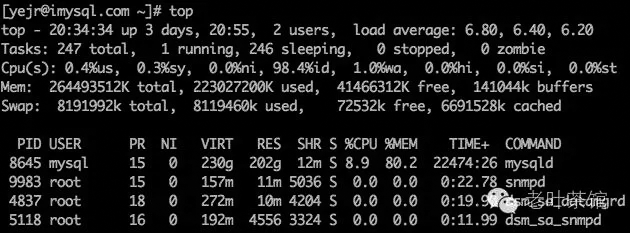
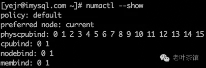

# 导读

> MySQL数据库服务器发生SWAP相信很多人都遇到过，如何找出元凶，又如何应对呢？

# 问题交代

我的朋友小芳（这次不是小明了，hoho），最近遇到了一个郁闷的问题：明明OS还有大量的空闲内存，可是却发生了SWAP，百思不得其解，她就来找我搬救兵了。

先看下SWAP是干嘛的，了解下它的背景知识。

在Linux下，SWAP的作用类似Windows系统下的“虚拟内存”。当物理内存不足时，拿出部分硬盘空间当SWAP分区（虚拟成内存）使用，从而解决内存容量不足的情况。

SWAP意思是交换，顾名思义，**当某进程向OS请求内存发现不足时，OS会把内存中暂时不用的数据交换出去，放在SWAP分区中，这个过程称为SWAP OUT**。**当某进程又需要这些数据且OS发现还有空闲物理内存时，又会把SWAP分区中的数据交换回物理内存中，这个过程称为SWAP IN**。在vmstat的输出结果中，分别表现为 si\so 两列，如下图.1

图1

看到这里我们就知道了，**发生SWAP的最直接可能的原因是进程向OS申请内存时，发现物理内存不足**，当没有SWAP可用的话，这时可能会一直等待，也可能会触发OOM-killer机制，OS把消耗内存最多的那个进程kill掉以释放内存，这个选择取决于内核参数 **vm.swappiness**。该参数可选范围从 0 - 100，**设为 0 就是希望最大限度使用物理内存，尽量不使用swap，设为 100 则是希望积极使用swap**。在运行数据库进程的服务器上，我们通常**强烈建议这个值小于等于10，最好是设置为 0**。原因很简单，对数据库这种需要集中CPU资源、大内存、高I/O的程序而言，如果用SWAP分区代替内存，那数据库服务性能将是不可接受的，还不如直接被OOM kill（数据库进程通常占用最多内存，最容易被OOM kill）来的痛快（早死晚死都是死，还不如痛快的死，反正很快就能重生，嗯）。

先介绍完这么多信息，大家肯定已经不耐烦了，我们就来看看现场并进行排查吧。

# 3、现场排查

首先，看下系统整体的状况，如下图.2所示

图2

从上图能看出来什么呢，有几个关键信息：

- 系统负载不算高，最近的平均load是6.8；
- CPU负载也不算高，有大量的空闲，idle为 98.4%；
- 内存主要分配给mysqld进程，占用了80.2%；
- 尽管物理内存有256G，空闲的也将近39G，但确实发生swap了，并且把SWAP都耗尽了。

得到第一个排查结果：**物理内存还有不少空闲，但却把swap都耗尽了**。作为一个有经验的DBA，遇到这种情况第一反应是什么呢？嗯，先不点破，继续往下看。

再执行 free -gt 查看内存、SWAP消耗情况，如下图.3所示

图3

看出来了吧：遇到这种情况，第一条件反射很直接就是：发生**内存泄露（memory leak）**了。

一般来说，如果发现内存统计结果中，**cached 和 used 相差特别大的话，基本可确定系统发生内存泄露**。相应的处理手法有：

- 治标的办法：择机重启进程，彻底释放内存归还给OS；
- 治本的办法：找到代码中导致泄露的代码，修复之（我们这次面对的是mysql代码，还是去官方提交bug吧，哈哈）；
- 治本的办法：升级程序版本，通常新版本会解决旧版本存在的问题，推荐此方案。

再看下MySQL中内存相关选项怎么配置的：

图4

除了 innodb-buffer-pool 分配的稍微多一些外，其他的还算正常。看了下，MySQL的版本是 5.6.19，看来是有必要升级到5.6系列的最新版本。

到这里，我们得到第二个排查结果：**mysqld进程发生内存泄露，建议择机重启进程，并尽快安排升级到最新版本**。

然而，仅仅是因为mysqld进程内存泄露导致的SWAP吗，貌似不全然？还记得上面我们有个地方还没点破的不：**物理内存还有不少空闲，但把swap都耗尽了**。同样滴，这种案例在我们知数堂的MySQL DBA培训课程里也被多次谈及，**绝大多数情况是因为没有关闭NUMA引起的**。在运行数据库进程的服务器上，强烈建议关闭NUMA，在之前的分享 [比较全面的MySQL优化参考（上篇）](http://mp.weixin.qq.com/s?__biz=MjM5NzAzMTY4NQ==&mid=205830212&idx=1&sn=c018f0903454b34196081bb79c244be5&scene=21#wechat_redirect) 中也有提及。我们接着来看下NUMA的状况：

图5

图6

从上面图.5、图.6可见，NUMA问题导致其中一个CPU可分配的内存远小于另一个（1.8G vs 38G），那么这个CPU上如果要申请大内存时，显然不够了，所以发生SWAP。关于NUMA的相关背景知识我这里不赘述。

因此，我们得到第三个排查结果：**由于服务器硬件、系统设置不当，没有关闭NUMA，导致发生SWAP**。建议方案有：

- 在BIOS设置层面关闭NUMA，缺点是需要重启OS；
- 或修改GRUB配置文件，缺点也是要重启OS；
- 升级MySQL版本到5.6.27及以后，新增了一个选项 innodb_numa_interleave，只需要重启mysqld实例，无需重启OS，推荐此方案。

说到这里，这个问题已经基本分析清楚了，相关的解决建议也给了，根据自己的情况去评估选择哪个方案即可。

# 4、写在最后

类似的案例发生也不是一次两次了，我肯定以后还会继续存在，看完案例的的同学也没办法立刻把所有服务器上的NUMA策略全部修整过来，或者可能冲动一下想修复，但过几天就又给忘光了。

老叶曾多次在各种场合不厌其烦地强调一些基础的MySQL运维、开发规范，也正是因为看到了其实还有不少此类问题的存在。这些基础的规范都没执行到位的话，早晚是有一天要去填坑的，不管是填自己的挖下的坑，还是前人留下的坑，哈哈。