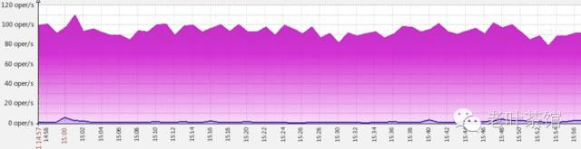
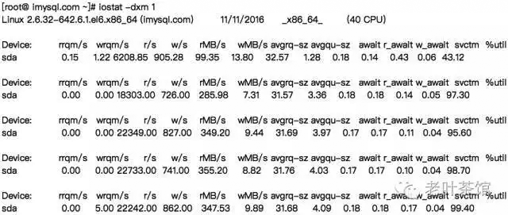
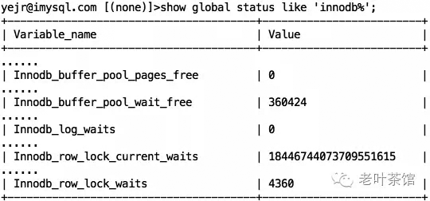

## FAQ系列 | 是什么导致MySQL数据库服务器磁盘I/O高？                

​         

# 0、导读

> 有个MySQL服务器的磁盘I/O总有过高报警，怎么回事？

# 1、问题

我的朋友小明，TA有个MySQL服务器最近总是报告磁盘I/O非常高，想着我这有免费的不用白不用的企业技术服务（TA自己这么想的），就找我帮忙给把把脉。

作为一个经验丰富(踩坑不断)的DBA，出现这种问题，一般来说，磁盘I/O很高无非是下面几个原因引起：

1. 磁盘子系统设备性能差，或采用ext2/ext3之类文件系统，或采用cfq之类的io scheduler，所以IOPS提上不去；
2. SQL效率不高，比如没有索引，或者一次性读取大量数据，所以需要更多的I/O；
3. 可用内存太小，内存中能缓存/缓冲的数据不多，所以需要更多的I/O。

方法论已有，接下来就是动手开始排查了。

# 2、排查

先看磁盘I/O设备，是由十几块SSD组成的RAID 10阵列，按理说I/O性能应该不至于太差，看iops和%util的数据也确实如此。

再来看下文件系统、io scheduler的因素，发现采用xfs文件系统，而且io scheduler用的是noop，看来也不是这个原因。而且看了下iostat的数据，发现iops也不算低，说明I/O能力还是可以的。

再来看看当前的processlist，以及slow query log，也没发现当前有特别明显的slow query，所以也不是这个原因了。

现在只剩下内存不足这个因素了，看了下服务器物理内存是64G，用系统命令 **free** 看了下，发现大部分都在cached，而free的也不多。观察InnoDB相关的配置以及status，看能不能找到端倪。

首先，看下 innodb-buffer-pool-size 分配了多少：

嗯，分配了18G，好像不是太多啊~

再看一下 innodb status：

重点关注下几个wait值，再看下show engine innodb结果：

关注下unpurge列表大小，看起来还是比较大的（有111万）。

更为诡异的是，在已经停掉SLAVE IO & SQL线程后，发现redo log还在一直增长...

第一次看

停掉SLAVE线程后过阵子再看

看到这里，有经验的DBA应该基本上能想明白了，主要是因为 innodb buffer pool 太小，导致了下面几个后果：

1. dirty page 和 data page 之间相互“排挤抢占”，所以会出现 Innodb_buffer_pool_wait_free 事件；
2. redo log 也没办法及时刷新到磁盘中，所以在SLAVE线程停掉后，能看到LSN还在持续增长；
3. 同时我们也看到unpurge的列表也积攒到很大（111万），这导致了ibdata1文件涨到了146G之大，不过这个可能也是因为有某些事务长时间未提交。

还有，不知道大家注意到没，Innodb_row_lock_current_waits 的值竟然是  18446744073709551615（想想bigint多大），显然不可能啊。事实上，这种情况已经碰到过几次了，明明当前没有行锁，这个  status 值却不小，查了一下官方bug库，竟然只报告了一例，bug id是#71520。

# 3、解决

既然知道原因，问题解决起来也就快了，我们主要做了下面几个调整：

- 调大innodb-buffer-pool-size，原则上不超过物理内存的70%，所以设置为40G；

- 调大innodb-purge-thread，原来是1，调整成4；

- 调大innodb_io_capacity和innodb_io_capacity_max，值分别为2万和2.5万；

  

调整完后，重启实例（5.7版本前调整innodb-buffer-pool-size 和 innodb-purge-thread 需要重启才生效）。再经观察，发现IOPS下降的很快，不再告警，同时 Innodb_buffer_pool_wait_free 也一直为 0，unpurge列表降到了数千级别，搞定，收工