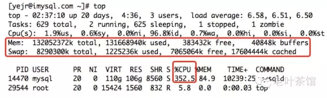
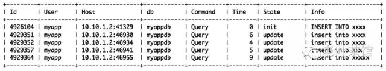
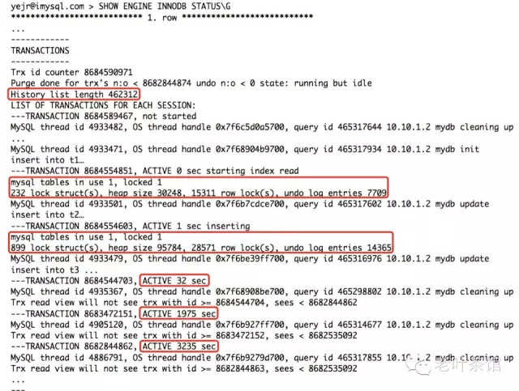
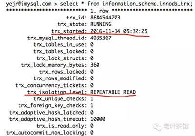
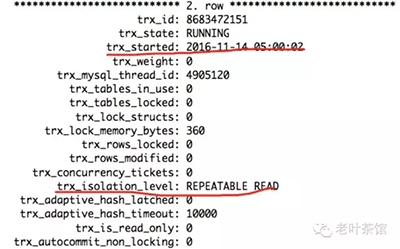
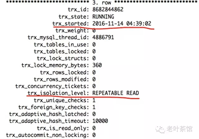

## 是谁，把InnoDB表上的DML搞慢的？                

​    

# 0、导读

> 突然发现MySQL服务器上InnoDB表的DML线程频繁被阻塞，TPS下降比较厉害，是什么原因导致？

# 1、问题

我的朋友小明（又是悲催的小明），发现有个MySQL数据库最近DML明显变慢了，执行SHOW PROCESSLIST总能看到DML线程状态，TPS下降也挺厉害的，不知道什么原因。

接到小明的求助，我第一反应是，可能有几个原因：

1. 服务器的性能不足；
2. InnoDB buffer pool size分配不够；
3. 表DDL设计不合理，例如没有基于索引的SQL请求，或者InnoDB表没有使用自增列做主键，或索引太多；
4. MySQL中有些SQL效率太低，影响整体性能；
5. 当前有其他进程负载较大，影响到mysqld进程的性能；

那么到底是什么原因导致InnoDB表上的DML操作很慢呢，下面一起来一步步排查吧。

# 2、排查

**2.1、查看整体负载**

先执行top看系统负载，看看高不高，并确认瓶颈是否在mysqld进程：

可以看到，系统负载不算高，mysqld进程的CPU消耗比较大，疑似索引可能存在问题。

从top的结果也没看到有其他进程在和mysqld进程抢占资源，消耗cpu或内存等资源。

另外mysqld进程占用的内存不小，按理不应该是InnoDB buffer pool分配不足的原因了。不过，我们也注意到used很大，但buffers+cached不大，疑似发生内存泄露。

**2.1、查看MySQL内部SQL请求**

接下来我们看看MySQL内部的一些SQL请求，是否存在索引设计不当导致SQL效率太差的情况。

并没有耗时特别久的SELECT请求，排除这个因素。

同时也排除了因为表DDL设计不合理导致DML太慢的因素，这个的背景知识详见 [[MySQL FAQ\]系列 — 为什么InnoDB表要建议用自增列做主键](http://mp.weixin.qq.com/s?__biz=MjM5NzAzMTY4NQ==&mid=200682457&idx=1&sn=bc090ad6013c234b2c802c76e39ce75a&scene=21#wechat_redirect)。

排查到这里，似乎无解了？

等等，我们再来检查InnoDB status看看：

从上面这些信息里我们注意到几个重要信息：

- un-Purge太大了，足有46万（History list length 462312，太大了）；
- 个别事务启动太久一直没提交（TRANSACTION 8682844862, ACTIVE 3235 sec，将近1个小时）；
- 个别事务里生成的undo太多（undo log entries 14365，一个事务里1万多undo，要死人的节奏）；
- buffer pool中的脏页不算多（Modified db pages  134050，约2GB，相对于总共90G的buffer pool才占2.2%，也还好）；

基本可以怀疑是因为unpurge list太大，导致DML被阻塞了，看看InnoDB的几个选项确认下：

上面这2个配置选项的意思是：

1、当InnoDB检测到当前unpurge list大于10万时，就会阻塞所有的DML请求；

2、每次DML请求被阻塞延时至少是  ((purge_lag/innodb_max_purge_lag)×10)–5  毫秒，最大阻塞延时是1000毫秒（1秒）。在上面的例子中，最少被阻塞 (462312/430000)*10-5=5.7514 毫秒，最久1秒；

这就能很好解释为什么InnoDB表上的DML请求总是那么慢了。

但是，为什么unpurge会这么大呢，继续追根刨底。

我们先来看下 information_schema.innodb_trx 视图，这个视图记录了当前所有活跃事务列表：

共有3个活跃事务，其中最早的一个是04:39:02开始的，而当前时间是05:32:25，两者相差了将近1个小时。可见，**是因为有个较早的事务，一直没有提交/回滚，导致这个unpurge的列表越来越大**。**在InnoDB中，执行purge工作前要先判断哪些数据（主要是Undo Log，被标记为删除的数据，以及二级索引中被删除的记录）可以被删除**。

在本例中，因为有个事务长时间没提交，它有可能需要读取这些旧数据，所以是不能被purge的，直到确认没有任何事务需要读取这些旧数据时，才能将它们清除。

# 3、解决方案

至此，我们知道为啥DML会很慢的原因了，解决起来就简单了：

- 及时提交长时间的事务，例如本例中应该及时提交线程ID为4886791的事务，实在找不到是哪个业务连接的话，就只能直接把这个线程给kill了。我在最近的几次大会上分享时，也提到应该及时杀掉长时间不活跃的连接，因为它们是有可能存在未提交的事务的。这个是治本的办法；
- 设置autocommit=1，尤其应该检查一些gui客户端，例如MySQL Workbench、Navicat，它们极有可能在连接MySQL时采用autocommit=0的模式，应该调整过来。这个也算是治本的办法之一；
- 在避免undo log暴涨的前提下，可以适当调大 innodb_max_purge_lag 值以允许存在更大的unpurge列表，还应适当调低 innodb_max_purge_lag_delay 值，降低每次DML被阻塞的耗时。这个是治标的办法，不太建议