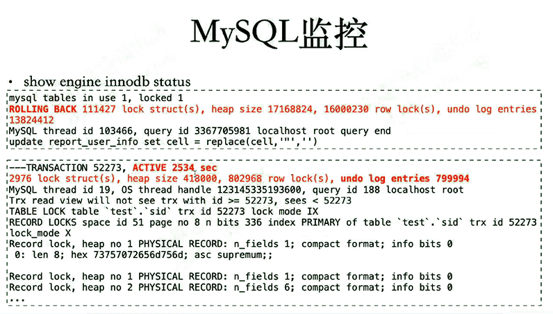

[TOC]

# MySQL层监控

主要是锁、索引引起的慢查询

其他情况，如来不及刷脏页、redo太小、异常调用等。

 

## MySQL服务性能是否有瓶颈

- tps
- QPS
- 慢查询
- rt（response time，响应时间）
- 锁
- 等待
- 临时表
- 临时文件
- 表缓存
- 线程缓存

 

## MySQL服务可用性

- 不仅能连上，还得能正常查询并及时返回结果

- MySQL服务存活

- MySQL复制是否终止，延迟多大

- 磁盘空间消耗

 

- MySQL复制是否终止，延迟多少

- 高一致性要求的场景，复制几乎不能有延迟

主从复制时，如果binlogformat=statement，隔离级别=rc， 可能会导致数据不一致。就需要做一个主从复制的监控，监控数据一致性。

 

## 衡量平均响应时长（average rt）

- 通过模拟N次随机业务逻辑判断响应耗时

```
mysql> select benchmark(100000,'call mysp()');
```

- 通过MySQL的基准测试函数来判断

```
mysql> select benchmark(100000,'select 1+1');
```

- 判断有效事务需要增长速率

```
root@localhost [(none)]>show engine innodb status \G

------------
TRANSACTIONS
------------
Trx id counter 45616397
```

 

## 等待事件

- Innodb_buffer_pool_wait_free

```
show global status like 'Innodb_buffer_pool_wait_free%';
```

- Innodb_log_waits

```
show global status like 'Innodb_log_waits%';
```

 

## 临时表、临时文件

- Created_tmp_disk_tables
- Created_tmp_files
- Created_tmp_tables

```
show global status like 'created_tmp%';
```

 

## 打开表、文件数

- Open_files
- Open_streams
- Open_table_definitions
- Open_tables
- Opened_files
- Opened_table_definitions
- Opened_tables

```
show global status like 'Open%';
```

## 并发连接

- Threads_cached 
- Threads_connected
- Threads_created
- Threads_running

```
show global status like 'Threads_%';
```

 

- 查看MySQL状态

  - show [full] processlist
  - show [global] status
  - show engine innodb status \G
  - tail -f slow.log

  > 不加global 只能看当前session的动态参数


- 案例：

  - sql产生了临时表，需要生成临时表
  - distinct相当于group by，没索引就用临时表了

  ```
  mysql> show processlist;
  +----+-----------------+-----------+------+---------+--------+------------------------+------------------+
  | Id | User            | Host      | db   | Command | Time   | State                  | Info             |
  +----+-----------------+-----------+------+---------+--------+------------------------+------------------+
  |  4 | event_scheduler | localhost | NULL | Query   | 675    | Copying to tmp table   |select distinct ..|
  ...
  ```

  

## handler_read监控

MYSQL之HANDLER_READ*详细讲解

```
mysql> pager cat - > /dev/null
PAGER set to 'cat - > /dev/null'
mysql> flush status ; select * from kk;
Query OK, 0 rows affected (0.04 sec)
 
48000 rows in set (0.06 sec)
 
mysql> nopager
PAGER set to stdout

mysql> show status like 'handler_read%';
+-----------------------+-------+
| Variable_name         | Value |
+-----------------------+-------+
| Handler_read_first    | 1     |
| Handler_read_key      | 1     |
| Handler_read_last     | 0     |
| Handler_read_next     | 0     |
| Handler_read_prev     | 0     |
| Handler_read_rnd      | 0     |
| Handler_read_rnd_next | 48001 |
+-----------------------+-------+
7 rows in set (0.00 sec)
```

 

### 案例一

- sql花费大量时间创建排序索引（因为没索引）

- 记录slowlog也花费长时间，可能是当前io很忙

  ```
  mysql> set profiling=1;
  
  mysql> select ...;
  
  mysql> show profiles;
  +----------+------------+------------+
  | Query_ID | Duration   | Query      |
  +----------+------------+------------+
  |        1 | 0.01228775 | select ... |
  |        2 | 0.00047000 | select ... |
  |        3 | 0.00405850 | select ... |
  |        4 | 0.00506475 | select ... |
  +----------+------------+------------+
  4 rows in set, 1 warning (0.00 sec)
  
  mysql> show profile for query 4;
  +--------------------------------+----------+
  | Status                         | Duration |
  +--------------------------------+----------+
  | starting                       | 0.000130 |
  | Executing hook on transaction  | 0.000012 |
  | starting                       | 0.000019 |
  | checking permissions           | 0.000016 |
  | Opening tables                 | 0.000073 |
  | init                           | 0.000016 |
  | System lock                    | 0.000021 |
  | optimizing                     | 0.000026 |
  | statistics                     | 0.000039 |
  | preparing                      | 0.000043 |
  | executing                      | 0.004428 |
  | sending data                   | 0.004428 |
  | creating short index           | 100.1234 |*
  | end                            | 0.000014 |
  | query end                      | 0.000010 |
  | waiting for handler commit     | 0.000020 |
  | closing tables                 | 0.000016 |
  | freeing items                  | 0.000040 |
  | logging slow query             | 0.000090 |
  | cleaning up                    | 0.000053 |
  +--------------------------------+----------+
  18 rows in set, 1 warning (0.00 sec)
  
  ```

  

### 案例二

- innodb回滚非常慢
- 如果发现大事务，要特别注意




### 案例三

slowlog


### 案例四

主从复制环境，因为表分区特别多（3w+） ，数据量大、有大事务， 导致主从复制延迟很高，是个bug。

[老叶茶馆] - 2017-05-28 意想不到的MySQL复制延迟原因.html


[[老叶茶馆\] - 2016-11-30 找到MySQL服务器发生SWAP罪魁祸首.html](.\剪辑：找到MySQL服务器发生SWAP罪魁祸首 .md)

[[老叶茶馆\] - 2017-03-27 在MySQL 5.7下排查内存泄露和OOM问题全过程.html](.\剪辑：在MySQL 5.7下排查内存泄露和OOM问题全过程.md)

[[老叶茶馆\] - 2016-11-17 FAQ系列 - 是什么导致MySQL数据库服务器磁盘I-O高？](.\剪辑：是什么导致MySQL数据库服务器磁盘IO高？.md)

[[老叶茶馆\] - 2016-12-07 是谁，把InnoDB表上的DML搞慢的？.html](.\剪辑：是谁，把InnoDB表上的DML搞慢的？.md)

[[老叶茶馆\] - 2016-01-13 优化系列 - 实例解析MySQL性能瓶颈排查定位.html](.\剪辑：实例解析MySQL性能瓶颈排查定位.md)


# MySQL层监控小结

> 重点是分析思路和对工具的灵活使用

- tps\QPS\慢查询\rt\锁\等待\临时表\临时文件\表缓存\线程缓存
- checkpoint lag\purge lag\aborted\大事务\长事务
- DML正常\复制不延迟&报错
- processlist查看不良状态
- slow query重点关注distinct page特别多的
- 神器perf top