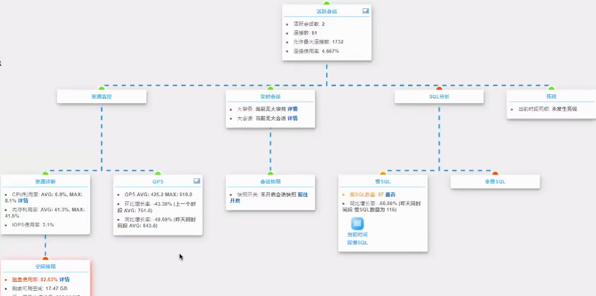

[TOC]

# MySQL监控&性能瓶颈排查

 

## 监控的目的

- 业务、数据库服务是否可用

- 通过事务实时性能数据变化感知业务的变化

- 数据库性能变化趋势判断服务器资源是否足够

- 了解线上计算资源使用情况

- 作为计算资源扩容、收缩的参考

- 作为优化工作的成果展示记录

### 监控服务的可用性

- 不只是数据库，业务整体对外是否可用

- DB进程存在，但可能没监听网络，或授权不正确，或网络故障，或连接数满，或负载过高而hang无响应

- 最好是有遍布各地的接口，模拟业务请求进行监控

- keepalived会有脑裂的隐患

### 监控数据可靠性

- 数据可靠性是指业务数据是否可靠、一致

- 服务可用，不代表数据就是正确的

- 有可能误操作删除数据，或者其他意外原因丢失数据

- 或者主从复制延迟，导致在从服务器无法读取到最新数据

- 通过模拟随机业务逻辑来验证数据可靠性

### 监控性能指标

- 服务器&MySQL实例负载高，虽然可连接，但是响应慢，等于不可用

- 响应很慢时，用户不耐烦一直刷屏，更容易引起风暴

- 因此需要监控系统响应时长、每秒处理事务数

- 

当CPU长时间超过100%改如何快速定位性能瓶颈？

- 计算效率低，导致高CPU占用

- 业务进程过多，如proxy时，响应更多的请求就会fork更多的进程

 

### 监控的关键指标

#### 硬件及系统层

| CPU  | %user，%sys，%idle，%iowait            |
| ---- | -------------------------------------- |
| 内存 | available，cached，swap，内存泄漏及OOM |
| I/O  | iops、吞吐、时延、利用率%util          |
| 网卡 | 吞吐哦，特别关注小包的收发频率         |

 

#### MySQL层

- 主要是锁、索引引起的慢查询

- 其他情况，如来不及刷脏页、redo太小、异常调用等。

  

 

### 业务监控

#### 业务状态监控

- 是否正常、tps、平均响应时长、自定义错误代码

- 接口响应延迟
  - 在监控系统调用应用接口，探测其响应延迟，该接口实现一些基本的业务逻辑

 

#### 思考

不用监控系统，只靠人肉的情况下，如何快速发现MySQL的性能瓶颈？有什么好的监控系统？

 

 