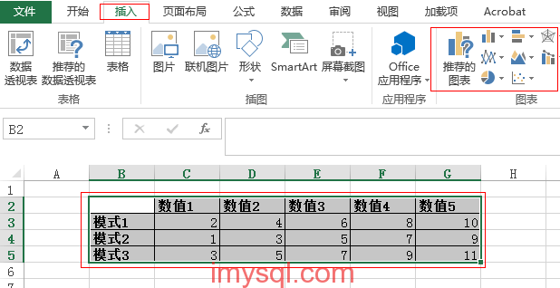
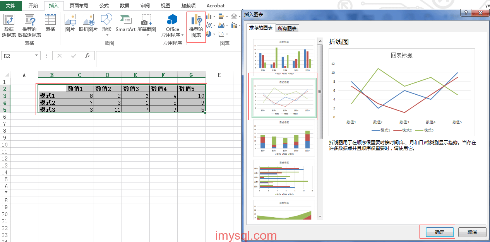
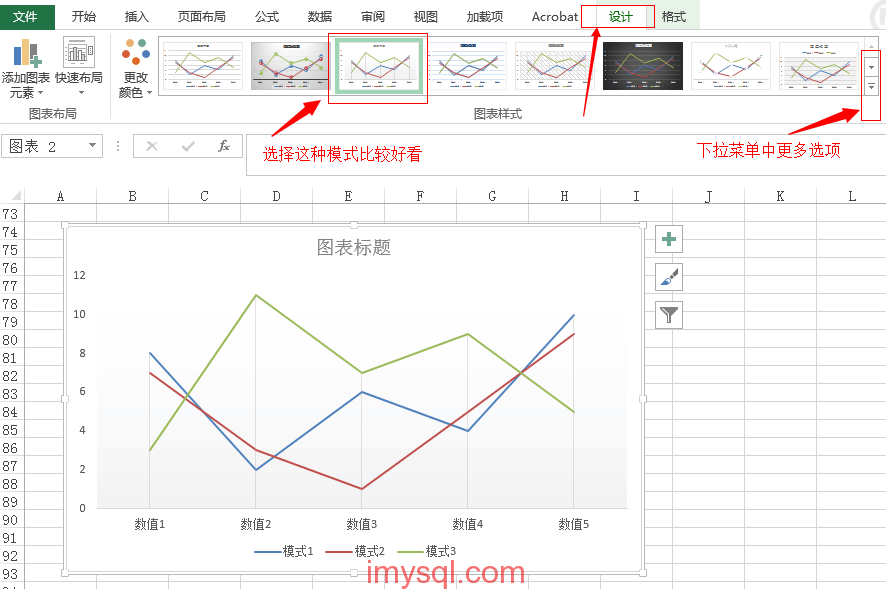

我经常会进行一些基准测试工作，测试结果需要进行对比，一般测试结果采用图表展示的方式再阐述结论最为通俗易懂。

本次分享下我平时用excel来生成图表的方法：

**一、数据收集、初始化**

1、构建一个excel表格

2、纵向表示多种对比的测试模式

3、横向表示各个测试模式在不同条件下的测试结果值

**二、生成对比图表**

1、选中excel表格各行各列

2、选择功能菜单中的“插入”=>“推荐的图表”（office 2013模式下是这样，其他版本可能有不同名称）

3、选择合适的图表模板，确认即可生成多条曲线对比图

**三、渲染图表**

双击刚才生成的图表，选择功能菜单中的“设计”，选择自己中意的图表模板，即可生成高大上的结果啦，哈哈。

附件是我的模板以及本文录制过程 [测试结果画曲线图 – 模板](./测试结果画曲线图-模板.xlsx)