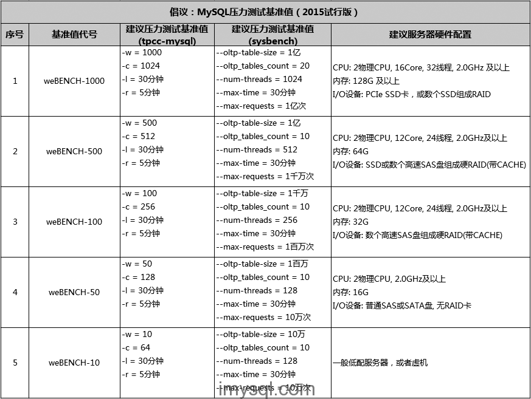

# 老叶倡议：MySQL压力测试基准值

通常，我们会出于以下几个目的对MySQL进行压力测试：

```
1、确认新的MySQL版本性能相比之前差异多大，比如从5.6变成5.7，或者从官方版本改成Percona分支版本；
2、确认新的服务器性能是否更高，能高多少，比如CPU升级了、阵列卡cache加大了、从机械盘换成SSD盘了；
3、确认一些新的参数调整后，对性能影响多少，比如 innodb_flush_log_at_trx_commit、sync_binlog 等参数；
4、确认即将上线的新业务对MySQL负载影响多少，是否能承载得住，是否需要对服务器进行扩容或升级配置；
```

针对上面这几种压测的目的，相应的测试方法也有所不同。

先说第四种，需要和线上业务结合起来，这时候就需要自行开发测试工具，或者利用 **[tcpcopy](https://github.com/session-replay-tools/tcpcopy)** 将线上实际用户请求导向测试环境，进行仿真模拟测试。

对于前三种，我们通常采用基准测试就可以。比较常用的MySQL基准压力测试工具有 **[tpcc-mysql](https://code.launchpad.net/~percona-dev/perconatools/tpcc-mysql)、[sysbench](https://code.launchpad.net/sysbench)、[mysqlslap](http://dev.mysql.com/doc/refman/5.6/en/mysqlslap.html)** 等几个。

关于压力测试工具的使用，可以查看我之前在ORACLE技术嘉年华上的分享：**[MySQL压力测试经验](http://pan.baidu.com/s/1jGjELkq)**，在这里不再细说。

基于促进同行间的交流，统一MySQL压测标准，并且可以相互分享、对比、借鉴测试结果的目的。因此老叶特别发起MySQL压力测试基准值倡议。建议大家采用以下几种压力测试基准值。

[](http://imysql.com/wp-content/uploads/2015/07/weBENCH-spec-20150721.png)倡议：MySQL压力测试建议基准值(2015试行版）

也可以查看本文附件excel文档：**[压力测试基准建议及数据采集模板](https://imysql.com/wp-content/uploads/2015/07/压力测试基准建议及数据采集模板-20150722.xlsx)**，里面已附带了压力测试相关的数据采集点建议，压测结果整理及自动生成对比图表。欢迎各位同行拍砖提出不同的见解和补充意见，先谢过大家。

 

**关于压力测试的其他几个方面：**

1、如何避免压测时受到缓存的影响
 【老叶建议】有2点建议
 a、填充测试数据比物理内存还要大，至少超过 **[innodb_buffer_pool_size](http://dev.mysql.com/doc/refman/5.6/en/innodb-parameters.html#sysvar_innodb_buffer_pool_size)** 值，不能将数据全部装载到内存中，除非你的本意就想测试全内存状态下的MySQL性能。
 b、每轮测试完成后，都重启mysqld实例，并且用下面的方法删除系统cache，释放swap（如果用到了swap的话），甚至可以重启整个OS。

```
[root@imysql.com]# sync  -- 将脏数据刷新到磁盘
[root@imysql.com]# echo 3 > /proc/sys/vm/drop_caches  -- 清除OS Cache
[root@imysql.com]# swapoff -a && swapon -a
```

 

2、如何尽可能体现线上业务真实特点
 【老叶建议】有2点建议
 a、其实上面已经说过了，就是自行开发测试工具或者利用 **[tcpcopy](https://github.com/session-replay-tools/tcpcopy)**（或类似交换机的mirror功能） 将线上实际用户请求导向测试环境，进行仿真模拟测试。
 b、利用 **[http_load](http://acme.com/software/http_load/)** 或 **[siege](https://github.com/JoeDog/siege)** 工具模拟真实的用户请求URL进行压力测试，这方面我不是太专业，可以请教企业内部的压力测试同事。

 

3、压测结果如何解读
 【老叶建议】压测结果除了tps/TpmC指标外，还应该关注压测期间的系统负载数据，尤其是 **iops、iowait、svctm、%util、每秒I/O字节数(I/O吞吐)、事务响应时间**(tpcc-mysql/sysbench 打印的测试记录中均有)。另外，如果I/O设备能提供设备级 **IOPS、读写延时** 数据的话，也应该一并关注。

假如两次测试的tps/TpmC结果一样的话，那么谁的 **事务响应时间、iowait、svctm、%util、读写延时** 更低，就表示那个测试模式有更高的性能提升空间。

 

4、如何加快tpcc_load加载数据的效率
 【老叶建议】tpcc_load其实是可以并行加载的，一方面是可以区分 **ITEMS、WAREHOUSE、CUSTOMER、ORDERS** 四个维度的数据并行加载。
 另外，比如最终想加载1000个 warehouse的话，也可以分开成1000个并发并行加载的。看下 tpcc_load 工具的参数就知道了：

```
usage: tpcc_load [server] [DB] [user] [pass] [warehouse]
OR
tpcc_load [server] [DB] [user] [pass] [warehouse] [part] [min_wh] [max_wh]
* [part]: 1=ITEMS 2=WAREHOUSE 3=CUSTOMER 4=ORDERS
```

本来想自己写个并行加载脚本的，后来发现万能的github上已经有人做好了，我就直接拿来用了，这是项目链接 **[tpcc_load_parallel.sh](http://pan.baidu.com/s/1pJDrzOf)**，加载效率至少提升10倍以上。

 

**延伸阅读：**

- [tpcc-mysql安装、使用、结果解读](http://imysql.com/2014/10/10/tpcc-mysql-full-user-manual.shtml)
- [新增sysbench和tpcc-mysql源码包下载](http://imysql.com/2014/09/18/sysbench-and-tpcc-mysql-source-tarball-download.shtml)
- [发布基于percona的tpcc-mysql分支版本](http://imysql.com/2014/10/11/percona-tpcc-mysql-branch-release.shtml)
- [sysbench安装、使用、结果解读](http://imysql.com/2014/10/17/sysbench-full-user-manual.shtml)

 

关于MySQL的方方面面大家想了解什么，可以直接留言回复，我会从中选择一些热门话题进行分享。 同时希望大家多多**转发**，多一些阅读量是老叶继续努力分享的绝佳助力，谢谢大家 :)

最后打个广告，运维圈人士专属铁观音茶叶微店上线了，访问：http://yuhongli.com 获得专属优惠

 

This post has already been read 5052 times!

### 您可能对下面这些文章也感兴趣:

1. [tpcc-mysql安装、使用、结果解读 ](https://imysql.com/2014/10/10/tpcc-mysql-full-user-manual.shtml) TPC-C是专门针对联机交易处理系统（OLTP系统）的规范，一般情况下我们也把这类系统称为业务处理系统。 tp […]...
2. [sysbench安装、使用、结果解读 ](https://imysql.com/2014/10/17/sysbench-full-user-manual.shtml) sysbench是一个模块化的、跨平台、多线程基准测试工具，主要用于评估测试各种不同系统参数下的数据库负载情况 […]...
3. [发布基于percona的tpcc-mysql分支版本 ](https://imysql.com/2014/10/11/percona-tpcc-mysql-branch-release.shtml) 1、关于项目简介 本项目是在percona的tpcc-mysql版本基础上衍生而来，根据InnoDB表结构设计 […]...
4. [新增sysbench和tpcc-mysql源码包下载 ](https://imysql.com/2014/09/18/sysbench-and-tpcc-mysql-source-tarball-download.shtml) sysbench从sourceforge迁移到launchpad上了，代码管理改成了Bazaar，但很多人应该 […]...
5. [[MySQL优化案例\]系列 — discuz!热帖翻页优化 ](https://imysql.com/2015/04/02/mysql-optimization-case-discuz-hot-post-very-old-paging-optimizing.shtml) 备注：插图来自discuz!官方LOGO，如果觉得不当还请及时告知 ：） 写在前面：discuz!作为首屈一指 […]...

Related posts brought to you by [YARPP](https://wordpress.org/plugins/yet-another-related-posts-plugin/).