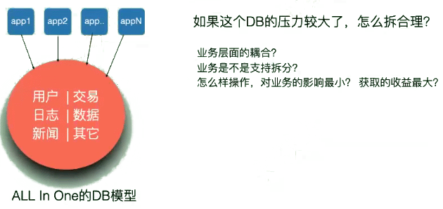
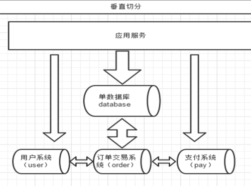
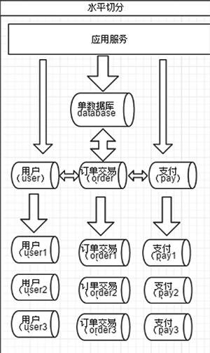
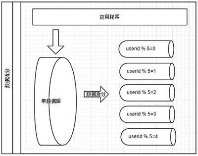
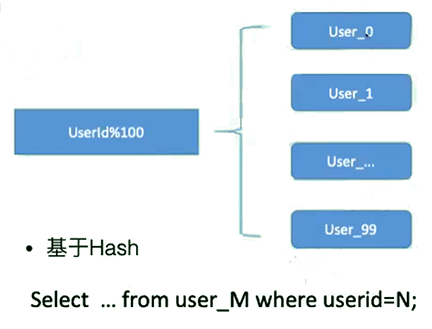
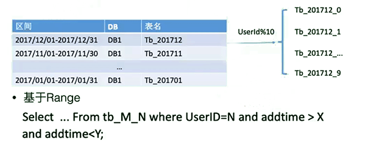
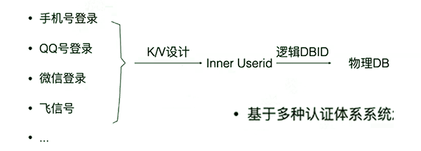
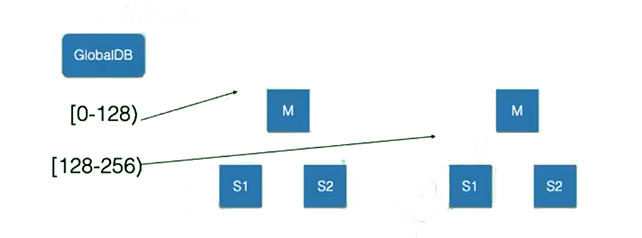

[TOC]



# 分库分表

**对业务不了解讨论分库分表就是耍流氓。**

- MySQL为什么要分库分表
- 常见的分库分表方案
- 优秀开元中间件推荐
- 分库分表后的二次扩容及缩容实现
- 业界其他优秀方案

## 数据的切分（Sharding）

数据的切分（Sharding）根据其切分规则的类型，可以分为两种切分模式。

- 垂直（纵向）切分：按照不同的表（或者Schema）来切分到不同的数据库（主机）之上。

  > 垂直切分的最大特点就是规则简单，实施也更为方便，尤其<u>****适合各业务之间的耦合度非常低**，相互影响**很小，业务逻辑非常清晰的系统****</u>。在这种系统中，可以很容易做到将不同业务模块所使用的表分拆到不同的数据库中。根据不同的表来进行拆分，对应用程序的影响也更小，拆分规则也会比较简单清晰。

- 水平（横向）切分：根据表中的数据的逻辑关系，将同一个表中的数据按照某种条件拆分到多台数据库（主机）上面。

  > 水平切分于垂直切分相比，相对来说稍微复杂一些。
  >
  > 因为要将同一个表中的不同数据拆分到不同的数据库中，对于应用程序来说，拆分规则本身就较根据表名来拆分更为复杂，后期的数据维护也会更为复杂一些。

### 垂直切分（分库）

一个数据库由很多表的构成，每个表对应着不同的业务，垂直切分是指按照业务将表进行分类，分布到不同的数据库上面，这样也就将数据或者说压力分担到不同的库上面。



- 优点：
  - 拆分后业务清晰，拆分规则明确；
  - 系统之间整合或扩展容易；
  - 数据维护简单。
- 缺点：
  - 部分业务表无法join，只能通过接口方式解决，提高了系统复杂度；
  - 受每种业务不同的限制存在单库性能瓶颈，不易数据扩展跟性能提高；
  - 事务处理复杂。

由于垂直切分是按照业务的分类将表分散到不同的库，所以有些业务表会过于庞大，存在单库读写与存储瓶颈，所以就需要水平拆分来做解决


### 水平切分（分表）

相对于垂直拆分，水平拆分不是将表做分类，而是按照某个字段的某种规则来分散到多个库之中，每个表中包含一部分数据。简单来说，我们可以将数据的水平切分理解为是按照数据行的切分，就是将表中的某些行切分到一个数据库，而另外的某些行又切分到其他的数据库中。



拆分数据就需要**定义分片规则**。

关系型数据库是行列的二维模型，拆分的第一原则是找到拆分维度。

比如：

- 从会员的角度来分析，商户订单交易类系统中查询会员某天某月某个订单，那么就需要按照会员结合日期来拆分，不同的数据按照会员ID做分组，这样所有的数据查询join都会在单库内解决；
- 从商户的角度来讲，要查询某个商家某天所有的订单数，就需要按照商户ID 做拆分；
- 是如果系统既想按会员拆分，又想按商家数据，则会有一定的困难。如何找到合适的分片规则需要综合考虑衡量。

几种典型的分片规则包括：

- 按照用户ID求模，将数据分散到不同的数据库，具有相同数据用户的数据都被分散到一个库中；

- 按照日期，将不同月甚至日的数据分散到不同的库中；

- 按照某个特定的字段求摸，或者根据特定范围段分散到不同的库中。

如图，切分原则都是根据业务找到适合的切分规则分散到不同的库，下面用用户ID 求模举例:



水平拆分（数据拆分）的优缺点

数据做了拆分有优点也有缺点。

优点：

- 拆分规则抽象好，join操作基本可以数据库做；
- 不存在单库大数据，高并发的性能瓶颈；
- 应用端改造较少；
- 提高了系统的稳定性跟负载能力。

缺点： 

- 拆分规则难以抽象；

- 分片事务一致性难以解决；

- 数据多次扩展难度跟维护量极大；

- 跨库join性能较差。

  

前面讲了垂直切分跟水平切分的不同跟优缺点，会发现每种切分方式都有缺点。

### 拆分的共同缺点

共同的特点缺点有：

- 引入分布式事务的问题；

- 跨节点Join的问题；

- 跨节点合并排序分页问题；

- 多数据源管理问题。

  > 针对数据源管理，目前主要有两种思路：
  >
  > A.   客户端模式，在每个应用程序模块中配置管理自己需要的一个（或者多个）数据源，直接访问各个数据库，在模块内完成数据的整合；
  >
  > B. 通过中间代理层来统一管理所有的数据源，后端数据库集群对前端应用程序透明；
  >
  > 

## 数据切分的经验原则

由于数据切分后数据Join 的难度，因此在拆分前尽量参考一下数据切分的经验原则：

- 第一原则：能不切分尽量不要切分。
- 第二原则：如果要切分一定要选择合适的切分规则，提前规划好。
- 第三原则：数据切分尽量通过数据冗余或表分组（Table Group）来降低跨库Join 的可能。
- 第四原则：由于数据库中间件对数据Join 实现的优劣难以把握，而且实现高性能难度极大，业务读取尽量少使用多表Join。

## 拆分架构的业务思路

<font color=red>单元化，精细治理，set化治理</font>

> 根据业务类型拆分，按业务进行拆分
>
> 拆痛点
>
>
> 冷热数据分离
>
> id Set规则分库（类hash）

## 为什么要分库分表

- 单表行数太多出现性能拐点
- 单表物理太大，单表50G以上，不方便管理
- 单实例超过1TB，不方便管理
- 单表并发太多，锁争用明显
- 实例并发太多，锁争用明显（thread_running)
- 连接数太高（上千） 

- 一般表三级B+Tree，上到4级B+Tree的话会有性能拐点。 

- 对延迟的敏感程度。

  MySQL特点是低延迟，高速响应，300ms延迟目前位置只有MySQL能达到。

 

- 不同操作的QPS性能
  - select 达到1.5w QPS时
  - insert操作约为1w QPS
  - update、delete操作约能达到3000~4000 QPS

 

如果数据库全网掉线， 重新登录，user_login_log 表就会产生严重的锁争用瓶颈——单表并发太多。

 

 

- 建议监控这两个状态：

  - thread_running这个值并发过高会造成数据库忙着线程切换，而无法提供服务。（mysql> show global status like '%thread%';）

  - 还有这个参数innodb_thread_concurrency。

 

 

# 常见分库分表方案

## 基于Hash



## 基于Range



## 基于List

- VipSet -> userid int {1001,1002, ... 9999} -> DB1 -> tb_x

- select ... from tb_x where userid = N;

  > 逻辑伪代码
  >
  > ```
  > if userid in VipSet {
  > 
  > 	return VipDB;
  > 
  > } else of (id < 20000000) {
  > 
  > 	if (id < 10000000){
  > 
  > 		return 'DB'+(id%2);
  > 
  > 	} else {
  > 
  > 			return 'DB' + ((id%2) + 2);
  > 
  > 			}
  > 
  > 	} else if (id < 40000000){
  > 
  > 		return 'DB' + (id%4)
  > 
  > 	} else {
  > 
  > 		throw new lllegalArgumentException("id out of range. id:"+id);
  > 
  > 	}
  > ```
  >
  > 
  >
  > 取模：`db_(id%2)  = db_0,db_1 ...`

  


## 大小表拆分

> 大小表，即金字塔设计
>
> - 以空间换取时间。
>
> - 数据拆分为年、月、十天、当天 ，表
>
> 查询数据，用当天、十天、月、年 的顺序逐级查询，直到查询够x条数据后为止（比如：微博条数）
>
> 写的时候会写多份（到不同级别表），年表可以按视图方式串起来（多个月union all）

- userid >1%100		-> 	DB1
  - userid % 10 > m
    - tb_20200721_m
    - tb_2020072_m
    - tb_202007_m

 


## 更复杂的情况

> 分单元治理

- 超级大V、超级用户、超级VIP怎么处理？
- 多IDC架构中如何处理分库分表
- 日志类型数据处理


# 分库分表后的二次扩容及缩容实现

> **提前规划很重要**

- 以库为单位

- 以表为单位

- 以逻辑Set为单位

  


# 分库分表示例

## 例：基于多种认证体系系统的拆分



 

## 例：基于range的拆分



 

1. 拆分后，业务上依然有user_id 作为条件。 涉及到join时，确保表在同一个库， 避免跨库跨节点join
2. 关于排序，一般会将排序单独放到独立的系统中进行，不会在主业务中进行。
3. 一般互联网业务会进行冗余写入，按照不同维度方式、数据模型，写入到不同节点中。

 

MySQL不指定拆分key时，会造成读放大，分布式节点中每一个节点都会进行一次全扫

知识点：E-R模型。

 

**分布式事务中，一般依靠消息队列来解决，而不是依靠数据库本身的事务机制来解决。**