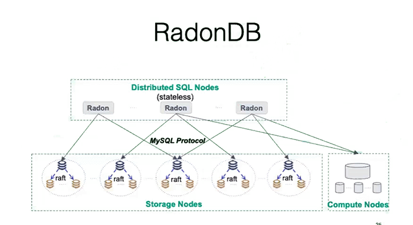

[TOC]

# 开源中间件产品


## 中间件方案

中间件方案一般有

- SQL 简单的路由

  ```
  select * from tb where user_id = xxx;  --> userid:values
  ```

- 执行计划判断：

  TDSQL\RandonDB

  - 中间件先判断计划后，优化逻辑和执行方式，再去执行。

  - 甚至比直接在MySQL还快—— 先查询出子查询，然后并行下发查询。

  ```
  select * from tb where user_id in (select id from tb2);
  
  for i in (select id from tb2)
  select * from tb1 where userid = i
  ```

  

 

## Sharding-Sphere

京东开源产品，基于Client端的Sharding-Sphere

|            | Sharding-JDBC | Sharding-Proxy | Sharding-Sidecar |
| ---------- | ------------- | -------------- | ---------------- |
| 数据库     | 任意          | MySQL          | MySQL            |
| 连接消耗数 | 高            | 低             | 高               |
| 异构语言   | 仅Java        | 任意           | 任意             |
| 性能       | 损耗低        | 损耗略高       | 损耗低           |
| 无中心化   | 是            | 否             | 是               |
| 静态入口   | 无            | 有             | 无               |

 


## mycat -- DBLE

 

 


 

## 数据迁移用的中间件

- kettle（功能更多）
- datax（性能更好）


## 做拆分的中间件

推荐

- TDSQL
- TBase
- RadonDB
- DBLE(Sharding-Sphere)


 

## TDSQL

 


 


 


 

## RadonDB



 


 


 

randonDB 看腾讯课堂视频https://ke.qq.com/course/477441?taid=7300078604077313

