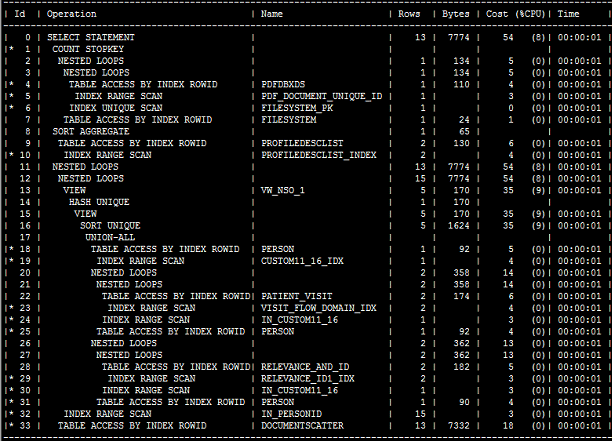
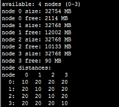
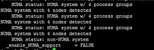

# NUMA导致的Oracle性能问题

> https://www.cnblogs.com/leohahah/p/6903721.html

**背景简介：**

Oracle版本:11.2.0.4 　　OS 版本：OEL5.8

在一次Oracle的Dataguard正常switchover过程中，遇到了一个极其诡异的问题，一条主业务的SQL语句在新主库的执行时间由之前的毫秒级别完成变成了20-60秒不等，为避免高峰业务超时必须尽快进行优化，否则只能走回退方案。

**优化过程：**

其实这个语句在之前将备库切换为snapshot备库做测试时表现是非常良好的，但是切换之后立马出了问题。在备库实际执行后获取到的执行计划与在主库一模一样，如下：



获取执行计划的语句如下：（语句出自ITPUB大神版主lfree）

```
select *
from
table(dbms_xplan.display_cursor(NVL('&1',NULL),
      NULL,
      'ALL ALLSTATS LAST PEEKED_BINDS cost partition -projection -outline &2'));
```

这里的参数1和2全部设置为空即可，此语句可以查出当前会话中上一个执行过语句的真实执行计划。

此SQL中不涉及视图，所以这个执行计划是非常好的，在主库执行也是毫秒级别的，因此同样的执行计划在备库却非常慢就很值得思考了。

接下来我利用set autot工具得到了执行此SQL后的统计信息，发现存在大量物理读。这里就很搞笑了，真实执行计划中不存在表扫描，所以出现这么多的物理读一定是回表操作特别多，那么为什么回表？显然内存不够。

于是我将SGA加大至80GB（比主库还大20GB），重启数据库再查，问题依旧。

我依然坚信是缓存的问题，那么必须要搞清为何数据未被缓存至内存，对Oracle数据库来说大多有2个原因：

1、数据太多，内存太小。

2、不是热点数据，被LRU刷出内存。

首先排除第二条，原主库60G的SGA都可以，现在80G的SGA没理由不可以。

此外注意到一个现象，v$sgainfo中的buffer pool在接近30GB时有一个很长时间的停顿，然后才慢慢增长至接近70G（剩余部分属于sharedpool等）。

于是突然想到NUMA的问题，果然：

numactl --hardware的运行结果：



这就尴尬了，在/etc/grub.conf的kernel一行后添加了numa=off，重启服务器后果然问题被解决。

事后查看数据库日志找到了如下信息：

.

因此可以确认是操作系统未关闭NUMA特性引起的（只设置数据库禁用NUMA的隐含参数是无用的，Oracle在11GR2之后已经默认禁用NUMA，但只是数据库级别）。

关于Oracle NUMA的相关信息，参考官网文档：Oracle NUMA Usage Recommendation (文档 ID 759565.1)

**名词解释：**

什么是NUMA：

NUMA模式是一种分布式存储器访问方式，处理器可以同时访问不同的存储器地址，大幅度提高并行性。 NUMA模式下，处理器被划分成多个"节点"（node）， 每个节点被分配有的本地存储器空间。  所有节点中的处理器都可以访问全部的系统物理存储器，但是访问本节点内的存储器所需要的时间，比访问某些远程节点内的存储器所花的时间要少得多。

--OK，注意这几个字：大幅提高并行性。Oracle数据库绝大多数时候进程都是串行的，除非特意设置并行度，而SQL Server也只有超过cost阈值才会并行，因此数据库服务器应该禁用NUMA。

关于NUMA更加详细的信息参考：

https://www.ibm.com/developerworks/cn/linux/l-numa/index.html

https://technet.microsoft.com/zh-cn/library/ms178144(v=sql.105).aspx

http://www.cnblogs.com/yubo/archive/2010/04/23/1718810.html