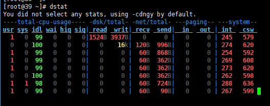
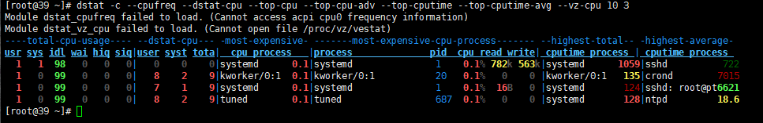

强大的性能监测工具**dstat**

本节分为以下几个部分：

dstat介绍：

> dstat命令是一个用来替换vmstat、iostat、netstat、nfsstat和ifstat这些命令的工具，是一个全能系统信息统计工具。\ 
> 安装：`yum install -y dstat`

dstat使用说明： 
 直接使用dstat，默认使用的是-cdngy参数，分别显示cpu、disk、net、page、system信息



| 分组     | 分组含义及子项字段含义                                       |
| -------- | ------------------------------------------------------------ |
| CPU状态  | CPU的使用率。显示了用户占比，系统占比、空闲占比、等待占比、硬中断和软中断情况。 |
| 磁盘统计 | 磁盘的读写，分别显示磁盘的读、写总数。                       |
| 网络统计 | 网络设备发送和接受的数据，分别显示的网络收、发数据总数。     |
| 分页统计 | 系统的分页活动。分别显示换入（in）和换出（out）。            |
| 系统统计 | 统计中断（int）和上下文切换（csw）。                         |

常见选项：

```
-c：显示CPU系统占用，用户占用，空闲，等待，中断，软件中断等信息。
-C：当有多个CPU时候，此参数可按需分别显示cpu状态，例：-C 0,1 是显示cpu0和cpu1的信息。
-d：显示磁盘读写数据大小。
-D hda,total：include hda and total。
-n：显示网络状态。
-N eth1,total：有多块网卡时，指定要显示的网卡。
-l：显示系统负载情况。
-m：显示内存使用情况。
-g：显示页面使用情况。
-p：显示进程状态。
-s：显示交换分区使用情况。
-S：类似D/N。
-r：I/O请求情况。
-y：系统状态。
--ipc：显示ipc消息队列，信号等信息。
--socket：用来显示tcp udp端口状态。
-a：此为默认选项，等同于-cdngy。
-v：等同于 -pmgdsc -D total。
--output 文件：此选项也比较有用，可以把状态信息以csv的格式重定向到指定的文件中，以便日后查看。例：dstat --output /root/dstat.csv & 此时让程序默默的在后台运行并把结果输出到/root/dstat.csv文件中。12345678910111213141516171819
```

## 命令选项

| Options              | Details                                                      |
| -------------------- | ------------------------------------------------------------ |
| -c, - -cpu           | 开启cpu统计                                                  |
| -C                   | 该选项跟cpu的编号（0~cpu核数-1,多个用都好隔开）如：0,3,total表示分别包含cpu0、cpu3和total |
| -d, - -disk          | 开启disk统计                                                 |
| -D                   | 改选跟具体的设备名（多个用逗号隔开）如：total,hda，hdb表示分别统计total、hda、hdb设备块 |
| -g, - -page          | 开启分页统计                                                 |
| -i, - -int           | 开启中断统计                                                 |
| -I 5,10              | 没弄懂呢~巴拉巴拉                                            |
| -l, - -load          | 开启负载均衡统计，分别是1m，5m，15m                          |
| -m, - -mem           | 开启内存统计，包括used，buffers，cache，free                 |
| -n, - -net           | 开启net统计，包括接受和发送                                  |
| -N                   | 该选项可以跟网络设备名多个用逗号隔开，如eth1,total           |
| -p, - -proc          | 开启进程统计，包括runnable, uninterruptible, new             |
| -r, - -io            | io开启请求统计，包括read requests, write requests            |
| -s, - -swap          | 开启swap统计，包括used, free                                 |
| -S                   | 该选项可以跟具体的交换区，多个用逗号隔开如swap1,total        |
| -t, - -time          | 启用时间和日期输出                                           |
| -T, - -epoch         | 启用时间计数，从epoch到现在的秒数                            |
| -y, - -sys           | 开启系统统计，包括中断和上下文切换                           |
| -aio                 | 开启同步IO统计 (asynchronous I/O)                            |
| -fs                  | 开启文件系统统计，包括 (open files, inodes)                  |
| -ipc                 | 开启ipc统计，包括 (message queue, semaphores, shared memory) |
| -lock                | 开启文件所统计，包括 (posix, flock, read, write)             |
| -raw                 | 开启raw统计 (raw sockets)                                    |
| -socket              | 开启sockets统计，包括 (total, tcp, udp, raw, ip-fragments)   |
| -tcp                 | 开启tcp统计，包括(listen, established, syn, time_wait, close) |
| -udp                 | 开启udp统计 (listen, active)                                 |
| -unix                | 开启unix统计(datagram, stream, listen, active)               |
| -vm                  | 开启vm统计 (hard pagefaults, soft pagefaults, allocated, free) |
| -stat                | 通过插件名称开启插件扩展，详见[命令插件](http://blog.csdn.net/yue530tomtom/article/details/75443305#t7) ：可能的内置插件为aio, cpu, cpu24, disk, disk24, disk24old, epoch, fs, int,  int24, io, ipc, load, lock, mem, net, page, page24, proc, raw, socket,  swap, swapold, sys, tcp, time,udp, unix, vm |
| -list                | 列举内置插件扩展的名称                                       |
| -a, - -all           | 是默认值相当于 -cdngy (default)                              |
| -f, - -full          | 相当于 -C, -D, -I, -N and -S                                 |
| -v, - -vmstat        | 相当于 -pmgdsc -D total                                      |
| -bw, - -blackonwhite | 在白色背景终端上改变显示颜色                                 |
| -float               | 在屏幕上的输出强制显示为浮点值（即带小数）(相反的选项设置为 - -integer) |
| -integer             | 在屏幕上的输出强制显示为整数值，此为默认值（相反的选项设置为- -float） |
| -nocolor             | 禁用颜色(意味着选项 - -noupdate)                             |
| -noheaders           | 禁止重复输出header，默认会打印一屏幕输出一次header           |
| -noupdate            | 当delay>1时禁止在过程中更新（即在时间间隔内不允许更新）      |
| -output file         | 输出结果到cvs文件中                                          |

## 命令参数

| 参数名称 | 参数描述                                           |
| -------- | -------------------------------------------------- |
| delay    | 两次输出之间的时间间隔，默认是1s                   |
| count    | 报告输出的次数，默认是没有限制，一直输出知道ctrl+c |

## 命令插件

虽然anyone可以自由的为dstat编写插件，但dstat附带大量的插件已经大大扩展其功能，下面是dstat附带插件的一个概述：

| 插件名称         | 插件描述                              |
| ---------------- | ------------------------------------- |
| -battery         | 电池电池百分比(需要ACPI)              |
| -battery-remain  | 电池剩余小时、分钟(需要ACPI)          |
| -cpufreq         | CPU频率百分比(需要ACPI)               |
| -dbus            | dbus连接的数量(需要python-dbus)       |
| -disk-util       | 显示某一时间磁盘的忙碌状况            |
| -fan             | 风扇转速(需要ACPI)                    |
| -freespace       | 每个文件系统的磁盘使用情况            |
| -gpfs            | gpfs读/写 I / O(需要mmpmon)           |
| -gpfs-ops        | GPFS文件系统操作(需要mmpmon)          |
| -helloworld      | dstat插件Hello world示例              |
| -innodb-buffer   | 显示innodb缓冲区统计                  |
| -innodb-io       | 显示innodb I / O统计数据              |
| -innodb-ops      | 显示innodb操作计数器                  |
| -lustre          | 显示lustreI / O吞吐量                 |
| -memcache-hits   | 显示memcache 的命中和未命中的数量     |
| -mysql5-cmds     | 显示MySQL5命令统计                    |
| -mysql5-conn     | 显示MySQL5连接统计                    |
| -mysql5-io       | MySQL5 I / O统计数据                  |
| -mysql5-keys     | 显示MySQL5关键字统计                  |
| -mysql-io        | 显示MySQL I / O统计数据               |
| -mysql-keys      | 显示MySQL关键字统计                   |
| -net-packets     | 显示接收和发送的数据包的数量          |
| -nfs3            | 显示NFS v3客户端操作                  |
| -nfs3-ops        | 显示扩展NFS v3客户端操作              |
| -nfsd3           | 显示NFS v3服务器操作                  |
| -nfsd3-ops       | 显示扩展NFS v3服务器操作              |
| -ntp             | 显示NTP服务器的ntp时间                |
| -postfix         | 显示后缀队列大小(需要后缀)            |
| -power           | 显示电源使用量                        |
| -proc-count      | 显示处理器的总数                      |
| -rpc             | 显示rpc客户端调用统计                 |
| -rpcd            | 显示RPC服务器调用统计                 |
| -sendmail        | 显示sendmail队列大小(需要sendmail)    |
| -snooze          | 显示每秒运算次数                      |
| -test            | 显示插件输出                          |
| -thermal         | 热系统的温度传感器                    |
| -top-bio         | 显示消耗块I/O最大的进程               |
| -top-cpu         | 显示消耗CPU最大的进程                 |
| -top-cputime     | 显示使用CPU时间最大的进程(单位ms)     |
| -top-cputime-avg | 显示使用CPU时间平均最大的进程(单位ms) |
| -top-io          | 显示消耗I/O最大进程                   |
| -top-latency     | 显示总延迟最大的进程(单位ms)          |
| -top-latency-avg | 显示平均延时最大的进程(单位ms)        |
| -top-mem         | 显示使用内存最大的进程                |
| -top-oom         | 显示第一个被OOM结束的进程             |
| -utmp            | 显示utmp连接的数量(需要python-utmp)   |
| -vmk-hba         | 显示VMware ESX内核vmhba统计数         |
| -vmk-int         | 显示VMware ESX内核中断数据            |
| -vmk-nic         | 显示VMware ESX内核端口统计            |
| -vz-io           | 显示每个OpenVZ请求CPU使用率           |
| -vz-ubc          | 显示OpenVZ用户统计                    |
| -wifi            | 无线连接质量和信号噪声比              |

## 常用插件

| 插件名称    | 插件描述                   |
| ----------- | -------------------------- |
| -disk-util  | 显示某一时间磁盘的忙碌状况 |
| -freespace  | 显示当前磁盘空间使用率     |
| -proc-count | 显示正在运行的程序数量     |
| -top-bio    | 显示块I/O最大的进程        |
| -top-cpu    | 显示CPU占用最大的进程      |
| -top-io     | 显示正常I/O最大的进程      |
| -top-mem    | 显示占用最多内存的进程     |

案例： 
 监察cpu情况 -c 
 

监察磁盘 -d

```
dstat 
--disk-tps  #每秒每个磁盘事务(tps)统计
--disk-util #磁盘利用率百分比
-d 分别显示磁盘的读、写总数。1234
```

推荐链接:

linux命令 dstat：https://blog.csdn.net/yue530tomtom/article/details/75443305\ 
dstat命令：http://man.linuxde.net/dstat

dstat源码：https://github.com/dagwieers/dstat/blob/master/dstat#L602