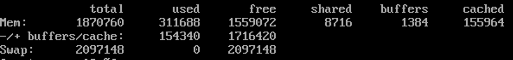

### 1，free命令

> -b/-k/-m:  以Byte/KB/MB为单位显示内存使用情况。
> -o:  不显示缓冲区调节列。
> -s:  持续观察内存使用状况
> -t 显示内存总和列

执行free之后各字段说明

系统的总物理内存是18270760KB，但系统当前真正可用的内存小并不是第一行free标记的1559072KB，它仅代表没被分配的内存。

第一行 Mem :表示物理内存的缓存统计

> total:表示物理内存总量
> used:表示总计分配给缓存（包含buffers与cach）使用的数量，但其中可能有部分缓存并未实际使用。
> free:未被分配的内存
> shared:共享内存
> bufers:系统已分配但未被使用的buffers数量
> cached:系统已分配但未被使用的cache数量

buffer是指作为buffer cache的内存，即块设备的读写缓冲区，cache是指作为page cache的内存，即文件系统的cache。如果cache的值很大，则说明cache主的文件数量很多。如果频繁访问到的文件都能被cache住，那么磁盘的读I/O必定会非常小，但是过大的文件cache可能会影响到内存的使用效率，导致操作系统上其他进程的内存不够大，甚至还会使用到swap空间。

> total =used + free

第二行  -/+ buffers/cache  :表示物理内存的缓存统计

> used:也就是第一行中的userd-buffers-cached，也是实际使用的内存总量
> free:未被使用的buffers与cache和未被分配的内存之和=第一行的（buffers+cached+free），这就是系统当前实际可用的内存。

第三行 Swap:表示硬盘上交换分区的使用情况。

**第二行所指的是从应用程序的角度来看，对应用程序来讲，buffers/cache是等同可用的，当程序使用内存时，buffers/cache会很快地被使用。从应用程序的角度来说，可用内存=第一行的（buffers+cached+free）**
 **第一行的Mem是对操作系统来讲的，buffers/cache都是属于被使用的，所以它认为free只有1559072KB**

我们一般理解的free输出应该从应用程序的角度去理解，应该管制第二行的free输出，因为那些buffers和cache是可能被重用的。
