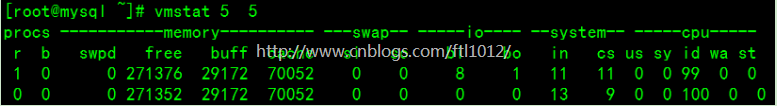
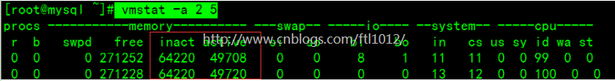
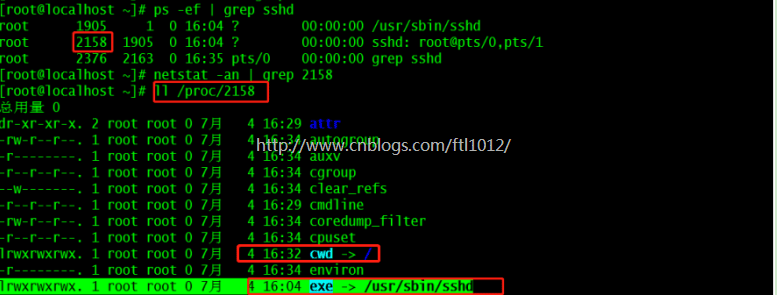

vmstat是Virtual Meomory Statistics（虚拟内存统计）的缩写，可对操作系统的虚拟内存、进程、CPU活动进行监控。是对系统的整体情况进行统计，不足之处是无法对某个进程进行深入分析。  

### 物理内存和虚拟内存区别

  我们知道，直接从物理内存读写数据要比从硬盘读写数据要快的多，因此，我们希望所有数据的读取和写入都在内存完成，而内存是有限的，这样就引出了物理内存与虚拟内存的概念。  

  物理内存就是系统硬件提供的内存大小，是真正的内存，相对于物理内存，在linux下还有一个虚拟内存的概念，虚拟内存就是为了满足物理内存的不足而提出的策略，它是利用磁盘空间虚拟出的一块逻辑内存，用作虚拟内存的磁盘空间被称为交换空间（**Swap Space**）。  

​    作为物理内存的扩展，linux会在物理内存不足时，使用交换分区的虚拟内存，更详细的说，就是内核会将暂时不用的内存块信息写到交换空间，这样以来，物理内存得到了释放，这块内存就可以用于其它目的，当需要用到原始的内容时，这些信息会被重新从交换空间读入物理内存。  

  linux的内存管理采取的是分页存取机制，为了保证物理内存能得到充分的利用，内核会在适当的时候将物理内存中不经常使用的数据块自动交换到虚拟内存中，而将经常使用的信息保留到物理内存。  

要深入了解linux内存运行机制，需要知道下面提到的几个方面：  

  首先，Linux系统会不时的进行页面交换操作，以保持尽可能多的空闲物理内存，即使并没有什么事情需要内存，Linux也会交换出暂时不用的内存页面。这可以避免等待交换所需的时间。  

​    其次，linux进行页面交换是有条件的，不是所有页面在不用时都交换到虚拟内存，linux内核根据”最近最经常使用“算法，仅仅将一些不经常使用的页面文件交换到虚拟内存，有时我们会看到这么一个现象：linux物理内存还有很多，但是交换空间也使用了很多。其实，这并不奇怪，例如，一个占用很大内存的进程运行时，需要耗费很多内存资源，此时就会有一些不常用页面文件被交换到虚拟内存中，但后来这个占用很多内存资源的进程结束并释放了很多内存时，刚才被交换出去的页面文件并不会自动的交换进物理内存，除非有这个必要，那么此刻系统物理内存就会空闲很多，同时交换空间也在被使用，就出现了刚才所说的现象了。关于这点，不用担心什么，只要知道是怎么一回事就可以了。  

   最后，交换空间的页面在使用时会首先被交换到物理内存，如果此时没有足够的物理内存来容纳这些页面，它们又会被马上交换出去，如此以来，虚拟内存中可能没有足够空间来存储这些交换页面，最终会导致linux出现假死机、服务异常等问题，linux虽然可以在一段时间内自行恢复，但是恢复后的系统已经基本不可用了。  

  因此，合理规划和设计linux内存的使用，是非常重要的。  

### 虚拟内存原理

   在系统中运行的每个进程都需要使用到内存，但不是每个进程都需要每时每刻使用系统分配的内存空间。当系统运行所需内存超过实际的物理内存，内核会释放某些进程所占用但未使用的部分或所有物理内存，将这部分资料存储在磁盘上直到进程下一次调用，并将释放出的内存提供给有需要的进程使用。  

  在Linux内存管理中，主要是通过“调页Paging”和“交换Swapping”来完成上述的内存调度。调页算法是将内存中最近不常使用的页面换到磁盘上，把活动页面保留在内存中供进程使用。交换技术是将整个进程，而不是部分页面，全部交换到磁盘上。  

  分页(Page)写入磁盘的过程被称作Page-Out，分页(Page)从磁盘重新回到内存的过程被称作Page-In。当内核需要一个分页时，但发现此分页不在物理内存中(因为已经被Page-Out了)，此时就发生了分页错误（Page Fault）。  

​    当系统内核发现可运行内存变少时，就会通过Page-Out来释放一部分物理内存。尽管Page-Out不是经常发生，但是如果Page-out频繁不断的发生，直到当内核管理分页的时间超过运行程式的时间时，系统效能会急剧下降。这时的系统已经运行非常慢或进入暂停状态，这种状态亦被称作thrashing(颠簸)。  

### 常见命令展示

```
vmstat 5 5 【在5秒时间内进行5次采样】
```



**字段说明：** 

Procs（进程）：

>  r: 运行队列中进程数量 
>
>  b： 等待IO的进程数量

Memory（内存）：

>  swpd: 使用虚拟内存大小 
>
>  free: 可用内存大小 
>
>  buff: 用作缓冲的内存大小 
>
>  cache: 用作缓存的内存大小

Swap： 

 si: 每秒从交换区写到内存的大小

>  so: 每秒写入交换区的内存大小

IO：（现在的Linux版本块的大小为1024bytes）

>  bi: 每秒读取的块数 
>
>  bo: 每秒写入的块数

系统：

> in: 每秒中断数，包括时钟中断。【interrupt】 
>
> cs: 每秒上下文切换数。    【count/second】

CPU（以百分比表示）：

>  us: 用户进程执行时间(user time) 
>
>  sy: 系统进程执行时间(system time) 
>
>  id: 空闲时间(包括IO等待时间),中央处理器的空闲时间 。以百分比表示。 
>
>  wa: 等待IO时间

**备注：** 

> 如果r经常大于4，id经常少于40，表示cpu的负荷很重。 
>
> 如果bi，bo长期不等于0，表示内存不足。 
>
> 如果disk经常不等于0，且在b中的队列大于3，表示io性能不好。 
>
> Linux在具有高稳定性、可靠性的同时，具有很好的可伸缩性和扩展性，能够针对不同的应用和硬件环境调整，优化出满足当前应用需要的最佳性能。因此企业在维护Linux系统、进行系统调优时，了解系统性能分析工具是至关重要的。 
>
> 显示活跃和非活跃内存 
>
> vmstat -a 2 5 【-a 显示活跃和非活跃内存,所显示的内容除增加inact和active】 
>
> 
>
> **显示从系统启动至今的fork数量** 
>
> vmstat -f 【 **linux下创建进程的系统调用是****fork**】 
>
> 
>
> **说明:** **信息****是从/proc/stat中的processes字段里取得的** 
>
> **查看内存使用的详细信息** 
>
> vmstat -s  【**显示内存相关统计信息及多种系统活动数量**】 
>
> 
>
> **说明：**这些信息的分别来自于/proc/meminfo,/proc/stat和/proc/vmstat 
>
> **查看磁盘的读/写** 
>
> vmstat -d 【**查看磁盘的读写】** 
>
> 
>
> **说明：**这些信息主要来自于/proc/diskstats. 
>
> **查看/dev/sda1磁盘的读/写** 
>
> **vmstat -p /dev/sda1** **【****显示指定磁盘分区统计信息****】** 
>
> 
>
> **说明：**这些信息主要来自于/proc/diskstats. 
>
> reads:来自于这个分区的读的次数。 
>
> read sectors:来自于这个分区的读扇区的次数。 
>
> writes:来自于这个分区的写的次数。 
>
> requested writes:来自于这个分区的写请求次数。 
>
> **查看系统的slab信息** 
>
> **vmstat -m** 
>
> **说明：**这些信息主要来自于**/proc/slabinfo** 
>
> slab:由于内核会有许多小对象，这些对象构造销毁十分频繁，比如i-node，dentry，这些对象如果每次构建的时候就向内存要一个页(4kb),这样就会非常浪费，为了解决这个问题，就引入了一种新的机制来处理在同一个页框中如何分配小存储区，而slab可以对小对象进行分配,这样就不用为每一个对象分配页框，从而节省了空间，内核对一些小对象创建析构很频繁，slab对这些小对象进行缓冲,可以重复利用,减少内存分配次数。 
>
> **查看进程路径**
>
> [root@localhost ~]# netstat -an | grep 2158 
>
> [root@localhost ~]# ll /proc/2158 
>
> 
>
> cwd符号链接的是进程运行目录； 
>
> exe符号连接就是执行程序的绝对路径； 
>
> cmdline就是程序运行时输入的命令行命令； 
>
> environ记录了进程运行时的环境变量； 
>
> fd目录下是进程打开或使用的文件的符号连接。 
>
> lsof -p 2158 
>
> 