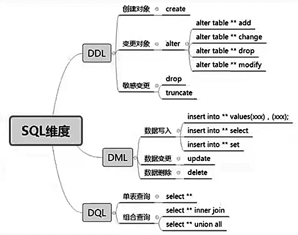
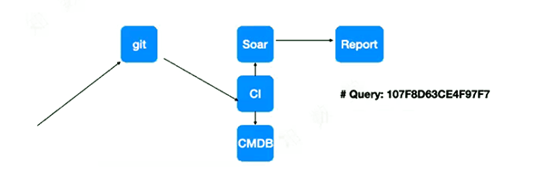

# SQL审核、工具

[TOC]

## 为什么需要SQL审核

- 期待通过SQL审核解决的问题
  - 拒瞎干，使规范落地
  - 拒绝将性能隐患带入生产环境
- 实际的困难
  - 工作量巨大，落地难度大。随着时间的积累，审核的规则会越来越多，必然面临审核自动化。
  - 无法可视化，需要面传口授

## SQL审核的建议、工具

- 开源的自动SQL审核工具有：Inception(via 去哪儿)，SQLAdvisor(via 美团)，Soar(via 小米)等。 目前依然在维护的只有Soar。

- 可以用SQL审核工具、slowlog配合策略来消除慢SQL

  

## 环境集成建议

- CI工具处理时使用py脚本将SQL传给Soar，并将低于90 甚至95分的SQL全部呈现在report中。

- 可以尝试动手，用py获取git项目的query file，并将每条SQL输出给soar，并得出SQL指纹和评分。
