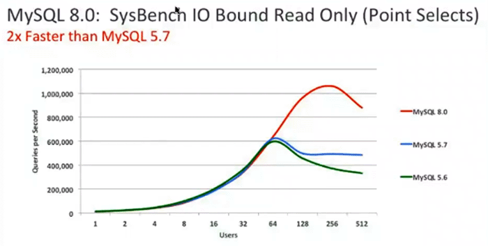

# 8.0中InnoDB新特性

- 数据字典采用InnoDB引擎存储，支持DDL原子性、crash safe，metadata管理更完善
- 快速在线加新列
- 并行redo log，并提升redo log的IO性能
- 新增倒序索引、不可见索引
- 增强CBO特性
- 消除了全局的buffer pool mutex
- 自增ID持久化
- 行锁增加skip locked和nowait特性选项
- 新增事务CATS特性，大大提升事务性能
- memcached plugin增强
- 增强json性能、功能
- 新增智能选项 innodb_dedicated_server

## 优化器新特性

- 不可见索引
- 倒序索引
- 8.0.13开始支持函数索引、表达式索引
- nowait\skip locked
- join-order optimizer hints
- variable-setting hint
- resource group hint
- 直方图
- 8.0.18开始支持hash join

## 内存临时表

- 基于内存的临时表（in-memory internal temporary tables），引擎由默认的memory改成了新的temptable引擎
- 默认内存相对于tmp-table-size，从16M提升到1G
- 对varchar、varbinary的处理效率更高
- internal_tmp_mem_storage_engine=temptable|memory
- temptable_max_ram=1GB

## 8.0 vs 5.7 性能对比

