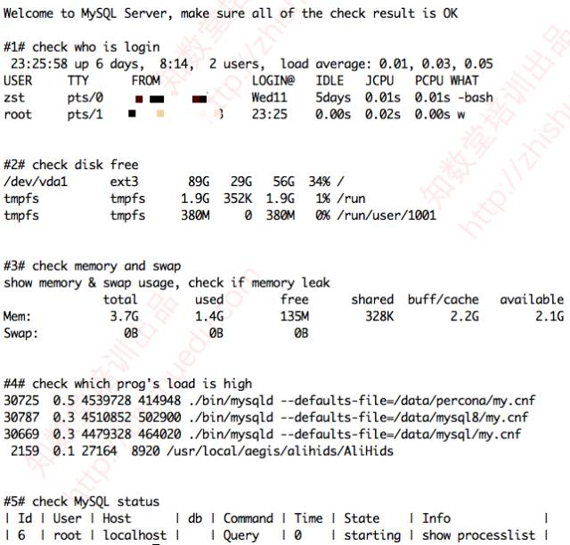

导读

DBA登入后，应该关注系统的几个基本状态，做到心中有数。


虽然现在都在推广自动化运维，不过有些时候还是需要登入到服务器去做些事情。那么，在有限的几次登入服务器机会中，作为DBA应该关注哪些事情呢？


1、检查除了自己以外，还有谁也登入到服务器上

一方面是查看还有哪些管理员在服务器上，自己的某些操作是否会影响到对方。比如有些洁癖重度患者会把 /tmp 下的临时文件删掉，或者清除一些看到的临时文件，而这些文件没准就是其他管理员临时生成的。


另外，这个习惯也能帮助我们消除一些安全隐患，比如看到某些管理员从不该被允许的远程IP登入进来，甚至是有些管理员直接从本地tty终端登入进来工作后，忘记关闭终端，直接关闭显示器，这种情况下在IDC值守的人，接上键盘就可以长驱直入无需账号密码。就像下面这样的：


第一列表示登录用户名；第二列表示登录终端，**tty表示本地终端**，pts表示远程终端；第三列表示登录时间、IP地址。


遇到这种情况，先找到这个login bash的进程ID，用 lsof 查看是否有打开文件来确认这个进程当前没有进行重要操作，确认没问题的话，就可以把这个进程给 kill 了，这个登入也自然会退出。


2、检查系统整体负载以及整体状况

了解系统当前负载情况，对比之前同时段登入时的系统负载情况，直观感觉系统负载是否有大幅波动，或者判断系统负载是否超过平均的负载值，以便及时处理。


3、找到消耗CPU、内存资源最多的进程

如果当前系统运行多个mysqld进程，或者MySQL和Nginx、PHP、java等混跑的话，可以查看哪个进程消耗较多资源。

如果是某个mysqld进程消耗的CPU长期超过100%，那么10有89的有可能是因为当前执行的SQL没有索引，或者索引使用不当导致。


4、查看MySQL中是否有耗时较久的请求

查看当前MySQL中是否有某些状态持续较长时间，比如Sending data、Coping to tmo table、Creating sort index等状态，一旦处于这些状态的SQL经常出现，那么几乎肯定是需要进行优化了。


说了这么多，肯定有同学按捺不住了。别着急嘛，老叶已经把这些关注点都整到一个shell脚本里了，大家可以访问我的github查看，也欢迎补充，说说你们登入服务器后，最关注哪些东西，并且会先做哪些事情。


github地址：https://github.com/zhishutech/mysqldba/blob/master/scripts/dba_login.sh


我们可以把这个脚本放在DBA工具专用目录下，然后在 /etc/profile 中增加类似下面这样一行，每次登入后就都会调用脚本执行了：

```
[root@zhishutang ~]# cat /etc/profile
# System wide environment and startup programs, for login setup
# Functions and aliases go in /etc/bashrc
...
...

unset i
unset -f pathmunge

. /dba/tools/dba-login.sh
```

我之前写过类似脚本，但找不到了，这是昨晚临时随手重写了个，还有很多不完善的。也当做是抛砖引玉了，希望大家继续来补充完善。


下面是登入MySQL服务器后的提示




祝大家玩的愉快 ：）

select connection_id();