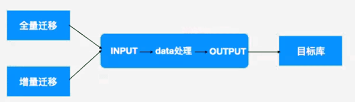
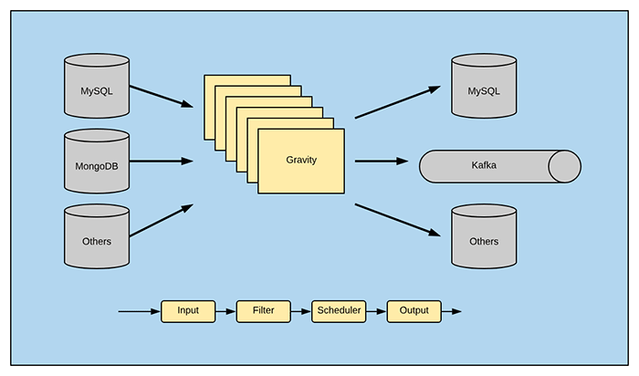
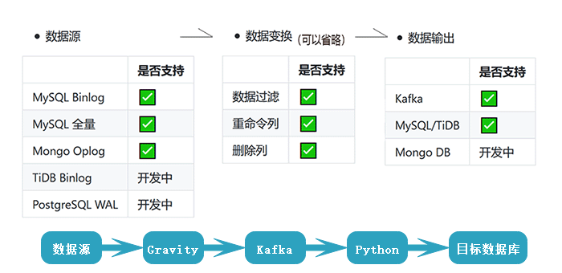

[TOC]

# DTS 数据迁移服务

- clickhouse 迁移， logstash， gh-ost  ， binlog2sql 搞定后，底层搞懂，DTS基本就搞懂了，因为原理相同。

- DTS更多是数据接口适配及版本适配。

- 常见同步场景

  > 大数据总线：发送MySQL binlog，mongo oplog的数据变更到kafka供下游消费
  >
  > 单向数据同步： MySQL to MySQL 的全量、增量同步
  >
  > 双向数据同步：MySQL to MySQL 的双向增量同步，同步过程中可以防止循环复制
  >
  > 分库分表到合库的同步：MySQL 分库分表 to 合并库的同步，可以指定源表和目标表的对应关系

## 为什么需要数据迁移服务

- 数据源异构
  - MySQL --> 大数据
  - Oracle --> MySQL
- 公司整合
  - 两个公司整合，业务数据统一
- 公司内部数据库异构
  - OLTP和OLAP的混合
- 数据归档需求


## 数据迁移原理




> 1. 以batch为单元
> 2. 通过表主键来标识数据。表中（要迁移的数据的）最大主键值为max_pk。
> 3. 每batch包含固定数据量，每次处理一个batch，因此有min(pk)和max(pk)
> 4. `select * from tb where pk > min_pk limit batch;`  获取一个batch的数据量
> 5. 每次获取完后，通过 `select max(pk) "c_max_pk"from ( select pk from tb where pk > min_pklimit batch) t;` 获取本次batch中最大主键值，然后与max_pk进行对比，如果max_pk == c_max_pk ， 则说明迁移完成。如果小于max_pk，说明需要继续迁移。
>
> 具体逻辑伪代码为：
>
> ```
> select max(pk) from tb;  --> max_pk
> select min(pk) from tb;  --> min_pk
> select max(pk) from (select pk from tb where pk >= min_pk limit batch); --> c_max_pk
> 
> select * from tb where pk >= min_pk limit batch;
> 
> select c_max_pk == max_pk ;     # 如果不相等，说明数据没读完，需要继续。
> 
> c_pk = c_max_pk
> select max(pk) from (select pk from tb where pk >= c_pk limit batch); --> c_max_pk
> ...
> ...
> 
> while
> 	select c_max_pk == max_pk ; return  true;
> 	数据读取完毕。
> 
> 全量迁移就是这么玩的。
> ```
>
> 如果未明确迁移表，则迁移全库：
>
> > 获取全库pk：
> >
> > `show tables -> list -> information_schema.indexes -> pk`

- 如果迁移过程中，对源库上已完成迁移的数据部分发生update，怎么办？

  > 如果迁移会话的事务隔离级别是RR，没什么问题；如果不是RR，会有问题。
  >
  > 建议，对静止的数据库进行全量迁移。
  >
  > - 如何保证静止数据库？
  >   - 可以对源库通过xb做备份，然后恢复出来，再对恢复出来的库进行全量迁移。

- 增量迁移的场景下，模拟为从库即可。
- 迁移过程中，如果源库发生变化， 新事务会被执行（因为GITD更加新），新数据会覆盖老旧数据，达到最终一致性，而不会像MySQL复制一样出现冲突。

## 业界DTS工具特点

| 名称     | 全量 | 增量                          | 点评                                                         |
| -------- | ---- | ----------------------------- | ------------------------------------------------------------ |
| kettle   | 是   | 基于SQL增量迁移               | 基于UI，在ETL社区使用广泛。<br>腾讯云Oracle迁移MySQL的推荐工具。 |
| logstash | 是   | 基于SQL增量迁移               | 支持数据源丰富                                               |
| dataX    | 是   | 基于SQL增量迁移               | 支持数据源丰富，默认driver不支持8.0                          |
| yugong   | 否   | 基于SQL增量迁移，日志解析同步 | 支持数据源丰富，功能超级强大，要求定制能力高。<br>比较重，但是很先进 |
| grviaty  | 是   | 基于SQL增量迁移，日志解析同步 | MySQL、PG、MongoDB、ES                                       |
| python   |      | 自己说了算，自己写，自己实现  |                                                              |

### DTS工具选择策略

- 满足能做事情时，选择简单的那个
- 如果可以的话，自主实现


### 业界DTS核心思路

> SQL Server to MySQL : 飞信、京东、沪江等等
>
> Oracle to MySQL : 淘宝 等等

- 整体流程：

  > 全备份之前先建立trigger，再全备。增量阶段用表反查数据，对比迁移目标做更新，更新后删除记录表条目，直到记录表为空。

  1. 针对要迁移的表建立trigger
  2. 做源库的全备份
  3. 针对全备份数据做全量迁移
  4. 利用trigger记录的表，做增量迁移
  5. 数据源切换，冻结源库，目标库触发器开始工作
  6. 更改配置，启用目标库
  7. 切换入流量
  8. 回迁

- 核心：

  基于trigger记录变化的pkid、变更时间等信息

  ```
  tb_1 (pkid,c1,c2,c3...)
  tb_1_incr(pkid,add_time,update_time)
  
  
  insert / update / delete  --> get pk --> insert into tb_1_incr values(pkid,time...)
  ```

- 获取增量：

  从tb_incr表中获取到pkid，将目标库中符合这些pkid的数据删除，并从源库中获取这些pkid的数据，重新写入目标库。

  

## gravity迁移原理及实现

> gravity ， 摩拜单车。 刚开始做MySQL 2 TiDB ， 后来放弃了。后来用作美团和摩拜的合并。在TiDB底层数据复制框架基础上实现。
>
> 项目地址：https://github.com/moiot/gravity

- 三种迁移模式：
  - replication
  - batch
  - stream

- 迁移期间会产生_gravity库，库中有表gravity_position。full迁移期间，会有数据记录迁移位置等信息。

  ```
  position:{"current_position":{	
  				"binlog-name":"",
  				"binlog-grid":""},
  		  "start_position":{
  		  		"binlog-name":"",
  				"binlog-grid":""}
  		  }
  ```

- 安装

  ```
  # git clone https://github.com/moiot/gravity.git
  # export GOPROXY="https://goproxy.cn"
  # cd gravity/    
  # ls
  ...
  # make
  # ls bin/
  gravity
  ```

- 运行

  ```
  ./gravity --config config.toml
  ```

- 原理
  - 全量：按表，基于主键，分批扫描
  - 增量：调用TiDB的同步组建实现，即：模拟为一个slave读取主库的binlog。
  - filter可以省略
  - scheduler，配置并行度，否则一条一条迁移。
  - scheduler针对output，并且type只支持"batch-table-scheduler"那一种。





- 配置

  > ### 配置文件
  >
  > 单进程的 Gravity 使用配置文件来配置。
  >
  > Gravity 是基于插件的微内核模式，各个插件有自己独立的配置。目前 Gravity 支持以 `toml` 格式和 `json` 格式作为配置文件来配置。
  >
  > 本节的描述中，为了方便起见，统一使用 `toml` 格式的配置文件描述配置规则。
  >
  > https://github.com/moiot/gravity/blob/master/docs/2.0/02-config-index.md

  - 示例配置

    - [Input 配置](https://github.com/moiot/gravity/blob/master/docs/2.0/03-inputs.md)
    - [Output 配置](https://github.com/moiot/gravity/blob/master/docs/2.0/04-outputs.md)
    - [Filter 配置](https://github.com/moiot/gravity/blob/master/docs/2.0/05-filters.md)
    - [Scheduler 配置](https://github.com/moiot/gravity/blob/master/docs/2.0/06-scheduler.md)
    - [Matcher 配置](https://github.com/moiot/gravity/blob/master/docs/2.0/07-matcher-en.md)

    ```
    [input]
    type = "mysql"
    mode = "stream"
    
    #
    # 源端 MySQL 的连接配置
    # - 必填
    #
    [input.config.source]
    host = "127.0.0.1"
    username = "_gravity"
    password = ""
    port = 3306
    max-open = 20 # 可选，最大连接数
    max-idle = 20 # 可选，最大空闲连接数，建议与 max-open 相同
    
    [output]
    type = "mysql"
    
    [output.config]
    enable-ddl = true # 当前支持 create & alter table 语句。库表名会根据路由信息调整。
    
    [output.config.target]
    host = "127.0.0.1"
    username = ""
    password = ""
    port = 3306
    max-open = 20 # 可选，最大连接数
    max-idle = 20 # 可选，最大空闲连接数，建议与 max-open 相同
    
    #
    # 目标端 MySQL 路由配置；match-schema, match-table 支持 * 匹配
    # - 必填
    #
    [[output.config.routes]]
    match-schema = "test"
    match-table = "test_source_table_*"
    target-schema = "test"
    target-table = "test_target_table"
    
    #
    # batch-table-scheduler 配置
    # - 可选
    #
    [scheduler]
    type = "batch-table-scheduler"
    
    [scheduler.config]
    # 默认值 100
    nr-worker = 100
    
    # 默认值 1
    batch-size = 1
    
    # 默认值 1024
    queue-size = 1024
    
    # 默认值 10240
    sliding-window-size = 10240
    ```

## gravity使用场景

1. 数据库异构迁移，如 MySQL --> ES , MySQL --> Kafka

   在复杂的场景中，建议写入kafka然后利用自定义程序，或是logstash类工具来消费kafka中的内容

2. 业务架构整理，多数据源拆分或合并
3. 业务整合

- 公司要求把原来没有拆分的表，按Hash拆分拆成10张，怎么做，有什么工具？
  - python 对id和100取模就行了。 也可以用gravity+dble做hash取模写到dble，拆分100张（远古时期）。
  - 现今的分库分表工具非常多，可以试试randonDB

## DataX全量迁移讲解

> DataX 是阿里巴巴集团内被广泛使用的离线数据同步工具/平台，实现包括  MySQL、Oracle、SqlServer、Postgre、HDFS、Hive、ADS、HBase、TableStore(OTS)、MaxCompute(ODPS)、DRDS 等各种异构数据源之间高效的数据同步功能。
>
> 项目地址：https://github.com/alibaba/DataX


## 数据库如何上云

1. 尽可能的使用复制升级
2. 使用云上的DTS服务


回头探索一下binlog2sql