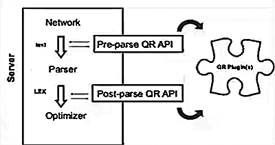

[TOC]

# 利用query rewrite plugin 做应急的SQL优化和降级

> 5.7开始引入

- 基于该工具

  - 官方的审计
  - firewall


## 原理图



## 启用方式

```
[11:56:37] root@ms51:~ # cd $basedir/share 

[11:57:05] root@ms51:share # ls -l *rew*
-rwxr-xr-x 1 mysql mysql 2236 May 19 16:46 install_rewriter.sql    -- 启用脚本
-rwxr-xr-x 1 mysql mysql 1258 May 19 16:46 uninstall_rewriter.sql  -- 禁用脚本

[11:57:13] root@ms51:share # mysql -S /data/mysql/mysql3306/tmp/mysql.sock < ./install_rewriter.sql 

mysql> show global variables like '%rewrite%';
+------------------+-------+
| Variable_name    | Value |
+------------------+-------+
| rewriter_enabled | ON    |
| rewriter_verbose | 1     |
+------------------+-------+
2 rows in set (0.00 sec)

/* 
[mysqld]
rewrite_enabled=ON
*/
```


## 使用方式

案例：防范类型溢出导致的不确定结果。

- 表结构及数据

  ```
  mysql> show create table kick\G
  *************************** 1. row ***************************
         Table: kick
  Create Table: CREATE TABLE `kick` (
    `id` int(11) NOT NULL AUTO_INCREMENT,
    `numbers` varchar(255) DEFAULT NULL,
    PRIMARY KEY (`id`)
  ) ENGINE=InnoDB DEFAULT CHARSET=utf8mb4
  1 row in set (0.01 sec)
  
  # 2^64 = 18446744073709551616
  # max bigint =  18446744073709551615
  
  mysql> select * from kick ;
  +----+----------------------------+
  | id | numbers                    |
  +----+----------------------------+
  |  1 | 18446744073709551615       |
  |  2 | 28446744073709551615       |
  |  3 | 38446744073709551615       |
  |  4 | 48446744073709551615       |
  |  5 | 58446744073709551615       |
  |  6 | 68446744073709551615       |
  |  7 | 78446744073709551615       |
  |  8 | 88446744073709551615       |
  |  9 | 98446744073709551615       |
  | 10 | 4844674407370955161500000  |
  | 11 | 4844674407370955161500001  |
  | 12 | 4844674407370955161500002  |
  | 13 | 4844674407370955161500003  |
  | 14 | 48446744073709551615000040 |
  +----+----------------------------+
  14 rows in set (0.00 sec)
  ```

- 数字超出bigint后结果并不准确——类型溢出

  ```
  mysql> select * from kick where numbers  = 4844674407370955161500000;
  +----+---------------------------+
  | id | numbers                   |
  +----+---------------------------+
  | 10 | 4844674407370955161500000 |
  | 11 | 4844674407370955161500001 |
  | 12 | 4844674407370955161500002 |
  | 13 | 4844674407370955161500003 |
  +----+---------------------------+
  4 rows in set (0.00 sec)
  ```

- 如何防范类型溢出？

  - 用单引号， 避免类型转换，直接以string方式传入varchar或char或int。

    ```
    mysql> select * from kick where numbers  = '4844674407370955161500000';
    
    +----+---------------------------+
    | id | numbers                   |
    +----+---------------------------+
    | 10 | 4844674407370955161500000 |
    +----+---------------------------+
    1 row in set (0.00 sec)
    ```

  - 使用rewrite plugin 实现转换

    ```
    mysql> insert into query_rewrite.rewrite_rules(
          pattern,
          pattern_database,
          replacement) 
        values (
          "select * from kick where numbers=?",
          "kk",
          "select * from kick where numbers=cast(? as char character set utf8)"
          );
    Query OK, 1 row affected (0.25 sec)
    
    # 调用以生效
    mysql> call query_rewrite.flush_rewrite_rules();
    Query OK, 0 rows affected, 1 warning (0.12 sec)
    
    mysql> select * from kick where numbers  = 4844674407370955161500000;
    +----+---------------------------+
    | id | numbers                   |
    +----+---------------------------+
    | 10 | 4844674407370955161500000 |
    +----+---------------------------+
    1 row in set, 1 warning (0.00 sec)
    ```


