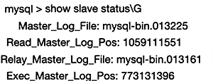
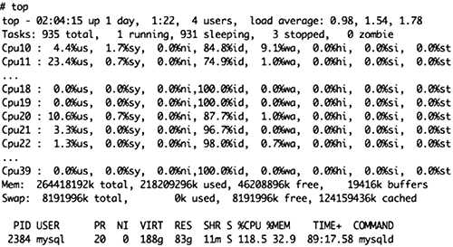
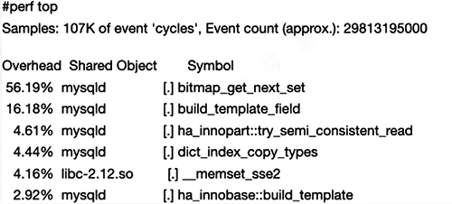

# 通过案例，学习perf识别MySQL性能瓶颈点

> perf 来自软件包 perf 。

案例：MySQL主从复制慢

- 现象

  主从复制延迟很大。一个binlog尺寸为1GB，差了64个binlog(13225-13161=64)，也就是差了64GB的binlog！

  

  

- 排查CPU、I/O

  CPU压力、I/O压力都不大

  


- 疑问：当前数据库在忙什么？

- 用perf查看一下

  

- 通过检索版本源码，定位到`bitmap_get_next_set`的用途

  > 建议本地留存一份版本源码，然后用`grep -r xxx` 的方式检索关键字。

  检索结果：发现代码和partition有关系

  > <font size=2> % grep -rn bitmap_get_next_set * </font>
  > <font size=2> include/my_bitmap.h:66:extern uint bitmap_get_next_set(const MY_BITMAP *map, uint bitmap_bit);  </font>
  > <font size=2> mysys/my_bitmap.c:613:uint bitmap_get_next_set(const MY_BITMAP *map, uint bitmap_bit)  </font>
  > <font size=2> sql/partition_info.h:518:    return bitmap_get_next_set(&read_partitions, part_id);  </font>
  > <font size=2> sql/sql_optimizer.cc:10839:       i= bitmap_get_next_set(table->read_set, i))  </font>
  > <font size=2> sql/sql_partition.cc:4126:    i= bitmap_get_next_set(&part_info->read_partitions, i - 1);  </font>
  > <font size=2> sql/sql_partition.cc:4135:       i= bitmap_get_next_set(&part_info->read_partitions, i))  </font>
  > <font size=2> storage/partition/ha_partition.cc:2673:       i= bitmap_get_next_set(used_partitions, i))  </font>
  > <font size=2> storage/partition/ha_partition.cc:2701:       j= bitmap_get_next_set(&m_locked_partitions, j))  </font>
  > <font size=2> storage/partition/ha_partition.cc:2778:         i= bitmap_get_next_set(&m_part_info->lock_partitions, i  </font>))
  > <font size=2> storage/partition/ha_partition.cc:2822:       i= bitmap_get_next_set(&m_part_info->lock_partitions, i))  </font>
  > <font size=2> storage/partition/ha_partition.cc:3288:       i= bitmap_get_next_set(&m_bulk_insert_started, i))  </font>
  > <font size=2> storage/partition/ha_partition.cc:4626:       i= bitmap_get_next_set(&m_partitions_to_reset, i))  </font>
  > <font size=2> storage/partition/ha_partition.cc:4707:       i= bitmap_get_next_set(&m_part_info->lock_partitions, i))  </font>
  > <font size=2> storage/partition/ha_partition.cc:5135:  for (i= bitmap_get_next_set(&m_part_info->lock_partitions, i);  </font>
  > <font size=2> storage/partition/ha_partition.cc:5137:       i= bitmap_get_next_set(&m_part_info->lock_partitions, i))  </font>
  > <font size=2> storage/partition/ha_partition.cc:5924:       i= bitmap_get_next_set(&m_part_info->lock_partitions, i))  </font>
  > <font size=2> unittest/gunit/my_bitmap-t.cc:337:       test_bit= bitmap_get_next_set(map, test_bit))  </font>
  > <font size=2> %  </font>

  

- 那么去排查环境里与partition有关的内容

  发现有3w多个分区！

  ```
  mysql > select count(*) from partitions where partition_name is not null;
  +----------+
  | count(*) |
  +----------+
  |    32128 |
  +----------+
  1 row in set(11.92 sec)
  ```

  原来是分区太多了。尝试减少分区、合并分区，同步速度恢复，问题解决。

  **建议**：5.7建议分区不超过1w个。一般的一个分区意味着一个表。8.0之后应该没什么限制了。
