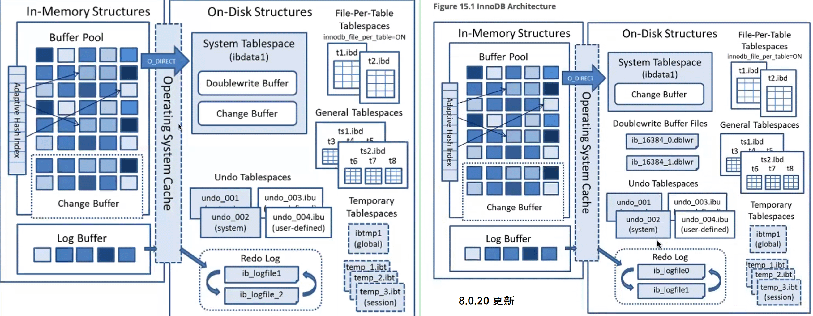

# MySQL

## 体系结构

### InnoDB 体系结构



### sql的执行过程

> [select](./Innodb DML流程(insert).md)
>
> [insert](./Innodb DML流程(insert).md)
>
> [update](./Innodb DML流程(update).md)

### undo各个版本具体如何

> 事务id，版本号
> undo用于保证事务原子性,redo用于保证事务持久性
>
> - undo是存储事务中修改之前的旧数据，存储的是整条记录
>
> - undo表空间（innodb_undo_directory） + 全局临时表空间（ibtmp1） --> 回滚段 --> undo log
>
>   > 5.6以前，undo只能存储在系统表空间ibdata中，5.7以前不包含全局临时表空间
>
> - session级别在临时表中产生的undo log，存储在全局临时表空间中的undo log里，这些undo是不记录到redo的。因为临时表不需要进行recovery。
>
> - undo表空间、全局临时表空间都可以单独支持最高128个回滚段
>
> > - 当删除某一行时，该行并不会马上从数据库的物理文件上移除，只是标记为delete flag = Y 。只有当InnoDB可以清楚更新日志记录的时候，那些行以及对应的索引记录才会真正的被物理删除，这个清除操作就是purge。
> >
> > - undo日志分为insert_undo和update_undo两种
> >
> >   - insert_undo仅在事务回滚时有用，事务提交后就没用了，可以马上删除掉。
> >   - update_undo在一致性读的时候需要被用到，如果当前没有更早的事务需要读取回滚段中的旧版本记录，这些记录就可以删除掉了。
> >   - 最好及时提交事务，避免InnoDB不能删除掉过期的undo log，使undo segment越来越大。
> >
> > - 事务中不同的请求类型，将被分配到不同的undo log中，每种请求类型分别需要一个undo log。


### MVCC

> <font color=red>MVCC：多版本依靠事务ID和undo，并发控制依靠行锁</font>
>
> - MVCC每个版本存储的是整条数据，数据存储在undo log中， 回滚段指针相当于undo log的索引，undo log存储在undo表空间。
> - InnoDB 靠undo保存旧版本数据，再利用回滚段指针查找旧版本数据，查找过程中通过事务ID判断数据版本可见性（事务ID逻辑对比，隔离级别）
>
>
> ### MVCC机制
>
> 每行记录有几个隐藏列：ROW_ID、TRX_ID、ROLL_PTR
>
> - ROW_ID：没有显式创建聚集索引时才会分配ROW_ID，如果已经指定了显式聚集索引，或not null 的uniq索引，那么ROW_ID就不存在了。
> - TRX_ID：事务ID，用于标识最后插入或更新这个行的最新版本。删除也被认为是一个更新，因为它在提交前只是在行上做一个[deleted-mark](..\3.存储对象数据结构\4.InnoDB 行记录结构、行格式和行溢出.md)。
>
>   - 事务ID是一个递增值，每开启一个事务便生成一个新的事务ID，事务ID是一条数据多次更新的时间点，类似时间戳的概念，基本上可以理解为事务ID是InnoDB数据最后一个版本的更新时间
> - ROLL_PTR：回滚段指针，对应事务ID和在该事务ID更新之前的版本。
>
>   - 更新之前，innodb先将旧数据复制到undo，然后回滚段指针指向undo的这个位置，再将这个指针存储在这条数据最新版本的头部信息里面。
> - UNDO LOG：存储了更改前的数据镜像，若该事务未提交，对隔离级别大于等于RC的其他事务，它们不会看到未提交的数据，而应该一直读取老版本的数据。*利用这个机制来构建MVCC多版本*。
>
>   - 需要访问旧版本数据时，通过ROLL_PTR找到对应的undo log版本，再根据TRX_ID来判断该版本记录的可见性
>   - **当旧版本记录中的TRX_ID指示对当前事务不可见时，则继续向前查找更旧的TRX_ID，直到找到符合可见性条件的记录。**
>   - 如果做搜索的话，先判断当前事务（id）和当前读到的数据的最新版本，按照隔离级别，进行判断数据版本是否可见，如：事务ID=9 ，数据最新版本=10 ， 隔离级别大于等于RC时，版本10的数据版本是不可见的。
>
> **<font color=red>当旧版本记录中的TRX_ID指示对当前事务不可见时，则继续向前查找更旧的TRX_ID，直到找到符合可见性条件的记录。</font>**
>
> 最常见场景：备份
>
> 一般的，我们发起备份时间在负载较低的时间段。
>
> - 如果当前实例里并发事务量很高，发起备份后，有可能同一条数据被更新过很多版本，等备份进程读取到这条数据时，要根据回滚段指针向前寻找很多版本的旧数据。
> - 如果备份时间足够久、备份期间产生的事务足够多，那么备份读取旧版本数据的代价是很大的。
> - 而且备份期间新产生的事务的undo都不能被清理掉，老版本时undo在ibdata中，会导致ibdata超级大。
>
> 
>
> ### MVCC对于可见性的判断
>
> 可见性判断
>
> - 并不是简单的直接拿当前事务的TRX_ID与表中每行记录的TRX_ID比较，去判断可见性。
> - 在事务开始时，将当前系统中的所有活跃事务copy到一个列表中（及read view快照），根据read view最早一个TRX_ID和最晚一个TRX_ID来做比较
> - 当前事务之前还未提交的事务的数据变化，以及当前事务启动后的其他事务的数据变更，在当前事务中均不可见


### 不可重复读和幻读

> 不可重复读指快照（修改）
>
> 幻读指增删

 


### 两阶段提交

### binlog和redolog的落盘机制

> 
>
> client发起commit后，sql已经成功执行，生成事务id、redo和undo，调用xa prepare到引擎，将xid记录到redo，将redo写盘，开始写binlog到缓存，将缓存的binlog落盘完成后，通知引擎commit，将binlog信息记录到redo，并再次将redo落盘。 提交完成后会清除undo
>
> 提交完成。


### MyIASM和innoDB的区别

```
innodb , 支持事务，IOT表结构，B+树结构，支持外键，支持行级锁
```


### redo和undo谁先谁后？

> undo用于保证事务原子性,redo用于保证事务持久性 
>
> undo 是数据的前映像, redo则是数据操作的记录，
>
> ##### 事务中 undo + redo的协同
>
> 1. 事务中更新数据前，先记录undo
> 2. 数据更新后，记录redo
> 3. 事务提交前，日志先写磁盘，保证持久化
> 4. undo和redo都需要先于数据持久化到磁盘
> 5. undo要早于redo写磁盘
> 6. undo和redo在写磁盘前都存放在内存中
> 7. undo用于保证事务原子性
> 8. redo用于保证事务持久性


### MySQL事务隔离级别

> 串行 SER，同一个表上进行顺序事务，无并行
>
> 读未提交RU，脏读
>
> 读已提交RC，每次查询创建一次快照。不避免幻读。不可重复读。
>
> 可重复读RR，事务开始后第一次有效查询时建立快照。通过read view + gaplock 避免幻读和可重复读
>
> - 幻读：读到新的数据或原来读到的数据没有了，针对增删。
> - 不可重复读：读到的数据被更改了，针对改。


### binlog相关的参数

```
####: for binlog
binlog_format     =row				# ROW/STATEMENT/MIXED   “确定性”
混合模式，在这种模式下，`master将根据根据存储引擎、变更操作类型等，从SBR、RBR中来选择更合适的日志格式`，默认为SBR；具体选择那种格式，这取决于变更操作发生的存储引擎、statement的类型以及特征，优先选择“数据一致性”最好的方式（RBR），然后才兼顾性能，比如statement中含有“不确定性”方法或者批量变更，那么将选择RBR方式，其他的将选择SBR以减少binlog的大小。我们建议使用mix方式。

log_bin           =v_datadir_path/logs/mysql-bin
binlog_rows_query_log_events    =on  
	当binlog_format=statement的时候进制日志只记录的是SQL语句，当binlog_fromat=row的时候记录的是event，如果想要在row模式的情况下也记录SQL语句；binlog_rows_query_events可以完成这个需求

log_slave_updates   =on  将从库应用的事务也记录到binlog中
expire_logs_days          =7                #      0
binlog_expire_logs_seconds     =604800    # mysql8.0
binlog_cache_size          =65536             #      65536(64k)
# binlog_checksum          =none              #    CRC32。   MGR=none
sync_binlog             =1 
slave-preserve-commit-order     =ON  在多线程复制环境下,能够保证从库回放relay log事务的顺序与这些事务在relay log中的顺序完全一致
```


## 锁

### MySQL有哪些锁

> 

## 复制

### 主从复制原理

> ### MASTER角色
>
> - **master instance**：主从复制里的“主”节点，复制架构中的数据来源。
>
> - **binlog**：master instance产生的binlog，binlog为二进制文件，以event为记录单位。
>
> - **dump_thread线程**：
> - 一个slave对应一个dump_thread线程。线程启动后，可以通过show processlist查看到。
>   - 当slave的io_thread启动后，master便会为此分配一个dump_thread线程通过TCP协议与slave进行通信，负责读取主节点上的binlog信息并发送给从节点：
>   - 主库写binlog成功后，通知dump_thread      线程。
>   - dump_thread线程会对binlog上一个读锁，读取binlog内容并发送给slave。
>   - dump_thread线程读取完binlog后，便释放对binlog文件的读锁。
>   - 当slave停止io_thread后，master的dump_thread依然可以show processlist查看到，直到master发生新的binlog后，dump_thread线程就消失了。
>
> 
>
> ### SLAVE角色：
>
> - **slave instance**：主从复制里的“从”节点，主节点的数据复制到的目标节点。
>
> - **io_thread线程**：slave上负责接收主节点发送来的binlog，并写入到relay log。启动io_thread后便开始接收master的binlog。
>
> - **relay-log**：master instance的binlog内容发送给slave后，由io_thread写入到relay-log，也叫relay-binlog。其格式和内容与master的binlog几乎一致。
>
> - **sql_thread线程**：负责将relay-log里的内容重放的线程。
>
> - **binlog(slave)**：slave instance产生的binlog，并不参与到当前的主从复制中（不过slave可以作为另一个架构里的master，这样这个binlog就作为master binlog啦）。
>
> 
>
> ### 复制瓶颈点：
>
> 1. 主库多线程并发DML，从库一个SQL thread重放。
> 2. 从库并行复制（SQL thread并行）可以缓解瓶颈1，但是io_thread 和 master的连接是一个TCP的连接（only one TCP connection）。
>
> **解决这些隐患和瓶颈：**
>
> - 使用半同步复制来保证复制可靠性（master会在意binlog的传输结果）
>
> - 使用并行复制机制来提升复制性能（干掉单线程重放瓶颈，让复制再快一点、更快一点！）
>       我们在不远的将来，会对它们逐步探索。


### 主从配置步骤

> 开启binlog
>
> 主库开启group commit logical clock甚至writeset
>
> 主库配置复制用账号和权限
>
> 从库slave-preserve-commit-order
>
> 从库change master to
>
> 从库start slave.
>
> 根据情况处理master的binlog清理和binlog备份等。


### 什么情况下会产生主从延迟

```
1. 主机短时间内发生大量事务 造成段时间段内主从复制延迟
2. 备机性能不够， 开了双1
3. 没开并行复制
4. 网络原因或硬件因素
5. 对无主键或索引表执行操作， 或从库缺失索引

- row格式，sql_thread重放过程中：

  - 如果有primarykey的情况下，就通过主键进行匹配；
  - 没有主键的情况下，如果有二级索引，就使用比较长的那个二级索引进行匹配；
  - 如果索引都没有，那么早期版本里就会进行全表扫描，
  - 8.0开始，会为全表建立hash，进行hash_scan。8.0.18版本中，该特性成为默认配置。

- innodb里，每个索引后面都会跟着主键，如果没有主键的情况下，innodb会产生内部隐藏的row_id。
```


## 优化和排查


### 慢日志里面记录的时间包含不包含锁的时间

> 慢查询日志中的lock_time实际上是查询花在等待获取其需要运行的锁的时间.例如,UPDATES查询需要写锁定
>
> | -s t | 按总query time排序 | -s at | 按平均query time排序 |
> | ---- | ------------------ | ----- | -------------------- |
> | -s l | 按总locktime排序   | -s al | 按平均lock time排序  |
> | -s s | 按总row send排序   | -s as | 按平均row send排序   |
> | -s c | 按count排序        | --    | --                   |


### 1032错误

> Could not execute Update_rows event on table reptest.t1; Can't find record in 't1', Error_code: 1032; handler error HA_ERR_KEY_NOT_FOUND; the event's master log mysql-bin.000009, end_log_pos 42303


### explain执行计划

> [传送门](../9.MySQL性能优化/0.性能优化总览/04.explain执行计划解读.md)
>
> 效率上， const > eq_ref > ref > range > index > all
>
> 一、type：连接类型  最关键的一列  效率（const>eq_ref>ref>range>index>all）
>
> 1、const:查询索引字段，并且表中最多只有一行匹配（好像只有主键查询只匹配一行才会是const，有些情况唯一索引匹配一行会是ref）
>
> 2、eq_ref    主键或者唯一索引  
>
> 3、ref   非唯一索引（主键也是唯一索引）
>
> 4、range  索引的范围查询
>
> 5、index  (type=index extra = using index 代表索引覆盖，即不需要回表)
>
> 6、all 全表扫描（通常没有建索引的列）
>
> 二、key_len
>
> 索引的长度，在不损失精度的情况下越短越好
>
> 三、ref
>
> 四、rows （内循环的次数）
>
> 五、extra
>
> 重要的几个
>
> 1、using temporary(组合查询返回的数据量太大需要建立一个临时表存储数据,出现这个sql应该优化)
>
> 2、using where (where查询条件)
>
> 3、using index(判断是否仅使用索引查询，使用索引树并且不需要回表查询)
>
> 4、using filesort(order by 太占内存，使用文件排序)
>
> 了解的几个
>
> 1、const row not found(据说是当表为空的时候展示，我用了个空表explain之后发现extra列是空值)
>
> 2、deleting all rows (MYISAM存储引擎快速清空表)
>
> 3、first_match(select * from a where name in(select a_name from B) ，B中有n条记录都记录了同一个a_name,每个a_name都只会匹配一次。exist也有同样的效果)
>
> 4、impossible having, impssible where  (错误的having 和where如，where 1<0)
>
> 5、Impossible WHERE noticed after reading const tables（如 where id =1 and name = "temp",表中不存在id=1并且name=temp的记录）
>
> 


### 如何查看服务器io情况，如何排查数据库io问题

```
Iostat，iotop

Fio，engine status. Slow sql.
```


### 遇到过哪些比较麻烦的问题

> [问题:长事务未提交，导致unpurge list太大，导致DML被阻塞了。调整业务提交逻辑](../9.MySQL性能优化\1.性能瓶颈排查及关键指标监控\99.性能排查剪辑\是谁，把InnoDB表上的DML搞慢的？.md)
>
> 分布式数据库表数据不平衡导致dump一段时间后失去进度
>
> 不合理的innodb并发度导致数据库性能急剧下降


### 常见的性能问题的排查思路，

> #### MySQL反应慢的排查思路
>
> 1. CPU的状态
> 2. 内存
> 3. I/O
> 4. MySQL是整体慢还是部分慢？一直慢还是高峰期慢？
> 5. 数据库内存命中情况
>
> > via [9.MySQL性能优化\1.性能瓶颈排查及关键指标监控\00.硬件及系统层监控.md](..\9.MySQL性能优化\1.性能瓶颈排查及关键指标监控\00.硬件及系统层监控.md)
> >
> > - user% 高， 检查索引；
> > - sys%高，检查是否发生了swap，是否未关闭NUMA，mysqld进程是否调度了os的别的进程，是否发生了行锁等待，os层硬件中断由特定的逻辑核心处理；
> > - iowait%高，IO子系统性能差或负载高，或设定配置不合理如调度模式设置错误，文件系统错误等原因。
>
> ### CPU状态
>
> - sys% 高
>   - NUMA问题。NUMA没禁用 
>   - swap问题。查看内存 ，vmstat查看swap的si so是否存在数据活跃——也会定位到NUMA问题
> - user% 高
>   - 存在不合理的索引
> - io_wait% 高
>   - 索引不合理，或访问数据过大（绝大多数也是由索引不合理引起）
>
> 
>
> ### SQL执行时间最长、执行次数最多，先优化哪一个？
>
> - 先优化次数最多的那个。
>
> - 高峰期的SQL也要最优先处理、优化
>
> 
>
> ### 是否到达瓶颈？
>
> 全天慢还是高峰期慢？高峰期慢的话，对比平时和高峰期的区别，如连接数、高峰期SQL等因素。
>
> 如果都排除了，再检查下面几项，来确认达到服务器性能极限，以进行扩容：
>
> - 在能达到最优化的情况下，如果符合下列情况，表示服务器达到瓶颈：
>   - CPU长期超过70%
>   - 响应时间timeout超时每天都有新增
>   - 慢日志相对于每天也有增加
>   - 磁盘空间紧张
>
> 
>
> ### 关于timeout
>
> - 大量读超时的话，考虑扩展从库
>
> - 大量写超时，可以考虑规划连接：一定比例的连接数负责写，一定比例的连接数负责读；让写的操作都能进入到写连接的连接池，防止等待超时。
>
> 
>
> - 如果以上操作后依然大量超时，也说明达到了瓶颈。
>
> ### 关于拆库
>
> - 单实例超过1TB，也要进行拆分。——备份时间不可控，因此拆分比较有必要。
>
> ### buffer pool 命中率及SQL延迟


### show processlist 和 show innodb status 的关注重点

> - processlist
>
>   - 线程数
>
>   - 有没有长时间活跃的线程
>
>   - 最关键的就是state列
>
>     - Copying to tmp table on disk 
>
>       由于临时结果集大于 tmp_table_size，正在将临时表从内存存储转为磁盘存储以此节省内存
>
>     - Locked 
>
>       被其他查询锁住了。
>
>       大量出现或长时间出现，需要关注索引。是否发生了全表扫描
>
>     - Sending data 
>
>       在从磁盘读取。
>
>       长时间、大量出现，需要关注IO性能和索引情况
>
>     - Sleeping
>
>       休眠连接。如果出现较多，需要关注是否业务层面存在缺陷，未及时关闭连接。或连接池配置是否合理。
>
>     - System lock
>
>     - Waiting for tables
>
>       等待表结构变更。涉及到表结构变更，在业务繁忙期间尤其引起关注。
>
> - innodb status
>
>   - 活跃事务清单，trx id
>
>     - 某一事务的活跃时常
>
>     - Purge done for trx's  n:o ，未提交的旧事务可能会阻塞净化线程并且消 耗资源。通过查看2次清除事务数之差，就可以知道是否发生了有事务迟迟没有提交。
>
>       - 减少此类开销的最好办法就是确保事务已完成就立即提交，不要让事务长时间地处于打开状态，因为一个打开的事务即使不做任何操作，也会影响到innodb清理旧版本的行数据。 
>
>     - undo n:o < 0这个是innodb清理进程正在使用的撤销日志编号，为0 0时说明清理进程处于空闲状态。
>
>     - History list length
>
>       undo log的数量——undo里的未清除事务的数量。
>
>       当一个事务执行了更新并提交后，这个数字就会增加。当清除进程移除一个旧版本数据时，它就会递减（purge thread也会更新purge done for …也就是上一行的数据。）。可以看purge的效率。
>
>   - io线程有无挂起，来判断负载是否存在IO受限的情况
>
>     - 在linux系统下使用参数：innodb_read_io_threads和innodb_write_io_threads两个变量来配置读写线程的数量，默认为各4个线程。
>
>   - change buffer
>
>     - 查看merge量
>
>   - AHI
>
>     - 查看自适应哈希索引大小以及效率，
>     - 自适应哈希索引只适用于等值查询，观察效率以决定是否要使用AHI
>
>   - log
>
>     - lsn刷新以及ckpt状态
>     - 日志操作的统计信息
>
>   - buffer pool
>
>     - made young和not young 判断LRU策略是否合理
>
>       > youngs/s度量标准仅用于old pages，基于对page的访问次数，而不是页的数量。对页进行多次访问都会被计算。如果见到非常低的值，可能需要减小延迟或增加old page LRU list 的比例。增大后，页面需要更长的时间才会移动到尾部，这就增加了再次访问page，从而使他们made young的可能性增大。 Not young，如果在执行大表扫描时未看到较高的non-young和non-youngs/s，请增加innodb_old_blocks_time
>
>     - IBP命中率，
>
>     - IBP大小等信息
>
>     - 查看被挤出IBP的脏页数，以及等待读入IBP的页数量，判断IBP是否够用或过大
>
>     - 预读效率
>
>   - row operations
>
>     - 主线程在做什么
>     - 当前进行的查询和等待的查询数量
>     - 每种行操作的数量和效率（前面的统计时间，平均下来每秒值。）


### 使用Xtrabackup备份和myqsldump的区别


# oracle

## 体系结构

### 一条sql执行的过程

> 
>
> **Oracle****执行****SQL****查询****select****语句的步骤**
>
> - SQL语句的执行主要由用户进程与服务器进程来完成，其他的一些进程可能要辅助完成这一过程。
>
> - 查询语句与其他SQL的区别在于，查询语句执行后要返回查询结果，其他类型的SQL语句只是返回执行成功或是失败的信息。
>
> - 查询语句的处理主要包含三个阶段：
>
> - - 编译 parse
>
>   - - 编译时，服务器进程会将SQL语句的正文放入shared       pool中的library       cache中并完成以下处理：
>     - 首先在shared pool中搜索是否有相同SQL语句，如果没有就进行后续处理。
>     - 检查该SQL语句的语法正确性
>     - 通过查看数据字典来检查表和列的定义
>     - 对所操作的对象加编译锁parse lock，以便在编译语句期间这些对象的定义不能被改变。
>     - 检查所引用对象的用户权限
>     - 生成执行该SQL语句所需的优化的执行计划
>     - 将SQL语句和执行计划装入shared pool。
>
>   - 执行execute
>
>   - - 编译后，服务器进程已经获得了执行SQL所需要的全部资源和信息，服务器进程开始执行SQL语句。
>
>   - 提取数据fetch
>
>   - - 服务器进程选择所需的数据行，并在需要时将其排序，最后将结果返回给用户进程。
>
> **Oracle****执行****UPDATE****（****INSERT****、****DELETE****）语句的步骤：**
>
> - 如果数据和回滚数据不在数据库高速缓冲区，则服务器进程把它们从数据文件中读到数据库高速缓冲区。
> - 服务器进程在要修改的数据行上加锁（行级锁）。
> - 服务器进程将数据的变化信息和回滚所需的信息都记录在重做日志缓冲区中。
> - 服务器进程将回滚所需的原始值和对数据所做的修改都写入数据库高速缓冲区，之后在数据库高速缓冲区中所有的这些数据块都将被标为脏块，因为此时内存和外存的数据时不一致的。


### oracle的体系结构


### 控制文件损坏如何修复

> 单一文件损坏，使用冗余副本覆盖恢复
>
> 全部丢失，使用autobackup恢复，或从备份集中恢复
>
> 丢失且没有备份，手动重建控制文件(resetlogs/noresetlogs)，可能会引起数据丢失。


### 控制文件中都有哪些信息

> 1. 数据库名称 DBID
> 2. 数据库创建的时间戳
> 3. 相关的数据文件、redolog group文件的名称和位置
> 4. 表空间信息
> 5. 数据文件offline信息
> 6. redo日志信息
> 7. 归档日志信息
> 8. rman备份块信息
> 9. 当前数据库scn
> 10. 检查点(checkpoint)信息


### Oracle 检查点

> Checkpoint和CKPT：为了提高系统恢复的效率
> Checkpoint事件
>
> - 为了提高系统效率和数据库的一致性，引入检查点事件。当DBWR将SGA中所有已经改变了的database buffer cache中的数据写到数据文件上时便产生该事件（写入的数据包括提交的和没提交的数据）。
> - Oracle利用重做日志和SCN是能够保证数据库的完全恢复，引入检查点是为了提升恢复的效率。所有到检查点为止的变化了的数据都安全的写入了数据文件，在实例恢复时，检查点之前的重做日志便不再需要，提升了恢复速度。
>
> CKPT
>
> - 在检查点事件发生时，Oracle要将检查点号码写入所有相关的数据文件的文件头，还要将检查点号码，重做日志序列号，归档日志名称和SCN都写入控制文件中。
> - 产生检查点时Oracle系统会进行大量的IO（触发DBWR，触发DBWR前会触发LGWR），所以过于频繁的产生检查点会影响数据库性能。


## 执行计划

### 抓取执行计划都有哪几种方式

> - 总览
>   - 预估执行计划 - Explain Plan
>   - 查询内存中缓存的执行计划 （dbms_xplan.display_cursor）
>   - 查询历史执行计划（dbms_xplan.display_awr）
>   - 在用sqlplus做SQL开发是（Autotrace）
>   - SQL_Trace, 10046
>
> 
>
> 1. 预估执行计划 - Explain Plan
> 
>    > Explain plan以SQL语句作为输入，得到这条SQL语句的执行计划，并将执行计划输出存储到计划表中。
>    > 首先，在你要执行的SQL语句前加explain plan for，此时将生成的执行计划存储到计划表中，语句如下：
>    > explain plan for SQL语句
>    > 然后，在计划表中查询刚刚生成的执行计划，语句如下：
>    > select * from table(dbms_xplan.display);
>    > 注意：Explain plan只生成执行计划，并不会真正执行SQL语句，因此产生的执行计划有可能不准，因为：
>    >
>    > 1）当前的环境可能和执行计划生成时的环境不同；
>   > 2）不会考虑绑定变量的数据类型；
>       > 3）不进行变量窥视。
>
> 2. 查询内存中缓存的执行计划 （dbms_xplan.display_cursor）
>
>    > 如果你想获取正在执行的或刚执行结束的SQL语句真实的执行计划（即获取library cache中的执行计划），可以到动态性能视图里查询。方法如下：
>    >
>    > 1）获取SQL语句的游标
>    > 游标分为父游标和子游标，父游标由sql_id(或联合address和hash_value)字段表示，子游标由child_number字段表示。
>    >
>    > 如果SQL语句正在运行，可以从v$session中获得它的游标信息，如：
>    > select status, sql_id, sql_child_number from v$session where status='ACTIVE' and ....
>    >
>    > 如果知道SQL语句包含某些关键字，可以从v$sql视图中获得它的游标信息，如：
>    > select sql_id, child_number, sql_text from v$sql where sql_text like '%关键字%‘
>    >
>    > 2）获取库缓存中的执行计划
>    > 为了获取缓存库中的执行计划，可以直接查询动态性能视图v$sql_plan和v$sql_plan_statistics_all等，但更方便的方法是以sql_id和子游标为参数，执行如下语句：
>    > select * from table(dbms_xplan.display_cursor('sql_id',child_number));
>    >
>    > 3）获取前一次的执行计划：
>    > set serveroutput off
>    > select * from table(dbms_xplan.display_cursor(null,null,'ALLSTATS LAST'));
>
>    3. 查询历史执行计划（dbms_xplan.display_awr）
>
>    > AWR会定时把动态性能视图中的执行计划保存到dba_hist_sql_plan视图中，如果你想要查看历史执行计划，可以采用如下方法查询：
>   > select * from table(dbms_xplan.display_awr('sql_id');
> 
> 4. 在用sqlplus做SQL开发是（Autotrace）
>
>    > set autotrace是sqlplus工具的一个功能，只能在通过sqlplus连接的session中使用，它非常适合在开发时测试SQL语句的性能，有以下几种参数可供选择：
>   >
>    > SET AUTOTRACE OFF ---------------- 不显示执行计划和统计信息，这是缺省模式
>    > SET AUTOTRACE ON EXPLAIN ------ 只显示优化器执行计划
>    > SET AUTOTRACE ON STATISTICS -- 只显示统计信息
>    > SET AUTOTRACE ON ----------------- 执行计划和统计信息同时显示
>    > SET AUTOTRACE TRACEONLY ------ 不真正执行，只显示预期的执行计划，同explain plan
> 
> 5. 生成Trace文件查询详细的执行计划 （SQL_Trace, 10046）
>
>    > 5. SQL_TRACE作为初始化参数可以在实例级别启用，也可以只在会话级别启用，在实例级别启用SQL_TRACE会导致所有进程的活动被跟踪，包括后台进程及所有用户进程，这通常会导致比较严重的性能问题，所以在一般情况下，我们使用sql_trace跟踪当前进程，方法如下：
>   >
>    > SQL>alter session set sql_trace=true;
>    > ...被跟踪的SQL语句...
>    > SQL>alter session set sql_trace=false;
>    > 如果要跟踪其它进程，可以通过Oracle提供的系统包DBMS_SYSTEM. SET_SQL_TRACE_IN_SESSION来实现，例如：
>    > SQL> exec dbms_system.set_sql_trace_in_session(sid,serial#,true) --开始跟踪
>    > SQL> exec dbms_system.set_sql_trace_in_session(sid,serial#,false) --结束跟踪
>    >
>    > 生成trace文件后，再用tkprof 工具将sql trace 生成的跟踪文件转换成易读的格式，语法如下：
>    > tkprof inputfile outputfile
>    > 10046事件是SQL_TRACE的一个升级版，它也是追踪会话，生成Trace文件，只是它里面的内容更详细，
> 
> 


### 在哪些情况下执行计划会发生改变

> 1. 相关的每张表及其索引发生DDL
> 2. 相关的每张表及其索引的统计信息发生变化
> 3. SQL发生绑定窥探和自适应游标行为
> 4. SQL发生动态采样


### 如何固定执行计划

> sql profile绑定执行计划
>


## 优化

### trace 10046和10053的区别

> - 10046 trace帮助我们解析 一条/多条SQL、PL/SQL语句的运行状态 ，这些状态包括 ：Parse/Fetch/Execute三个阶段中遇到的等待事件、消耗的物理和逻辑读、CPU时间、执行计划等等。
>
>   - 即10046 为我们揭示了 一条/多条SQL 的运行情况， 对于 以点入手的 SQL调优是很好的辅助工具，特别是在 10g之前没有ASH的情况下。 但整体系统调优 不是10046 所擅长的， 10046 是 性能调优的起钉器 ， AWR是性能调优 的锤子。
>
>   - 10046还能帮助我们分析 一些 DDL维护命令的内部工作原理， RMAN、Data Pump Expdp/Impdp等工具的缓慢问题等， 是研究 oracle 数据库原理的 居家旅行必备良品。
>
>   - 10046 和SQL TRACE的区别？
>
>   - 10046 比 SQL_TRACE参数提供更多的控制选项， 更详细的内容输出， 一般Maclean只用10046 而不用sql_trace
>
>     
>
> - 10053 是最常用的Oracle 优化器optimizer 跟踪trace， 10053 可以作为我们解析 优化器为什么选择某个执行计划，其中的理由的辅助工具，但并不告诉我们这个执行计划 到底运行地如何。
>
> - 而10046 并不解释 optimizer优化器的工作， 但它同样说明了在SQL解析parse阶段所遇到的等待事件和所消耗的CPU等资源，以及Execute执行和Fetch阶段的各项指标。
>
> - 简而言之10046 告诉我们SQL(执行计划)运行地如何， 10053告诉我们 优化器为什么为这个SQL选择某个执行计划。


### 迁移的几种方式

> expdp ,exp , rman, ogg, dg


### 说一下对4031报错的理解

> ORA-04031: unable to allocate 4120 bytes of shared memory ("shared pool",...)
>
> 1.内存中存在大量碎片，导致在分配内存的时候，没有连续的内存可存放，此问题一般是需要在开发的角度上入手，比如增加绑定变量，减少应解析来改善和避免；
>
> 2.内存容量不足，需要扩大内存。


### oracle表连接的方式

>- 排序合并连接（Sort Merge Join）
>
>  > - 排序合并连接一般用在两张表中没有索引，并且连接列已经排好序的情况下
>  >
>  > 排序合并连接的执行过程如下所示：
>  >
>  > \* 将每个行源的行按连接条件列排序
>  >
>  > \* 然后合并两个已排序的行源，并返回生成的行源
>  >
>  > 例如：
>  >
>  > select * from employees d,departments t where d.department_id=t.department_id;
>  > 访问机制如下：访问departments表并排序department_id列，访问employees表并排序department_id列，然后依次交替比较、归并。
>  >
>  > 注意：排序合并连接一般用在两张表中没有索引，并且连接列已经排好序的情况下。
>
>  
>
>- 嵌套循环连接（Nested Loops Join）
>
>  > \* 两个表中的一个被定义为“外部表”（或“驱动表”）
>  >
>  > \* 另一个表被称为“内部表”
>  >
>  > \* 将针对外部表中的每一行检索内部表中所有匹配的行
>  >
>  > 注意:join的顺序很重要，一般选择小表作为“驱动表”，大表作为“内部表”。
>  >
>  > 如两个表，一个100行，一个10000行，理想的连接方式是：100行的小表作为“驱动表”，10000行的大表作为“内部表”，用小表中的每条记录去匹配大表中的记录。如果两张表的连接词在大表中是索引列，则是最完美的。
>
>
>
>- 哈希连接（Hash Join）
>
>  > \* 优化器对小表利用连接键在内存中建立hash表
>  >
>  > \* 扫描大表，每得到一条记录，就来hash表中“探测”一次，找出与hash表匹配的行
>  >
>  > 注意：Hash Join 是CBO做大数据集连接时的常用方式。


### 数据库的几个状态

> nomount 加载参数文件，启动实例，开启SGA和后台进程
>
> mount 加载控制文件，检查数据文件和日志文件位置和名称，但不去确认文件是否存在与正确
>
> open 校验控制文件并通过，数据库open
>
> open read only 只读模式，不检查redo
>
> restrict 受限模式，维护模式


### 统计分析表中都有哪些信息

> 统计信息主要是描述数据库中表，索引的大小，规模，数据分布状况等的一类信息。
>
> 例如，表的行数，块数，平均每行的大小，索引的leaf  blocks，索引字段的行数，不同值的大小等，都属于统计信息。
>
> CBO正是根据这些统计信息数据，计算出不同访问路径下，不同join  方式下，各种计划的成本，最后选择出成本最小的计划。
>
> 统计信息是存放在数据字典表中的，如tab$，一般可通过察看某些视图来获取统计信息状况，如DBA_TABLES,DBA_INDEXES,DBA_TAB_COL_STATISTICS,  DBA_TAB_HISTOGRAMS等。在这些视图中包含表示统计信息的一些字段，这些字段只有搜集过统计信息之后才有值，否则是空的。
>
> 例如，last_analyzed 字段表示上次统计信息搜集的时间，可以根据这个字段，快速的了解最近一次统计信息搜集的时间。
>
> 收集统计信息的方法
>
> 1. 使用gather_stats_job自动收集是在创建数据库时自动创建的，并由调度程序进行管理。他会收集数据库中优化程序统计信息缺失或已过时的所有对象的统计信息。
> 2. 使用dbms_stats 程序包手动收集收集的是系统统计信息。
> 3. 通过设置数据库初始化参数进行收集。
> 4. 通过从另一个数据库导入统计信息进行收集。


## AWR

### 说说dbtime

> #### DB Time:
>
> **DB Time****只记录前台会话事件，不记录后台会话事件（如：写日志、写数据文件用时是不记录的。）**
>
> - 前台会话事件：由于前台调用、等待返回结果产生等待的事件，包含CPU时间，I/O时间，CPU队列等待的时间，其他非IDLE等待 的时间。
> - Total DB     Time= 所有会话的DB Time之和。
> - DB Time  <>     Response Time
>
> DB Time不包括Oracle后台进程消耗的时间。如果DB Time远远小于Elapsed时间，说明数据库比较空闲。
>
> #### AAS(平均活动会话)： 
>
> Total DB time:所有会话的DB time之和
>
> Avg Active Sessions （AAS）= Total DB Time / Wall clock elapsed time （现实运行时间）
>
> AAS展示了平均数据库会话繁忙程度，任意时刻的数据库会话并行数。
>
> AAS+CPU为核心性能进行判定：
>
> 一旦活动会话数量超出CPU数量，需要关注，说明系统比较忙。
>
> - AAS ~=0 ，数据库基本没人用
> - AAS < 1 ，数据库基本上空闲
> - AAS < CPUs ， 问题不太大，有些会话100% active？
> - AAS > CPUs， 可能存在性能问题
> - AAS >> CPUs，远大于CPU数量，可能已经陷入瓶颈。
>
>  
>
> 如果将每一个session按照时间放入时间线，那么多个会话依次叠加，便形成了直方图。对直方图进行纵向切片，则展示了切片时间时的数据库会话数量。


### Awr常见的等待事件

> ORACLE的等待事件，主要可以分为两类，即空闲(IDLE)等待事件和非空闲(NON-IDLE)等待事件。
>
>  
>
> 1). 空闲等待事件指ORACLE正等待某种工作，在诊断和优化数据库的时候，不用过多注意这部分事件。
>
>  
>
> 2). 非空闲等待事件专门针对ORACLE的活动，指数据库任务或应用运行过程中发生的等待，这些等待事件是在调整数据库的时候需要关注与研究的。
>
>  
>
> 一些常见的非空闲等待事件有:
>
> ? db file scattered read
>
> ? db file sequential read
>
> ? buffer busy waits
>
> ? free buffer waits
>
> ? enqueue
>
> ? latch free
>
> ? log file parallel write
>
> ? log file sync
>
> 
>
> 常见的空闲事件有:
>
> ? dispatcher timer
>
> ? lock element cleanup
>
> ? Null event
>
> ? parallel query dequeue wait
>
> ? parallel query idle wait - Slaves
>
> ? pipe get
>
> ? PL/SQL lock timer
>
> ? pmon timer- pmon
>
> ? rdbms ipc message
>
> ? slave wait
>
> ? smon timer
>
> ? SQL* Net break/reset to client
>
> ? SQL* Net message from client
>
> ? SQL* Net message to client
>
> ? SQL* Net more data to client
>
> ? virtual circuit status
>
> ? client message


### Awr中sql有几种统计方式

> 执行耗时，cpu time，buffer gets，reads，执行次数，解析调用，内存使用，等待时间


### 如何分析awr

> dbtime ，命中率，等待事件，sql排序，sga分析建议，pga分析建议

### 硬解析的指标

> AWR load profile中
>
> Redo size：每秒产生的日志大小(单位字节)，可标志数据变更频率, 数据库任务的繁重与否。Logical reads：每秒/每事务逻辑读的块数.平决每秒产生的逻辑读的block数。Logical Reads= Consistent Gets + DB Block Gets 
>
> Block changes：每秒/每事务修改的块数
>
> Physical reads：每秒/每事务物理读的块数
>
> Physical writes：每秒/每事务物理写的块数
>
> User calls：每秒/每事务用户call次数
>
> 
>
> Parses：SQL解析的次数.每秒解析次数，包括fast parse，soft parse和hard parse三种数量的综合。 软解析每秒超过300次意味着你的"应用程序"效率不高，调整session_cursor_cache。在这里，fast parse指的是直接在PGA中命中的情况（设置了session_cached_cursors=n）；soft parse是指在shared pool中命中的情形；hard parse则是指都不命中的情况。
>
> 看基线对比
>
> Hard parses：其中硬解析的次数，硬解析太多，说明SQL重用率不高。每秒产生的硬解析次数, 每秒超过100次，就可能说明你绑定使用的不好，也可能是共享池设置不合理。这时候可以启用参数cursor_sharing=similar|force，该参数默认值为exact。但该参数设置为similar时，存在bug，可能导致执行计划的不优。
>
> Sorts：每秒/每事务的排序次数
>
> Logons：每秒/每事务登录的次数
>
> Executes：每秒/每事务SQL执行次数
>
> Transactions：每秒事务数.每秒产生的事务数，反映数据库任务繁重与否。
>
>  

### sql优化的时候都关注哪些点

> 定位有问题的语句，检查执行计划，检查执行过程中优化器的统计信息，分析相关表的记录数、索引情况改写SQL语句、使用HINT、调整索引、表分析有些SQL语句不具备优化的可能，需要优化处理方式达到最佳执行计划。但是最佳的执行计划不一定是最佳的执行情况。一切以实际执行的情况为准。

 

## RAC

### oracle RAC的组件有哪些

> ClusterWare组件
>
> *******************
>
> 四种Service
>
> Crsd - 集群资源服务
>
> Cssd - 集群同步服务
>
> Evmd - 事件管理服务
>
> oprocd - 节点检测监控
>
> --------
>
> VIP - 虚拟IP地址(Virtual IP)
>
> scanIP
>
> OCR - Oracle Cluster Registry(集群注册文件),记录每个节点的相关信息
>
> Voting Disk - Establishes quorum (表决磁盘),仲裁机制用于仲裁多个节点向共享节点同时写的行为，这样做是为了避免发生冲突。
>
> ASM
>
> RAC的组件
>
> ************
>
> 提供过了额外的进程，用来维护数据库
>
> LMS - Gobal Cache Service Process 全局缓存服务进程
>
> LMD - Global Enqueue Service Daemon 全局查询服务守护进程
>
> LMON - Global Enqueue Service Monitor全局查询服务监视进程
>
> LCK0 - Instance Enqueue Process 实例查询进程
>
> ---------------------
>
> RAC中的特点是：
>
> 每一个节点的linstance都有自己的SGA
>
> 每一个节点的linstance都有自己的background process
>
> 每一个节点的linstance都有自己的redo logs
>
> 每一个节点的linstance都有自己的undo表空间
>
> 所有节点都共享一份datafiles和controlfiles
>
> 还提出了一个缓存融合的技术(Cache fusion)
>
> 目的有两个
>
> 01.保证缓存的一致性
>
> 02.减少共享磁盘IO的消耗
>
> 因此在RAC环境中多个节点保留了同一份的DB CACHE
>
> 缓存融合（Cache fusion）工作原理：
>
> ****************************************
>
> 01.其中一个节点会从共享数据库中读取一个block到db cache中
>
> 02.这个节点会在所有的节点进行交叉db block copy
>
> 03.当任何一个节点缓存被修改的时候，就会在节点之间进行缓存修改
>
> 04.为了达到存储的一致最终修改的结果也会写到磁盘上


### rac相对于单实例的优势

> 通过RAC数据库，可以构建一个高性能、高可靠的数据库集群系统，RAC的优势在于：
> （1）可以实现多个节点间的负载均衡
> （2）可以提供高可用服务
> （3）通过横向扩展提高了并发连接数
> （4）通过并行执行技术提高了事务响应时间
> （5）具有很好的扩展性


### rac随机分配链接的劣势

> ？