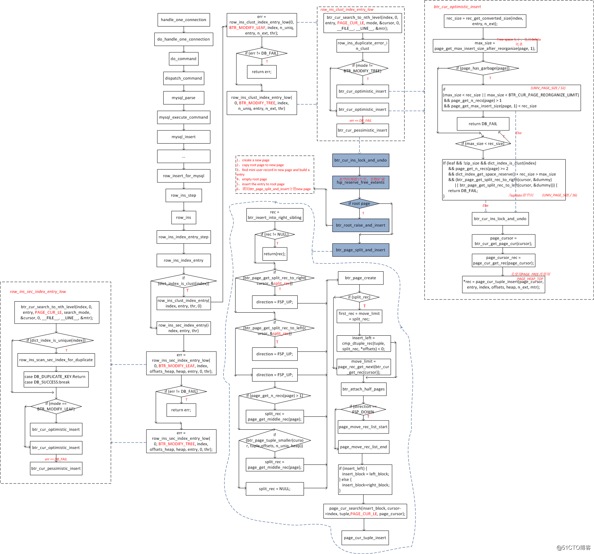

Innodb DML流程(insert)

client发起insert请求

server层进行权限及语义语法检测，然后提交请求给innodb

如果目标有主键或唯一索引，innodb进行唯一性冲突检测，读取主键或唯一索引到IBP进行检测。

对表加IX锁，获取pk或rowid，将数据在IBP中写入聚集索引，动作记录到redo log。如果是辅助索引，则在change buffer中写入辅助索引内容，动作记录到redo log，并在之后更新到IBP。

插入结束后，提交事务，进入二阶段提交。

写脏页时先进行double write buffer写， 等待double write buffer落盘完成后，进行脏页落盘。