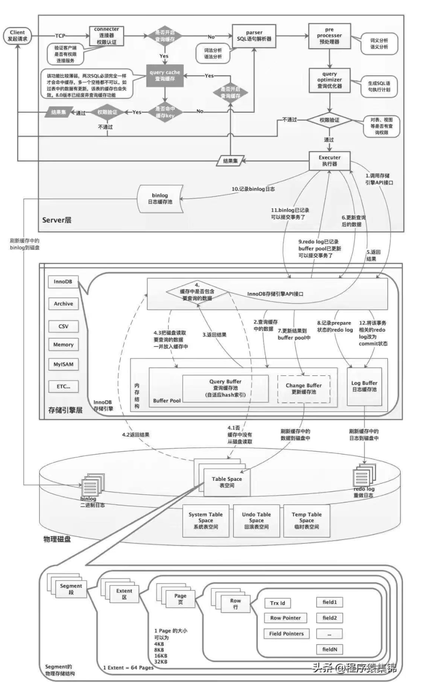

> 20201116 didi
>
> 1. DML到innodb层后的执行流程
>    1. 将数据读入IBP，并对相关记录加x锁；
>    2. 将undo信息写入undo表的回滚段；
>    3. 更改IBP数据，并将更新记录写入redo；
>    4. 提交时根据innodb_flush_log_at_trx_commit的设置用不同的方式将redo buffer记录刷新到redo log file ，然后释放x锁；
>    5. 后台IO线程根据需要将IBP中更新过的数据写入到磁盘文件。
>    
> 2. innodb buffer pool作用
>    1. B+树结构
>    2.  InnoDB对任何数据的读写都是基于内存的，当读一条数据时，会先检查是否在IBP(data pages)中：
>          		如果不在，那么去IO读InnoDB表空间，读取到data pages后，再返回给client
>          		如果在，读取最新版本
>          	  然后进行操作，变成脏数据，再刷新到磁盘。
>    3. IBP里最大的三个区域：Database pages、Modified db pages、Free buffers
>    
> 3. change buffer pool作用
>    1. B+树结构
>    2. 对insert操作进行缓冲
>    3. 将辅助索引上的DML操作从随机IO变为顺序IO，提高IO效率
>    4. 缓存辅助索引变化的区域，要修改的辅助索引页不在内存时，读入索引页到change buffer。对索引的更新先缓存到change buffer，然后由master thread做merge——将修改数据merge后刷新到磁盘
>    
> 4. 二阶段提交
>    1. client提交到server，server提交到innodb(prepare)，redo写入XID，事务状态标记为trx_prepared，redo写盘
>    2. innodb返回成功给server
>    3. server开始写binlog
>    4. binlog写结束
>    5. server发起fsync() ，将binlog写盘
>    6. binlog完成落盘
>    7. server将binlog filename、pos 提交到innodb ，innodb写入redo，事务状态标记为trx_not_started，redo写盘
>    8. 返回提交结果给client
>
> 5. mvcc，rc\rr，快照，快照怎么创建的（这个老叶讲过……我没记……）
>    - rc级别下，每次查询都创建一次快照。
>    - rr级别下，第一次有效查询创建快照，快照直到事物结束前不会再刷新。
>    - 快照怎么创建的……看mvcc截图吧。
>    - 快照读（普通select）
>    - 当前读（s锁或x锁）
>
> 6. insert as select 在rr/rc 级别下的上锁
>    	
>    ​		rc级别下不加锁
>    ​	    rr级别下nextkey_lock
>    
> 7. xtrabackup备份流程
>
> 8. 高可用方案，MHA方案高可用做跨机房方案（3机房），说下设计方案和思路
>
> 9. 分库分表，思路， 大表拆分思路和产品。

什么是幻读？

什么是不可重复读？

