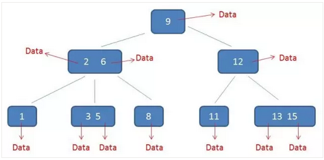
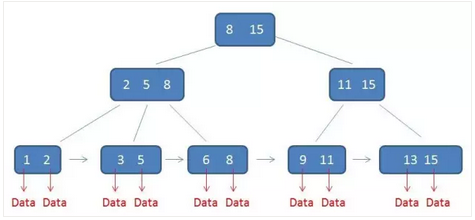

# 面试问题列表

### 一、PostgreSQL

##### 1、PG的复制？有几种方式？原理是什么？

##### 2、PG的垃圾回收vacuum机制是什么？存在什么隐患？

### 二、MYSQL

##### 1、mysql的几种复制模式，原理是什么？半同步和增强半同步的区别是什么？增强半同步有什么优缺点？

##### 2、mysql的RR和RC分别存在什么隐患？RR隔离级别是通过什么机制解决幻读和重复读的？RC为什么会有幻读的隐患？

##### 3、描述下B+tree的结构，并说出select语句和update语句是如何执行得到结果的？

##### 4、简述二分算法和avl树，说出B+tree和B-tree的区别？mysql innodb为什么选择用B+tree的结构存储数据？

```
avl == 自平衡二叉查找树
在计算机科学中，AVL树是最早被发明的自平衡二叉查找树。在AVL树中，任一节点对应的两棵子树的最大高度差为1，因此它也被称为高度平衡树。查找、插入和删除在平均和最坏情况下的时间复杂度都是
。增加和删除元素的操作则可能需要借由一次或多次树旋转，以实现树的重新平衡。AVL树得名于它的发明者G. M. Adelson-Velsky和Evgenii Landis，他们在1962年的论文《An algorithm for the organization of information》中公开了这一数据结构。
节点的平衡因子是它的左子树的高度减去它的右子树的高度（有时相反）。带有平衡因子1、0或 -1的节点被认为是平衡的。带有平衡因子 -2或2的节点被认为是不平衡的，并需要重新平衡这个树。平衡因子可以直接存储在每个节点中，或从可能存储在节点中的子树高度计算出来。


B+树， 叶子节点包含父节点的所有信息，形成一个有序链表。除叶子结点外，其他节点只包含指针，不包含数据记录。
B-（B）树，非叶子节点和叶子节点都是数据记录。

B-树降低查询高度,减少磁盘IO读写次数,虽然增加了内存运算,但只要不溢出内存,速率更快.如图一所示,相比于一般的树,B-树高度只有三,查找到节点3/5只要在磁盘上查找三次,但由于节点3/5存储了两个数据,所以增加了内存的运算.
B-树的自平衡.如图二所示,B-树能够自动将各节点数据平衡(图一插入节点4自平衡成图二),这样可以尽可能的放入多的数据仍能保持高度不变(这里还是3)


B+树对比B-树的优点总结:①.IO次数更少(相同高度可以存储更多);②.查询性能稳定(受高度和内存的影响少);③.范围查询简便(B+树的结构特点). 
```





##### 5、mysql的binlog和redo的区别是什么？如何让binlog和redo原子性？如果mysql实例出现crash，在恢复的时候是如何判断事务应该回滚还是前滚？

```
双1
看redo xid && binlog 是否commit，决定回滚还是前滚。
```


##### 6、mysq分区表的有几种方式？创建分区表的原理是什么？

##### 7、mysql的分布式事务是如何实现的？分别应用到了哪里？

##### 8、简述mysql中的direct IO和buffer IO？

##### 9、GTID和POSITION做复制有什么区别？

### 三、操作系统（OS）

##### 1、说出常用的几种磁盘阵列，并说出阵列的可用空间大小，例如2块1T的磁盘做raid1和raid0，分别可用多大空间？

##### 2、磁盘的IO调度都有哪些？HDD和SSD适用哪些调度类型？

##### 3、说出几种CPU的的工作模式，并给出建议适用哪种模式？

##### 4、开启和关闭numa，对内存的使用有哪些影响？

##### 5、文件系统xfs和ext4有什么区别？

### 四、其他

##### 1、对国内的分布式数据了解多少？说出几个国产化的数据库？

##### 2、HOTDB的体系结构是什么？


SSD 1G/1s ，1T ssd 15~mins。

