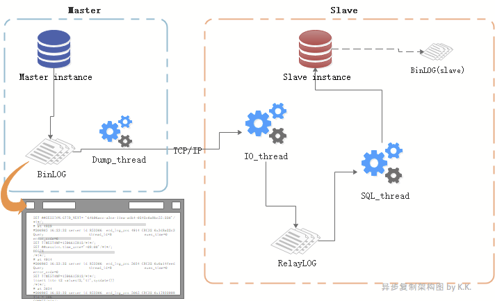
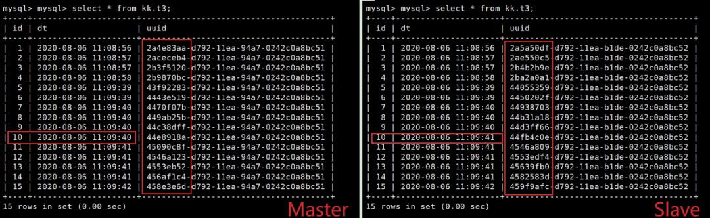
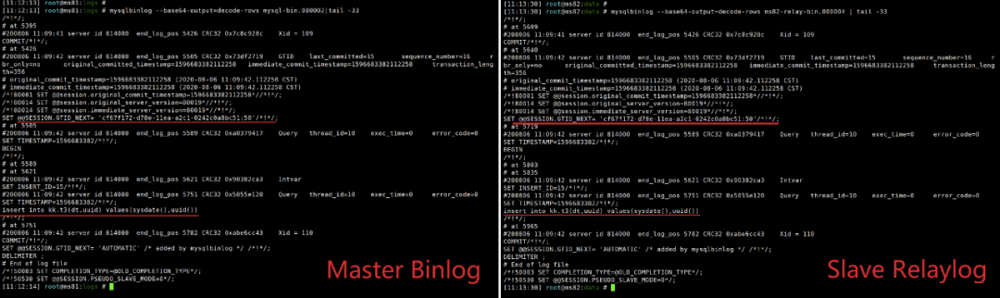
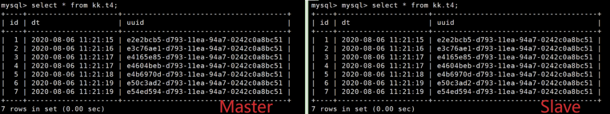
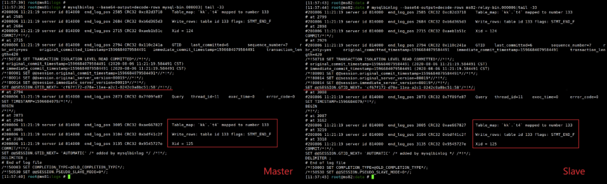
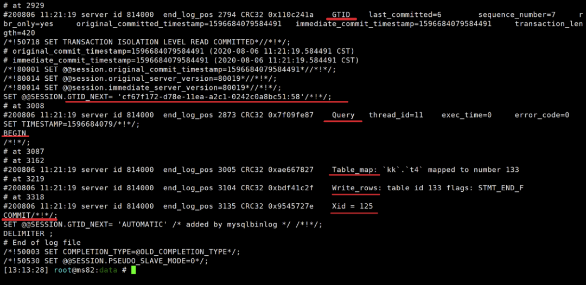

哈~喽各位旅行者，我是最近参加了一个集训营并成功白嫖到一本书正在嗨森ing的拖拖拖拖拖稿成自然的老湿鸡孔个个。

 

在前一次的探索之旅中，我们搭建起来了一个异步复制结构。

在本次探索之旅中，我们尝试使用尽可能简单直白的方式，重新认识一下异步复制的原理，以及其他知识。

 

本次探索之旅的行程单：

- 重说异步复制原理，发现异步复制瓶颈点
- 重说Binlog格式的意义和选择
- 通过Binlog格式的对比实验深刻理解区别
- ROW格式的一些探索

 

来次Go！

 

 **重说异步复制原理**

- Binlog是复制的基础，复制是MySQL应用的核心。
- 所谓复制，不过就是从master读取binlog的事件，然后在slave上对其进行处理、重放。

 

下面我们把探索二中关于复制的一些简短概念，与图结合起来做一下讲解：

 

**MASTER角色：**

- master     instance：主从复制里的“主”节点，复制架构中的数据来源。

- binlog：master     instance产生的binlog，binlog为二进制文件，以event为记录单位。

- dump_thread线程：

- - 一个slave对应一个dump_thread线程。线程启动后，可以通过show      processlist查看到。
  - 当slave的io_thread启动后，master便会为此分配一个dump_thread线程通过TCP协议与slave进行通信，负责读取主节点上的binlog信息并发送给从节点：
  - 主库写binlog成功后，通知dump_thread      线程。
  - dump_thread线程会对binlog上一个读锁，读取binlog内容并发送给slave。
  - dump_thread线程读取完binlog后，便释放对binlog文件的读锁。
  - 当slave停止io_thread后，master的dump_thread依然可以show      processlist查看到，直到master发生新的binlog后，dump_thread线程就消失了。

 

**SLAVE角色：**

- slave     instance：主从复制里的“从”节点，主节点的数据复制到的目标节点。
- io_thread线程：slave上负责接收主节点发送来的binlog，并写入到relay     log。启动io_thread后便开始接收master的binlog。
- relay-log：master     instance的binlog内容发送给slave后，由io_thread写入到relay-log，也叫relay-binlog。其格式和内容与master的binlog几乎一致。
- sql_thread：负责将relay-log里的内容重放的线程。
- binlog(slave)：slave     instance产生的binlog，并不参与到当前的主从复制中（不过slave可以作为另一个架构里的master，这样这个binlog就作为master     binlog啦）。

 

**从异步复制原理我们可以发现，异步复制架构有这样的隐患：**

1. master将事务binlog写入到binlog文件，通知dump线程发送新的binlog内容，然后主库继续处理事务，不会去理会binlog传输至从库节点的状态和结果，传输失败了或者丢了它也不管。
2. 如果master崩溃，此时master上已经提交的事务可能并未传输到slave。如果这时进行主从切换，那么就会发生主从数据不一致的情况（原master数据多了一些）。

 

**实际上，主从复制还有这样的性能瓶颈：**

1. 即使master上使用并行DML，slave只有一个sql_thread进行重放（单线程重放）。

 

**如果这些隐患和瓶颈不解决，MySQL不会风光如此。在这里先挖几个坑，分别是：**

- 使用半同步复制来保证复制可靠性（master会在意binlog的传输结果）
- 使用并行复制机制来提升复制性能（干掉单线程重放瓶颈，让复制再快一点、更快一点！）
            我们在不远的将来，会对它们逐步探索。

 

 

 

**重说****binlog****格式、意义和选择**

 

binlog_format 参数

 

| Property              | Value                  |
| --------------------- | ---------------------- |
| Command-Line  Format  | --binlog-format=format |
| System Variable       | binlog_format          |
| Scope                 | Global, Session        |
| Dynamic               | Yes                    |
| SET_VAR Hint  Applies | No                     |
| Type                  | Enumeration            |
| Default Value         | ROW                    |
| Valid Values          | ROWSTATEMENTMIXED      |

 

statement：

- binlog诞生时便使用的格式，十分古老，十分简洁明了。在binlog中记录SQL语句，因此binlog体积会很小。
- 由于binlog记录的是SQL原文，因此binlog的可读性非常好。
- 由于binlog记录的是SQL原文，某些情况下，SQL每次执行的结果都不一定相同，因此在重放时就经常导致主从数据不一致。

 

row：

- 会根据实际操作的数据行的内容记录动作事件，让操作数据具备唯一性，也因此使binlog体积很大。
- row格式会导致binlog非常大，如：delete     from tb where c1 <= 9000; .statement格式会记录一条SQL：delete from tb where c1     <= 9000; row格式会记录9000条变更日志！每一次变动都会写成日志。
- binlog里事件记录的可读性相比statement格式要差很多，无法从binlog看到执行的SQL。
- 在表有主键的复杂SQL中，复制性能相比statement要更快。

 

mixed：

- 混合模式。通常记录为statement格式，但是在一些不确定的情况下，会记录为row格式。
- 事务级别为RC时，InnoDB表会自动转为row格式记录。
- GTID、MGR都在以row格式为基础。
- NDB Cluster     8.0默认为mixed（不支持statement）
- 某些情况下mixed也会导致不一致问题。

 

建议

**尽量使用row格式。**

 

 

 

**通过对比实验，体会****binlog_format****为****statement****和****row****时的区别，明白为何尽量使用****row****格式**

 

\# 环境信息：#  mysql 8.0.19，一主一从异步复制架构。# 修改master的binlog_format为statement。（这个实验里无需调整slave的binlog_format，想想看为什么？）mysql-master> set binlog_format=statement;Query OK, 0 rows affected (0.00 sec)# binlog_format参数支持session和global级别，别晕。mysql-master> show global variables like "%binlog_format%";+---------------+-------+| Variable_name | Value |+---------------+-------+| binlog_format | ROW  |+---------------+-------+1 row in set (0.01 sec)# binlog_format参数支持session和global级别，别晕。mysql-master> show variables like "%binlog_format%";+---------------+-----------+| Variable_name | Value   |+---------------+-----------+| binlog_format | STATEMENT |+---------------+-----------+1 row in set (0.01 sec)# 建库建表用来实验。mysql-master> create database kk;Query OK, 1 row affected (0.30 sec)mysql-master> create table kk.t3 (id int auto_increment primary key,dt varcharQuery OK, 0 rows affected (0.74 sec)# uuid() 函数会随机生成UUID，mysql-master> insert into kk.t3(dt,uuid) values(sysdate(),uuid());Query OK, 1 row affected, 1 warning (0.08 sec)#重复插入若干次

 

**对比主从结果**：

会发现主从节点发生了数据不一致的情况：id=10的时间不一致，而uuid列则完全不一致。

 

分析binlog和relay-log，可以看到，statement格式的binlog中记录的是完整的SQL，这样在执行一些不可控结果的函数时，二者肯定不一致。

 

 

 

将master的binlog_format调整为row，再次实验：

\# 建立一个新表用来测试mysql-master> create table kk.t4 like kk.t3;Query OK, 0 rows affected (0.96 sec)# 调整binlog格式为rowmysql-master> set binlog_format=row;Query OK, 0 rows affected (0.00 sec)# 切换一下日志，便于后面分析mysql-master> flush logs;Query OK, 0 rows affected (0.25 sec)# 插入若干次数据mysql-master> insert into kk.t4(dt,uuid) values(sysdate(),uuid());Query OK, 1 row affected (0.06 sec)

 

**对比主从结果**：

发现主从两库的kk.t4表数据完全一致，是插入数据不够多以至于没暴露出问题吗？

我们去解析一下binlog和relay-log

 

 

可以发现，binlog及relay-log中这一处记录的并不是SQL语句，而是一个看不太懂的东西。

其实就是这个看不太懂的东西使二者数据版本一致的。

 

 

 

**对ROW格式的进一步探索**

 

事件

row格式下，binlog中并不能看到SQL，只能看到一系列事件（event），

如：一个insert操作在binlog中大致对应6个event：

1. GTID
2. QUERY(begin)
3. ROW_QUERY(可能没有)
4. TABLE_MAP
5. WRITE_ROWS
6. XID(commit)

我们可以通过前面案例中的binlog进行观察，更多的动作对应可以自己尝试探索一下。

 

索引在reply中的利用

在表有主键的复杂SQL中，基于row的复制在性能上相比statement要更快，为什么呢？因为基于row的复制（也叫RBR，row-based replication）对索引有更好的利用。

 

SQL在row格式下对索引的使用原则：

1. sql_thread重放过程中，如果有primary     key，就通过primary key进行记录匹配；
2. 如果没有primary     key，但是有辅助索引，就使用比较长的那个辅助索引进行匹配；
3. 如果连索引都没有，早期版本里就会进行全表扫描。
4. 如果连索引都没有，从8.0开始，会为全表建立hash，进行hash_scan。（8.0.18版本中，该特性成为默认配置，相关配置参数也被废除。）

 

​    innodb里，如果表没有主键，innodb会产生内部隐藏的row_id。

 

简短一些就是：

有主键时用主键，无主键时用辅助索引，索引多时用较长索引做匹配，没有索引时，早期版本全表扫，8.0开始做hash scan。

 

 

 

好了，今天的探索之旅已经抵达终点，对于MySQL复制的原理和binlog格式的区别你有所了解了吗？

 

下一次探索之旅我们计划向着GTID粗发，Go！Go！