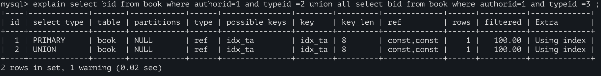

# 单表查询优化

```
create table book( bid int(4) primary key,name varchar(20) not null,authorid int(4) not null,publicid int(4) not null,typeid int(4) not null );
 
insert into book values(1,'tjava',1,1,2),(2,'tc',2,1,2),(3,'wx',3,2,1),(4,'math',4,2,3) ;
```

- 无索引情况下的查询

  > explain select bid from book where typeid in(2,3) and authorid=1  order by typeid desc ;

  

- 创建索引

  > alter table book add index idx_ta (typeid,authorid);

  - 因为bid是主键，二级索引末尾是有隐藏包含主键的，因此创建索引时可以利用这个特性。

  

  - 要确保最左匹配原则

  - 有时in条件会导致索引失效，因此可以将in条件改写，或将in条件滞后一些优先满足最左匹配。

    

    


> 本例中同时出现了Using where; Using index：
>
> 原因是 where  authorid=1 and  typeid in(2,3)中，authorid在索引(authorid,typeid)中，直接在索引表中能查到；
>
> 而typeid虽然也在索引(authorid,typeid)中，但是含in的范围查询需要进一步去server筛选，所以（using where）；
> 如没有了in，则不会出现using where，因为直接从索引中命中，无需进一步筛选。[原理：SQL 执行过程和where条件提取过程](../5.MySQL体系结构/1.MySQL体系结构/2.server层服务层SQL层/4.0.SQL 执行过程和where条件提取过程.md	)
>
> ```
> explain select bid from book where  authorid=1 and  typeid =3 order by typeid desc ;
> ```
>
> 
>
> 不过当in必选时，某些情况下可以这样改写，但需要额外的一次排序的话，可能代价会更大。
>
> ```
>  explain select bid from book where authorid=1 and typeid =2 
>  union all select bid from book where authorid=1 and typeid =3 ;
> ```
>
> 

