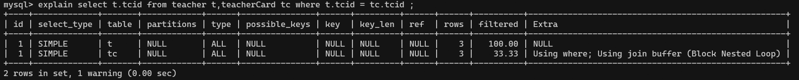

# explain

| explain       |                        |
| ------------- | ---------------------- |
| ID            | 编号                   |
| select_type   | 查询类型               |
| table         | 表                     |
| type          | 类型                   |
| possible_keys | 预测用到的索引         |
| key           | 实际使用的索引         |
| key_len       | 实际使用索引的长度     |
| ref           | 表之间的引用           |
| rows          | 通过索引查询到的数据量 |
| Extra         | 额外的信息             |

## ID

- 同级关联，id值相同时，从上往下执行。上下的顺序一般为数据大小排序。

- id值不同时，值越大优先级越高。

  > 包含嵌套查询的关联，一般id同时有相同和不同的情况，先执行内层。id值不同时，值越大优先级越高。

- 同级join 有索引

  1->1->1->1

  

- 同级join无索引

  1->1->1->1

  

- 嵌套，无索引

  3->2->1

  

  


## select_type 查询类型

- simple:简单查询（不包含子查询(不一定)、union）

  

  

- PRIMARY:包含子查询SQL中的 主查询 （最外层）

- SUBQUERY：包含子查询SQL中的 子查询 （非最外层）

- derived:衍生查询(使用到了临时表)

  > 在from子查询中， 如果有table1 union table2 ，则table1 就是derived,table2就是union

  


  

- union:上例
- union result :告知开发人员，那些表之间存在union查询


## type:索引类型、类型

> system > const > eq_ref > ref > fulltext > ref_or_null > index_merge > unique_subquery > index_subquery > range > index > ALL
>
> **system>const>eq_ref>ref>range>index>all**   
>
> - 要对type进行优化的前提：有索引
>
> - system,const只是理想情况，实际能达到 ref>range
>
> system/const: 结果只有一条数据
> eq_ref:结果多条；但是每条数据是唯一的 ；
> ref：结果多条；但是每条数据是是0或多条 ；


- system（忽略）: 只有一条数据的系统表 ；或 衍生表只有一条数据的主查询	

- const：仅仅能查到一条数据的SQL ,用于Primary key 或unique索引  （类型 与索引类型有关）

  > ```
  > create table test01(tid int(3),tname varchar(20),primary key(tid) );
  > insert into test01 values(1,'a') ;
  > ```
  >
  > 
  >
  > 
  >
  > 删除主键索引，改为二级索引，type便不再是const了
  >
  > 

- eq_ref：唯一性索引：对于每个索引键的查询，返回匹配唯一行数据（有且只有1个，不能多 、不能0个）

  > > select ... from ..where name = ... .常见于唯一索引 和主键索引。
  >
  > 查看数据
  >
  > 
  >
  > 创建索引前的执行计划
  >
  > 
  >
  > 创建pk或uk
  >
  > ```
  > alter table teacherCard add constraint pk_tcid primary key(tcid);
  > alter table teacher add constraint uk_tcid unique index(tcid) ;
  > ```
  >
  > 
  >
  > 以上SQL，用到的索引是 t.tcid,即teacher表中的tcid字段；
  > 如果teacher表的数据个数 和 连接查询的数据个数一致（都是3条数据），则有可能满足eq_ref级别；否则无法满足。
  >
  > **测试一下0个的情况**
  >
  > 
  >
  > 
  >
  > 见：ref
  >
  > 

  

- ref：非唯一性索引，对于每个索引键的查询，返回匹配的所有行（0，多）

  > 唯一索引的0个匹配行，以及非唯一索引的匹配所有行。

  

- range：检索指定范围的行 ,where后面是一个范围查询(between   ,> < >=,     **特殊:in有时候会失效 ，从而转为 无索引all**)

  > ```
  > alter table teacher add index tid_index (tid) ;
  > ```
  >
  > 


  

- index：查询全部索引中数据

  > tid 是索引列， 只需要扫描索引表，不需要所有表中的所有数据
  >
  > 

  

- all：查询全部表中的数据

  > cid不是索引，需要全表所有，即需要所有表中的所有数据
  >
  > 


## possible_keys ：可能用到的索引，是一种预测，不准。

```
explain select t.tname ,tc.tcdesc from teacher t,teacherCard tc where t.tcid= tc.tcid and t.tid = (select c.tid from course c where cname = 'sql') ;
```


如果 possible_key/key是NULL，则说明没用索引


## key ：实际使用到的索引

如果 possible_key/key是NULL，则说明没用索引


## key_len ：索引的长度 ;

​    作用：用于判断复合索引是否被完全使用  （a,b,c）。
create table test_kl
(
​	name char(20) not null default ''
);
alter table test_kl add index index_name(name) ;
explain select * from test_kl where name ='' ;   -- key_len :60
在utf8：1个字符站3个字节  

alter table test_kl add column name1 char(20) ;  --name1可以为null

alter table test_kl add index index_name1(name1) ;
explain select * from test_kl where name1 ='' ; 
--如果索引字段可以为Null,则会使用1个字节用于标识。

drop index index_name on test_kl ;
drop index index_name1 on test_kl ;

增加一个复合索引 
alter table test_kl add index name_name1_index (name,name1) ; 

explain select * from test_kl where name1 = '' ; --121
explain select * from test_kl where name = '' ; --60


varchar(20)
alter table test_kl add column name2 varchar(20) ; --可以为Null 
alter table test_kl add index name2_index (name2) ;

explain select * from test_kl where name2 = '' ;  --63
20*3=60 +  1(null)  +2(用2个字节 标识可变长度)  =63

utf8:1个字符3个字节
gbk:1个字符2个字节
latin:1个字符1个字节

## ref : 注意与type中的ref值区分。

​	作用： 指明当前表所 参照的 字段。
​		select ....where a.c = b.x ;(其中b.x可以是常量，const)

alter table course  add index tid_index (tid) ;

	explain select * from course c,teacher t where c.tid = t.tid  and t.tname ='tw' ;

## rows: 被索引优化查询的 数据个数 (实际通过索引而查询到的 数据个数)

​	explain select * from course c,teacher t  where c.tid = t.tid
​	and t.tname = 'tz' ;

## Extra：

​	(i).using filesort ： 性能消耗大；需要“额外”的一次排序（查询）  。常见于 order by 语句中。
排序：先查询

10个人 根据年龄排序。


create table test02
(
	a1 char(3),
	a2 char(3),
	a3 char(3),
	index idx_a1(a1),
	index idx_a2(a2),
	index idx_a3(a3)
);

explain select * from test02 where a1 ='' order by a1 ;

a1:姓名  a2：年龄


explain select * from test02 where a1 ='' order by a2 ; --using filesort
小结：对于单索引， 如果排序和查找是同一个字段，则不会出现using filesort；如果排序和查找不是同一个字段，则会出现using filesort；
	避免： where哪些字段，就order by那些字段2


复合索引：不能跨列（最佳左前缀）
drop index idx_a1 on test02;
drop index idx_a2 on test02;
drop index idx_a3 on test02;

alter table test02 add index idx_a1_a2_a3 (a1,a2,a3) ;
explain select *from test02 where a1='' order by a3 ;  --using filesort
explain select *from test02 where a2='' order by a3 ; --using filesort
explain select *from test02 where a1='' order by a2 ;
explain select *from test02 where a2='' order by a1 ; --using filesort
	小结：避免： where和order by 按照复合索引的顺序使用，不要跨列或无序使用。


	(ii). using temporary:性能损耗大 ，用到了临时表。一般出现在group by 语句中。
	explain select a1 from test02 where a1 in ('1','2','3') group by a1 ;
	explain select a1 from test02 where a1 in ('1','2','3') group by a2 ; --using temporary
	避免：查询那些列，就根据那些列 group by .
	
	(iii). using index :性能提升; 索引覆盖（覆盖索引）。原因：不读取原文件，只从索引文件中获取数据 （不需要回表查询）
		只要使用到的列 全部都在索引中，就是索引覆盖using index
	
	例如：test02表中有一个复合索引(a1,a2,a3)
		explain select a1,a2 from test02 where a1='' or a2= '' ; --using index   
		
		drop index idx_a1_a2_a3 on test02;
	
		alter table test02 add index idx_a1_a2(a1,a2) ;
		explain select a1,a3 from test02 where a1='' or a3= '' ;


​		
		如果用到了索引覆盖(using index时)，会对 possible_keys和key造成影响：
		a.如果没有where，则索引只出现在key中；
		b.如果有where，则索引 出现在key和possible_keys中。
	
		explain select a1,a2 from test02 where a1='' or a2= '' ;
		explain select a1,a2 from test02  ;
	
	(iii).using where （需要回表查询）
		假设age是索引列
		但查询语句select age,name from ...where age =...,此语句中必须回原表查Name，因此会显示using where.
		
	explain select a1,a3 from test02 where a3 = '' ; --a3需要回原表查询


	(iv). impossible where ： where子句永远为false
		explain select * from test02 where a1='x' and a1='y'  ;