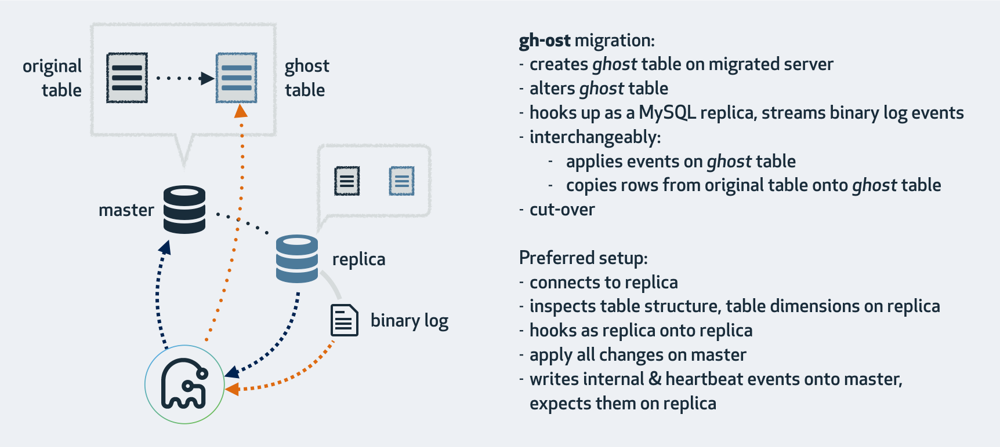

## 背景：

   作为一个DBA，大表的DDL的变更大部分都是使用Percona的[pt-online-schema-change](https://www.percona.com/doc/percona-toolkit/3.0/pt-online-schema-change.html)，本文说明下另一种工具[gh-ost](https://github.com/github/gh-ost)的使用：不依赖于触发器,是因为他是通过模拟从库,在row binlog中获取增量变更,再异步应用到ghost表的。在使用gh-ost之前，可以先看[GitHub 开源的 MySQL 在线更改 Schema 工具【转】](https://www.cnblogs.com/zhoujinyi/p/9187502.html)文章或则官网了解其特性和原理。本文只对使用进行说明。

## 说明：

1）下载安装：https://github.com/github/gh-ost/tags

2）[参数说明](https://github.com/wing324/helloworld_zh/blob/master/MySQL/gh-ost/GitHub开源MySQL Online DDL工具gh-ost参数解析.md)：gh-ost --help


3）使用说明：条件是操作的MySQL上需要的binlog模式是ROW。如果在一个从上测试也必须是ROW模式，还要开启log_slave_updates。根据上面的参数说明按照需求进行调整。

   环境：主库：192.168.163.131；从库：192.168.163.130

[DDL过程](https://yq.aliyun.com/articles/62928)：

```
① 检查有没有外键和触发器。
② 检查表的主键信息。
③ 检查是否主库或从库，是否开启log_slave_updates，以及binlog信息  
④ 检查gho和del结尾的临时表是否存在
⑤ 创建ghc结尾的表，存数据迁移的信息，以及binlog信息等    
---以上校验阶段
⑥ 初始化stream的连接,添加binlog的监听
---以下迁移阶段
⑥ 创建gho结尾的临时表，执行DDL在gho结尾的临时表上
⑦ 开启事务，按照主键id把源表数据写入到gho结尾的表上，再提交，以及binlog apply。
---以下cut-over阶段
⑧ lock源表，rename 表：rename 源表 to 源_del表，gho表 to 源表。
⑨ 清理ghc表。
```


**1. 单实例上DDL**： 单个实例相当于主库，需要开启--allow-on-master参数和ROW模式。

```
gh-ost --user="root" --password="root" --host=192.168.163.131  --database="test" --table="t1"  --alter="ADD COLUMN cc2 varchar(10),add column cc3 int not null default 0 comment 'test' " --allow-on-master  --execute
```

**2. 主从上DDL**：

有2个选择，一是按照1直接在主上执行同步到从上，另一个连接到从库，在主库做迁移（只要保证从库的binlog为ROW即可，主库不需要保证）：

```
gh-ost --user="root" --password="root" --host=192.168.163.130  --database="test" --table="t" --initially-drop-old-table --alter="ADD COLUMN y1 varchar(10),add column y2 int not null default 0 comment 'test' "  --execute
```

此时的操作大致是：

- 行数据在主库上读写
- 读取从库的二进制日志，将变更应用到主库
- 在从库收集表格式，字段&索引，行数等信息
- 在从库上读取内部的变更事件（如心跳事件）
- 在主库切换表

在执行DDL中，从库会执行一次stop/start slave，要是确定从的binlog是ROW的话可以添加参数：--assume-rbr。如果从库的binlog不是ROW，可以用参数--switch-to-rbr来转换成ROW，此时需要注意的是执行完毕之后，binlog模式不会被转换成原来的值。--assume-rbr和--switch-to-rbr参数不能一起使用。

**3. 在从上进行DDL测试**：

```
gh-ost --user="root" --password="root" --host=192.168.163.130  --database="test" --table="t"  --alter="ADD COLUMN abc1 varchar(10),add column abc2 int not null default 0 comment 'test' " --test-on-replica  --switch-to-rbr --execute
```

参数--test-on-replica：在从库上测试gh-ost，包括在从库上数据迁移(migration)，数据迁移完成后stop slave，原表和ghost表立刻交换而后立刻交换回来。继续保持stop slave，使你可以对比两张表。如果不想stop  slave，则可以再添加参数：--test-on-replica-skip-replica-stop

上面三种是gh-ost操作模式，上面的操作中，到最后不会清理临时表，需要手动清理，再下次执行之前果然临时表还存在，则会执行失败，可以通过参数进行删除:

```
--initially-drop-ghost-table:gh-ost操作之前，检查并删除已经存在的ghost表。该参数不建议使用，请手动处理原来存在的ghost表。默认不启用该参数，gh-ost直接退出操作。

--initially-drop-old-table:gh-ost操作之前，检查并删除已经存在的旧表。该参数不建议使用，请手动处理原来存在的ghost表。默认不启用该参数，gh-ost直接退出操作。

--initially-drop-socket-file:gh-ost强制删除已经存在的socket文件。该参数不建议使用，可能会删除一个正在运行的gh-ost程序，导致DDL失败。

--ok-to-drop-table:gh-ost操作结束后，删除旧表，默认状态是不删除旧表，会存在_tablename_del表。
```


还有其他的一些参数，比如：--exact-rowcount、--max-lag-millis、--max-load等等，可以看上面的说明，具体大部分常用的参数命令如下：

```
gh-osc --user= --password= --host= --database= --table= --max-load=Threads_running=30, --chunk-size=1000 --serve-socket-file=/tmp/gh-ost.test.sock --exact-rowcount --allow-on-master/--test-on-replica --initially-drop-ghost-table/--initially-drop-old-table/--initially-drop-socket-file --max-lag-millis= --max-load='Threads_running=100,Threads_connected=500' --ok-to-drop-table
```

**4）额外说明：终止、暂停、限速**

```
gh-ost --user="root" --password="root" --host=192.168.163.131  --database="test" --table="t1"  --alter="ADD COLUMN o2 varchar(10),add column o1 int not null default 0 comment 'test' " --exact-rowcount --serve-socket-file=/tmp/gh-ost.t1.sock --panic-flag-file=/tmp/gh-ost.panic.t1.flag  --postpone-cut-over-flag-file=/tmp/ghost.postpone.t1.flag --allow-on-master  --execute
```

① **标示文件终止运行**：--panic-flag-file

创建文件终止运行，例子中创建**/tmp/gh-ost.panic.t1.flag**文件，终止正在运行的gh-ost，临时文件清理需要手动进行。

② **表示文件禁止cut-over进行**，即禁止表名切换，数据复制正常进行。--postpone-cut-over-flag-file

创建文件延迟cut-over进行，即推迟切换操作。例子中创建**/tmp/ghost.postpone.t1.flag**文件，gh-ost 会完成行复制，但并不会切换表，它会持续的将原表的数据更新操作同步到临时表中。

③ 使用socket监听请求，操作者可以在命令运行后更改相应的参数。--serve-socket-file，--serve-tcp-port（默认关闭）

创建socket文件进行监听，通过接口进行参数调整，当执行操作的过程中发现负载、延迟上升了，不得不终止操作，重新配置参数，如 chunk-size，然后重新执行操作命令，可以通过scoket接口进行**动态调整**。如：

**暂停操作：**

```
#暂停
echo throttle | socat - /tmp/gh-ost.test.t1.sock
#恢复
echo no-throttle | socat - /tmp/gh-ost.test.t1.sock
```

**修改限速参数：**

```
echo chunk-size=100 | socat - /tmp/gh-ost.t1.sock

echo max-lag-millis=200 | socat - /tmp/gh-ost.t1.sock

echo max-load=Thread_running=3 | socat - /tmp/gh-ost.t1.sock
```

 **4）和[pt-online-schema-change](https://www.cnblogs.com/zhoujinyi/p/3491059.html)对比测试**

 \1. 表没有写入并且参数为默认的情况下，二者DDL操作时间差不多，毕竟都是copy row操作。

 \2. 表有大量写入(sysbench)的情况下，因为pt-osc是多线程处理的，很快就能执行完成，而gh-ost是模拟“从”单线程应用的，极端的情况下，DDL操作非常困难的执行完毕。

 **结论：**虽然gh-ost不需要触发器，对于主库的压力和性能影响也小很多，但是针对高并发的场景进行DDL效率还是比pt-osc低，所以还是需要在业务低峰的时候处理。相关的测试可以看[gh-ost和pt-osc性能对比](https://blog.csdn.net/poxiaonie/article/details/75331916)。

 5**）封装脚本：**

环境：M：192.168.163.131（ROW），S：192.168.163.130/132

封装脚本：gh-ost.py

```
#!/bin/env python
# -*- encoding: utf-8 -*-
#----------------------------------------------
# Purpose:     gh-ost
# Created:     2018-06-16
#----------------------------------------------
 
import MySQLdb
import re
import sys
import time
import subprocess
import os
from optparse import OptionParser
 
def calc_time(func):
    def _deco(*args, **kwargs):
        begin_time = time.time()
        func(*args, **kwargs)
        cost_time = time.time() - begin_time
        print 'cost time: %ss' % round(cost_time,2)
    return _deco
 
def get_table_count(conn,dbname,tbname):
    query  = ''' SELECT count(*) FROM %s.%s ''' %(dbname,tbname)
    cursor = conn.cursor()
    cursor.execute(query)
    row_nums = cursor.fetchone()
    cursor.close()
    conn.close()
    return row_nums
 
def online_ddl(conn,ddl_cmd):
    cursor = conn.cursor()
    cursor.execute(ddl_cmd)
    conn.commit()
    cursor.close()
    conn.close() 
 
#@calc_time
def run_cmd(cmd):
    p = subprocess.Popen(cmd, shell=True)
    return p,p.pid
 
def drop_ghost_table(conn,ghost_name_list):
    try:
        cursor = conn.cursor()
        query  = ''' DROP TABLE IF EXISTS %s; ''' %(ghost_name_list)
        cursor.execute(query)
        conn.commit()
        cursor.close()
        conn.close()
    except Exception,e:
        print e
 
if __name__ == "__main__":
    parser = OptionParser()
    parser.add_option("-P", "--Port", help="Port for search", dest="port")
    parser.add_option("-D", "--Dbname", help="the Dbname to use", dest="dbname")
    parser.add_option("-T", "--Table", help="the Table to use", dest="tablename")
 
    (options, args) = parser.parse_args()
 
    if not options.port:
        print 'params port need to apply'
        exit()
 
    if not options.dbname:
        print 'params dbname need to apply'
        exit()
 
    if not options.tablename:
        print 'params tablename need to apply'
        exit()
 
    gh_ost_socket   = '/tmp/gh-ost.%s.%s.sock' %(options.dbname,options.tablename)
    #终止标志
    panic_flag      = '/tmp/gh-ost.panic.%s.%s.flag' %(options.dbname,options.tablename)
    # postpone_flag   =  '/tmp/gh-ost.postpone.%s.%s.flag' %(options.dbname,options.tablename)
    #暂停标志
    throttle_flag   = '/tmp/gh-ost.throttle.%s.%s' %(options.dbname,options.tablename)
#    socket = '/data/%s/tmp/mysql.sock' %(options.port)
    socket = '/var/run/mysqld/mysqld.sock'
 
     
 
    get_conn = MySQLdb.connect(host='192.168.163.131', port=int(options.port), user='root', passwd='root', db=options.dbname, unix_socket=socket,charset='utf8')
    conn     = MySQLdb.connect(host='192.168.163.131', port=int(options.port), user='root', passwd='root', db=options.dbname, unix_socket=socket,charset='utf8')
     
    (table_count,) = get_table_count(get_conn,options.dbname,options.tablename)
    print ("\033[0;32m%s\033[0m" % "表的数量：%s" %table_count)
 
    DDL_CMD    = raw_input('Enter DDL CMD   : ').replace('`','')
 
    gh_command_list = re.split('[ ]+',DDL_CMD)
    if gh_command_list[0].upper() == 'CHANGE' and gh_command_list[1] != gh_command_list[2]:
        print ("\033[0;31m%s\033[0m" % "renamed columns' data will be lost,pt-osc exit...")
        exit()
 
    if table_count <= 10000:
        ddl = ''' ALTER TABLE %s %s ''' %(options.tablename,DDL_CMD)
        print ("\033[0;36m%s\033[0m" %ddl)
        print ("\033[0;32m%s\033[0m" % "online ddl ...")
        online_ddl(conn,ddl)
        print ("\033[0;32m%s\033[0m" % "执行完成 ...")
        exit()
 
    else:
        MAX_LOAD   = raw_input('Enter Max Threads_running【25】 : ')
        if not MAX_LOAD:
            Threads_running = 25
        else:
            try:
                Threads_running = int(MAX_LOAD)
            except ValueError:
                print ("\033[0;31m%s\033[0m" % "输入类型错误,退出...")
                exit()
 
        CHUNK_SIZE = raw_input('Enter Max chunk-size【1000】    : ')
        if not CHUNK_SIZE:
            chunk_size = 1000
        else:
            try:
                chunk_size = int(CHUNK_SIZE)
            except ValueError:
                print ("\033[0;31m%s\033[0m" % "输入类型错误,退出...")
                exit()
 
        print ("\033[0;32m%s\033[0m" % "gh-ost ddl ...")
        #--postpone-cut-over-flag-file=%s
        gh_command = '''/usr/bin/gh-ost --user="root" --password="root" --host=192.168.163.131 --port=%s --database="%s" --table="%s" --allow-on-master  --max-load='Threads_running=%d' --chunk-size=%d --serve-socket-file=%s --panic-flag-file=%s --throttle-additional-flag-file=%s --alter="%s"  --execute ''' %(options.port,options.dbname,options.tablename,Threads_running,chunk_size,gh_ost_socket,panic_flag,throttle_flag,DDL_CMD)
        print ("\033[0;36m%s\033[0m" %gh_command)
 
     
        child,pid = run_cmd(gh_command)
        print ("\033[0;31mgh-ost's PID：%s\033[0m" %pid)
        print ("\033[0;33m创建：【touch %s】文件，暂停DDL ...\033[0m" %throttle_flag)
        try:
            child.wait()
        except:
            child.terminate()
            #clean
            ghost_name_list = '_%s_ghc,_%s_gho'  %(options.tablename,options.tablename)
            drop_ghost_table(conn,ghost_name_list)
            if os.path.exists(gh_ost_socket):
                os.system('rm -r %s' %gh_ost_socket)
                print ("\033[0;32m%s\033[0m" % "清理完成 ...")
                exit()
            print ("\033[0;32m%s\033[0m" % "清理完成 ...")
            exit()
        finally :
            pass
```


运行：

```
root@test2:~# python gh-ost.py -P3306 -Dtest -Tzjy
表的数量：1310720
Enter DDL CMD   : ADD COLUMN q1 varchar(10),ADD COLUMN q2 varchar(10)
Enter Max Threads_running【25】 : 10
Enter Max chunk-size【1000】    : 200
gh-ost ddl ...
/usr/bin/gh-ost --user="root" --password="root" --host=192.168.163.131 --port=3306 --database="test" --table="zjy" --allow-on-master  --max-load='Threads_running=10' --chunk-size=200 --serve-socket-file=/tmp/gh-ost.test.zjy.sock --panic-flag-file=/tmp/gh-ost.panic.test.zjy.flag --throttle-additional-flag-file=/tmp/gh-ost.throttle.test.zjy --alter="ADD COLUMN q1 varchar(10),ADD COLUMN q2 varchar(10)"  --execute
gh-ost's PID：2105
创建：【touch /tmp/gh-ost.throttle.test.zjy】文件，暂停DDL ...
2018/06/17 14:37:37 binlogsyncer.go:79: [info] create BinlogSyncer with config {99999 mysql 192.168.163.131 3306 root   false false <nil>}
2018/06/17 14:37:37 binlogsyncer.go:246: [info] begin to sync binlog from position (mysql-bin.000013, 31197930)
2018/06/17 14:37:37 binlogsyncer.go:139: [info] register slave for master server 192.168.163.131:3306
2018/06/17 14:37:37 binlogsyncer.go:573: [info] rotate to (mysql-bin.000013, 31197930)
# Migrating `test`.`zjy`; Ghost table is `test`.`_zjy_gho`
# Migrating test2:3306; inspecting test2:3306; executing on test2
# Migration started at Sun Jun 17 14:37:37 +0800 2018
# chunk-size: 200; max-lag-millis: 1500ms; dml-batch-size: 10; max-load: Threads_running=10; critical-load: ; nice-ratio: 0.000000
# throttle-additional-flag-file: /tmp/gh-ost.throttle.test.zjy
# panic-flag-file: /tmp/gh-ost.panic.test.zjy.flag
# Serving on unix socket: /tmp/gh-ost.test.zjy.sock
Copy: 0/1305600 0.0%; Applied: 0; Backlog: 0/1000; Time: 0s(total), 0s(copy); streamer: mysql-bin.000013:31199542; State: migrating; ETA: N/A
Copy: 0/1305600 0.0%; Applied: 0; Backlog: 0/1000; Time: 1s(total), 1s(copy); streamer: mysql-bin.000013:31202866; State: migrating; ETA: N/A
Copy: 44400/1305600 3.4%; Applied: 0; Backlog: 0/1000; Time: 2s(total), 2s(copy); streamer: mysql-bin.000013:33352548; State: migrating; ETA: 56s
Copy: 91200/1305600 7.0%; Applied: 0; Backlog: 0/1000; Time: 3s(total), 3s(copy); streamer: mysql-bin.000013:35598132; State: migrating; ETA: 39s
Copy: 135200/1305600 10.4%; Applied: 0; Backlog: 0/1000; Time: 4s(total), 4s(copy); streamer: mysql-bin.000013:37727925; State: migrating; ETA: 34s
Copy: 174000/1305600 13.3%; Applied: 0; Backlog: 0/1000; Time: 5s(total), 5s(copy); streamer: mysql-bin.000013:39588956; State: migrating; ETA: 32s
Copy: 212200/1305600 16.3%; Applied: 0; Backlog: 0/1000; Time: 6s(total), 6s(copy); streamer: mysql-bin.000013:41430090; State: migrating; ETA: 30s
Copy: 254800/1305600 19.5%; Applied: 0; Backlog: 0/1000; Time: 7s(total), 7s(copy); streamer: mysql-bin.000013:43483555; State: migrating; ETA: 28s
Copy: 303600/1305600 23.3%; Applied: 0; Backlog: 0/1000; Time: 8s(total), 8s(copy); streamer: mysql-bin.000013:45834978; State: migrating; ETA: 26s
Copy: 351200/1305600 26.9%; Applied: 0; Backlog: 0/1000; Time: 9s(total), 9s(copy); streamer: mysql-bin.000013:48128675; State: migrating; ETA: 24s
Copy: 401400/1305600 30.7%; Applied: 0; Backlog: 0/1000; Time: 10s(total), 10s(copy); streamer: mysql-bin.000013:50547454; State: migrating; ETA: 22s
Copy: 451200/1305600 34.6%; Applied: 0; Backlog: 0/1000; Time: 11s(total), 11s(copy); streamer: mysql-bin.000013:52946991; State: migrating; ETA: 20s
Copy: 490000/1305600 37.5%; Applied: 0; Backlog: 0/1000; Time: 12s(total), 12s(copy); streamer: mysql-bin.000013:54817320; State: migrating; ETA: 19s
Copy: 529600/1305600 40.6%; Applied: 0; Backlog: 0/1000; Time: 13s(total), 13s(copy); streamer: mysql-bin.000013:56735431; State: migrating; ETA: 19s
Copy: 589200/1305600 45.1%; Applied: 0; Backlog: 0/1000; Time: 14s(total), 14s(copy); streamer: mysql-bin.000013:59606450; State: migrating; ETA: 17s
Copy: 639400/1305600 49.0%; Applied: 0; Backlog: 0/1000; Time: 15s(total), 15s(copy); streamer: mysql-bin.000013:62025561; State: migrating; ETA: 15s
Copy: 695200/1305600 53.2%; Applied: 0; Backlog: 0/1000; Time: 16s(total), 16s(copy); streamer: mysql-bin.000013:64704138; State: migrating; ETA: 14s
Copy: 751200/1305600 57.5%; Applied: 0; Backlog: 0/1000; Time: 17s(total), 17s(copy); streamer: mysql-bin.000013:67401961; State: migrating; ETA: 12s
Copy: 803800/1305600 61.6%; Applied: 0; Backlog: 0/1000; Time: 18s(total), 18s(copy); streamer: mysql-bin.000013:69935884; State: migrating; ETA: 11s
Copy: 856400/1305600 65.6%; Applied: 0; Backlog: 0/1000; Time: 19s(total), 19s(copy); streamer: mysql-bin.000013:72470455; State: migrating; ETA: 9s
Copy: 907400/1305600 69.5%; Applied: 0; Backlog: 0/1000; Time: 20s(total), 20s(copy); streamer: mysql-bin.000013:74927401; State: migrating; ETA: 8s
Copy: 958800/1305600 73.4%; Applied: 0; Backlog: 0/1000; Time: 21s(total), 21s(copy); streamer: mysql-bin.000013:77404243; State: migrating; ETA: 7s
Copy: 999200/1305600 76.5%; Applied: 0; Backlog: 0/1000; Time: 22s(total), 22s(copy); streamer: mysql-bin.000013:79351223; State: migrating; ETA: 6s
Copy: 1009600/1305600 77.3%; Applied: 0; Backlog: 0/1000; Time: 23s(total), 23s(copy); streamer: mysql-bin.000013:79855229; State: migrating; ETA: 6s
Copy: 1059600/1305600 81.2%; Applied: 0; Backlog: 0/1000; Time: 24s(total), 24s(copy); streamer: mysql-bin.000013:82264712; State: migrating; ETA: 5s
Copy: 1107200/1305600 84.8%; Applied: 0; Backlog: 0/1000; Time: 25s(total), 25s(copy); streamer: mysql-bin.000013:84558411; State: migrating; ETA: 4s
Copy: 1147000/1305600 87.9%; Applied: 0; Backlog: 0/1000; Time: 26s(total), 26s(copy); streamer: mysql-bin.000013:86486148; State: migrating; ETA: 3s
Copy: 1198000/1305600 91.8%; Applied: 0; Backlog: 0/1000; Time: 27s(total), 27s(copy); streamer: mysql-bin.000013:88943747; State: migrating; ETA: 2s
Copy: 1245400/1305600 95.4%; Applied: 0; Backlog: 0/1000; Time: 28s(total), 28s(copy); streamer: mysql-bin.000013:91218202; State: migrating; ETA: 1s
Copy: 1286600/1305600 98.5%; Applied: 0; Backlog: 0/1000; Time: 29s(total), 29s(copy); streamer: mysql-bin.000013:93203991; State: migrating; ETA: 0s
Copy: 1310720/1310720 100.0%; Applied: 0; Backlog: 0/1000; Time: 29s(total), 29s(copy); streamer: mysql-bin.000013:94366846; State: migrating; ETA: due
Copy: 1310720/1310720 100.0%; Applied: 0; Backlog: 1/1000; Time: 30s(total), 29s(copy); streamer: mysql-bin.000013:94369042; State: migrating; ETA: due
# Migrating `test`.`zjy`; Ghost table is `test`.`_zjy_gho`
# Migrating test2:3306; inspecting test2:3306; executing on test2
# Migration started at Sun Jun 17 14:37:37 +0800 2018
# chunk-size: 200; max-lag-millis: 1500ms; dml-batch-size: 10; max-load: Threads_running=10; critical-load: ; nice-ratio: 0.000000
# throttle-additional-flag-file: /tmp/gh-ost.throttle.test.zjy
# panic-flag-file: /tmp/gh-ost.panic.test.zjy.flag
# Serving on unix socket: /tmp/gh-ost.test.zjy.sock
Copy: 1310720/1310720 100.0%; Applied: 0; Backlog: 0/1000; Time: 30s(total), 29s(copy); streamer: mysql-bin.000013:94371928; State: migrating; ETA: due
2018/06/17 14:38:08 binlogsyncer.go:107: [info] syncer is closing...
2018/06/17 14:38:08 binlogstreamer.go:47: [error] close sync with err: sync is been closing... （这里的error不影响使用，重复关闭了sync，等作者修复）
2018/06/17 14:38:08 binlogsyncer.go:122: [info] syncer is closed
# Done
```


## 总结：

gh-ost 放弃了触发器，使用 binlog 来同步。gh-ost 作为一个伪装的备库，可以从主库/备库上拉取 binlog，过滤之后重新应用到主库上去，相当于主库上的增量操作通过 binlog 又应用回主库本身，不过是应用在幽灵表上。



**gh-ost 首先连接到主库上，根据 alter 语句创建幽灵表，然后作为一个”备库“连接到其中一个真正的备库上，一边在主库上拷贝已有的数据到幽灵表，一边从备库上拉取增量数据的 binlog，然后不断的把 binlog 应用回主库。**图中 cut-over 是最后一步，锁住主库的源表，等待 binlog 应用完毕，然后替换 gh-ost 表为源表。gh-ost  在执行中，会在原本的 binlog event 里面增加以下 hint  和心跳包，用来控制整个流程的进度，检测状态等。这种架构带来诸多好处，例如：

- **整个流程异步执行**，对于源表的增量数据操作没有额外的开销，高峰期变更业务对性能影响小。
- **降低写压力**，触发器操作都在一个事务内，gh-ost 应用 binlog 是另外一个连接在做。
- **可停止**，binlog 有位点记录，如果变更过程发现主库性能受影响，可以立刻停止拉binlog，停止应用 binlog，稳定之后继续应用。
- 可测试，gh-ost 提供了测试功能，可以连接到一个备库上直接做 Online DDL，在备库上观察变更结果是否正确，再对主库操作，心里更有底。

注意： sync error的错误：https://github.com/github/gh-ost/issues/597

## 参考文档：

https://github.com/github/gh-ost

[GitHub 开源的 MySQL 在线更改 Schema 工具](https://segmentfault.com/a/1190000006158503)

[Online DDL 工具 gh-ost 支持阿里云 RDS](http://mysql.taobao.org/monthly/2018/05/02/)

[gh-ost：不一样的在线表结构变更](https://yq.aliyun.com/articles/62928)

[GitHub开源MySQL Online DDL工具gh-ost参数解析](https://github.com/wing324/helloworld_zh/blob/master/MySQL/gh-ost/GitHub开源MySQL Online DDL工具gh-ost参数解析.md) 