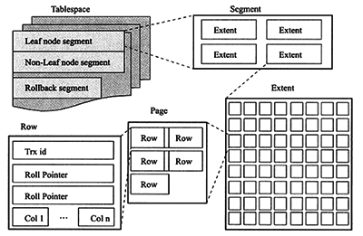
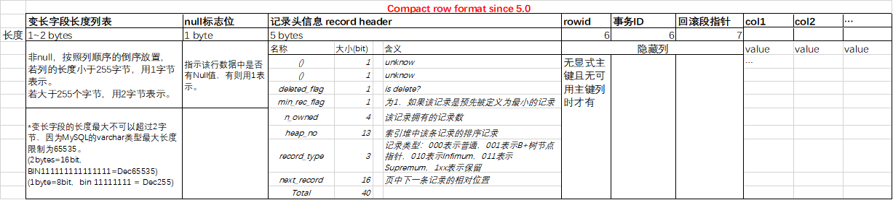
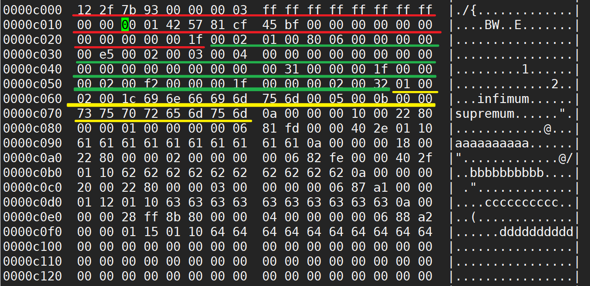
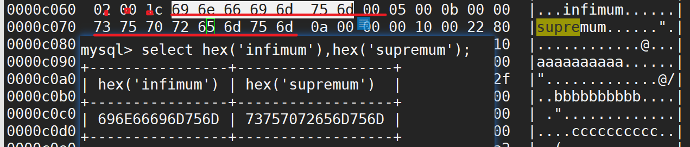
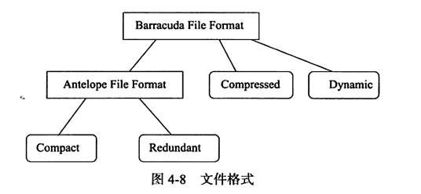

[TOC]

## IOT表(index organized table)

InnoDB表为IOT表。表都是根据主键顺序组织存放的。

InnoDB表中，每张表都有个主键，如果创建表时未显式指定主键，则InnoDB会按照下面方式选择或创建主键：

- 表中有非空的唯一索引，则该列认作主键

- 表中无显式主键，无非空的唯一索引，InnoDB自动创建6bytes大小的指针(DB_ROW_ID)。

  > DB_ROW_ID（实例级别，6B。全实例里的表共同使用这个ID队列。）
  >
  > [聚集索引、rowid、DB_ROW_ID](../MySQL/6.MySQL索引/1.MySQL索引基础/06.聚集索引(Clustered).md)

如果表中最终有主键列（不管是显式声明，还是自动选择非空唯一索引列），且主键列为单列，都可以使用`_rowid` 作为别名来引用主键列。（多列组成的索引不适用`_rowid` 别名）

> ```
> mysql> create table k1 (
>     -> a int not null,
>     -> b int,
>     -> c int not null,
>     -> d int not null,
>     -> unique key(a),
>     -> unique key(b),
>     -> unique key(c,d));
> Query OK, 0 rows affected (0.70 sec)
> 
> mysql> insert into k1 select 5,6,7,8;
> Query OK, 1 row affected (0.18 sec)
> Records: 1  Duplicates: 0  Warnings: 0
> 
> mysql> select a,b,c,d,_rowid from k1;
> +---+------+---+---+--------+
> | a | b    | c | d | _rowid |
> +---+------+---+---+--------+
> | 1 |    2 | 3 | 4 |      1 |
> | 5 |    6 | 7 | 8 |      5 |
> +---+------+---+---+--------+
> 2 rows in set (0.00 sec)
> 
> --最终选择单列的、非空的、唯一的列a作为主键了。
> ```
>
> 


## InnoDB逻辑存储结构




### 表空间

共享表空间、`innodb_file_per_table` 等，已经在文件一章中有介绍，[传送门](./12.文件.md)。

启用独立表空间后，每张表的表空间内存放的知识数据、索引和change buffer bitmap，其他的数据如：undo信息，change buffer索引页，系统事务信息、double write buffer等还是存放在原来的共享表空间内。因此，启用了独立表空间参数后，共享表空间依然会增大。增大后即使释放undo，共享表空间文件也不会回缩，仅将释放的undo空间标记为可重用。

> 可以使用小工具 py_innodb_page_info 来查看表空间中各页的类型和信息。
>
> [david-mysql-tools](https://github.com/pyb0815/david-mysql-tools)
>
> > python py_innodb_page_info.py <path>/ibdata1
>
> ```
> [11:09:30] root@ms51:py_innodb_page_type # python py_innodb_page_info.py /d
> ata/mysql/mysql3307/data/ibdata1
> Total number of page: 33408:
> Insert Buffer Bitmap: 2
> System Page: 99
> Transaction system Page: 1
> Freshly Allocated Page: 2126
> Undo Log Page: 31078
> File Segment inode: 5
> B-tree Node: 93
> File Space Header: 3
> 扩展描述页: 1
> ```
>
> 


### 段

数据段、索引段、回滚段。

IOT表数据即索引，索引即数据，因此数据段即为B+树的叶子节点，索引段为B+树的非叶子节点。

回滚段后续再说。


### 区

任何情况下每个区大小都为1MB，为了保证区中页的连续性，InnoDB一次从磁盘申请4~5个区。默认情况下InnoDB页大小为16K，即每个区有64个页。按OS block为4k算，一个区为256个OS block。

压缩页，每个页大小可通过参数`key_block_size` （远古版本）设置为2K、4K、8K，因此每个区对应的页数量就是512、256、128。 如今可以使用参数`innodb_page_size`设置默认页大小为4K、8K，但是页中的数据不是压缩的。这时区中页的数量同样也是256、128。总体来说不管页配置如何，一个区的大小都是1MB。


启用`innodb_file_per_table`后，创建的表默认大小为96K

```
mysql> create table k2 (id int);
exiQuery OK, 0 rows affected (0.57 sec)

[11:56:54] root@ms51:kk # ll -h
-rw-r----- 1 mysql mysql  8.4K Jan 11 11:56 k2.frm
-rw-r----- 1 mysql mysql   96K Jan 11 11:56 k2.ibd
```

为什么初始下只用了96k（6个页）呢？在每个段开始时，先用32个页大小的碎片页（fragment page）来存放数据，每次根据需求按页扩展，使用完这些页后才是64个连续页的申请。目的是对于小表或者undo，可以在开始时申请较少的空间，节省磁盘开销。

```
[12:29:44] root@ms51:py_innodb_page_type # ll -h  /data/mysql/mysql3307/data/kk/k3.ibd 
-rw-r----- 1 mysql mysql 592K Jan 11 12:29 /data/mysql/mysql3307/data/kk/k3.ibd
[12:29:48] root@ms51:py_innodb_page_type # ll -h  /data/mysql/mysql3307/data/kk/k3.ibd 
-rw-r----- 1 mysql mysql 2.0M Jan 11 12:29 /data/mysql/mysql3307/data/kk/k3.ibd

[12:30:39] root@ms51:py_innodb_page_type # python py_innodb_page_info.py /data/mysql/mysql3307/data/kk/k3.ibd  
Total number of page: 128:
Freshly Allocated Page: 91
Insert Buffer Bitmap: 1
File Space Header: 1
B-tree Node: 34
File Segment inode: 1


mysql> select count(*) from k3;
+----------+
| count(*) |
+----------+
|       64 |
+----------+
1 row in set (0.00 sec)


可以看出，从96k扩展到592k之后，再次扩展就申请了1M多的空间。（每个页在案例中最多2条记录，每个页16k，592-96=496,496k/16k=31 ，初始分配1个。64/2=32页，但是可以看出来， 第32次申请空间时， 并不是分配了1M，而是1M多（2.0M-约600k）。
```


### 页

innoDB磁盘管理的最小单位。通过参数`innodb_page_size`将页设置为4、8、16k后，则所有表中页的大小都为该值，且不可再次修改，除非使用mysqldump导出并导入新库。


InnoDB中常见的页类型有：

- 数据页 B-tree Node
- undo页 undo log page
- 系统页 system page
- 事务数据页 transaction system page
- 插入缓冲位图页 insert buffer bitmap
- 插入缓冲空闲列表页 insert buffer free list
- 未压缩的二进制大对象页 uncompressed blob page
- 压缩的二进制大对象页 compressed blob page


### 行

InnoDB是面向列(row-oriented)的，也就是说数据是按照行进行存放的。

**每个页存放的行记录也是有硬性定义的，最多允许存放16k/2-200行记录，即 7992行。**

有row-oriented，就有column-oriented，MySQL infobright引擎就是列存放的。其他的自行探索。


## InnoDB行记录格式

目前来看，行记录格式分为两类

- Antelope
  - Redundant（before mysql 5.0)
  - Compact(since mysql 5.0)
- Barracuda
  - Compressed
  - Dynamic ( since mysql 5.7)

### compact

5.0开始支持compact格式

Compact，5.0之后默认行格式。将长字段长度超过768字节的部分由off-page存储



> ```
> CREATE TABLE `k4` (
> `col1` varchar(5) DEFAULT NULL,
> `col2` varchar(10) DEFAULT NULL,
> `col3` char(10) DEFAULT NULL,
> `col4` varchar(10) DEFAULT NULL
> ) ENGINE=InnoDB DEFAULT CHARSET=utf8mb4 ROW_FORMAT=COMPACT
> 
> mysql> insert into k4 values( 'a','bb','ccc','dddd');
> Query OK, 1 row affected (0.06 sec)
> 
> [16:21:08] root@ms51:kk # hexdump -C -v k4.ibd > /tmp/k4.hex
> 
> 0000c060  02 00 1f 69 6e 66 69 6d  75 6d 00 02 00 0b 00 00  |...infimum......|
> 0000c070  73 75 70 72 65 6d 75 6d  04 0a 02 01 00 00 00 10  |supremum........|
> 0000c080  ff ee 00 00 00 00 02 01  00 00 00 00 06 50 d7 00  |.............P..|
> 0000c090  00 01 45 01 10 61 62 62  63 63 63 20 20 20 20 20  |..E..abbccc     |
> 0000c0a0  20 20 64 64 64 64 00 00  00 00 00 00 00 00 00 00  |  dddd..........|
> 0000c0b0  00 00 00 00 00 00 00 00  00 00 00 00 00 00 00 00  |................|
> 
> 
> ```
>
> > 使用vim 进入了十六进制查看
> >
> > ```
> > vim -b filename
> > 
> > :%! xxd
> > ```
> >
>
> 按照格式来摘取一下各part(第一条)
>
> | col              | col_v | data length | data                                             |
> | ---------------- | ----- | ----------- | ------------------------------------------------ |
> | col4             | dddd  | varchar(10) | 64 64 64 64                                      |
> | col3             | ccc   | char(10)    | 63 63 63 20 20 20 20 20 20 20                    |
> | col2             | bb    | varchar(10) | 62 62                                            |
> | col1             | a     | varchar(5)  | 61                                               |
> | roll PTR         |       | 7 bytes     | d7 00 00 01 45 01 10                             |
> | Trx_ID           |       | 6 bytes     | 00 00 00 00 06 50                                |
> | RowID            |       | 6 bytes     | 00 00 00 00 02 01                                |
> | Rec. Header      |       | 5 bytes     | 00 00 10 ff ee                                   |
> | Null flag        |       | 1 byte      | 00                                               |
> | 变长字段长度列表 |       |             | 04 0a 02 01 / (4,10,2,1 -> col4,col3,col2,col1 ) |
>
> 第二条记录插入后，再次解析数据文件
>
> ```
> mysql> insert into k4 values( 'e','ff','ggg','hhhh');
> Query OK, 1 row affected (0.28 sec)
> 
> 0000c060  02 00 1f 69 6e 66 69 6d  75 6d 00 03 00 0b 00 00  |...infimum......|
> 0000c070  73 75 70 72 65 6d 75 6d  04 0a 02 01 00 00 00 10  |supremum........|
> 0000c080  00 2e 00 00 00 00 02 01  00 00 00 00 06 50 d7 00  |.............P..|
> 0000c090  00 01 45 01 10 61 62 62  63 63 63 20 20 20 20 20  |..E..abbccc     |
> 0000c0a0  20 20 64 64 64 64 04 0a  02 01 00 00 00 18 ff c0  |  dddd..........|
> 0000c0b0  00 00 00 00 02 02 00 00  00 00 06 51 d8 00 00 01  |...........Q....|
> 0000c0c0  46 01 10 65 66 66 67 67  67 20 20 20 20 20 20 20  |F..effggg       |
> 0000c0d0  68 68 68 68 00 00 00 00  00 00 00 00 00 00 00 00  |hhhh............|
> ```
>
> | col                    | col_v | data length | data                           | data_row1            |
> | ---------------------- | ----- | ----------- | ------------------------------ | -------------------- |
> | col4                   | hhhh  | varchar(10) | 68 68 68 68                    | --                   |
> | col3                   | ggg   | char(10)    | 67 67  67 20 20 20 20 20 20 20 | --                   |
> | col2                   | ff    | varchar(10) | 66 66                          | --                   |
> | col1                   | e     | varchar(5)  | 65                             | --                   |
> | roll PTR               |       | 7 bytes     | d8 00 00 01 46 01 10           | d7 00 00 01 45 01 10 |
> | Trx_ID                 |       | 6 bytes     | 00 00 00 00 06 51              | 00 00 00 00 06 50    |
> | RowID                  |       | 6 bytes     | 00 00 00 00 02 02              | 00 00 00 00 02 01    |
> | Rec. Header            |       | 5 bytes     | 00 00 18 ff c0                 | 00 00 10 ff ee       |
> | Null flag              |       | 1 byte      | 00                             | --                   |
> | 变长字段长度列表(倒序) |       |             | 04 0a  02 01                   | --                   |
>
> 插入第三行，这次包含null
>
> ```
> mysql> insert into k4 values( 'i',null,null,'ii');
> Query OK, 1 row affected (0.26 sec)
> 
> 0000c060  02 00 1f 69 6e 66 69 6d  75 6d 00 04 00 0b 00 00  |...infimum......|
> 0000c070  73 75 70 72 65 6d 75 6d  04 0a 02 01 00 00 00 10  |supremum........|
> 0000c080  00 2e 00 00 00 00 02 01  00 00 00 00 06 50 d7 00  |.............P..|
> 0000c090  00 01 45 01 10 61 62 62  63 63 63 20 20 20 20 20  |..E..abbccc     |
> 0000c0a0  20 20 64 64 64 64 04 0a  02 01 00 00 00 18 00 2c  |  dddd.........,|
> 0000c0b0  00 00 00 00 02 02 00 00  00 00 06 51 d8 00 00 01  |...........Q....|
> 0000c0c0  46 01 10 65 66 66 67 67  67 20 20 20 20 20 20 20  |F..effggg       |
> 0000c0d0  68 68 68 68 02 01 06 00  00 20 ff 94 00 00 00 00  |hhhh..... ......|
> 0000c0e0  02 03 00 00 00 00 06 56  db 00 00 01 47 01 10 69  |.......V....G..i|
> 0000c0f0  69 69 00 00 00 00 00 00  00 00 00 00 00 00 00 00  |ii..............|
> ```
>
> | col                    | col_v | data length | data                           | data_row2                      | data_row1            |
> | ---------------------- | ----- | ----------- | ------------------------------ | ------------------------------ | -------------------- |
> | col4                   | ii    | varchar(10) | 69 69                          | 68 68 68 68                    | --                   |
> | col3                   | null  | char(10)    | null                           | 67 67  67 20 20 20 20 20 20 20 | --                   |
> | col2                   | null  | varchar(10) | null                           | 66 66                          | --                   |
> | col1                   | i     | varchar(5)  | 69                             | 65                             | --                   |
> | roll PTR               |       | 7 bytes     | db 00 00 01 47 01 10           | d8 00 00 01 46 01 10           | d7 00 00 01 45 01 10 |
> | Trx_ID                 |       | 6 bytes     | 00 00 00 00 06 56              | 00 00 00 00 06 51              | 00 00 00 00 06 50    |
> | RowID                  |       | 6 bytes     | 00 00 00 00 02 03              | 00 00 00 00 02 02              | 00 00 00 00 02 01    |
> | Rec. Header            |       | 5 bytes     | 00  00 20 ff 94                | 00 00 18 ff c0                 | 00 00 10 ff ee       |
> | Null flag              |       | 1 byte      | 06                             | 00                             | --                   |
> | 变长字段长度列表(倒序) |       |             | 02 01/ (col4,col1. 2和3为null) | 04 0a  02 01                   | --                   |
>
> 插入第四行，也包含null
>
> ```
> mysql> insert into k4 values( 'j','jj',null,null);
> Query OK, 1 row affected (0.17 sec)
> 
> 0000c070  73 75 70 72 65 6d 75 6d  04 0a 02 01 00 00 00 10  |supremum........|
> 0000c080  00 2e 00 00 00 00 02 01  00 00 00 00 06 50 d7 00  |.............P..|
> 0000c090  00 01 45 01 10 61 62 62  63 63 63 20 20 20 20 20  |..E..abbccc     |
> 0000c0a0  20 20 64 64 64 64 04 0a  02 01 00 00 00 18 00 2c  |  dddd.........,|
> 0000c0b0  00 00 00 00 02 02 00 00  00 00 06 51 d8 00 00 01  |...........Q....|
> 0000c0c0  46 01 10 65 66 66 67 67  67 20 20 20 20 20 20 20  |F..effggg       |
> 0000c0d0  68 68 68 68 02 01 06 00  00 20 00 1e 00 00 00 00  |hhhh..... ......|
> 0000c0e0  02 03 00 00 00 00 06 56  db 00 00 01 47 01 10 69  |.......V....G..i|
> 0000c0f0  69 69 02 01 0c 00 00 28  ff 76 00 00 00 00 02 04  |ii.....(.v......|
> 0000c100  00 00 00 00 06 57 dc 00  00 01 48 01 10 6a 6a 6a  |.....W....H..jjj|
> 0000c110  00 00 00 00 00 00 00 00  00 00 00 00 00 00 00 00  |................|
> 
> ```
>
> | col                    | col_v | data length | data                  | data_row3                           | data_row2                      | data_row1            |
> | ---------------------- | ----- | ----------- | --------------------- | ----------------------------------- | ------------------------------ | -------------------- |
> | col4                   | null  | varchar(10) | null                  | 69 69                               | 68 68 68 68                    | --                   |
> | col3                   | null  | char(10)    | null                  | null                                | 67 67  67 20 20 20 20 20 20 20 | --                   |
> | col2                   | jj    | varchar(10) | 6a 6a                 | null                                | 66 66                          | --                   |
> | col1                   | j     | varchar(5)  | 6a                    | 69                                  | 65                             | --                   |
> | roll PTR               |       | 7 bytes     | dc 00  00 01 48 01 10 | db 00 00 01 47 01 10                | d8 00 00 01 46 01 10           | d7 00 00 01 45 01 10 |
> | Trx_ID                 |       | 6 bytes     | 00 00 00 00 06 57     | 00 00 00 00 06 56                   | 00 00 00 00 06 51              | 00 00 00 00 06 50    |
> | RowID                  |       | 6 bytes     | 00 00 00 00 02 04     | 00 00 00 00 02 03                   | 00 00 00 00 02 02              | 00 00 00 00 02 01    |
> | Rec. Header            |       | 5 bytes     | 00 00 28  ff 76       | 00  00 20 ff 94                     | 00 00 18 ff c0                 | 00 00 10 ff ee       |
> | Null flag              |       | 1 byte      | 0c                    | 06/ = Bin 110，倒过来第2、3位为null | 00                             | --                   |
> | 变长字段长度列表(倒序) |       |             | 02 01                 | 02 01                               | 04 0a  02 01                   | --                   |
>
> 可以看出来， null真的不占用空间（除了一个null flag）。
>
> 变长字段长度列表个人理解是这一行的数据中，按列倒序的顺序，将实际value长度做好记录。所以char类型不管是否够长，都会是0a，也就是10长度。
>
> 下面做一个测试，col3 char(10)为null，其他列都插入长度5的数据
>
> ```
> mysql> insert into k4 values( 'kkkkk','kkkkk',null,'kkkkk');
> Query OK, 1 row affected (0.17 sec)
> 
> 0000c070  73 75 70 72 65 6d 75 6d  04 0a 02 01 00 00 00 10  |supremum........|
> 0000c080  00 2e 00 00 00 00 02 01  00 00 00 00 06 50 d7 00  |.............P..|
> 0000c090  00 01 45 01 10 61 62 62  63 63 63 20 20 20 20 20  |..E..abbccc     |
> 0000c0a0  20 20 64 64 64 64 04 0a  02 01 00 00 00 18 00 2c  |  dddd.........,|
> 0000c0b0  00 00 00 00 02 02 00 00  00 00 06 51 d8 00 00 01  |...........Q....|
> 0000c0c0  46 01 10 65 66 66 67 67  67 20 20 20 20 20 20 20  |F..effggg       |
> 0000c0d0  68 68 68 68 02 01 06 00  00 20 00 1e 00 00 00 00  |hhhh..... ......|
> 0000c0e0  02 03 00 00 00 00 06 56  db 00 00 01 47 01 10 69  |.......V....G..i|
> 0000c0f0  69 69 02 01 0c 00 00 28  00 1f 00 00 00 00 02 04  |ii.....(........|
> 0000c100  00 00 00 00 06 57 dc 00  00 01 48 01 10 6a 6a 6a  |.....W....H..jjj|
> 0000c110  05 05 05 04 00 00 30 ff  57 00 00 00 00 02 05 00  |......0.W.......|
> 0000c120  00 00 00 06 5c df 00 00  01 49 01 10 6b 6b 6b 6b  |....\....I..kkkk|
> 0000c130  6b 6b 6b 6b 6b 6b 6b 6b  6b 6b 6b 00 00 00 00 00  |kkkkkkkkkkk.....|
> ```
>
> | col              | col_v | data length | data                                             |
> | ---------------- | ----- | ----------- | ------------------------------------------------ |
> | col4             | kkkkk | varchar(10) | 6b 6b  6b 6b 6b                                  |
> | col3             | null  | char(10)    | --                                               |
> | col2             | kkkkk | varchar(10) | 6b 6b 6b 6b 6b                                   |
> | col1             | kkkkk | varchar(5)  | 6b 6b 6b 6b 6b                                   |
> | roll PTR         |       | 7 bytes     | df 00 00  01 49 01 10                            |
> | Trx_ID           |       | 6 bytes     | 00 00 00 00 06 5c                                |
> | RowID            |       | 6 bytes     | 00 00 00 02 05                                   |
> | Rec. Header      |       | 5 bytes     | 00 30 ff  57 00                                  |
> | Null flag        |       | 1 byte      | 04/ Dec04 = Bin 100 ，倒过来看，第三位(列)为null |
> | 变长字段长度列表 |       |             | 05 05 05                                         |
>
> 再来一次
>
> ```
> mysql> insert into k4 values( 'lllll','mmmmm',null,'nnnnn');
> Query OK, 1 row affected (0.16 sec)
> 
> 0000c070  73 75 70 72 65 6d 75 6d  04 0a 02 01 00 00 00 10  |supremum........|
> 0000c080  00 2e 00 00 00 00 02 01  00 00 00 00 06 50 d7 00  |.............P..|
> 0000c090  00 01 45 01 10 61 62 62  63 63 63 20 20 20 20 20  |..E..abbccc     |
> 0000c0a0  20 20 64 64 64 64 04 0a  02 01 00 00 00 18 00 2c  |  dddd.........,|
> 0000c0b0  00 00 00 00 02 02 00 00  00 00 06 51 d8 00 00 01  |...........Q....|
> 0000c0c0  46 01 10 65 66 66 67 67  67 20 20 20 20 20 20 20  |F..effggg       |
> 0000c0d0  68 68 68 68 02 01 06 00  00 20 00 1e 00 00 00 00  |hhhh..... ......|
> 0000c0e0  02 03 00 00 00 00 06 56  db 00 00 01 47 01 10 69  |.......V....G..i|
> 0000c0f0  69 69 02 01 0c 00 00 28  00 1f 00 00 00 00 02 04  |ii.....(........|
> 0000c100  00 00 00 00 06 57 dc 00  00 01 48 01 10 6a 6a 6a  |.....W....H..jjj|
> 0000c110  05 05 05 04 00 00 30 00  2b 00 00 00 00 02 05 00  |......0.+.......|
> 0000c120  00 00 00 06 5c df 00 00  01 49 01 10 6b 6b 6b 6b  |....\....I..kkkk|
> 0000c130  6b 6b 6b 6b 6b 6b 6b 6b  6b 6b 6b 05 05 05 04 00  |kkkkkkkkkkk.....|
> 0000c140  00 38 ff 2c 00 00 00 00  02 06 00 00 00 00 06 5d  |.8.,...........]|
> 0000c150  e0 00 00 01 4a 01 10 6c  6c 6c 6c 6c 6d 6d 6d 6d  |....J..lllllmmmm|
> 0000c160  6d 6e 6e 6e 6e 6e 00 00  00 00 00 00 00 00 00 00  |mnnnnn..........|
> ```
>
> | col              | col_v | data length | data                 |
> | ---------------- | ----- | ----------- | -------------------- |
> | col4             | nnnnn | varchar(10) | 6e 6e 6e 6e 6e       |
> | col3             | null  | char(10)    | --                   |
> | col2             | mmmmm | varchar(10) | 6d 6d 6d 6d 6d       |
> | col1             | lllll | varchar(5)  | 6c  6c 6c 6c 6c      |
> | roll PTR         |       | 7 bytes     | e0 00 00 01 4a 01 10 |
> | Trx_ID           |       | 6 bytes     | 00 00 00 00 06 5d    |
> | RowID            |       | 6 bytes     | 00 00 00 00  02 06   |
> | Rec. Header      |       | 5 bytes     | 00 00 38 ff 2c       |
> | Null flag        |       | 1 byte      | 04                   |
> | 变长字段长度列表 |       |             | 05 05 05             |

### Redundant格式

MySQL5.0之前的InnoDB行记录格式。保留仅是为了兼容而已。不展开了。

### Dynamic格式

MySQL5.7开始支持的InnoDB行记录格式。后续做知识关联。


### Compressed 格式

待补充

### Dynamic格式

待补充


## 行溢出

### compact格式的行溢出

varchar(N)，N为类型数据的**字符的长度**，而varchar类型最大支持65535**字节**，这块就需要换算一下了。

> ```
> mysql> create table k5 (test varchar(65535));
> ERROR 1074 (42000): Column length too big for column 'test' (max = 16383); use BLOB or TEXT instead
> ```
>
> utf8mb4为4bytes存储方式，因此65535长度/4 = 16383 ， 最大只能保存16383个字符的长度。
>
> 另外，65535字节，是varchar列的长度的总和，两列18000字符，超出了16383字符（超出了65535字节），也是不行的。
>
> ```
> mysql> create table k5 (test varchar(9000),te2 varchar(9000));
> ERROR 1118 (42000): Row size too large. The maximum row size for the used table type, not counting BLOBs, is 65535. This includes storage overhead, check the manual. You have to change some columns to TEXT or BLOBs
> ```
>
> 

- varchar最大支持65535 bytes 长度，但是一个page 默认 16k = 16384 bytes，如何存放65535 bytes？

  - 一般情况下，InnoDB的数据都是存放在页类型为B-tree node中，当发生行溢出时，数据存放在页类型为 UNcompress Blob页中。

    > 可以实验验证一下，产生一次行溢出，然后观察数据文件内页分配情况
    >
    > ```
    > mysql> create table k5 (test varchar(16383)) row_format=compact;
    > Query OK, 0 rows affected (0.75 sec)
    > 
    > [12:21:46] root@ms51:py_innodb_page_type # python py_innodb_page_info.py /data/mysql/mysql3307/data/kk/k5.ibd -v
    > page offset 00000000, page type <File Space Header>
    > page offset 00000001, page type <Insert Buffer Bitmap>
    > page offset 00000002, page type <File Segment inode>
    > page offset 00000003, page type <B-tree Node>, page level <0000>
    > page offset 00000000, page type <Freshly Allocated Page>
    > page offset 00000000, page type <Freshly Allocated Page>
    > Total number of page: 6:
    > Freshly Allocated Page: 2
    > Insert Buffer Bitmap: 1
    > File Space Header: 1
    > B-tree Node: 1
    > File Segment inode: 1
    > 
    > mysql> insert into k5  select repeat('a',16383);
    > Query OK, 1 row affected (0.22 sec)
    > Records: 1  Duplicates: 0  Warnings: 0
    > 
    > [12:21:53] root@ms51:py_innodb_page_type # python py_innodb_page_info.py /data/mysql/mysql3307/data/kk/k5.ibd -v
    > page offset 00000000, page type <File Space Header>
    > page offset 00000001, page type <Insert Buffer Bitmap>
    > page offset 00000002, page type <File Segment inode>
    > page offset 00000003, page type <B-tree Node>, page level <0000>
    > page offset 00000004, page type <Uncompressed BLOB Page>
    > page offset 00000000, page type <Freshly Allocated Page>
    > Total number of page: 6:
    > Insert Buffer Bitmap: 1
    > Freshly Allocated Page: 1
    > File Segment inode: 1
    > B-tree Node: 1
    > File Space Header: 1
    > Uncompressed BLOB Page: 1
    > ```
    >
    > 可以发现，B-tree Node依然为1，但是多了1个 uncompressed blob page，猜测数据应该都写入到这大对象页中了。 用hex方式查看一下
    >
    > ```
    > 0000c070  73 75 70 72 65 6d 75 6d  14 c3 00 00 00 10 ff f0  |supremum........|
    > 0000c080  00 00 00 00 02 08 00 00  00 00 06 71 ef 00 00 01  |...........q....|
    > 0000c090  52 01 10 61 61 61 61 61  61 61 61 61 61 61 61 61  |R..aaaaaaaaaaaaa|
    > 0000c0a0  61 61 61 61 61 61 61 61  61 61 61 61 61 61 61 61  |aaaaaaaaaaaaaaaa|
    > 0000c0b0  61 61 61 61 61 61 61 61  61 61 61 61 61 61 61 61  |aaaaaaaaaaaaaaaa|
    > 0000c0c0  61 61 61 61 61 61 61 61  61 61 61 61 61 61 61 61  |aaaaaaaaaaaaaaaa|
    > ...
    > 0000c380  61 61 61 61 61 61 61 61  61 61 61 61 61 61 61 61  |aaaaaaaaaaaaaaaa|
    > 0000c390  61 61 61 00 00 00 1d 00  00 00 04 00 00 00 26 00  |aaa...........&.|
    > 0000c3a0  00 00 00 00 00 3c ff 00  00 00 00 00 00 00 00 00  |.....<..........
    > ...
    > 0000fff0  00 00 00 00 00 70 00 63  ee d6 72 25 42 57 3b a5  |.....p.c..r%BW;.|
    > 00010000  e1 b2 82 01 00 00 00 04  00 00 00 00 00 00 00 00  |................|
    > 00010010  00 00 00 01 42 57 3b a5  00 0a 00 00 00 00 00 00  |....BW;.........|
    > 00010020  00 00 00 00 00 1d 00 00  3c ff ff ff ff ff 61 61  |........<.....aa|
    > 00010030  61 61 61 61 61 61 61 61  61 61 61 61 61 61 61 61  |aaaaaaaaaaaaaaaa
    > ```
    >
    > /76651/
    >
    > 14 c3
    >
    > 00
    >
    > 00 00 10 ff f0
    >
    > 00 00 00 00 02 08
    >
    > 00 00  00 00 06 71
    >
    > ef 00 00 01 52 01 10
    >
    > 观察一下， 在0x0c093 开始，有的第一个'a'记录，持续到0x0c392结束。
    >
    > 使用十六进制计算器计算长度，0x0c392-0x0c093+1=2ff+1=300，转换为10进制为767+1=768
    >
    > （为什么+1？ 计算有多少个元素：末尾-开头+1，懵逼了就去学小学数学去。）
    >
    > 写满768长度记录之后，记录的是偏移量，指向行溢出页（也就是uncompressed BLOB page）

  - 那么多长的varchar类型是保存在单个数据页，又是多长开始保存在BLOB页呢？

    - 直接上结论：因为InnoDB引擎时IOT结构，即：B+Tree结构，每个页中至少应该有两条行记录（否则就成链表了），如果页中只能存放得下一条记录，那么innodb会自动将行数据存放到溢出页。如果一个页中至少放入两行数据，那么就不会存放到BLOB页。

  - TEXT和BLOB类型也和varchar一样，至少保证一个页能存放两条记录。不过使用这两种数据类型情况时，一般数据都会很长，所以多数情况下还是会发生行溢出，数据页只保存前768bytes，其他部分保存到BLOB页中。

### Compressed和Dynamic

两种记录个事对于存放在BLOB中的数据采用了完全的行溢出策略。数据页中只存放20个字节的指针，实际的数据都存放在溢出页(Off page)中。

Compressed格式的另一个功能是对行数据以zlib的算法进行压缩。对BLOB、Text、varchar这类大长度的数据能够较有效的压缩存储。


## CHAR的行结构存储

从MySQL 4.1开始， char(N)中N为字符的长度，而不是字节长度。

在不同的字符集下，CHAR类型列内部存储的可能并不是固定长度的数据。

> 一个实验
>
> 行记录格式选择compact，字符集选择GBK、UTF8、UTF8MB4等非latin1字符集
>
> 插入多行数据，分别使用英文和中文。而后分析数据文件。
>
> ```
> mysql> create table k6 ( a char(2)) charset=GBK;
> Query OK, 0 rows affected (0.63 sec)
> 
> mysql> insert into k6 select 'ab';
> Query OK, 1 row affected (0.07 sec)
> Records: 1  Duplicates: 0  Warnings: 0
> 
> mysql> insert into k6 select '你好';
> Query OK, 1 row affected (0.09 sec)
> Records: 1  Duplicates: 0  Warnings: 0
> 
> 0000c070  73 75 70 72 65 6d 75 6d  02/00/00 00 10 00 1c/00  |supremum........|
> 0000c080  00 00 00 02 09/00 00 00  00 06 76/f4 00 00 01 54  |..........v....T|
> 0000c090  01 10/61/62|04/00/00 00  18 ff d5/00 00 00 00 02  |..ab............|
> 0000c0a0  0a/00 00 00 00 06 77/f5  00 00 40 26 01 10/c4 e3/ |......w...@&....|
> 0000c0b0  ba c3/00 00 00 00 00 00  00 00 00 00 00 00 00 00  |................
> ```
>
> 为了方便观看，做成列表
>
> | col              | data length | row_hex_data(ab)     | row_hex_data(你好)    |
> | ---------------- | ----------- | -------------------- | --------------------- |
> | col1             | char(2)     | 61 62 (a b)          | c4 e3 ba c3           |
> | roll PTR         | 7 bytes     | f4 00 00 01 54 01 10 | f5  00 00 40 26 01 10 |
> | Trx_ID           | 6 bytes     | 00 00 00  00 06 76   | 00 00 00 00 06 77     |
> | RowID            | 6 bytes     | 00 00 00 00 02 09    | 00 00 00 00 02 0a     |
> | Rec. Header      | 5 bytes     | 00 00 10 00 1c       | 00 00  18 ff d5       |
> | Null flag        | 1 byte      | 00                   | 00                    |
> | 变长字段长度列表 |             | 02                   | 04                    |
>
> ```
> mysql> select a,hex(a) from k6;
> +--------+----------+
> | a      | hex(a)   |
> +--------+----------+
> | ab     | 6162     |
> | 你好   | C4E3BAC3 |
> +--------+----------+
> 2 rows in set (0.00 sec)
> ```
>
> 可以发现，在存储层面，char行数据也用变长字段长度列表来标记char数据类型的长度。且不满足长度时，使用0x20来填充。 因此，在多字节字符集场景下，char和varchar实际的行存储方式上实际上是没有区别的。
>
> > ```
> > mysql> insert into k6 select 'c';
> > Query OK, 1 row affected (0.16 sec)
> > Records: 1  Duplicates: 0  Warnings: 0
> > 
> > ...
> > 0000c0c0  00 00 00 06 7c f8 00 00  01 56 01 10/63 20/00 00  |....|....V..c ..
> > ```
> >
> > 


## InnoDB数据页结构

> InnoDB公司本身并没有详细介绍page结构的实现。MySQL官方手册中页基本没有提及InnoDB存储引擎的内部结构。只能通过源码来了解…… Peter对InnoDB页做过结构的分析，但是已经很久远了…… 之后才有的compact格式，而现在已经是Dynamic，所以很多知识是……不一定完全准确的。

### 总体结构

InnoDB数据页由7个部分组成：[传送门](..\MySQL\5.MySQL体系结构\2.InnoDB引擎体系结构\3.存储对象数据结构\3.InnoDB DataPage 数据结构和DML的动作、空间重用原则.md)

1. File Header 文件头，38 bytes
2. Page Header 页头，56 bytes
3. Infilmun和Supremum Records，26 bytes(Dynamic)
4. User Records 用户记录，就是行记录
5. Free Space 空闲空间
6. Page Directory 页目录
7. File Trailer 文件结尾信息，8 bytes


### File Header

File Header用来记录页的头信息，由8个部分组成，共占用38字节。

| name                             | byte(s) | 说明                                                         |
| -------------------------------- | ------- | ------------------------------------------------------------ |
| fil_page_space_pr_shksum         | 4       | 页的checksum                                                 |
| fil_page_offset                  | 4       | 表空间中页的偏移值。<br>如果页的大小为16KB，那么总共有65536个页。fil_page_offset表示该页在所有页中的位置。若此表空间的ID为10，那么搜索页(10,1)就表示查找表a中的第二个页。 |
| fil_page_prev                    | 4       | 当前页的上一个页。B+Tree特性决定了叶子节点是双向链表         |
| fil_page_next                    | 4       | 当前页的下一个页。B+Tree特性决定了叶子节点是双向链表         |
| fil_page_lsn                     | 8       | 该页最后被修改的日志序列位置LSN。                            |
| fil_page_type                    | 2       | InnoDB存储引擎页的类型。见下表。<br>记住0x45BF，表示数据页，即实际行记录的存储空间。 |
| fil_page_file_flush_lsn          | 8       | 仅在系统表空间的一个页中定义该值。代表文件至少被更新到了该LSN。对于独立表空间，该值都为0。 |
| fil_page_arch_log_no_or_space_id | 4       | 该值代表页属于哪个表空间。                                   |

### InnoDB页类型

| Type                    | Hex    | 说明                   |
| ----------------------- | ------ | ---------------------- |
| fil_page_index          | 0x45BF | B+树 叶子节点          |
| fil_page_undo_log       | 0x0002 | undo log页             |
| fil_page_inode          | 0x0003 | 索引节点(非叶子节点)   |
| fil_page_ibuf_free_list | 0x0004 | Insert buffer 空闲列表 |
| fil_page_type_allocated | 0x0000 | 该页为最新分配         |
| fil_page_ibuf_bitmap    | 0x0005 | Insert buffer 位图     |
| fil_page_type_sys       | 0x0006 | 系统页                 |
| fil_page_type_trx_sys   | 0x0007 | 事务系统数据           |
| fil_page_type_fsp_hdr   | 0x0008 | File Space Header      |
| fil_page_type_xdes      | 0x0009 | 扩展描述页             |
| fil_page_type_blob      | 0x000A | Blob页                 |

### Page Header

Page Header用来记录数据页的状态信息，由14个部分组成，共占用56字节。

| 名称              | byte(s) | 说明                                                         |
| ----------------- | ------- | ------------------------------------------------------------ |
| page_n_dir_slots  | 2       | 在Page Directory中的Slot数。<br> 参照后面的 Page Directory小节 |
| page_heap_top     | 2       | 堆中第一个记录的指针。记录在页中是根据堆的形式存放的。       |
| page_n_heap       | 2       | 堆中的记录数。一共占用2字节，但是第15位表示行记录格式。      |
| page_free         | 2       | 指向可重用空间的首指针                                       |
| page_garbage      | 2       | 已删除记录的字节数。即：行记录结构中delete flag为1的记录大小的总数。 |
| page_last_insert  | 2       | 最后插入记录的位置                                           |
| page_direction    | 2       | 最后插入的方向。可能的取值为：<br>- PAGE_LEFT (0x01)<br>- PAGE_RIGHT (0x02)<br>- PAGE_SAME_REC (0x03)<br>- PAGE_SAME_PAGE (0x04)<br>- PAGE_NO_DIRECTION (0x05) |
| page_n_direction  | 2       | 一个方向连续插入记录的数量                                   |
| page_n_recs       | 2       | 该页中记录的数量                                             |
| page_max_trx_id   | 8       | 修改当前页的最大事务ID。该值仅在secondary index中定义。      |
| page_level        | 2       | 当前页在索引树种的位置。0x00代表叶子节点，叶子节点总是在第0层。 |
| page_index_id     | 8       | 索引ID，表示当前页属于哪个索引。                             |
| page_btr_seg_leaf | 10      | B+树数据页的非叶子节点所在段的segment header。该值仅在B+树的root页中定义 |
| page_btr_seg_top  | 10      | B+树数据页所在段的segment header。该值仅在B+树的root页中定义 |

### Infimum和Supremum Record

InnoDB存储引擎中每个数据页中都有两个虚拟行记录，分别表示无穷最大值和无穷最小值。在不同的行记录格式下，两者占用的字节数并不相同。在Dynamic格式下，Infimim和Supremum共计占用26字节。


### User Record和Free Space

User Record即实际存储行记录的内容。总是B+树索引组织。

Free Space同样也是个链表数据结构，在一条记录被删除后，该空间会被加入到空闲链表。


### Page Directory

PageDirectory中存放了记录的相对位置（是页的相对位置，不是偏移量）

有些时候这些记录指针称为Slots或Directory Slots。

与Oracle不同的是，InnoDB中并不是每个记录拥有一个slots，InnoDB的 slots是一个稀疏目录(sparse directory)，即：一个slot中可能包含多个记录。

伪记录Infimum的n_owned值永远为1，伪记录Supremum的n_owned的取值范围为[1,8]，其他用户记录的n_owned的取值范围为[4,8]。当记录被插入或删除时，需要对slot进行分裂或平衡的维护操作。

**B+树索引本身并不能找到具体的一条记录，能找到的只是该记录所在的页。数据库把页载入内存后，再通过Page Directory进行二叉查找。二叉查找的复杂度很低且在内存中继续进行，因此通常忽略这部分查找所需的耗时。**

在slots中记录是按照索引键值的顺序存放，这样可以利用二叉查找迅速找到记录的指针。

> 假设：有(i,d,c,b,e,g,l,h,f,j,k,a)，同时假设一个slots中包含4条记录，则slots中的记录可能是(a,e,i)—— /abcd/efgh/ijkl

由于InnoDB中Page Directory是稀疏目录，二叉查找的结果只是一个粗略的结果——InnoDB必须通过[recorder header](.\MySQL\5.MySQL体系结构\2.InnoDB引擎体系结构\3.存储对象数据结构\4.InnoDB 行记录结构、行格式和行溢出.md)中的next_record来继续查找相关记录。Page Directory很好的解释了[recorder header](.\MySQL\5.MySQL体系结构\2.InnoDB引擎体系结构\3.存储对象数据结构\4.InnoDB 行记录结构、行格式和行溢出.md)中n_owned值的含义，因为这些记录并不包括在page directory中。


### File Trailer

为了检测页是否完整的写入磁盘，而设计的标记部分。

File Trailer只有一个fil_page_end_lsn部分，占用8字节。

- 前4字节代表该页checksum，
- 后4字节和File Header中的file_page_lsn相同。

将两个值与File Header中的fil_page_space_or_chksum和fil_page_lsn值进行比较，看是否一致，以此来保证页的完整性(not corrupted)

> checksum的比较需要通过InnoDB的checksum函数来进行比较，并不是简单的等值比较。

在默认配置下，InnoDB每次从磁盘读取一个页都会检测该页的完整性，即：页是否corrupt。这就是通过File Trailer部分进行检测的。检测行为会有一定的开销，可以通过参数`innodb_checksums`来开启或关闭这个对页完整性的检查。

MySQL 5.6.6开始新增参数`innodb_checksum_algorithm`，用来控制检测checksum函数的算法，默认值为crc32。 crc32为MySQL5.6.6引入的新算法，比之前有较高的性能。

启用strict_crc32是最快的方式，因为其不再对innodb和crc32算法进行两次检测。

数据库从低版本升级而来，则需要进行mysql_upgrade操作。


# 对InnoDB数据页结构的整体验证

```
mysql> show create table k9 \G
*************************** 1. row ***************************
       Table: k9
Create Table: CREATE TABLE `k9` (
  `col1` int(11) NOT NULL AUTO_INCREMENT,
  `col2` varchar(10) DEFAULT NULL,
  PRIMARY KEY (`col1`)
) ENGINE=InnoDB DEFAULT CHARSET=utf8mb4 ROW_FORMAT=COMPACT
1 row in set (0.00 sec)

mysql> insert into k9(col2) select repeat('a',10);
Query OK, 1 row affected (0.23 sec)
Records: 1  Duplicates: 0  Warnings: 0

mysql> insert into k9(col2) select repeat('b',10);
Query OK, 1 row affected (0.08 sec)
Records: 1  Duplicates: 0  Warnings: 0

mysql> insert into k9(col2) select repeat('c',10);
Query OK, 1 row affected (0.07 sec)
Records: 1  Duplicates: 0  Warnings: 0

mysql> insert into k9(col2) select repeat('d',10);
Query OK, 1 row affected (0.06 sec)
Records: 1  Duplicates: 0  Warnings: 0

```

```
[18:37:14] root@ms51:py_innodb_page_type # python py_innodb_page_info.py /data/mysql/mysql3307/data/kk/k9.ibd -v
page offset 00000000, page type <File Space Header>
page offset 00000001, page type <Insert Buffer Bitmap>
page offset 00000002, page type <File Segment inode>
page offset 00000003, page type <B-tree Node>, page level <0000>
page offset 00000000, page type <Freshly Allocated Page>
page offset 00000000, page type <Freshly Allocated Page>
Total number of page: 6:
Freshly Allocated Page: 2
Insert Buffer Bitmap: 1
File Space Header: 1
B-tree Node: 1
File Segment inode: 1

```

可以发现，第三个页是数据页。

```
page offset 00000003, page type <B-tree Node>, page level <0000>
```

所以，叶子节点的起始位置是(`16k*3=16384*3=49152,hex(49152)=C000 `)

```
...
0000c000  12 2f 7b 93 00 00 00 03  ff ff ff ff ff ff ff ff  |./{.............|
0000c010  00 00 00 01 42 57 81 cf  45 bf 00 00 00 00 00 00  |....BW..E.......|
0000c020  00 00 00 00 00 1f 00 02  01 00 80 06 00 00 00 00  |................|
0000c030  00 e5 00 02 00 03 00 04  00 00 00 00 00 00 00 00  |................|
0000c040  00 00 00 00 00 00 00 00  00 31 00 00 00 1f 00 00  |.........1......|
0000c050  00 02 00 f2 00 00 00 1f  00 00 00 02 00 32 01 00  |.............2..|
0000c060  02 00 1c 69 6e 66 69 6d  75 6d 00 05 00 0b 00 00  |...infimum......|
0000c070  73 75 70 72 65 6d 75 6d  0a 00 00 00 10 00 22 80  |supremum......".|
0000c080  00 00 01 00 00 00 00 06  81 fd 00 00 40 2e 01 10  |............@...|
0000c090  61 61 61 61 61 61 61 61  61 61 0a 00 00 00 18 00  |aaaaaaaaaa......|
0000c0a0  22 80 00 00 02 00 00 00  00 06 82 fe 00 00 40 2f  |".............@/|
0000c0b0  01 10 62 62 62 62 62 62  62 62 62 62 0a 00 00 00  |..bbbbbbbbbb....|
0000c0c0  20 00 22 80 00 00 03 00  00 00 00 06 87 a1 00 00  | .".............|
0000c0d0  01 12 01 10 63 63 63 63  63 63 63 63 63 63 0a 00  |....cccccccccc..|
0000c0e0  00 00 28 ff 8b 80 00 00  04 00 00 00 00 06 88 a2  |..(.............|
0000c0f0  00 00 01 15 01 10 64 64  64 64 64 64 64 64 64 64  |......dddddddddd|
0000c100  00 00 00 00 00 00 00 00  00 00 00 00 00 00 00 00  |................|
0000c110  00 00 00 00 00 00 00 00  00 00 00 00 00 00 00 00  |................|
...
/*c000 + 16k = 49152 + 16384 = 65536 = 0x10000，数据页结尾位置在0x10000*/
...
0000ffd0  00 00 00 00 00 00 00 00  00 00 00 00 00 00 00 00  |................|
0000ffe0  00 00 00 00 00 00 00 00  00 00 00 00 00 00 00 00  |................|
0000fff0  00 00 00 00 00 70 00 63  12 2f 7b 93 42 57 81 cf  |.....p.c./{.BW..|
00010000  00 00 00 00 00 00 00 00  00 00 00 00 00 00 00 00  |................|
```

red:file_header,green:page_header,yellow:infimum&supremum

开始分析：

- File Header | 用来记录页的头信息，由8个部分组成，共占用38字节。

  > | name                             | byte(s) | 说明                                                         | 实际值                  |
  > | -------------------------------- | ------- | ------------------------------------------------------------ | ----------------------- |
  > | fil_page_space_pr_shksum         | 4       | 页的checksum                                                 | 12 2f 7b 93             |
  > | fil_page_offset                  | 4       | 表空间中页的偏移值。<br>如果页的大小为16KB，那么总共有65536个页。fil_page_offset表示该页在所有页中的位置。若此表空间的ID为10，那么搜索页(10,1)就表示查找表a中的第二个页。 | 00 00 00 03             |
  > | fil_page_prev                    | 4       | 当前页的上一个页。B+Tree特性决定了叶子节点是双向链表         | ff ff ff ff             |
  > | fil_page_next                    | 4       | 当前页的下一个页。B+Tree特性决定了叶子节点是双向链表         | ff ff ff ff             |
  > | fil_page_lsn                     | 8       | 该页最后被修改的日志序列位置LSN。                            | 00 00 00 01 42 57 81 cf |
  > | fil_page_type                    | 2       | InnoDB存储引擎页的类型。见下表。<br>记住0x45BF，表示数据页，即实际行记录的存储空间。 | 45 bf                   |
  > | fil_page_file_flush_lsn          | 8       | 仅在系统表空间的一个页中定义该值。代表文件至少被更新到了该LSN。对于独立表空间，该值都为0。 | 00 00 00 00 00 00 00 00 |
  > | fil_page_arch_log_no_or_space_id | 4       | 该值代表页属于哪个表空间。                                   | 00 00 00 1f             |

- 页的File Trailer部分

  > ```
  > 0000fff0  00 00 00 00 00 70 00 63  12 2f 7b 93 42 57 81 cf  |.....p.c./{.BW..|
  > ```
  >
  > File Trailer通过比较File Header部分来保证页写入的完整性，8字节长度，具体内容为
  >
  > ```
  > 12 2f 7b 93 42 57 81 cf
  > ```
  >
  > - 前4字节为Checksum，该值与File Header部分的checksum通过checksum函数进行比较。通过比较可以发现这部分与File Header的前4字节（fil_page_space_pr_shksum）相等。
  > - 后4字节为LSN，这部分与File Header部分的fil_page_lsn的结尾部分相等。

  

- Page Header | 用来记录数据页的状态信息，由14个部分组成，共占用56字节。

  > | 名称              | byte(s) | 说明                                                         | 实际值                        |
  > | ----------------- | ------- | ------------------------------------------------------------ | ----------------------------- |
  > | page_n_dir_slots  | 2       | 在Page Directory中的Slot数。<br> 参照后面的 Page Directory小节 | 00 02                         |
  > | page_heap_top     | 2       | 堆中第一个记录的指针。记录在页中是根据堆的形式存放的。       | 01 00                         |
  > | page_n_heap       | 2       | 堆中的记录数。一共占用2字节，但是第15位表示行记录格式。      | 80 06                         |
  > | page_free         | 2       | 指向可重用空间的首指针                                       | 00 00                         |
  > | page_garbage      | 2       | 已删除记录的字节数。即：行记录结构中delete flag为1的记录大小的总数。 | 00 00                         |
  > | page_last_insert  | 2       | 最后插入记录的位置                                           | 00 e5                         |
  > | page_direction    | 2       | 最后插入的方向。可能的取值为：<br>- PAGE_LEFT (0x01)<br>- PAGE_RIGHT (0x02)<br>- PAGE_SAME_REC (0x03)<br>- PAGE_SAME_PAGE (0x04)<br>- PAGE_NO_DIRECTION (0x05) | 00 02                         |
  > | page_n_direction  | 2       | 一个方向连续插入记录的数量                                   | 00 03                         |
  > | page_n_recs       | 2       | 该页中记录的数量                                             | 00 04                         |
  > | page_max_trx_id   | 8       | 修改当前页的最大事务ID。该值仅在secondary index中定义。      | 00 00 00 00 00 00 00 00       |
  > | page_level        | 2       | 当前页在索引树种的位置。0x00代表叶子节点，叶子节点总是在第0层。 | 00 00                         |
  > | page_index_id     | 8       | 索引ID，表示当前页属于哪个索引。                             | 00 00 00 00 00 00  00 31      |
  > | page_btr_seg_leaf | 10      | B+树数据页的非叶子节点所在段的segment header。该值仅在B+树的root页中定义 | 00 00 00 1f 00 00 00 02 00 f2 |
  > | page_btr_seg_top  | 10      | B+树数据页所在段的segment header。该值仅在B+树的root页中定义 | 00 00 00 1f 00 00 00 02 00 32 |
  >
  > | values                   | 说明                                                         |
  > | ------------------------ | ------------------------------------------------------------ |
  > | page_n_dir_slots = 00 02 | page directory里有2个slots。每个slot占用2字节，              |
  > | page_heap_top = 01 00    | 代表空闲空间开始位置的偏移量。0xc000+0x0100=0x0c100          |
  > | page_n_heap = 80 06      | 堆中记录数。行格式为Compact时初始值为0x08 02， 06-02=4条记录 |
  > | page_free = 00 00        | 可重用的空间首地址。没有进行过删除操作，因此为0              |
  > | page_garbage = 00 00     | 已删除的记录字节为0，因为没删除过。                          |
  > | page_last_insert = 00 e5 | via哦是页最后插入的位置的偏移量。最后的插入位置应该是0xc000+0x00e5=0xc0e5。可以看出，直接指向了记录本身，而不是记录的变长字段长度列表位置。(记录值前17个字节，位于记录头信息之后，rowid、trx_id、rollptr部分之内。) |
  > | page_direction = 00 02   | PAGE_RIGHT (0x02)。同坐自增方式进行的记录插入，所以page direction方向是向右的。 |
  > | page_n_direction = 00 03 | 自增长插入了4条记录， 00 ，01 ，02 ，03 。                   |
  > | page_n_recs = 00 04      | 该页的行记录数为04。该值与page_n_heap的区别是，page_n_heap包含了2个伪记录，并且是通过有符号的方式记录的。 |
  > | page_level = 00 00       | 表示该页为叶子节点。叶子层永远是0x00                         |
  > | page_index_id = 0x31     | 索引ID为0x31                                                 |
  
- 伪记录

  接下来观察伪记录，0xC05E~ 0xC078

  ```
  0000c050  00 02 00 f2 00 00 00 1f  00 00 00 02 00 32>01 00  |.............2..|
  0000c060  02 00 1c 69 6e 66 69 6d  75 6d 00 05 00 0b 00 00  |...infimum......|
  0000c070  73 75 70 72 65 6d 75 6d< 0a 00 00 00 10 00 22 *80*  |supremum......".|
  0000c080  00 00 01 00 00 00 00 06  81 fd 00 00 40 2e 01 10  |............@...|
  0000c090  61 61 61 61 61 61 61 61  61 61 0a 00 00 00 18 00  |aaaaaaaaaa......|
  0000c0a0  22 *80* 00 00 02 00 00 00  00 06 82 fe 00 00 40 2f  |".............@/|
  0000c0b0  01 10 62 62 62 62 62 62  62 62 62 62 0a 00 00 00  |..bbbbbbbbbb....|
  ```

  在InnoDB中，伪行只有一个列，且类型是char(8)，读取方式和一般行并无区别。

  - Infimum：

    recorder header: 01 00 02 00 1c

    只有一列的伪记录：69 6e 66 69 6d  75 6d 00 (通过下面查询结果可知，多了一个0x00)

  - Supremum：

    recorder header：05 00 0b 00 00

    只有一列的伪记录：73 75 70 72 65 6d 75 6d

    ```
    mysql> select hex('infimum'),hex('supremum');
    +----------------------+------------------------+
    | hex('infimum')       | hex('supremum')        |
    +----------------------+------------------------+
    | 69 6E 66 69 6D 75 6D | 73 75 70 72 65 6D 75 6D |
    +----------------------+------------------------+
    1 row in set (0.00 sec)
    ```

- infimum行记录中，记录了**页中下一个记录的**位置的偏移量

  Infimum的行记录的recorder header ：01 00 02 00 1c，所在位置为0xC05E~0xC062，最后两个字节表示下一个记录相对于当前行记录内容的位置：0xc063+0x1c = c07f，从此（包含C07F）开始就是第一条实际**行记录内容**的位置了。

  > 0a 00 00 00 10 00 22
  >
  > 80 00 00 01 00 00 00 00 06  81 fd 00 00 40 2e 01 10 61 61 61 61 61 61 61 61  61 61
  >
  > | 项目                                           | 值                             |
  > | ---------------------------------------------- | ------------------------------ |
  > | 长度列表（1byte）                              | 0a                             |
  > | null标示位置（1byte）                          | 00                             |
  > | Record header（5bytes）                        | 00 00 10 00 22                 |
  > | rowid（4bytes）？                              | 80 00 00 01                    |
  > | trx_id（6bytes）                               | 00 00 00 00 06  81             |
  > | RPTR（7bytes）                                 | fd 00 00 40 2e 01 10           |
  > | 记录                                           | 61 61 61 61 61 61 61 61  61 61 |
  > |                                                |                                |
  > | * record header 后两个字节（下一记录偏移指针） | 00 22<br>0xc07f+0x22=0xc0a1    |
  >
  > 
  >
  > > 为什么rowid是4bytes？
  > >
  > > 因为表有声明主键： `col1 int(11) NOT NULL AUTO_INCREMENT`，int类型占用4个字节。
  >
  > 由此可知：通过伪行的行记录信息找到record header，通过该值最后两个字节即可定位到实际数据内容，并继续通过record header找到偏移量，就可以找到所有的行记录；通过page header的page_prev\page_next就可以定位到上一个、下一个页的位置，这样InnoDB就能读到整张表所有的行记录数据。

  

- Page directory

  > page directory 位置计算：
  >
  > Page Header.page_n_dir_slots = 00 02 ，0x02，两个slots，每个slot2字节
  >
  > page directory在file trailer前面，而file trailer在页尾8字节，那么从file trailer向前推4字节，就行了。
  >
  > 
  >
  > ```
  > 0000ffe0  00 00 00 00 00 00 00 00  00 00 00 00 00 00 00 00  |................|
  > 0000fff0  00 00 00 00 00 70 00 63  12 2f 7b 93 42 57 81 cf  |.....p.c./{.BW..|
  > 00010000  00 00 00 00 00 00 00 00  00 00 00 00 00 00 00 00  |................|
  > ```
  >
  > 经过计算，page directory位置在0xfff4~0xfff7， 00 70， 00 63
  >
  > page directory是逆序存放的，因此可以看到： 00 63 是最初行的相对位置，00 70 是最后一行记录的相对位置——0063对应的位置是0xc063(infimum)，0070对应的位置是0xc070(supremum) 【括号中记录为通过查看HEXDUMP数据】
  >
  > 
  >
  > 由于目前表里只有4行数据，并没有更多页分配，在这里我新增一些数据，并重新观察page directory的位置和内容：
  >
  > ```
  > ...
  > ...
  > mysql> insert into k9(col2) select col2 from k9;
  > Query OK, 80 rows affected (0.07 sec)
  > Records: 80  Duplicates: 0  Warnings: 0
  > 
  > mysql> select count(*) from k9;
  > +----------+
  > | count(*) |
  > +----------+
  > |      160 |
  > +----------+
  > 1 row in set (0.00 sec)
  > 
  > Page Header.page_n_dir_slots = 00 29
  > 0x29个slots，每个2字节。 = 41*2 = 82 字节，即：0xffa6 ~ 0xfff7
  > 
  > 0000ff90  00 00 00 00 00 00 00 00  00 00 00 00 00 00 00 00  |................|
  > 0000ffa0  00 00 00 00 00 00>00 70  15 15 14 8d 14 05 13 7d  |.......p.......}|
  > 0000ffb0  12 f5 12 6d 11 e5 11 5d  10 d5 10 4d 0f c5 0f 3d  |...m...]...M...=|
  > 0000ffc0  0e b5 0e 2d 0d a5 0d 1d  0c 95 0c 0d 0b 85 0a fd  |...-............|
  > 0000ffd0  0a 75 09 ed 09 65 08 dd  08 55 07 cd 07 45 06 bd  |.u...e...U...E..|
  > 0000ffe0  06 35 05 ad 05 25 04 9d  04 15 03 8d 03 05 02 7d  |.5...%.........}|
  > 0000fff0  01 f5 01 6d 00 e5 00 63< 7d 05 c0 37 42 57 b7 ec  |...m...c}..7BW..|
  > 00010000  00 00 00 00 00 00 00 00  00 00 00 00 00 00 00 00  |................|
  > ```
  >
  > 由此可继续探索。
  >
  > Page Directory slots中的数据都是按照主键的顺序存放的，因此查询具体记录就需要通过部分进行。
  >
  > 由于InnoDB的存储引擎slot是稀疏的，因此还需要通过record  header的n_owned进行进一步判断：如要查找主键col1为5的记录，通过二叉查找page directory的slots，找到槽00 e5 ，即：行记录的实际位置在 0xc000+0xe5 = 0xc0e5 ，定位记录的位置后可以发现，0xc0e5开始的第一行记录是ddddd，并不是需要找的eeeeee（见下例子）
  >
  > 但是查看0xc0e0~0xc0e5之间的record header：`04 00 28 00 22`，找到4~8bits区间表示n_owned部分：
  >
  > > 0x04 00 28 00 22  =  0100 0000 0000 0010 1000 0000 0000 **0010 0**010
  >
  > 4~8 bit = 00100 ，转换为10进制为4，表示该记录中有4个记录，因此还需要进一步查找。
  >
  > 通过recorder header最后两个字节的偏移量`00 22`找到下一条记录位置：0xc0e5+0x22=0xc107，从0xc107读取4字节rowid，确定这行就是要找到主键=5的行记录。
  >
  > ```
  > mysql> select * from k9 where col1 in (4,5,6);
  > +------+------------+
  > | col1 | col2       |
  > +------+------------+
  > |    4 | dddddddddd |
  > |    5 | eeeeeeeeee |
  > |    6 | aaaaaaaaaa |
  > +------+------------+
  > 3 rows in set (0.00 sec)
  > 
  > 
  > ...
  > # 可以看到0xc0e5行记录的rowid为 80 00 00 04（主键为4），并不是要找的内容。
  > 0000c0e0  04 00 28 00 22>80 00 00  04 00 00 00 00 06 88 a2  |..(."...........|
  > 0000c0f0  00 00 01 15 01 10 64 64  64 64 64 64 64 64 64 64  |......dddddddddd|
  > # 通过0xc0e5行记录的record header末尾2字节偏移量，找到下一条记录位置0xc107，rowid=80  00 00 05，即：主键记录=5，确定这条才是最终要找的记录，结束。
  > 0000c100  0a 00 00 00 30 00 22>80  00 00 05 00 00 00 00 08  |....0.".........|
  > 0000c110  0c ac 00 00 01 20 01 10  65 65 65 65 65 65 65 65  |..... ..eeeeeeee|
  > 0000c120  65 65 0a 00 00 00 38 00  22 80 00 00 06 00 00 00  |ee....8.".......|
  > 0000c130  00 08 0d ad 00 00 01 21  01 10 61 61 61 61 61 61  |.......!..aaaaaa|
  > 0000c140  61 61 61 61 0a 00 00 00  40 00 22 80 00 00 07 00  |aaaa....@.".....|
  > 0000c150  00 00 00 08 0d ad 00 00  01 21 01 1c 62 62 62 62  |.........!..bbbb|
  > 0000c160  62 62 62 62 62 62 0a 00  04 00 48 00 22 80 00 00  |bbbbbb....H."...|
  > 0000c170  08 00 00 00 00 08 0d ad  00 00 01 21 01 28 63 63  |...........!.(cc|
  > 0000c180  63 63 63 63 63 63 63 63  0a 00 00 00 50 00 22 80  |cccccccc....P.".|
  > 0000c190  00 00 09 00 00 00 00 08  0d ad 00 00 01 21 01 34  |.............!.4|
  > 0000c1a0  64 64 64 64 64 64 64 64  64 64 0a 00 00 00 58 00  |dddddddddd....X.|
  > 0000c1b0  22 80 00 00 0a 00 00 00  00 08 0d ad 00 00 01 21  |"..............!|
  > 0000c1c0  01 40 65 65 65 65 65 65  65 65 65 65 0a 00 00 00  |.@eeeeeeeeee....|
  > 0000c1d0  60 00 22 80 00 00 0d 00  00 00 00 08 12 b0 00 00  |`.".............|
  > 0000c1e0  01 24 01 10 61 61 61 61  61 61 61 61 61 61 0a 00  |.$..aaaaaaaaaa..|
  > 
  > ```
  >
  > 

  

# Named File Formats机制

InnoDB引擎将1.0.x版本之前的文件格式定义为Antelope，之后的版本支持的文件格式定义为Barracuda，新的文件格式总是包含于之前版本的文件格式。



参数`innodb_file_format`用来指定文件格式，可以通过下面方式来查看

- 查看MySQL版本

  ```
  mysql> select @@version;
  +------------+
  | @@version  |
  +------------+
  | 5.7.30-log |
  +------------+
  1 row in set (0.00 sec)
  ```

- 查看InnoDB版本

  ```
  mysql> select @@innodb_version;
  +------------------+
  | @@innodb_version |
  +------------------+
  | 5.7.30           |
  +------------------+
  1 row in set (0.01 sec)
  ```

- 查看文件格式

  ```
  mysql> select @@innodb_file_format;
  +----------------------+
  | @@innodb_file_format |
  +----------------------+
  | Barracuda            |
  +----------------------+
  1 row in set (0.00 sec)
  
  ```

参数`innodb_file_format_check` 用来检测当前InnoDB引擎文件格式的支持度，默认为ON。如果出现不支持的文件格式，在error log中能看到关于 file format support的报错。