# 索引

InnoDB存储引擎支持这几种常见的索引：

- B+树索引
- 全文索引
- hash索引

B+树索引并不能找到一个给定键值的具体行，能找到的只是被查找数据行所在的页，然后通过把页读入内存，再从内存中进行查找，最后得到要查找的数据。

前面的实验中已经知道，每页的page directory中的solt是按照主键的顺序存放的，对于某一条具体记录的查询是通过对page directory进行二分查找得到的。

> 表 --> Page Directory 一节中有提到。


**平衡二叉树（AVL树）**

- 查询速度很快，但是维护代价很大。不过平衡二叉树多用于内存结构对象中，因此维护的开销相对较小。

## B+树

B+树由B树和ISAM（索引顺序访问方法）演变而来。是为直接存取存储设备设计的一种平衡查找树。

- 在B+树中，所有记录节点都是按照键值的大小顺序存放在同一层的叶子节点上，由各叶子节点指针进行连接。

  

### B+树的插入操作

B+树的插入必须保证插入后叶子节点中的记录依然是排序的。同时，要考虑插入到B+树的3种情况，每种情况都可能会导致不同的插入算法：

| leaf page满 | index page 满 | 采取操作                                                     |
| ----------- | ------------- | ------------------------------------------------------------ |
| ×           | ×             | 都未满，直接将记录插入到叶子节点。                           |
| √           | ×             | 叶子节点满<br>1. 拆分leaf page<br>2.将中间的节点放入到index page中<br>3.小于中间节点的记录放左边<br>4.大于或等于中间节点的记录放右边 |
| √           | √             | 叶子节点和索引节点全满<br>1.拆分leaf page<br>2.小于中间节点的记录放左边，反之右边<br>3.拆分index page<br>4.小于中间节点的记录放左边<br>5.大于中间节点的记录放右边<br>6.将中间节点放入上一层index page |

> 三种情况的示意：
>
> - 初始B+树数据
>
>   
>
>   
>
> - 叶子节点和索引节点未满时的插入
>
>   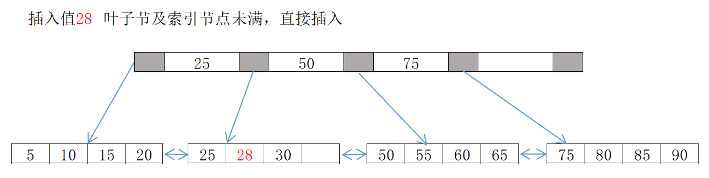
>
>   
>
> - 叶子节点满但索引节点未满时的插入
>
>   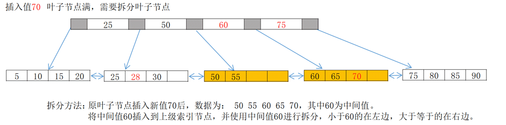
>
>   
>
> - 叶子节点和索引节点都满时的插入
>
>   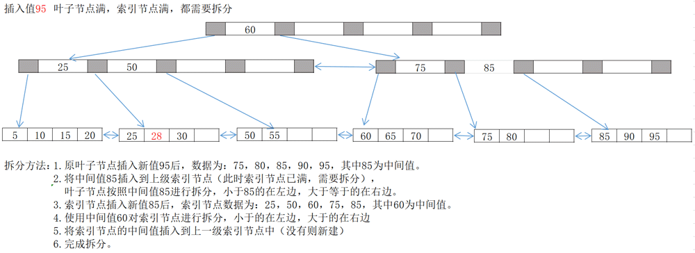
>
>   

从示例总可以看到，为了保持平衡，对新插入的键值可能面临着大量拆分页（split）操作，页拆分操作意味着大量IO操作，因此应该在可以的情况下尽量减少页的拆分操作。因此，B+树提供了类似于平衡二叉树的**旋转功能（rotation）**

> **B+树的rotation**
>
> 旋转发生在leaf page已满，但其左右的兄弟节点没有满的情况下。
>
> 此时，B+树并不会急于去做拆分页的操作，而是将记录移动到所在页的兄弟节点上。
>
> 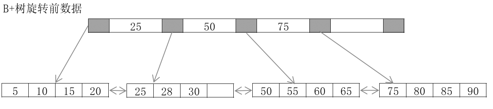
>
> 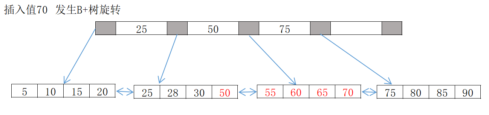
>
> - 从示例可以看到，采用旋转操作可以使B+树减少一次页的拆分操作，同时这颗B+树高度依然保持为2层。


### B+树的删除操作

B+树使用填充因子(fill factor)来控制树的删除变化。50%是填充因子可设置的最小值。

B+树的删除操作同样必须保证删除后叶子节点中的记录依然排序。

同插入一样，B+树的删除操作页需要考虑三种情况，但与插入不同的是，删除还需要根据填充因子的变化来衡量

| 叶子节点小于填充因子 | 中间节点小于填充因子 | 操作                                                         |
| -------------------- | -------------------- | ------------------------------------------------------------ |
| ×                    | ×                    | 直接将记录从叶子节点删除。如果该节点还是index page节点，用该节点的右侧节点代替。 |
| √                    | ×                    | 合并叶子节点和它的兄弟节点，同时更新index page               |
| √                    | √                    | 1.合并叶子节点和它的兄弟节点<br>2.更新Index page<br>3.合并Index page和它的兄弟节点 |

> - 叶子节点等于填充因子，中间节点等于填充因子，直接删除记录
>
>   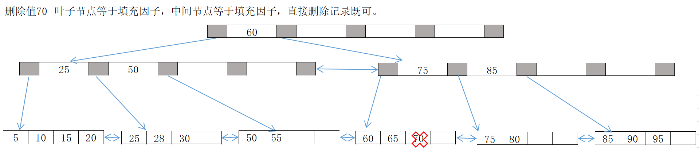
>
> - 删除值是index 节点，使用右侧值代替
>
>   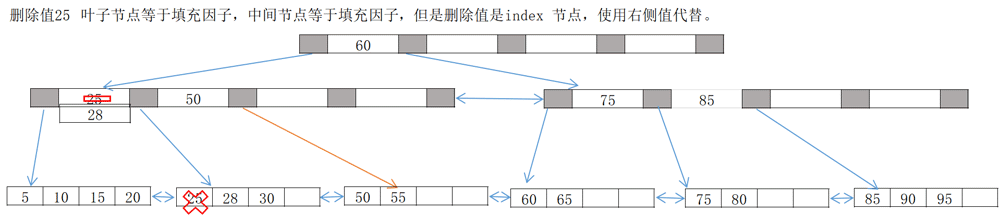
>
> - 删除值后leaf page填充因子小于50%，需要做合并操作
>
>   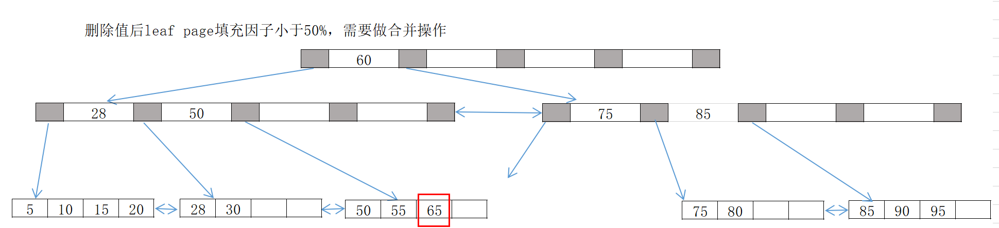
>
> - 与兄弟节点合并后，75-85的index节点不满足填充因子，因此索引节点也需要合并
>
>   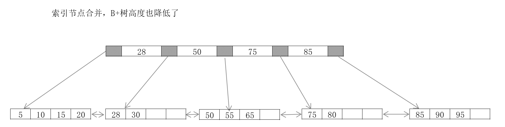


## B+树索引

B+树索引在数据库中有一个特点是高扇出性(fan out)，因此B+树一般高度都在2~4层，也就意味着查找某一键值的行记录时最多只需要2到4次IO。

> 按机械硬盘每秒至少100次IO来算，2~4次IO意味着查询只需要0.02秒~0.04秒。

B+树索引分为聚集索引（clustered index）和辅助索引（secondary index），但是不管聚集索引还是辅助索引，内部都是B+树，即：高度平衡的，叶子节点存放所有数据。

聚集索引与辅助索引不同的是，叶子节点存放的是否是一整行的信息。

### 聚集索引

> 聚集索引对于主键的排序查找和范围查找速度非常快。
>
> 查找主键范围查询时，通过叶子节点的上层中间节点就可以得到页的范围，直接读取数据页即可。

InnoDB存储引擎表是IOT表，即表中数据按照主键顺序存储。聚集索引就是按照每张表的主键构造一棵B+树，同时叶子节点中存放的即为整张表的行记录数据，也将聚集索引的叶子节点称为数据页。

聚集索引的上述特性绝对了IOT表中数据也是索引的一部分。同B+树的数据结构一样，每个数据页都通过一个双向链表来进行链接。

由于实际的数据页只能按照一颗B+树结构进行排序，因此每张表只能拥有一个聚集索引。

多数情况下，优化器倾向于使用聚集索引。因为聚集索引能够在B+树索引的叶子节点上直接找到数据。

另外，由于定义了数据的逻辑顺序，聚集索引能够特别快的访问针对范围值的查询，优化器能够快速发现某一段范围的数据页是需要扫描的。

InnoDB的Page Directory是稀疏的，用HEXDUMP查看表空间文件时可以发现，infimum记录本身通过record header中最后2bytes来判断吓一跳记录的位置，这就是min(primary key)的键值（可能涉及到有无符号类型的标记），该值后4bytes就是只想数据页的页号。用同样方式可找到其他键值和指向的数据页。

对非数据页节点的分析可以发现数据页上存放的时完整的每行记录，而非数据页的索引页中存放的仅仅时键值和指向数据页的偏移量，而不是完整的行记录。

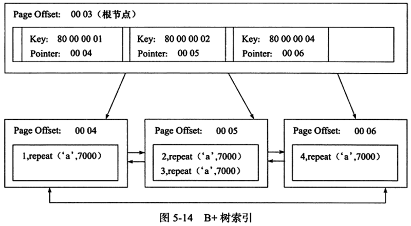

聚集索引并不是在物理上连续的——在物理上按照特定顺序存放记录的维护成本会非常高。实际上聚集索引是逻辑上连续的，页按照主键顺序排序，通过双向链表链接；每个页中的记录也是通过双向链表进行维护，物理存储上可以同样不按照主键顺序存储。


### 辅助索引 secondary index

叶子节点并不包含记录的全部数据。

叶子节点除了包含键值，每个叶子节点中的索引行中还包含一个书签，用来告诉InnoDB存储引擎哪里可以找到与索引相对应的行数据，也就是相应行数据的聚集索引键。

InnoDB会遍历辅助索引并通过叶子级别的指针，活动的指向主键索引的主键，然后再通过主键索引（聚集索引）来找到一个完整的行记录。

> 如果在一棵高度为3的辅助索引树中查找数据，那需要对这课辅助索引树便利3次，找到指定主键。如果聚集索引树同样为高度3，那么还需要对聚集索引树进行3次查找，最终找到一个完整的行数据所在的页，因此一共需要6次逻辑IO访问，以得到访问最终的一个数据页。

对于Oracle、MSSQL这类数据库，使用堆表进行数据存储，即行数据的存储按照插入的顺序存放，与MyISAM类似。堆表的特性决定了表上的索引都是非聚集的，主键与非主键的区别只是是否唯一且非空，因此，这时使用ROW IDentified 来作为“书签“，可以用类似"文件号:页号:槽号"的格式来定位实际的数据行。

> 堆表和IOT表
>
> 堆表的书签使非聚集索引查找可以比主键书签方式更快。
>
> 堆表的非聚集索引可以在一张表中存在多个，需要对多个非聚集索引进行查找。
>
> 对于非聚集索引的离散读，IOT表上的非聚集索引会比堆表上的聚集索引慢一些。

堆表在OLAP场景可能比IOT表快。

表中数据是否更新、更新是否影响到物理地址的变化，也会使堆表快于IOT表，但是不绝对。

在排序和范围查找场景下，IOT表通过B+树的中间节点就可以找到要查找的所有页然后去读取，这在堆表的特性上不可能实现的。

IOT表上非聚集索引的离散读可以通过预读取机制来避免多次的离散读操作。

因此，IOT表还是heap表，取决于应用，并不存在哪个更优秀的问题。

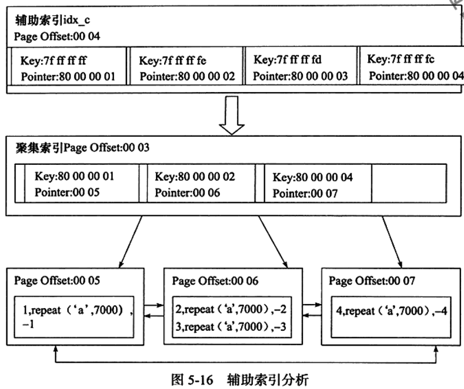


### B+树索引的分裂

前面提到B+树的分裂时最简单的一种情况，其中并未考虑到最重要的并发场景。

B+树索引页的分裂并不总是从页的中间记录开始的，因为这样会导致页空间的浪费。

> 例子：如下面的记录： 1，2，3，4，5，6，7，8，9
>
> 插入时根据自增顺序进行的。 若此时插入记录“10”后需要进行页分裂，根据前面的方法，会将记录5作为split record，分裂后得到下面两个页：
>
> - 1，2，3，4
> - 5，6，7，8，9，10
>
> 然而，由于插入是自增顺序的，因此第一个页中将不再会有记录插入，这就导致了空间的浪费，而第二个页后续页会继续分裂，继续产生新的页浪费。

InnoDB的Page Header中有三个部分用来保存插入的顺序信息：

- Page_last_insert
- Page_direction
- Page_n_direction

通过这些信息，InnoDB引擎可以决定是向左还是向右进行分裂，同时决定将分裂点记录为哪一个值。

- 若插入是随机的，则取页的中间记录作为分裂点
- 若往同一方向插入的记录数量为5，且目前已经cursor到的记录之后还有3条记录，则分裂点为定位到的记录后的第三条记录
- 否则分裂点就是待插入的记录(自增插入的普遍情况。)

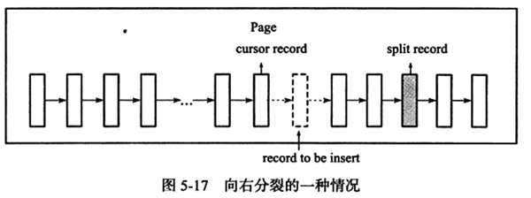

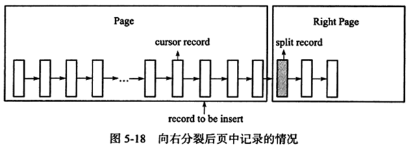

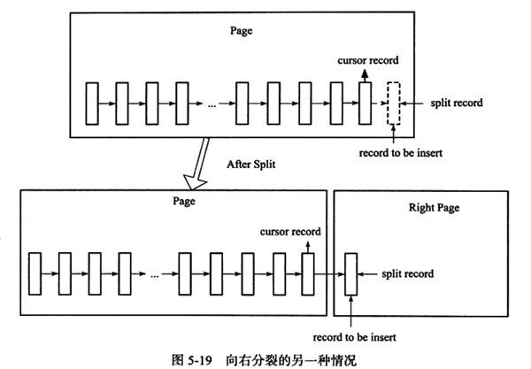


### B+树索引的管理

> 语法：
>
> - Alter table <table_name> ADD {INDEX|KEY} [<index_name>]  [<index_type>] (index_col_name,... ) [index_option] ...
>
> - Alter table <table_name> 
>
>   DROP PRIMARY KEY | DROP {INDEX|KEY} <index_name>
>
> - Create [uinque] index <index_name> [index_type] on <table_name> (index_col_name, ... )
>
> - Drop index <index_name> on <table_name>
>
> - 创建部分索引  ... add key idx_a ( a(10) );
>
> - 创建联合索引  ... add key idx_a_b (a,b);

查询索引： show index from <table_name>;


#### show index 解析

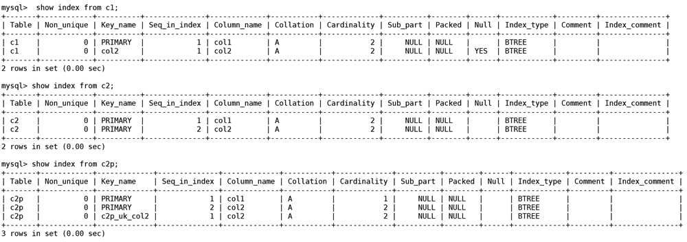

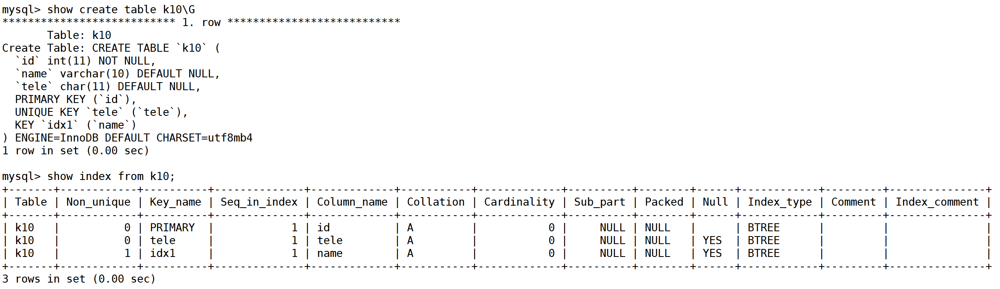

| col          | 含义                                                         |
| ------------ | ------------------------------------------------------------ |
| table        | 索引所在表名                                                 |
| Non_unique   | 是否为非唯一的索引。PK永远是0                                |
| Key_name     | 索引名字。可以通过这个名字来drop index                       |
| seq_in_index | 索引中该列的位置。联合索引中能看出来区别。                   |
| column_name  | 索引列的名称。                                               |
| collation    | 列以怎样方式存储在索引中。可以是A或者NULL。B+树索引总是A，即：排序的。如果使用了Heap存储引擎且创建了hash索引，这里会显示Null。因为Hash根据Hash桶存放索引数据，而不是对数据进行排序。 |
| cardinality  | 【关键】表示索引中唯一值的数目的估计值。cardinality表的行数尽可能接近1，如果非常小，需要考虑是否可以删除此索引。 |
| sub_part     | 是否是列的部分索引。如果是的话，显示索引的列的部分的长度。如果是整个列的索引，则为NULL |
| packed       | 关键字如何被压缩。如果没有压缩则为NULL                       |
| Null         | 索引列是否含有NULL值。即：列是否允许空值。                   |
| Index_type   | 索引的类型。InnoDB只支持B+树索引，显示的都是BTREE。          |
| Comment      | 注释。                                                       |

#### Cardinality值

Cardinality值非常非常关键。优化器会根据这个值来判断是否使用这个索引。

但是，这个值不是实时更新的，即：并非每次索引的更新都会更新该值——代价会很高。 因此，这个值不是太准确的，只是大概值。

要更新cardinality值，使用analyze table命令。

**cardinality为NULL，在某些情况下可能会发生索引建立了却没有被用到，或者两条基本一样的SQL查询执行计划发现结果不一样，最好的办法就是在非高峰期做一次analyze table，使优化器更好的利用索引。**

##### Cardinality

创建索引的经验是，在访问表中很少一部分时使用B+树索引才有意义：

- 对于低选择性（取值范围很小）的性别、地区、类型等字段，查询结果很可能占据全表记录的较大比例，这是添加B+树素银完全没有必要。
- 对于高选择性（取值范围很广，几乎没有重复），使用B+树索引最合适。

<font color=red>判断索引列是否为高选择性的依据，使用show index语句查询索引，观察cardinality/n_rows_in_table 比值，应该尽可能接近1。如果值非常小，那么要考虑是否还有必要创建该索引。</font>

*在访问高选择性属性的字段并从表中取出很少部分数据时，为字段添加B+树索引是非常有必要的。*


##### Cardinality统计

cardinality的统计是在存储引擎层面实现的，因为不同的引擎实现B+树的方式并不相同。

在生产环境中，索引的更新操作是非常频繁的。如果每次发生变更便统计cardinality，那么负担会非常重。另外，如果表非常大，那么统计一次cardinality值所需的时间也不少，因此数据库对于cardinality的统计都是通过采样（sample）的方法来完成的。

InnoDB中，cardinality统计信息的更新发生在两个操作中：insert和update。由于前面的两个负荷考虑，Innodb内部更新cardinality信息的策略为：

- 表中1/16的数据已经发生过变化，更新cardinality统计信息。

- stat_modified_counter>2 000 000 000。

  > 如果对表中某一行数据频繁的进行更新操作，这时表中的实际数据量没有增加，实际发生变化的还是这一行数据，则第一种策略无法适应这种情况。因此，在InnoDB引擎内部有一个计数器：stat_modified_counter，用来表示发生变化的次数，当大于2 000 000 000时，同样需要更新cardinality信息。

**InnoDB怎样进行cardinality信息的统计和更新？**

- 使用采样的方法，默认InnoDB对8个叶子节点进行采样，过程如下：
  - 取得B+树索引中叶子节点的数量，记为A。
  - 随机取得B+树索引中的8个叶子节点。统计每个页不同记录的个数，记为P1,P2,...P8。
  - 根据采样信息给出cardinality的预估值：cardinality=(p1+p2+p3...+p8) *A/8。
- cardinality值通过对8个叶子节点预估而得，因此不是一个实际精确的值。
- 8个叶子节点是随机取的，所以每次得到的cardinality也可能是不同的。当然，表足够小的时候（叶子节点数小于等于8个），每次采样的值都会一样。

> InnoDB1.2之前：
>
> - innodb_stats_sample_pages 
>
>   参数innodb_stats_sample_pages 用来设置统计cardinality时每次采样页的数量，默认值为8。
>
> - innodb_stats_method
>
>   用来判断如何对待索引中出现的NULL值记录，默认值为nulls_equal，表示将NULL值记录视为相等的记录。
>
>   有效值还有nulls_unequal，nulls_ignored，分别表示将NULL值记录视为不同的记录和忽略NULL值的记录。
>
>   >例如，某夜中索引记录为NULL,NULL,1,2,2,3,3,3
>   >
>   >在innodb_stats_method的默认设置下，该页的cardinality为4；
>   >
>   >若innodb_stats_method -> nulls_unequal，该页的cardinality为5；
>   >
>   >若innodb_stats_method ->nulls_ignored，cardinality为3。

**InnoDB对Cardinality的底层机制**

- Cardinality是通过采样完成的计算的, 而不是对所有的数据都参与计算.
- 当执行`analyze table`， `show table status`， `show index`或者访问`information_schema`中的`tables`或者`statistics`表时候，存储引擎会重新计算`Cardinality`的值。 如果表中的数据量极大，会导致计算速度很慢。

InnoDB 1.2之后对cardinality统计的参数

- innodb_stats_persistent

  > 是否将命令analyze table计算得到的cardinality值存放到磁盘上。
  >
  > 默认值为OFF。
  >
  > 开启的好处是减少重新计算每个索引的cardinality值，比如：当MySQL数据库重启时。
  >
  > 用户也可以通过create table和alter table的选项stats_persistent来对每张表进行控制。

- innodb_stats_on_metadata

  > 当通过命令 show table status， show index及访问 information_schema 架构下的表tables和statistics时，是否需要重新计算索引的cardinality值？
  >
  > 默认值：OFF

- innodb_stats_persistent_sample_pages

  > 若参数innodb_stats_persistent设置为ON，该参数表示analyze table更新cardinality值时每次采样的页的数量。
  >
  > 默认值：20

- innodb_stats_transient_sample_pages

  > 该参数用来取代之前版本的innodb_stats_sample_pages，表示每次采样页的数量。
  >
  > 默认值：8


#### fast index creation

- MySQL5.5之前对于索引的添加或者删除操作，实际数据库的操作过程为：
  - 首先创建一张新的临时表，表结果为通过命令alter table新定义的结构
  - 然后把原表中的数据导入到临时表
  - 删除原表
  - 将临时表重命名为原来的表名

这在大表进行索引的添加和删除操作会需要很长的时间，而且如果大量事务需要访问正在被修改的表，数据库服务意味着并不可用。

InnoDB在1.0.x开始支持Fast index creation 快速索引创建的方式来创建索引（FIC）：

- FIC方式只限定于辅助索引，对主键的创建和删除同样需要重建一张表。

- 对于辅助索引，InnoDB会对创建索引的表上加S锁。在创建过程中，无需重建表，因此速度较之前提高很多，并且数据库的可用性也得到了提高。删除辅助索引操作更简单，InnoDB存储引擎只需更新内部视图，并将辅助索引的空间标记为可用，同时删除MySQL数据库内部视图上对该表的索引定义即可。

- 临时表的创建路径使通过参数tmpdir进行设置的，必须保证tmpdir有足够的空间可以存放临时表，否则会导致创建索引失败。
- 由于FIC在索引的创建过程中对表加上了S锁，因此在创建的过程中只能对该表进行读操作，如果有大量的事务需要对表进行写操作，那么数据库服务同样不可用。


#### Online Schema Change(OSC)

最早由facebook实现的在线DDL方式，事务的创建过程过程中，可以有读写事务对表进行操作。

OSC使用PHP脚本来实现，并不是通过修改InnoDB引擎源码实现的，实现步骤如下：

| No   | action                 | 说明                                                         |
| ---- | ---------------------- | ------------------------------------------------------------ |
| 1    | init                   | 初始化，对创建的表做一些验证工作，如是否有主键，是否有触发器或者FK。 |
| 2    | createCopyTable        | 创建和原始表结构一样的新表。                                 |
| 3    | alterCopyTable         | 对创建的新表进行alter table操作，如添加索引或列。            |
| 4    | createDetasTable       | 创建deltas表，作用使为下一步创建的触发器所使用。之后对原表的所有DML操作会被记录到createDeltasTable表中。 |
| 5    | createTriggers         | 对原表创建insert、update、delete操作的触发器，出发操作产生的记录被写入到deltas表。 |
| 6    | startSnpshotXact       | 开始OSC操作的事务。                                          |
| 7    | selectTableIntoOutfile | 将原表中的数据写入到新表。为了减少对原表的锁定时间，这里通过分片（chunked）将数据输出到多个外部文件，然后将外部文件的数据导入到copy表中。分片的大小可以指定，默认值是500 000。 |
| 8    | dropNCIndexs           | 在导入到新表前，删除新表中所有的辅助索引。                   |
| 9    | loadCopyTable          | 将导出的分片文件导入到新表。                                 |
| 10   | replayChanges          | 将OSC过程中原表DML操作的记录应用的新表中，这些记录被保存在deltas表中。 |
| 11   | recreateNCIndexes      | 重新创建辅助索引                                             |
| 12   | replayChanges          | 再次进行DML日志的回放操作，这些日志是在上述创建辅助索引中过程中新产生的日志。 |
| 13   | swapTables             | 将原表和新表交换名字，整个操作过程中需要锁定2张表，不允许新的数据产生。不过由于更名是一个很快的操作，因此阻塞的时间非常短。 |

- 实际实现起来非常复杂，用到了非常多的InnoDB知识点，可以阅读源码，更好理解InnoDB引擎的使用。
- OSC由PHP实现，有一些局限性，要求进行修改的表一定要有主键，且表本身不能存在外键和触发器。另外，在过程中如果允许sql_bin_log=0，可能导致主从不一致。


#### Online DDL

FIC避免了创建索引阶段对临时表的使用，但索引创建时会阻塞表上的DML操作。MySQL5.6开始支持Online DDL，允许辅助索引创建的同时，还允许诸如insert、update、delete这类DML操作。

不仅是辅助索引，以下几类DDL操作都可以通过online方式进行操作：

- 辅助索引的创建与删除
- 改变自增值
- 添加或删除外键约束
- 列的重命名

**原理**

- InnoDB引擎实现Online DDL的原理时在执行创建或删除操作的同时，将insert、delete、update这类DML操作日志记录到一个缓存中，待完成索引创建后再重做应用到表上，达到数据一致性。

- 这个缓存大小由参数`innodb_online_alter_log_max_size`控制，默认的大小为128MB。
- 若用户更新的表比较大，并且再创建过程中伴有大量的写事务，如遇到`innodb_online_alter_log_max_size`的空间能存放日志时，会抛出错误`ER_INNODB_ONLIINE_LOG_TOO_BIG`
- 对于这个错误，可调大innodb_online_alter_log_max_size，以获得更大的日志缓存空间。此外还可以设alter table模式为share，这样在执行过程中不会有写事务发生，因此不需要进行DML日志的记录。
- Online DDL在创建索引完成后再通过重做日志达到数据库的一致性，这意味着索引创建过程中，SQL优化器不会选择正在创建中的索引。

> 新的alter table语法中创建索引的方式有变化：
>
> alter table <table_name>
>
> | ADD {index|key} <index_name>
>
> [index_type] (index_col_name,....) [index_option] ...
>
> ALGORITHM [=] {default | inplace | copy }
>
> LOCK [=] {default | none | shared | exclusive}
>
> - ALGORITHM 指定创建或删除索引的算法
>
>   - COPY：按照MySQL 5.1版本之前的工作模式，即创建临时表。
>
>   - INPLACE：不创建临时表。
>
>   - DEFAULT：根据参数old_alter_table来判断是通过INPLACE还是COPY的算法，参数默认为OFF，表示采用INPLACE方式。
>
>     ```
>     mysql> show variables like 'old_alter_table';
>     +-----------------+-------+
>     | Variable_name   | Value |
>     +-----------------+-------+
>     | old_alter_table | OFF   |
>     +-----------------+-------+
>     1 row in set (0.02 sec)
>       
>     mysql> select @@version;
>     +------------+
>     | @@version  |
>     +------------+
>     | 5.7.30-log |
>     +------------+
>     1 row in set (0.00 sec)
>     ```
>
> - LOCK 为索引创建或删除时对表添加锁的情况，可以是：
>
>   - NONE：执行创建或删除操作时，对目标表不添加任何的锁，即事务仍然可以进行读写，不会受到阻塞。这种模式可以获得最大的并发。
>   - SHARE：和FIC类似，创建或删除操作时，对目标表加上S锁。对于并发读事务依然可以执行，对于写事务就会发生等待。如果引擎不支持share模式，会返回错误。
>   - EXECLUSIVE：执行创建或删除操作时，对目标表加上一个X锁。读写事务都会被阻塞，和COPY方式运行得到的状态类似，但不需要像COPY方式一样创建临时表。
>   - DEFAULT：会首先判断当前操作是否可以使用NONE模式，如果不能则判断是否可以使用SHARE模式，最后判断是否可以EXCLUSIVE模式。DEFAULT会通过判断事务最大并发性来判断执行DDL的模式。


### B+树索引的使用

- 不同业务场景，对B+树索引的需求不同

  - OLTP中，对索引的使用往往是通过索引取得表中少部分的数据。否则即使创建索引，优化器也未必使用。

  - OLAP中，很少需要对单条数据或条件进行查询，往往涉及到多张表之间的join，通常要对时间字段进行索引，大多数统计都需要根据时间维度来做数据筛选。当然，如果表关联为hash join，那么索引又不是非常重要。

- 联合索引

  略

- 覆盖索引

  略

- 优化器选择不使用索引的情况

  当访问的数据据占据整个表数据较大一部分时（20%左右），优化器会优先选择通过聚集索引而不是二级索引，因为顺序读的效率要高于离散读。（如：整行数据查询，二级索引并不能覆盖全部查询列。）对于不能进行索引覆盖的情况，优化器选择辅助索引的情况是，通过辅助索引查找的数据时少量的。这个逻辑是出于机械硬盘的特性来考虑，用顺序读替代离散随机读。但如果使用了SSD，且相信使用辅助索引可以带来更好的性能，那么可以使用force index 来强制使用特定索引——

  ```
  select * from table force index(index_name);
  ```

- Hint

  显式的通知优化器使用哪个索引。

  以下两种情况可能需要用到index hint：

  - 优化器错误的选择了某个索引，导致SQL运行的很慢。
  - 某SQL语句可以选择的索引非常多，这时优化器选择执行计划的开销可能大于SQL执行本身。

  Hint语法：

  ```
  table_name [ [AS] alias ] [index_hint_list]
  index_hint_list:
      index_hint[, index_hint] ...
  index_hint:
      USE {index|key} 
      [FOR {JOIN | ORDER BY | GROUP BY}] ([index_list]) | IGNORE {index|key}
      [FOR {JOIN | ORDER BY | GROUP BY}] ([index_list]) | IGNORE {index|key}
  index_list:
      index_name[, index_name] ...
  ```

  e.g.

  ```
  select * from t use index(a) where a=1 and b=2;
  ```

  但是，hint只是通知优化器可以选择该索引，实际上优化器还是会再根据自己的判断而选择。这一点hint不同于force index。因此，使用hint后并不一定会改变执行计划。

  

